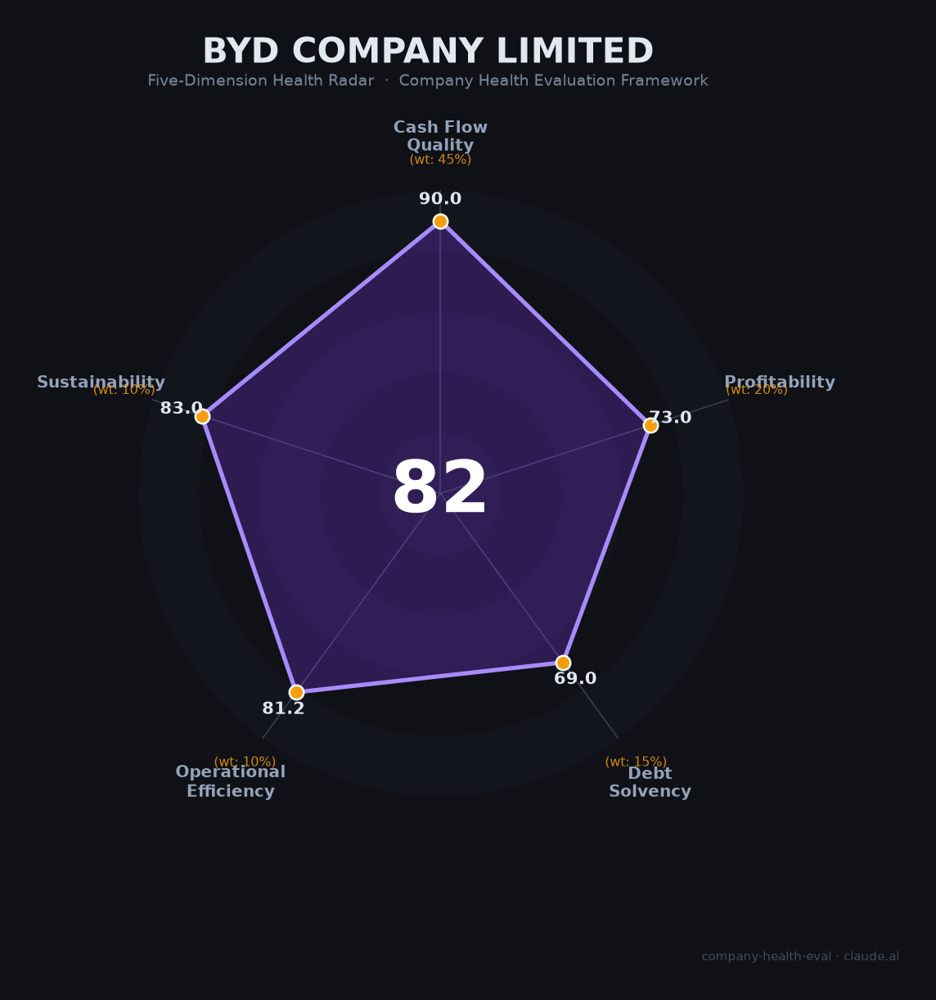

# 比亚迪 (BYD) 财务健康评估（2026-06-16）

## 一句话结论

🟡 **中等偏上（82/100）** | 全球新能源车销冠（460万辆）、海外利润引擎启动（贡献60%）、垂直整合护城河极深，核心短板是2025年经营现金流腰斩+自由现金流转负+有息负债翻四倍

---

## 一、公司基本画像

| 维度 | 信息 |
|------|------|
| **主体** | 比亚迪股份有限公司 (002594.SZ / 1211.HK) |
| **成立时间** | 1995年2月10日（深圳龙岗） |
| **创始人** | 王传福（董事长兼总裁，持股16.90%） |
| **总部** | 广东省深圳市坪山区 |
| **上市** | H股2002年（1211.HK），A股2011年（002594.SZ） |
| **当前市值** | ~¥8,280亿（A股），历史峰值¥1.32万亿（2025年5月） |
| **员工规模** | 🔒 869,622人（2025年末，A股最大雇主） |
| **研发人员** | 🔒 127,700人（全球车企最多） |
| **核心业务** | 新能源车（81%营收）+手机部件/比亚迪电子（19%）+电池外供+储能 |
| **品牌矩阵** | 王朝、海洋、腾势（豪华）、方程豹（越野）、仰望（百万级超豪华） |
| **巴菲特投资** | 2008年$2.3亿买入10%，2022-2025年彻底清仓，17年~35倍回报 |

**一句话定性**：比亚迪是全球新能源车销量冠军和垂直整合最深度的车企——75%零部件自产的"比亚迪模式"构建了同行无法复制的成本护城河。2025年是"增收不增利"的转折年：营收首破¥8,000亿但净利降19%，正经历从"国内价格战"向"海外高利润"的战略切换。

---

## 二、五维财务健康评估

### 1. 现金流质量（90.0/100）🟢 权重45%

| 指标 | 判断 | 依据 |
|------|------|------|
| 经营现金流净额 | 🟢 健康 | 🔒 2023年¥1,697亿→2024年¥1,335亿→2025年¥591亿。三年均为正但急剧恶化（2025年-55.7%）。主因：存货大增（¥1,384亿，+19%）、应付账款减少 |
| 现金及等价物 | 🟢 健康 | 🔒 货币资金¥754亿（2025年末）+ 交易性金融资产。足以覆盖短期运营需求 |
| 有息负债 | 🟢 健康 | 🔒 有息负债¥1,134亿/总资产¥8,837亿=12.8%。虽从¥286亿跳升4倍（海外扩产借款），但相对于资产规模仍然极低 |
| 净现比（OCF/NI） | 🟢 健康 | 🔒 2024年OCF ¥1,335亿/NI ¥403亿=**3.31x**；2025年OCF ¥591亿/NI ¥326亿=**1.81x**。均>1，利润现金含量高 |

**核心判断**：尽管2025年经营现金流腰斩至¥591亿，但OCF/NI仍达1.81x，且三年均为正。经营现金流恶化是"主动选择"——大规模海外建厂（巴西/泰国/匈牙利）和存货备货导致现金被"锁"在资产负债表上，而非经营层面恶化。2025年港股配售融资¥435亿补充了流动性。

### 2. 盈利能力（73.0/100）⚠️ 权重20%

| 指标 | 判断 | 依据 |
|------|------|------|
| 毛利率 | 🟢 良好 | 🔒 2025年综合17.74%（汽车20.49%）。高于特斯拉（18%）和吉利（16.6%），处于行业良好水平 |
| 净利率 | 🟠 一般 | 🔒 2025年净利率4.1%（¥326亿/¥8,040亿）。国内价格战侵蚀利润，但海外单车净利是国内2.4倍 |
| 营收增速（3年CAGR） | 🟢 优秀 | 🔒 ¥4,241亿（2022）→¥8,040亿（2025），CAGR约**23.8%** |
| 研发费用率 | 🟢 良好 | 🔒 2025年R&D ¥634亿/营收=**7.89%**，三年累计超¥1,575亿（是同期利润的1.5倍），几乎全部费用化 |
| 人均产出 | 🟢 良好 | 🔒 ¥92.5万/人。高于行业平均但低于特斯拉（$703K）。87万人中大量为一线生产工人 |

**核心判断**：比亚迪的盈利能力是"薄利多销"的极致体现——国内单车净利仅~¥4,000元（被价格战压到极限），但海外单车净利¥20,000+弥补了缺口。2025年海外利润贡献占比已升至~60%。核心悬念在于：如果海外增速放缓，国内利润能否支撑公司的巨额研发投入？

### 3. 偿债能力（69.0/100）⚠️ 权重15%

| 指标 | 判断 | 依据 |
|------|------|------|
| 资产负债率 | 🟡 关注 | 🔒 2025年末70.74%（三年降了7pct）。刚好超过70%的"危险线"，但趋势向好。且负债以经营性无息负债为主 |
| 有息负债率 | 🟢 健康 | 🔒 有息负债¥1,134亿/总资产=12.8%，远低于30%危险线。应付账款¥2,441亿（无息）占比41% |
| 流动比率 | 🟡 关注 | 存货¥1,384亿+应收¥370亿 vs 应付¥2,441亿+短期借款¥385亿。推算流动比率1-1.5 |
| 现金比率 | 🟡 关注 | 货币资金¥754亿 vs 短期有息负债¥385亿=1.96x覆盖。但含应付账款则现金比率<0.5 |
| 股权质押 | 🟢 健康 | 王传福16.9%，无显著质押 |

**核心判断**：比亚迪的高负债率（70.74%）是汽车行业最大的争议点——被戏称"比压迪"。但债务结构健康：有息负债仅占12.8%，绝大部分是经营性应付（供应商账期）。付款周期127天虽引发争议，但优于长城（163天）和上汽（164天）。真实风险在于：若行业下行导致销售收入骤降，应付账款的支付压力会快速转化为流动性危机。

### 4. 运营效率（81.2/100）🟢 权重10%

| 指标 | 判断 | 依据 |
|------|------|------|
| 应收周转 | 🟢 健康 | 🔒 应收周转天数从30天降至22.5天（2025年），三年持续改善。年末应收账款从¥623亿降至¥370亿（-40%） |
| 客户集中度 | 🟢 健康 | 全球460万零售客户，119个国家/地区。极度分散 |
| 员工规模趋势 | 🟡 关注 | 29万→57万→70万→97万→**87万**。2025年首次减员10万人（-10.2%），主要在一线生产岗。研发人员仍逆势增长（+4,700人） |
| 高管稳定性 | 🟢 健康 | 王传福自1995年创立至今。核心管理层极稳定 |

**核心判断**：2025年首次减员10万人是比亚迪从"野蛮扩张"转向"精细化运营"的信号。研发逆势扩招（+3.8%）说明公司仍在投资未来。应收周转的持续改善是低调但重要的正面信号——比亚迪对上游供应商的议价权在增强。

### 5. 可持续发展（83.0/100）🟢 权重10%

| 指标 | 判断 | 依据 |
|------|------|------|
| 行业赛道空间 | 🟢 健康 | 全球NEV市场CAGR 13-28%至2030年。海外市场渗透率仍低（东南亚~20%、拉美~10%） |
| 技术壁垒 | 🟢 健康 | 垂直整合（75%自产零部件）+刀片电池+DM-i+自研4nm"璇玑A3"智驾芯片+12.7万研发人员。成本优势同行无法复制 |
| 业务多元化 | 🟢 健康 | 五大品牌全价格段覆盖（7万-168万）+比亚迪电子+电池外供+储能。海外收入占比38.65%且快速提升 |
| 融资/资本支持 | 🟢 健康 | A+H双平台上市，¥8,280亿市值。2025年港股配售¥435亿。银行授信充足 |
| 政策/监管风险 | 🟡 关注 | 国内购置税减免2026年起退坡（插混门槛升至100km）冲击低配车型。欧盟MIP价格承诺替代关税是利好。美国/加拿大市场基本关闭。巴西劳工争议已平息 |

**核心判断**：比亚迪的可持续发展具有独特的"技术+成本"双重护城河。自研4nm车规芯片（2026年5月发布）证明其在最核心的供应链环节也能自给。最大的长期风险不在比亚迪本身，而在于地缘政治对中国车企全球化的遏制。

---

## 三、综合评分与健康等级

| 维度 | 得分 | 权重 | 加权得分 |
|------|:----:|:----:|:--------:|
| 现金流质量 | 90.0 | 45% | 40.5 |
| 盈利能力 | 73.0 | 20% | 14.6 |
| 偿债能力 | 69.0 | 15% | 10.3 |
| 运营效率 | 81.2 | 10% | 8.1 |
| 可持续发展 | 83.0 | 10% | 8.3 |
| **综合得分** | | **100%** | **81.9 / 100** |

**健康等级**：🟡 **中等偏上（Moderate-High）**

> 数据可信度：所有财务数据来自比亚迪A股年报（经审计），标注🔒。交付量、海外数据来自公司公告和乘联会。行业对标数据来自各公司年报和行业研报。

---

## 四、同业对标

### 全球新能源车企对比

| 对比项 | **比亚迪** | **特斯拉** | **吉利汽车** |
|--------|:----------:|:--------:|:--------:|
| 上市 | A+H股 | NASDAQ | 港股 |
| 2025年交付 | **460万辆 (+7.7%)** | 164万辆 (-8.6%) | 303万辆 (+39%) |
| 其中纯电 | 226万辆 | 164万辆 | — |
| 营收 | **¥8,040亿 (+3.5%)** | $948亿 (-3%) | ¥3,452亿 (+25%) |
| 汽车毛利率 | 20.5% | ~18% | 16.6% |
| 净利润 | **¥326亿 (-19%)** | $38亿 (-46%) | ¥169亿 (+1.1%) |
| 研发投入 | **¥634亿** | $64亿 | — |
| 资产负债率 | 70.7% | 39.9% | — |
| 员工 | 87万 | 13.5万 | — |
| 海外销量 | 105万辆 (+145%) | — | — |
| 市值 | **¥8,280亿** | $1.54万亿 | ~¥1,800亿 |

### 比亚迪 vs 特斯拉：2025年关键分水岭

| 维度 | 比亚迪优势 | 特斯拉优势 |
|------|----------|----------|
| 销量 | 460万 vs 164万（2.8倍） | — |
| 纯电销量 | 226万（首次超越） | 被超越 |
| 营收增速 | +3.5% | -3% |
| 利润韧性 | 净利-19%（优于对手） | 净利-46% |
| 毛利率 | 20.5%（汽车） | ~18% |
| 现金流 | OCF ¥591亿（恶化中） | OCF $148亿（稳定） |
| 负债 | 70.7%（高但主要为无息） | 39.9%（极低） |
| 现金储备 | ¥754亿 | $441亿（~¥3,200亿） |
| 研发人员 | 12.8万 | ~1.5万（估） |
| 品牌溢价 | 低（单车均价¥11.9万） | 高 |
| 海外利润 | 海外贡献60%利润 | — |

**对标结论**：比亚迪在销量、营收增速、毛利率上全面超越特斯拉，但资产负债率和现金流质量明显弱于对手。比亚迪是"薄利多销的效率之王"，特斯拉是"高溢价的现金堡垒"。两者的估值差（特斯拉市值12倍于比亚迪）完全取决于市场愿不愿意给比亚迪的规模以科技公司估值。

---

## 五、核心风险清单

1. **经营现金流大幅恶化（中高）**：2025年OCF腰斩至¥591亿（-55.7%），FCF首次深度转负（-¥977亿）。海外建厂资本开支¥1,568亿（+61%）和存货积压（+19%）是主因。若2026年OCF继续恶化，可能需要新一轮融资。触发条件：海外工厂投产延迟、国内销量增速降至<5%。

2. **国内价格战的"无底洞"效应（高）**：秦PLUS低至7.98万元、海鸥智驾版6.98万元。国内单车净利被压至~¥4,000元（较2024年降25%）。行业利润率4.1%创历史新低。2026年3月价格战虽"戛然而止"（原材料涨价驱动），但竞争压力从未消失。触发条件：新一轮价格战、碳酸锂大幅降价。

3. **海外扩张的"投入期"风险（中高）**：匈牙利工厂投资~€50亿（2026年底投产）、巴西/泰国/印尼/土耳其/乌兹别克斯坦多线作战。2025年有息负债从¥286亿跳升至¥1,134亿（+296%），净现金转负。如果海外工厂产能爬坡不达预期，高额固定成本将成为沉重负担。触发条件：匈牙利工厂delay至2027年、巴西/土耳其市场遇冷。

4. **地缘政治遏制的系统性风险（中）**：欧盟MIP价格承诺虽好于反补贴关税，但本质仍是贸易限制。美国102.5%关税实质关闭市场。若特朗普主义扩散（更多国家对中国EV加征关税），比亚迪的"出口→本地化"切换速度可能跟不上。触发条件：更多国家效仿美国/加拿大、欧盟废除MIP重征关税。

5. **高负债率的资本市场叙事风险（中）**：70.74%负债率+GMT Research做空报告（声称"隐性债务¥3,230亿"）持续侵蚀投资者信心。尽管债务结构以无息经营性负债为主（与恒大截然不同），但叙事一旦形成便很难扭转。触发条件：新的做空报告、应付账款逾期事件。

6. **巴菲特清仓的长期背书丧失（中低）**：伯克希尔2022-2025年彻底清仓，虽然"卖完就涨"证明了市场的无视，但失去了全球最受尊敬的价值投资者的背书，对部分机构投资者的比亚迪配置决策有长期影响。

---

## 六、求职/择业视角

### 核心优势

- **稳定性极高**：中国最大民营制造业雇主（87万人）。以"不裁员"著称（2025年减员以自然减员为主，未强制裁员）。王传福多次公开表态"不轻易裁掉一个员工"
- **技术积累深厚**：12.7万研发人员（全球车企第一）。三年累计研发投入¥1,575亿。从电池→IGBT→MCU→智驾芯片全栈自研。离开比亚迪的工程师在新能源行业极度抢手
- **全球视野**：119国/海外工厂多国布局，内部有大量海外轮岗机会
- **隐性福利**：6元食堂、员工宿舍、购车内部价、"明日之星"训练营（26年传统，王传福亲自授课）

### 现存短板

- **薪资中偏低**：应届硕士18-35万（蔚来28-50万、腾讯35-58万）。公积金仅5%（深圳大厂普遍12%）是最大槽点
- **加班强度大**：核心部门"886"是常态，午休仅30分钟。"无效加班"现象存在（即使没任务也要耗着）
- **管理风格粗放**："把管理技术化"导致对"人"的关注不足。应届生流失率高，很多人把比亚迪当"跳板"
- **部门差异巨大**：智驾/电池/研究院核心岗成长快，传统生产岗天花板低

### 分场景建议

| 个人诉求 | 推荐度 | 说明 |
|----------|:------:|------|
| 新能源/电池方向技术深耕 | ⭐⭐⭐⭐⭐ | 全球最完整的垂直整合技术栈，从电池材料到智驾芯片全覆盖 |
| 稳定+长期发展 | ⭐⭐⭐⭐ | 87万人不裁员文化+26年应届生培养传统 |
| 海外市场/国际化 | ⭐⭐⭐⭐ | 119国渠道+多国工厂，内部轮岗机会多 |
| 高薪+快速财富积累 | ⭐⭐ | 薪资在车企中偏低，无期权（已上市），利润奖仅1-1.5万 |
| WLB/正常工作作息 | ⭐⭐ | 核心研发岗886，非核心岗可能准时 |
| 应届生"镀金" | ⭐⭐⭐ | 技术含金量高但品牌溢价不如特斯拉/华为 |

---

## 七、总结

**比亚迪**是全球新能源车领域「规模效率之王+垂直整合最深+从国内薄利向海外厚利战略切换」的公司：75%零部件自产的成本护城河和12.7万研发人员的技术纵深构建了同行无法复制的竞争力，**唯一核心短板是2025年经营现金流腰斩+自由现金流转负+有息负债翻四倍的"三杀"信号**，暴露出从"国内野蛮扩张"转向"全球重资产投入"的转型阵痛。

在新能源车渗透率过半、价格战白热化、全球化遭遇地缘政治逆风的大环境下，比亚迪属于**中等偏上**的雇主和投资标的——适合认可"工程师文化"、愿意以中等薪资换取最完整新能源技术栈经验的技术人才，以及相信全球电动化趋势和中国制造出海逻辑的长期投资者。

> "即使所有财产消失，只要工程师还在，就随时可以东山再起。" —— 王传福

---

*评估日期：2026-06-16 | 数据来源：比亚迪A股年报（002594.SZ，2023-2025年度，经审计）、比亚迪公告、乘联会、IEA Global EV Outlook 2026、GMT Research | 评分引擎：score.py v1.1*

*⚠️ 免责声明：本报告基于公开信息分析，不构成投资或求职建议。比亚迪A股市值约¥8,280亿（2026年6月15日），较2025年5月历史峰值¥1.32万亿回落约37%。*
