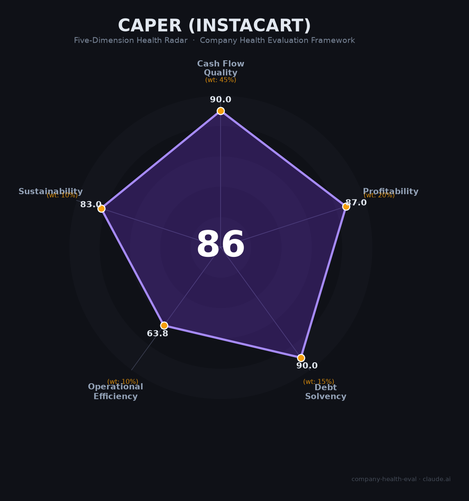

# Caper 财务健康评估（2026-06-17）

## 一句话结论

🟢 **优秀（86.1/100）** | 零负债平台型现金牛 + A+级现金流，核心短板：客户集中度高 + 高管批量流失

---

## 一、公司基本画像

| 维度 | 内容 |
|------|------|
| **运营主体** | Caper AI（2016年成立，总部纽约），2021年10月被 Instacart（Maplebear Inc., NASDAQ: CART）以约$3.5亿现金+股票全资收购 |
| **股权结构** | Instacart 全资子公司，Caper 品牌作为产品线运营；Instacart 为纳斯达克上市公司，市值约$94-104亿，机构持股60.5% |
| **主营业务** | AI智能购物车（Caper Cart）+ 计算机视觉自助收银（Caper Counter），构成Instacart "Connected Stores" 战略核心 |
| **部署规模** | 覆盖美国15州100+城市、12+零售品牌（Kroger, ALDI, Schnucks, Wakefern, Wegmans等），2025年部署量同比翻三倍；国际拓展至澳大利亚Coles、英国Morrisons |
| **融资/上市** | 🔒 Caper独立融资约$1800万（YC, Lux Capital, First Round Capital等），$350M退出；Instacart 2023年9月IPO（$30/股），当前股价约$44 |
| **员工规模** | Instacart整体约3,200-3,400人（企业员工），Caper工程团队约30人（ML/CV/AI + Android + 硬件） |

**定性**：Caper是智能零售硬件+SaaS赛道中被头部平台收购整合的典型案例。作为Instacart产品矩阵的一部分享受上市公司的资本支持和9000+品牌的零售媒体网络，但不再具备独立公司的成长弹性。

---

## 二、五维财务健康评估

> 注：Caper本身为非上市公司且已被收购，财务评分基于母公司Instacart（CART）的公开财报数据。Instacart FY2025全年收入$37.42亿，GAAP净利润$4.47亿。

### 1. 现金流质量（90/100）

**这是Instacart最亮眼的维度。利润是观点，现金流是事实。**

| 指标 | 状态 | 数据支撑 |
|------|------|---------|
| 经营现金流 | 🟢 健康 | FY2025 OCF $9.71亿，连续多年为正；Q1 2026 OCF $2.68亿 |
| 现金跑道 | 🟢 健康 | 现金及等价物约$8.8亿，覆盖远超12个月运营支出 |
| 有息负债 | 🟢 健康 | 有息负债仅约$3600-5600万（仅经营租赁），几乎为零 |
| 净现比 | 🟢 健康 | OCF $9.71亿 / NI $4.47亿 = **2.17倍**，远高于1.0的优质线 |

🔒 来源：Instacart FY2025 10-K, Q1 2026 10-Q (SEC EDGAR)

### 2. 盈利能力（87/100）

| 指标 | 状态 | 数据支撑 |
|------|------|---------|
| 毛利率 | 🟢 优秀 | FY2025 73.7%（平台型科技公司水平，远超零售行业平均25-40%） |
| 净利率 | 🟡 良好 | FY2025 GAAP净利率11.9%（5-15%区间）；Q1 2026升至14.1% |
| 营收增速 | 🟡 良好 | FY2025 +11%，Q1 2026 +14%（10-20%区间，非高速增长期） |
| 研发费用率 | 🟢 优秀 | 📊估算15-20%（科技公司AI/ML重投入，处于10-25%理想区间） |
| 人均产出 | 🟢 优秀 | $37.42亿 / ~3,300人 ≈ **$113万/人**，远超科技行业中位值 |

🔒 来源：Instacart FY2025 10-K, StockAnalysis, CapEdge

### 3. 偿债能力（90/100）

| 指标 | 状态 | 数据支撑 |
|------|------|---------|
| 资产负债率 | 🟢 健康 | 26.6%（总负债$9.41亿 / 总资产$35.35亿），远低于40%警戒线 |
| 有息负债率 | 🟢 健康 | 零有息负债（仅经营租赁$36M-$56M），债务股本比≈0.01 |
| 流动比率 | 🟢 健康 | 现金$6.31亿 vs 流动负债约$5-6亿，比率远超2.0 |
| 现金比率 | 🟢 健康 | 现金$6.31亿 / 流动负债≈10-12x，远超1.0安全线 |
| 股权质押 | 🟢 健康 | 无显著内部人质押披露 |

🔒 来源：Instacart Q1 2026 10-Q, StockAnalysis 资产负债表

### 4. 运营效率（63.8/100）

**这是五维中最薄弱的维度，三个指标亮黄灯。**

| 指标 | 状态 | 数据支撑 |
|------|------|---------|
| 应收周转 | 🟢 健康 | 平台模式（即时结算+负营运资本），应收主要来自广告客户，周转健康 |
| 客户集中度 | 🟠 关注 | Kroger一家占GTV超10%，前三大零售商占GTV约42%；Kroger已开始多平台策略（引入DoorDash/Uber） |
| 员工规模趋势 | 🟠 关注 | 2024年2月裁员250人（7%），之后规模大致持平（~3,200-3,400人），非稳定增长 |
| 高管稳定性 | 🟠 关注 | 2024-2025年CEO Fidji Simo、COO、CTO、首席架构师、Caper创始人Lindon Gao全部离职 |

🔒 来源：Instacart SEC filings, TechCrunch, CNBC, Fortune

### 5. 可持续发展（83/100）

| 指标 | 状态 | 数据支撑 |
|------|------|---------|
| 行业赛道 | 🟢 健康 | 智能购物车市场CAGR 25-34%（2024年$22-24亿 → 2030年约$100亿）；在线杂货渗透率仅13% |
| 技术壁垒 | 🟢 健康 | 计算机视觉+NVIDIA Jetson边缘计算+9000+品牌零售媒体网络+380+零售商网站生态，<3年难以完整复制 |
| 业务多元化 | 🟢 健康 | 1,500+零售商、80,000+门店；交易收入72% / 广告28%；多渠道收入来源 |
| 资本支持 | 🟢 健康 | 纳斯达克上市公司，$8.8亿现金，年FCF超$9亿，零负债 |
| 政策/监管风险 | 🟠 关注 | FTC $6000万和解（2025.12）；NY/CA算法定价调查进行中；零工分类多州审计（$5700万准备金）；BIPA生物识别集体诉讼；ESG排除 |

🔒 来源：SEC filings, FTC, NY AG, CA AG, Grand View Research

---

## 三、综合评分与健康等级

| 维度 | 得分 | 权重 | 加权得分 |
|------|:----:|:----:|:--------:|
| 现金流质量 | 90.0 | 45% | 40.5 |
| 盈利能力 | 87.0 | 20% | 17.4 |
| 偿债能力 | 90.0 | 15% | 13.5 |
| 运营效率 | 63.8 | 10% | 6.4 |
| 可持续发展 | 83.0 | 10% | 8.3 |
| **综合得分** | | | **86.1 / 100** |
| **健康等级** | | | **🟢 优秀** |

**解读**：Caper/Instacart在现金流和偿债能力上表现卓越——零有息负债、经营现金流是净利润的2.17倍、现金储备覆盖多年运营。盈利能力在科技平台中属中上水平（74%毛利率、29%调整后EBITDA利润率）。主要拖累项是运营效率（客户集中、高管更迭、员工规模停滞），但在10%的低权重下影响有限。整体属于「财务极稳，局部有短板但整体可控」的优质标的。

---

## 四、同业对标

| 对比项 | Caper (Instacart) | Amazon Dash Cart | Shopic | A2Z Cust2Mate |
|--------|:---:|:---:|:---:|:---:|
| 上市/融资状态 | 🔒 NASDAQ: CART | 🔒 NASDAQ: AMZN | 💬 私人（$56M融资） | 🔒 NASDAQ: AZ |
| 母公司市值 | ~$100亿 | ~$2万亿+ | 无 | ~$3-5亿 |
| 智能购物车部署 | 12+品牌，100+城市 | 25+ Whole Foods + 所有Amazon Fresh | 2000辆（Shufersal）+ 多国试点 | 2500+辆交付，1.9万辆积压 |
| 技术路线 | CV + 称重 + NVIDIA Jetson | CV + 传感器融合 + 深度学习 | CV夹式设备（可改装标准购物车） | CV + AI购物车 |
| 核心收入模式 | SaaS + 广告分成 + 交易 | 自有门店增量销售 | SaaS + 硬件租赁 | 硬件销售 + 零售媒体 |
| 广告生态 | **9000+品牌**（Carrot Ads） | Amazon Ads（有限购物车屏幕） | 促销+定向优惠 | 2026年Q1刚启动（乐高等） |
| 核心差异 | 平台中立定位 + 最大广告网络 | 垂直整合 + Prime生态 + 2026年重大改版 | 低成本改装方案 + 欧洲布局 | 上市公司 + $1.95亿合同积压 |

**对标结论**：Caper在广告生态（9000+品牌）和中立平台定位上具备独特优势，但硬件部署规模落后于A2Z（1.9万辆积压）和Amazon Dash Cart（自有门店全覆盖）。最大竞品Veeve已于2025年4月倒闭退出，行业正在向头部集中。

---

## 五、核心风险清单

1. **客户集中与流失风险（高）**：Kroger一家占GTV超10%，前三大零售商占~42%。Kroger已于2025-2026年引入DoorDash和Uber Eats作为竞争配送方。任何一家头部零售商流失都意味着数十亿美元GTV的损失。

2. **高管团队批量流失（高）**：2024-2025年间CEO、COO、CFO、CTO、首席架构师全部离职，三位创始人全部退出运营。现任CEO Chris Rogers（2025年8月接任）虽为内部晋升但面临「创始团队真空」下的领导力挑战。

3. **竞争格局恶化（高）**：DoorDash杂货GOV增长32%、Uber Eats增长40%，而Instacart仅13%。市场份额从70%降至58%。Wedbush和Piper Sandler已下调评级。

4. **监管与诉讼叠加（中高）**：FTC $6000万和解（2025.12）+ NY/CA算法定价调查 + 零工分类多州审计（$5700万准备金）+ BIPA生物识别诉讼 + ESG排除。虽不致命但持续消耗管理精力和现金流。

5. **Caper硬件毛利率压力（中）**：智能购物车硬件成本约$5,000-$10,000/辆（约100倍于标准购物车），毛利率30-50%远低于Instacart软件的70-90%。需通过广告变现弥补硬件亏损。零售商对$10,000/辆的价格敏感。

6. **Caper核心人才流失（中）**：创始人Lindon Gao于2024年底离开，共同创立Dyna Robotics（已获Nvidia、Amazon投资，估值超$6亿）。创始CTO York Yang随同离开。Caper团队还面临「996」工作文化标签。

7. **Instacart股价与员工股权问题（中高）**：IPO价格$30，当前约$44（+47%），但较52周高点$53.50下跌~18%。早期员工在2021年$390亿峰值估值时的股权仍大幅缩水。内部人持续净卖出（$2.84亿卖出 vs $0.94亿买入），零内部人增持。

---

## 六、求职/择业视角

### 核心优势

- **财务稳定性极强**：零负债、$8.8亿现金、年FCF超$9亿——裁员风险远低于烧钱型初创公司。2024年2月裁员中Caper被明确列为「优先投资领域」。
- **技术经验含金量高**：计算机视觉 + 边缘AI（NVIDIA Jetson）+ 传感器融合 + 实时推荐系统 + 广告变现——技能栈高度通用，可迁移至自动驾驶、机器人、AR/VR等领域。
- **全远程办公**：Flex First政策不要求RTO，美国境内完全远程，适合注重工作灵活性的候选人。
- **薪酬有竞争力**：Levels.fyi中位数总包$478K（美国SWE），Caper ML EM岗位基础薪资$201K-$253K + 股权 + 年度RSU刷新。

### 现存短板

- **薪酬天花板**：总包中位数$478K虽不低，但同期Meta/Google/OpenAI同级可到$550K-$700K+。广告技术公司的薪酬上限低于纯AI/基础模型公司。
- **品牌背书有限**：Instacart/Caper在工程圈的品牌号召力弱于FAANG+、OpenAI、Stripe等。跳槽时「Instacart → FAANG」路径存在但需要更强的项目叙事支撑。
- **职业天花板**：Caper作为Instacart内部的一个产品线（~30人团队），向上晋升空间受限于组织层级。ML EM角色管理约10人+虚线带30人，已接近该产品线内的职位顶点。
- **RSU风险**：当前股价约$44，若市场继续下行，IPO后入职员工的RSU价值可能缩水。2021-2022年峰值估值期入职的老员工股权仍大幅underwater。

### 分场景建议

| 个人诉求 | 推荐度 | 理由 |
|----------|:------:|------|
| 稳定+深耕 | ⭐⭐⭐⭐ | 母公司财务极稳，Caper为战略优先方向，裁员风险低 |
| 高薪+跳板 | ⭐⭐⭐ | 薪酬中上但非顶级；CV/Edge AI经验可迁移至机器人和自动驾驶 |
| 成长+股权红利 | ⭐⭐ | 上市已近3年，暴富窗口已关闭；股价增长温和（+47% since IPO but -18% from ATH） |
| 多元+跨领域 | ⭐⭐⭐⭐ | CV + IoT + 广告 + 零售商生态——技能组合覆盖面广 |
| 创业后退出 | ⭐⭐⭐⭐⭐ | Lindon Gao的路径已验证：Caper经历 → $350M退出 → Dyna Robotics获顶级VC+战略投资 |

---

## 七、总结

**Caper (Instacart) 是智能零售科技领域「被头部平台整合的AI+硬件标杆」：**
零负债、$8.8亿现金、经营现金流2.17倍覆盖净利润的财务底盘极为扎实，唯一结构性短板是客户集中度高（前三大零售商占GTV 42%）和高管团队在2024-2025年几乎全员更替。
在在线杂货渗透率仅13%仍有巨大增长空间、但竞争格局加速向Amazon和Walmart倾斜的大环境下，属于**稳健型优质标的**，适合**追求技术深度+工作稳定性、不依赖股权暴富**的候选人，尤其适合将Caper的CV+Edge AI经验作为跳板进入机器人和自动驾驶领域的职业规划者。

---

*评估日期：2026年6月17日 | 数据截至：Instacart Q1 2026（2026年5月6日发布）| 评分引擎：company-health-eval v3.0*
