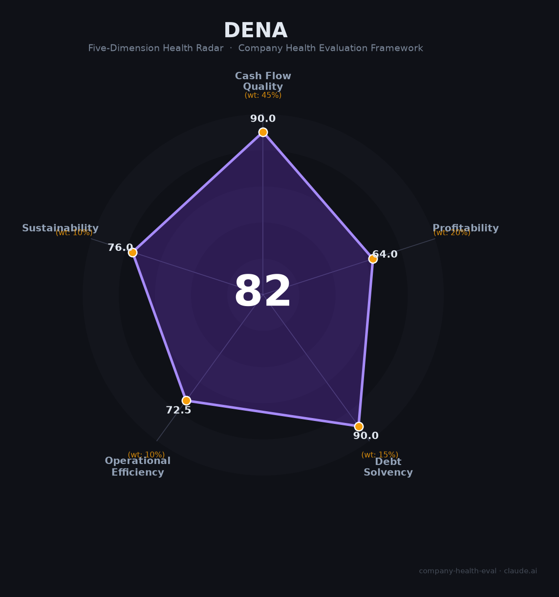

# DeNA 财务健康评估（2026-06-18）

## 一句话结论

🟡 **中等偏上（81.7/100）** | 日企手游+体育多元化标杆，净现金¥546亿+¥500亿回购+Pokemon TCG Pocket首年$13亿，核心短板：爆款后遗症(MAU腰斩)+CEO一年两换+医疗¥96亿减值+市场3年萎缩

---

## 一、公司基本画像

| 维度 | 内容 |
|------|------|
| **运营主体** | 株式会社ディー・エヌ・エー（DeNA Co., Ltd.），1999年3月创立，东京证交所Prime上市（2432.T），日经225成分股 |
| **创始人** | 南場智子（Tomoko Namba），1962年生，哈佛MBA，前麦肯锡合伙人。2025年4月退任CEO任会长，2026年6月拟回归CEO |
| **主营业务** | 🔒 游戏（Pokemon TCG Pocket/Masters EX、Fire Emblem Heroes等IP手游，占44%营收）+ 直播（Pococha/IRIAM，27%）+ 体育（横浜DeNAベイスターズ职棒队，22%）+ 医疗健康（Allm/Data Horizon，6%） |
| **上市/资本** | 🔒 2005年Mothers→2007年东证一部→现Prime。当前市值~¥2,800亿（$19亿），股价~¥2,670。任天堂持股~13%、南場智子~17% |
| **关键合作** | 任天堂资本+业务联盟（2015至今），Nintendo Systems合资（任天堂80%/DeNA 20%），Pokemon Card D Studio子公司（DeNA 66.6%/TPC 33.4%） |
| **员工规模** | 🔒 2,572人（2025年3月，同比-11%），推行"AI全员押注"结构调整。平均年收¥854万（日本游戏公司#6） |

**定性**：DeNA是日本手游行业"最懂IP运营"的多元化集团——凭借与任天堂/Pokemon Company的深度绑定在IP手游赛道拥有独特护城河，横浜DeNAベイスターズ（2024年日本大赛冠军）提供了稳定的第二增长曲线。但公司正经历Pokemon TCG Pocket热度消退（MAU从5100万腰斩至2400万）的典型"爆款后遗症"，CEO一年内两次更替，并面临激进投资者（村上集团）的治理压力。

---

## 二、五维财务健康评估

> 注：DeNA为东京证交所上市公司，财年截至3月31日。FY2025=2025年4月至2026年3月。🔒表示经审计数据。

### 1. 现金流质量（90/100）

| 指标 | 状态 | 数据支撑 |
|------|------|---------|
| 经营现金流 | 🟢 健康 | 🔒 FY2025 OCF ¥334亿（vs FY2024 ¥390亿），连续多年为正 |
| 现金跑道 | 🟢 健康 | 🔒 现金¥1,030亿，净现金¥546亿。年运营支出~¥1,290亿，现金覆盖远超12个月 |
| 有息负债 | 🟢 健康 | 🔒 有息负债¥484亿，净现金为正（¥546亿）。负债率可控（净资产比率69.8%） |
| 净现比 | 🟢 健康 | 🔒 OCF ¥334亿 / NI ¥190.5亿 = **1.75倍**。现金产生能力远超会计利润 |

### 2. 盈利能力（64/100）

| 指标 | 状态 | 数据支撑 |
|------|------|---------|
| 毛利率 | 🟡 一般 | 📊 估40-55%（游戏IP授权费压缩毛利+体育/医疗低毛利业务拖累）。IFRS营业利润率12.7%，处于行业中等 |
| 净利率 | 🟡 良好 | 🔒 FY2025 12.9%（5-15%区间）。FY2024曾达14.8%，下滑反映TCG Pocket热度消退 |
| 营收增速 | 🟡 一般 | 🔒 FY2025 -9.9%（TCG Pocket高基数效应）。FY2022-FY2025 CAGR ~3.1%。FY2026公司指引+4.3% |
| 研发投入 | 🟡 一般 | 🔒 单独披露研发仅¥7.7亿（0.5%），游戏开发成本计入COGS。整体科技投入偏低 |
| 人均产出 | 🟢 优秀 | 🔒 ¥1,477亿 / 2,572人 = **¥5,740万/人**（~$383K）。远高于行业平均，CyberAgent仅¥1,054万 |

### 3. 偿债能力（90/100）

| 指标 | 状态 | 数据支撑 |
|------|------|---------|
| 资产负债率 | 🟢 健康 | 🔒 净资产比率69.8%，即资产负债率~30%（<40%） |
| 有息负债率 | 🟢 健康 | 有息负债¥484亿 / 总资产~¥4,000亿 ≈12%。且净现金为正 |
| 流动/现金比率 | 🟢 健康 | 现金¥1,030亿，流动负债可控 |
| 股权质押 | 🟢 健康 | 公开上市，创始人持股17%，无显著质押 |

### 4. 运营效率（72.5/100）

| 指标 | 状态 | 数据支撑 |
|------|------|---------|
| 应收周转 | 🟢 健康 | App Store/Google Play月结+游戏内购预付制，现金转换周期短 |
| 客户集中度 | 🟢 健康 | 数千万游戏玩家+棒球迷+直播用户。任天堂是重要合作伙伴但不是"客户" |
| 员工规模趋势 | 🟠 关注 | 🔒 2,897→2,572（-11%）。官方称AI结构调整（目标：一半人做现有业务，一半转AI新事业） |
| 高管稳定性 | 🟠 关注 | 🔒 CEO一年内两次更替（南場→岡村2025.4 → 南場拟2026.6回归）。创始人回归可能稳定方向但反映继任计划不稳定 |

### 5. 可持续发展（76/100）

| 指标 | 状态 | 数据支撑 |
|------|------|---------|
| 行业赛道 | 🟠 关注 | 🌐 日本手游市场连续3年萎缩（CAGR 7-10%但<15%）。中国/韩国厂商持续蚕食份额 |
| 技术壁垒 | 🟢 健康 | 任天堂/Pokemon Company深度绑定（10年+合作）+ 25年手游运营经验 + 棒球队独家IP |
| 业务多元化 | 🟢 健康 | 🔒 游戏44% + 直播27% + 体育22% + 医疗6%。日本游戏公司中最多元化的收入结构之一 |
| 资本支持 | 🟢 健康 | 🔒 TSE Prime上市+¥1,030亿现金+净现金¥546亿+¥500亿回购（最高可回购22.4%股份） |
| 政策风险 | 🟠 关注 | 🌐 ガチャ监管趋严（2025年概率公示强化）+ MSCA法案改变平台经济学 + 日本手游市场规模萎缩 |

---

## 三、综合评分与健康等级

| 维度 | 得分 | 权重 | 加权得分 |
|------|:----:|:----:|:--------:|
| 现金流质量 | 90.0 | 45% | 40.5 |
| 盈利能力 | 64.0 | 20% | 12.8 |
| 偿债能力 | 90.0 | 15% | 13.5 |
| 运营效率 | 72.5 | 10% | 7.2 |
| 可持续发展 | 76.0 | 10% | 7.6 |
| **综合得分** | | | **81.7 / 100** |
| **健康等级** | | | **🟡 中等偏上** |

---

## 四、同业对标

| 对比项 | DeNA (2432) | CyberAgent (4751) | GungHo (3765) | Mixi (2121) |
|--------|:---:|:---:|:---:|:---:|
| 营收（最新) | ¥1,477亿 | ¥8,740亿 | ¥932亿 | ¥1,549亿 |
| 营收增速 | -9.9% | +9.1% | -10.0% | +5.4% |
| 营业利润率 | 12.7% | 8.2% | 5.4% | **17.2%** |
| 员工规模 | 2,572 | 8,284 | 1,583 | 1,645 |
| 人均营收 | **¥5,740万** | ¥1,054万 | ¥5,890万 | ¥9,415万 |
| 平均年收 | ¥854万 | — | ¥750万 | — |
| 市值 | ~¥2,800亿 | ~¥7,100亿 | ~¥1,370亿 | ~¥1,720亿 |
| 核心差异 | 多元化(游戏+体育+医疗)+任天堂IP | 互联网广告巨头+AbemaTV | 单一爆款依赖(パズドラ) | モンスト依赖+高利润率 |

**对标结论**：DeNA在多元化上远超同行（是唯一同时拥有职业棒球队和医疗业务的手游公司），人均产出在行业前列。但增速和利润率均处于行业中游，不如Mixi的专注高效，也不如CyberAgent的广告帝国规模优势。

---

## 五、核心风险清单

1. **Pokemon TCG Pocket爆款后遗症（高）**：MAU从5100万腰斩至2400万，月收入从$2.35亿峰值暴跌87%至$3140万。FY2025游戏收入-17.6%，FY2026公司指引利润-19.8%。单一IP集中的结构性风险显著。

2. **CEO一年两换+激进投资者施压（中高）**：南場→岡村(2025.4)→南場回归(2026.6拟)。一年内CEO两次更替反映战略方向不稳。村上集团已建仓，要求更高股东回报和业务重组。

3. **医疗业务持续失血（高）**：FY2025确认Allm商誉减值¥96亿，剩余商誉¥207亿面临进一步减值风险。医疗板块自收购以来从未盈利，是公司资本配置效率最大的问号。

4. **日本手游市场结构性萎缩（中高）**：连续3年下滑，中国/韩国厂商持续蚕食份额。DeNA缺乏自主研发的顶级IP（所有大作为任天堂/Pokemon授权），面临"代工化"风险。

5. **任天堂合作关系的去风险化（中）**：DeNA已出售68%任天堂持股，任天堂手游投入在收缩。Nintendo Systems合资（任天堂80%）意味着议价能力向任天堂倾斜。

6. **AI结构调整的员工冲击（中）**：11%员工减少（目标"一半人做现有业务"）。虽非传统裁员，但组织变动和角色重定义对团队稳定性构成压力。

---

## 六、求职/择业视角

### 核心优势
- **WLB日本IT行业领先**：Glassdoor WLB 4.1/5、OpenWork 4.19/5、远程为主（出社仅2成）、月加班27h、有休消化率71.5%
- **薪酬行业Top 6**：平均¥854万（$57K），在日本游戏公司中属顶级。20代成长环境评分4.7/5（OpenWork最高分）
- **国际化经验**：与任天堂/Pokemon Company深度合作，IP运营经验独特且高度通用
- **沟通透明+治理规范**：OpenWork沟通透明度4.5/5、法令遵守4.3/5，女性管理职比率12.6%行内领先

### 现存短板
- **长期人才培养不足**：OpenWork"长期人才培养"仅2.9/5（最低分）。平均勤続5-6年，"培养完就走"模式
- **核心业务不够稳固**：依赖外部IP而非自研，职业安全感受Pokemon热度波动影响大
- **日本法人评分低**：Glassdoor日本法人仅2.8/5（vs全球4.2），反映日本实体的薪酬竞争力和晋升问题
- **AI结构调整期的不确定性**：2025年"全员AI押注"改革的实质效果需2026年下半年才能看清

### 分场景建议

| 个人诉求 | 推荐度 | 理由 |
|----------|:------:|------|
| 稳定+WLB | ⭐⭐⭐⭐⭐ | 日本IT行业最好的WLB+远程文化+净现金¥546亿的抗风险能力 |
| 高薪+积累 | ⭐⭐⭐⭐ | 薪酬Top 6+20代成长环境Top级+IP运营经验全球化通用 |
| 长期深耕 | ⭐⭐⭐ | 人才培养长期评分低+组织变革期+CEO频繁更替 |
| IP/游戏运营 | ⭐⭐⭐⭐⭐ | 与任天堂/Pokemon的深度合作经验在全球游戏行业独一无二 |

---

## 七、总结

**DeNA 是日本手游行业「最懂IP运营+最敢多元化的复合集团」：**
净现金¥546亿+¥500亿回购的财务底盘极为扎实，Pokemon TCG Pocket首年$13亿证明了其在IP手游运营上的顶级能力，横浜DeNAベイスターズ（2024日本一）提供了少见的"游戏+体育"双轮驱动模式。但公司正面临多重过渡期挑战：TCG Pocket热度腰斩→游戏收入惯性下滑、CEO一年两换→战略方向待稳、医疗¥96亿减值→多元化代价显现、AI结构调整→11%人员缩减。
在激进投资者施压+日本手游市场连续3年萎缩的大环境下，属于**防御型现金牛标的**，适合追求极致WLB+IP运营经验积累、能接受组织变革不确定性的候选人。

---

*评估日期：2026年6月18日 | 数据截至：DeNA FY2025（2026年5月12日发布）| 评分引擎：company-health-eval v3.0*
