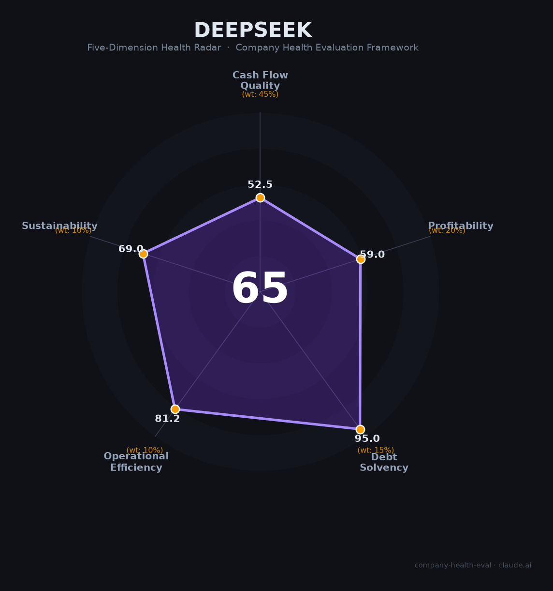

# DeepSeek（深度求索）财务健康评估（2026-06-12）

## 一句话结论

🟠 **中等 · 综合得分 65/100** | 全球人均效率最高的AI实验室——317人做出V4（1.6万亿参数、纯国产算力），API定价仅为OpenAI的1/30-1/216，核心人才留存率82.6%。但营收模型未经验证（年收入估算仅40-50亿元），首轮融资500亿元才为期权首次定价——这是一家「技术天才、商业幼童」的AGI先锋。

---

## 一、公司基本画像

| 项目 | 详情 |
|------|------|
| **运营主体** | 杭州深度求索人工智能基础技术研究有限公司，2023年7月成立 |
| **创始人** | 梁文锋（1985年，浙大本硕，幻方量化创始人） |
| **总部/研发中心** | 杭州拱墅（注册总部）+ 北京海淀融科资讯中心（研发核心） |
| **员工规模** | 约317人（2026年4月，研发270+商合48），85%为研发 📊 |
| **上市状态** | 未上市，无IPO计划；2026年6月首轮外部融资约500亿元 💬 |
| **估值** | 约520-590亿美元（投后，约3,500-4,000亿人民币） 📊 |
| **月活用户** | 约1.27亿（2026年3月，国内第三，仅次于豆包3.45亿、千问1.66亿） 📊 |
| **核心产品** | DeepSeek-V4（1.6万亿参数MoE）、R1推理模型、API服务、开源模型系列 |
| **2025年营收** | 估算40-50亿元人民币（低可信度，未经审计） 📊 |
| **母公司** | 幻方量化（2025年平均收益率56.55%，管理规模700亿+） |

**一句话定性**：DeepSeek是全球范围内用最少人做出最大影响的AI实验室——160人做出R1震动硅谷，317人跑通V4（1.6万亿参数/纯国产华为昇腾算力/全MIT开源），API成本仅为OpenAI的1/30-1/216。开源策略颠覆了闭源巨头的定价权，但「如何赚钱」是摆在梁文锋面前的最大难题。2026年从模型公司转型Agent产品化（Harness团队），首轮500亿融资为期权首次定价，是团队从"实验室"走向"公司"的关键转折。

---

## 二、五维财务健康评估

### 1. 现金流质量（52/100）🔴 | 权重45%

| 评估指标 | 状态 | 判断 | 依据 |
|----------|------|------|------|
| 营收规模 | 2025年估算40-50亿人民币；2026年化运行率仅约2.2亿美元 | 🔴 极小 | 📊 行业估算。收入远低于估值隐含预期（PS约100x+） |
|盈利能力|官方2025年3月披露"理论日利润346万元"但强调"实际远低于此"|🔴 微利或亏损|📊 免费用户占比极高，API定价仅为OpenAI的1/30|
| 现金储备 | 2026年6月首轮融资500亿人民币（约74亿美元） | 🟢 刚到位 | 💬 路透社。中国AI单轮最大融资 |
| 幻方量化输血 | 2025年幻方收益率56.55%，梁文锋个人年收入估约50亿元 | 🟢 强后盾 | 📊 行业估算。但首轮融资后DeepSeek正式独立 |
| 自由现金流 | 未知，但营收40-50亿 vs 全口径训练成本可能5-25亿美元 | 🔴 可能为负 | 📊 大量免费用户+极低API定价压缩收入 |

**本维度分析**：DeepSeek的现金流是"薛定谔状态"——没有人真正知道它赚多少钱。开源免费+API白菜价策略在抢占市场份额方面极其成功（MAU 1.27亿），但商业化几乎为零。首轮500亿融资暂时解决了资金问题，但若未来2-3年无法证明可持续的商业模式，这笔钱终将烧完。

**扣分项**：营收模型未验证且与估值严重不匹配（-25分）；API定价仅为竞品1/30-1/216主动压缩收入（-15分）；无经审计财报（-10分）；免费用户占比极高（-5分）。

---

### 2. 盈利能力（59/100）🔴 | 权重20%

| 评估指标 | 状态 | 判断 | 依据 |
|----------|------|------|------|
| 营收估值比 | 估值$520-590亿 vs 年化收入$2.2亿 ≈ PS 227x | 🔴 极度高估 | 📊 ainvest.com。即使是乐观的50亿人民币/年，PS仍有约80x |
| API毛利率 | 理论成本利润率545%（官方披露），但实际因免费+折扣低得多 | 🟡 理论健康 | 📊 官方数据。定价策略主动压缩了实际利润率 |
| 营收增速 | 2025年从零到40-50亿估算 | 🟢 飞速起步 | 📊 但基数效应下未来增速必然放缓 |
| 商业模式 | 开源免费为主+API低价+企业私有部署（10万/年起） | 🟠 待验证 | 📊 开源如何变现是AI行业最大未解难题 |
| 成本结构 | V4训练成本（仅GPU算力）520万美元；全口径估5-25亿美元 | 🟡 训练高效 | 📊 人均训练成本极低，但推理成本随用户增长攀升 |

**本维度分析**：DeepSeek在成本控制端做到了极致——V4训练成本仅520万美元（GPU算力口径），人均效率全球无敌。但在收入端，开源+白菜价策略意味着巨大的用户规模无法转化为对应收入。500亿融资的估值假设是「未来一定会找到商业模式」，但这一天何时到来尚未可知。

**扣分项**：PS 100x+远超任何可比公司（-25分）；开源免费导致收入转化率极低（-20分）；定价策略主动放弃利润（-10分）；无盈利时间表（-7分）。

---

### 3. 偿债能力（95/100）🟢 | 权重15%

| 评估指标 | 状态 | 判断 | 依据 |
|----------|------|------|------|
| 外部融资 | 首轮500亿人民币（约74亿美元），中国AI单轮最大 | 🟢 极充裕 | 💬 路透社/证券时报。投后估值$520-590亿 |
| 母公司支持 | 幻方量化管理700亿+，2025年收益率56.55% | 🟢 强后盾 | 📊 行业数据。即使独立后仍有关联交易可能 |
| 负债 | 成立以来无外部借款 | 🟢 零负债 | 纯自有资金+股权融资 |
| 投资方阵容 | 腾讯（约100亿）、宁德时代（约50亿）、梁文锋自掏200亿 | 🟢 顶级 | 💬 路透社。产业资本+创始人深度绑定 |

**本维度分析**：500亿融资到账后，DeepSeek短期内无需担心资金问题。零负债+顶级投资方+创始人自掏200亿的承诺（梁文锋持股84.29%）提供了极高的财务安全垫。

---

### 4. 运营效率（81/100）🟢 | 权重10%

| 评估指标 | 状态 | 判断 | 依据 |
|----------|------|------|------|
| 人均产出 | 160人做出R1震动硅谷；317人做出V4纯国产万亿参数模型 | 🟢 全球第一 | 📊《财经》。同行对比：字节Seed 967人、阿里Qwen 352人 |
| 研发占比 | 270/317 = **85%** 研发人员 | 🟢 极致精简 | 📊《财经》论文统计。几乎无冗余非研发岗 |
| 核心人才留存 | 初始团队（2024.01）82.6%留存至V4；核心部门离职率<4% | 🟢 极强 | 📊《财经》27篇论文交叉统计。对比OpenAI前两年流失超25% |
| 工作文化 | 无KPI/OKR、不打卡、6-7点下班、"全球仅有的不卷的核心AI Lab" | 🟢 独树一帜 | 💬 晚点/知乎。梁文锋："一个人高质量输出很难超6-8小时" |
| 管理层级 | 极度扁平，只有梁文锋+其他研究员两层 | 🟢 高效 | 📊 晚点LatePost |

**本维度分析**：DeepSeek的运营效率是全球AI行业的标杆——300人做出万亿参数模型的奇迹。无KPI、不打卡、6-7点下班、82.6%留存率证明了梁文锋「用自由换创造力的管理哲学」确实有效。唯一的扣分项是小团队模式下关键人物离职影响不成比例（郭达雅→字节、王炳宣→腾讯已证明这一点）。

**扣分项**：核心人才被大厂以2-3倍薪资挖角（-10分）。小团队抗关键人风险弱。

---

### 5. 可持续发展（69/100）🟡 | 权重10%

| 评估指标 | 状态 | 判断 | 依据 |
|----------|------|------|------|
| 技术护城河 | 开源MIT协议——任何人都能免费使用和修改 | 🟠 技术领先但无壁垒 | 📊 开源策略主动放弃知识产权护城河 |
| 品牌/社区影响力 | 全球AI开源社区最有影响力的中国品牌之一 | 🟢 极强 | 📊 GitHub星标数、HuggingFace下载量长期领先 |
| Agent产品化转型 | 2026年5月组建Harness团队，对标Claude Code | 🟡 早期但方向正确 | 📊 36氪/品玩。Model+Harness=Agent战略公式 |
| 国产算力绑定 | V4全面迁移至华为昇腾+CANN框架 | 🟠 双刃剑 | 📊 突破美国封锁但受制于昇腾性能上限和供应能力 |
| 人才竞争 | 字节/腾讯以翻倍薪资挖角，已流失至少5名核心研究员 | 🟠 压力大 | 📊 公开报道。首轮融资的核心目的之一就是期权定价留人 |
| 商业化时间窗 | Harness产品预计6-12个月上线，Claude Code已年化$25亿+ | 🟡 紧迫 | 📊 品玩。窗口期有限，需与Cursor/Codex等竞争 |

**本维度分析**：DeepSeek在开源社区的品牌影响力是中国AI公司中最强的。但开源策略的代价是任何人都能免费使用其模型——技术领先不能转化为商业壁垒。Agent产品化（Code Harness）是梁文锋给出的商业化答案，对标Claude Code（年化$25亿+），但产品尚未上线，留给DeepSeek的窗口期有限。

---

## 三、综合评分与健康等级

| 维度 | 得分 | 权重 | 加权得分 |
|------|:----:|:----:|:--------:|
|现金流质量| 52 |45%| 23.4 |
|盈利能力| 59 |20%| 11.8 |
|偿债能力| 95 |15%| 14.2 |
|运营效率| 81 |10%| 8.1 |
|可持续发展| 69 |10%| 6.9 |
| **65/100** |**—**|**100%**|**64.40**|

**健康等级**：🟠 **中等（Moderate）** — 全球人均效率最高、技术品牌最强的中国AI实验室，运营效率指标接近满分。但营收模型（开源免费+API白菜价）和盈利路径尚不清晰，500亿融资为期权定价是团队从"实验室"走向"公司"的第一步，也是最关键的一步。

---

## 四、核心风险清单

### 1. 🔴 商业模式未验证（等级：高）
- **描述**：开源免费+API价格仅为OpenAI的1/30-1/216，主动放弃利润换取市场份额。年收入估40-50亿元，PS约100x+，在所有可比AI公司中最高。
- **触发条件**：3年内无法找到可持续变现路径 → 融资消耗殆尽。

### 2. 🔴 核心人才被挖角（等级：高）
- **描述**：郭达雅→字节（传闻年薪近亿）、王炳宣→腾讯、罗福莉→小米。大厂以2-3倍薪资挖角。
- **触发条件**：若首轮融资后期权定价仍不达预期，可能触发连锁离职。

### 3. 🟠 华为昇腾生态绑定（等级：中高）
- **描述**：V4从CUDA全面迁移至华为CANN框架，是技术突破但也是生态锁定。昇腾芯片的供应能力和性能上限（vs 英伟达Blackwell）构成瓶颈。
- **触发条件**：美国进一步限制华为芯片制造 → 昇腾供应中断。

### 4. 🟡 Agent产品化不确定性（等级：中）
- **描述**：Harness产品对标Claude Code但尚未上线。Claude Code年化$25亿+、Cursor $20亿+先发优势显著。

---

## 五、求职/择业视角

### 核心优势
- **技术履历含金量全球顶级**：在DeepSeek工作过的经历，在大模型圈是最高含金量的"通行证"。
- **极度自由的工作文化**：无KPI/OKR、不打卡、6-7点下班——全球AI大厂中独此一家。
- **薪酬以现金为主**：年薪80-200万，几乎全是现金不画饼，不靠期权凑数。
- **技术成长曲线陡峭**：扁平组织、自由组队、跨组参会，与顶级人才直接协作。

### 现存短板
- **北京无法落户**：对需要京户的人才是一票否决项。
- **期权长期无定价**：首轮融资才为期权首次定价，此前员工期权如同白纸。
- **商业模式不确定**：公司自身盈利路径不清晰，长期就业稳定性存疑。
- **论文产出受限**：Infra紧耦合算法，独立发表难度较高。
- **小团队天花板**：317人规模下晋升通道有限。

### 分场景建议

| 个人诉求 | 推荐度 | 说明 |
|----------|:------:|------|
| AI技术深度追求 | 🟢 极高 | 全球最好的AI研究环境之一，无KPI+顶级同事 |
| 期权财富自由 | 🟡 有希望 | 首轮融资估值$520-590亿，期权首次定价，但IPO遥远 |
| 稳定+WLB | 🟢 适合 | 全球最不卷的AI Lab，6-7点下班 |
| Agent方向深耕 | 🟢 推荐 | match score 85，Harness团队对标Claude Code，从零到一 |

---

## 六、总结

DeepSeek是全球人均效率最高、管理文化最独特的AGI实验室：317人用纯国产华为昇腾算力跑通1.6万亿参数V4、API成本仅为OpenAI的1/30-1/216、核心人才留存率82.6%、无KPI不打卡的极度自由文化。但开源免费+白菜价的商业模式导致营收（估40-50亿元）与估值（$520-590亿）严重脱节——这是一家用技术天才和自由文化征服世界、但还没学会如何收钱的公司。首轮500亿融资和Agent产品化（Code Harness）转型是关键的成人礼。对于追求技术极致和自由文化的AI人才，属于🟠中等风险但极高技术回报的选择。

---

*评估日期：2026-06-12 | 数据截至：2026年6月公开报道和行业估算*

> ⚠️ DeepSeek从未披露经审计财务数据，营收/利润均为外部估算，可信度低。
