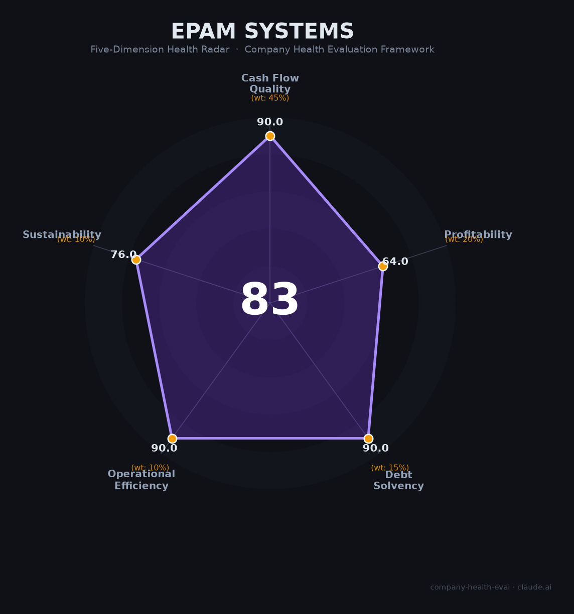

# EPAM Systems 财务健康评估（2026-06-17）

## 一句话结论

🟡 **中等偏上（83.4/100）** | IT服务工程标杆，$1.3B现金+零负债+OCF 1.73x覆盖净利，核心短板：毛利率持续下行(33.9%→28.8%)+乌克兰/白俄罗斯地缘政治暴露

---

## 一、公司基本画像

| 维度 | 内容 |
|------|------|
| **运营主体** | EPAM Systems, Inc.（NYSE: EPAM），1993年在新泽西普林斯顿和白俄罗斯明斯克同时创立 |
| **创始人** | Arkadiy Dobkin（白俄罗斯裔，1991年移居美国，2025年9月卸任CEO转任执行董事长）；现任CEO Balazs Fejes（匈牙利裔，2004年通过收购Fathom加入） |
| **主营业务** | 🔒 软件工程服务（定制开发+产品工程+平台现代化）+ 数字转型咨询 + AI/数据服务 + 云计算 |
| **上市状态** | 🔒 2012年纽交所IPO（$12/股，募资$83M），S&P 500成分股，当前市值~$48亿（股价~$91），TTM P/E ~13x |
| **股权结构** | 机构持股>100%（Capital Group 13.4%、Vanguard 13.2%、BlackRock 7.8%等），内部人~3.3%，创始人Dobkin持股~3.3% |
| **员工规模** | 🔒 62,850人（Q1 2026），交付专业人员~56,500人，覆盖55+国家 |

**定性**：EPAM是东欧软件工程精英文化的全球标杆——凭借深厚的工程功底和客户信任（前10大客户仅21.6%）在IT服务高端市场占据独特生态位。但2022年俄乌战争后被迫将交付从东欧（战前~60%产能）大规模转移至印度（已10,000人→目标20,000人）和拉美，毛利率持续承压，正从"东欧工程公司"转型为"全球AI原生咨询公司"。

---

## 二、五维财务健康评估

### 1. 现金流质量（90/100）

| 指标 | 状态 | 数据支撑 |
|------|------|---------|
| 经营现金流 | 🟢 健康 | 🔒 FY2024 $559M → FY2025 **$655M** (+17.1%)。连续多年为正，Q1 2026季节性为负（-$36M，支付年度奖金所致） |
| 现金跑道 | 🟢 健康 | 🔒 现金$1.30B，无流动性风险。年OCF $655M持续补血 |
| 有息负债 | 🟢 健康 | 🔒 长期债务仅$25M，vs $1.30B现金。实质零负债 |
| 净现比 | 🟢 健康 | 🔒 OCF $655M / NI $378M = **1.73倍**。现金产生能力远超会计利润 |

### 2. 盈利能力（64/100）

| 指标 | 状态 | 数据支撑 |
|------|------|---------|
| 毛利率 | 🟡 一般 | 🔒 FY2025 28.8%（FY2021峰值33.9%→持续下行）。IT服务行业平均~30%，Accenture 32.6% |
| 净利率 | 🟡 良好 | 🔒 FY2025 6.9%（5-15%区间）。FY2021曾达12.8%，战争+并购+汇率三重压力下持续收窄 |
| 营收增速 | 🟡 一般 | 🔒 FY2023 -2.8% → FY2024 +0.8% → FY2025 +15.4%（M&A驱动，有机仅+4.9%）。FY2026指引+4-6.5% |
| 研发投入 | 🟡 一般 | 📊 IT服务公司无传统R&D科目，平台投资（DIAL/AI-RUN）预算估5%左右，属行业平均水平 |
| 人均产出 | 🟢 优秀 | 🔒 $5.46B / 62,850人 = **$86,800/人**。超越Accenture(~$84K)、Infosys(~$59K)、TCS(~$48K) |

### 3. 偿债能力（90/100）

| 指标 | 状态 | 数据支撑 |
|------|------|---------|
| 资产负债率 | 🟢 健康 | 🔒 总负债$1.22B / 总资产$4.90B = 25.0%（<40%） |
| 有息负债率 | 🟢 健康 | 🔒 长期借款仅$25M。实质零有息负债 |
| 流动比率 | 🟢 健康 | 📊 流动资产~$2.5B / 流动负债~$1B ≈ 2.5x |
| 现金比率 | 🟢 健康 | 📊 现金$1.3B / 流动负债~$1B ≈ 1.3x |
| 股权质押 | 🟢 健康 | 无内部人大比例质押 |

### 4. 运营效率（90/100）

| 指标 | 状态 | 数据支撑 |
|------|------|---------|
| 应收周转 | 🟢 健康 | 🔒 客户主要为财富500强+政府机构，信用质量高。IT服务DSO约60-70天，行业合理水平 |
| 客户集中度 | 🟢 健康 | 🔒 前10大客户仅21.6%，无单一客户>10%。客户留存率>93%。极度分散 |
| 员工趋势 | 🟢 健康 | 🔒 53K(2023)→57.7K(2024)→61.2K(2025)→62.9K(Q1 2026)。稳步增长，无大规模裁员 |
| 高管稳定性 | 🟢 健康 | 创始人→执行董事长过渡(2025.9)有序，内部接班人Fejes（服务22年）。市场反应积极（股价+10%） |

### 5. 可持续发展（76/100）

| 指标 | 状态 | 数据支撑 |
|------|------|---------|
| 行业赛道 | 🟠 关注 | 🌐 全球IT服务CAGR 5.8-11.7%（<15%健康线）。但GenAI创造的新服务需求增速更高 |
| 技术壁垒 | 🟢 健康 | 🔒 30年工程品牌+前100大客户中80%+参与AI项目+全球55国交付网+Anthropic独家合作（1,300→10,000+认证架构师） |
| 业务多元化 | 🟢 健康 | 🔒 6大垂直行业（金融25%、零售20%、科技15%等）+55+国家运营。极度分散 |
| 资本支持 | 🟢 健康 | 🔒 S&P 500成分股+$1.3B现金+$500M+年FCF+$10亿回购计划。FY2025回购$608M（>净利润） |
| 政策风险 | 🟠 关注 | 🌐 乌克兰仍9,500+员工（战火中运营）；白俄罗斯3,500+员工（制裁风险+HTP税收优惠可能丧失） |

---

## 三、综合评分与健康等级

| 维度 | 得分 | 权重 | 加权得分 |
|------|:----:|:----:|:--------:|
| 现金流质量 | 90.0 | 45% | 40.5 |
| 盈利能力 | 64.0 | 20% | 12.8 |
| 偿债能力 | 90.0 | 15% | 13.5 |
| 运营效率 | 90.0 | 10% | 9.0 |
| 可持续发展 | 76.0 | 10% | 7.6 |
| **综合得分** | | | **83.4 / 100** |
| **健康等级** | | | **🟡 中等偏上** |

---

## 四、同业对标

| 对比项 | EPAM | Globant (GLOB) | Accenture (ACN) | Endava (DAVA) |
|--------|:---:|:---:|:---:|:---:|
| 营收规模 | **$5.46B** | $2.42B | $64.9B | ~$1.0B |
| 营收增速 | +15.4%(有机5%) | +15.3% | +1% | -6.8% |
| 毛利率 | 28.8% | **35.7%** | 32.6% | 24.3% |
| 净利率 | 6.9% | 6.9% | **11.4%** | 2.3% |
| 员工规模 | 62,850 | 31,300 | 774,000 | 12,100 |
| 人均创收 | **$86.8K** | $77.3K | $83.8K | $82.0K |
| 人才池核心 | 东欧→印度+拉美 | **拉美** | 全球 | 东欧 |
| P/E (TTM) | ~13x | ~31x | ~27x | ~20x |
| GenAI应对 | Anthropic深度合作 | 4个自研AI平台 | AI咨询$6B+规模 | 支付/金融专精 |

**对标结论**：EPAM在数字工程专业公司中是"规模最大但估值最低"的悖论——$5.5B营收（Globant的2.3倍），但P/E仅为13x（Globant的42%）。市场对其东欧地缘风险、毛利率下行和AI颠覆风险给予了大幅折价。如果印度转型和AI咨询故事兑现，存在显著的价值重估空间。

---

## 五、核心风险清单

1. **地缘政治——乌克兰/白俄罗斯暴露（高）**：乌克兰9,500+员工仍在战火中运营，白俄罗斯3,500+员工面临制裁扩大和资产没收风险。HTP全额免税至2049年——若丧失，有效税率将飙升。

2. **毛利率持续压缩（中高）**：毛利率从33.9%(FY2021)→30.6%(FY2023)→28.8%(FY2025)。印度低成本扩张短期拉低利润率、长期能否恢复到30%+未验证。

3. **GenAI颠覆传统外包模式（中高）**：GitHub Copilot/Cursor/Claude Code等工具使编码效率提升55%+。传统T&M计费模型面临结构性收缩。EPAM正向AI原生咨询和成果导向定价转型，但成功与否待观察。

4. **东欧人才优势相对削弱（中）**：印度15M+IT人才供给（EPAM目标从10K→20K）+拉美近岸时区优势，使东欧不再是唯一"高性价比工程人才"来源。

5. **CEO换代执行风险（中）**：创始人Dobkin（任职32年）2025年9月退位。新CEO Fejes虽为22年老人，但"从纯工程公司转向AI原生咨询"的战略执行考验巨大。

6. **证券集体诉讼悬而未决（低至中）**：2024年5月盈利预期大幅下调（股价单日-27%）引发的证券集体诉讼仍在进行中。

---

## 六、求职/择业视角

### 核心优势
- **工程文化圈内口碑极好**：Glassdoor 3.9/5，WLB 4.0/5，CEO认可度92%，87%员工愿意推荐。在IT服务行业内属于顶尖
- **WLB行业领先**：Blind WLB评分4.0/5（最高），在996横行的科技行业中极为稀缺
- **全栈工程经验深厚**：世界500强客户+复杂数字平台工程，经验高度通用，跳槽到任何科技公司都有价值
- **无裁员文化**：即使在战争冲击和2023年营收下滑期间，仍避免大规模裁员

### 现存短板
- **薪酬偏低**：Blind薪酬评分仅2.9/5（最低维度）。美国L3中位$138K，远低于Accenture Tech(~$283K)和产品公司。股票激励极少
- **品牌在非IT服务圈知名度有限**：对跳槽到FAANG/独角兽的"敲门砖"效应不如Accenture/McKinsey
- **职业天花板**：作为专业服务公司，职业路径较扁平（工程师→高级→架构师→总监），缺少产品经理/创始人等路径
- **地缘不确定性**：若乌克兰/白俄罗斯局势恶化，在EPAM任职的东欧同事可能面临巨大的个人和职业冲击

### 分场景建议

| 个人诉求 | 推荐度 | 理由 |
|----------|:------:|------|
| 稳定+WLB | ⭐⭐⭐⭐⭐ | IT服务行业最好的WLB+无裁员文化+远程灵活 |
| 高薪+跳板 | ⭐⭐⭐ | 薪酬行业内偏低，但工程经验通用性强 |
| AI转型红利 | ⭐⭐⭐⭐ | Anthropic深度合作+AI收入$600M目标，是参与AI落地的独特机会 |
| 多元+全球化 | ⭐⭐⭐⭐⭐ | 55国/6万人的跨国公司经验，特别是新兴市场（印度、拉美）的稀缺经历 |

---

## 七、总结

**EPAM Systems 是全球IT服务行业「工程文化最深厚的数字转型专家」：**
$1.3B现金+实质零负债+OCF 1.73倍净利的财务底盘极为扎实，前10大客户仅占21.6%的极度分散性和6大垂直行业布局赋予了抗周期韧性。核心结构性挑战是毛利率从2021年的33.9%持续下行至28.8%——战争迫使的交付中心从东欧向印度迁移（拉低利润率）+ GenAI编码工具对传统T&M定价模型的颠覆。在IT服务行业从"成本套利外包"向"AI原生咨询"范式转型的大背景下，属于**防御性+低估值（P/E 13x）+高分红（回购$608M>净利润）的价值型标的**，适合追求WLB极致、看重全球化经验积累、且愿意押注AI转型红利的候选人。

---

*评估日期：2026年6月17日 | 数据截至：EPAM Q1 2026（2026年5月7日发布）+ FY2025 10-K（2026年2月26日提交）| 评分引擎：company-health-eval v3.0*
