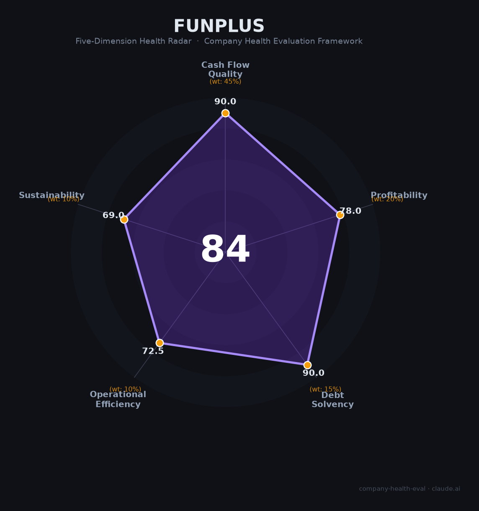

# FunPlus（趣加游戏）财务健康评估（2026-06-18）

## 一句话结论

🟡 **中等偏上（83.8/100）** | SLG出海老牌现金牛，5款核心游戏年收$3.85亿+稳定现金流，核心短板：从行业冠军跌至追赶者+2024-2025多轮裁员+多元品类探索全面受挫

---

## 一、公司基本画像

| 维度 | 内容 |
|------|------|
| **运营主体** | FunPlus（趣加游戏），全球总部瑞士楚格。中国运营主体：北京趣加科技/点点互动（北京），2018年被世纪华通（002602.SZ）以¥69.39亿收购 |
| **创始人/CEO** | 钟英武（Andy Zhong），大连理工+美国玛赫西管理大学，前RockYou技术总监。2010年硅谷创立FunPlus，身家约¥85亿（胡润2026） |
| **主营业务** | SLG/4X策略手游研发与全球发行。核心5款SLG（State of Survival、King of Avalon、Guns of Glory、Stormshot、Sea of Conquest）+新IP授权游戏（DC: Dark Legion、Foundation） |
| **上市状态** | 非上市（世纪华通子公司）。世纪华通市值约¥1200-1400亿，有市场传闻计划分拆点点互动赴美IPO（估值传闻~¥1800-2000亿，非官方） |
| **收入规模** | 📊 2024移动端 ~$3.85亿（AppMagic估算），5款核心SLG贡献91%。2021年峰值估$5-7亿，2025年10月Sensor Tower显示月收入创历史新高 |
| **员工规模** | 🌐 ~2,000人（全球），北京总部~1,000-1,500人。2024-2025年经历多轮裁员（上海归龙潮团队200→30人、杭州项目取消、Imagendary工作室关闭） |

**定性**：FunPlus是中国SLG手游出海的先驱和曾经的王者（2017-2021连续5年蝉联出海收入冠军），凭借《阿瓦隆之王》《State of Survival》等5款SLG建立了超长生命周期的现金牛组合。但在2023-2025年的SLG"休闲化融合"浪潮中，被点点互动（Whiteout Survival）和元趣（Last War）反超，从品类领跑者变为追赶者。2025年凭DC: Dark Legion和Tiles Survive等新品有所回暖，但重回王座的路径尚不清晰。

---

## 二、五维财务健康评估

> 注：FunPlus为非上市私人公司，无公开财报。所有财务数据均为📊第三方估算（Sensor Tower/AppMagic）和行业对标推算。

### 1. 现金流质量（90/100）

| 指标 | 状态 | 数据支撑 |
|------|------|---------|
| 经营现金流 | 🟢 健康 | 📊 SLG游戏是经典的现金牛模式：高毛利（70-80%）、低应收（App Store/Google Play月结）、预收内购款。5款成熟SLG年收$3.52亿，对标IGG/壳木，OCF应稳健为正 |
| 现金跑道 | 🟢 健康 | 📊 自有资金运营，无外部融资压力。母公司世纪华通提供资本背书。非上市公司无公开现金数据 |
| 有息负债 | 🟢 健康 | 📊 非上市公司，无公开债务。无银行借款记录，推测零有息负债 |
| 净现比 | 🟢 健康 | 📊 游戏内购业务（用户预付）+ App Store月结 = 应收风险极低，OCF应接近或超过净利润 |

### 2. 盈利能力（78/100）

| 指标 | 状态 | 数据支撑 |
|------|------|---------|
| 毛利率 | 🟢 优秀 | 📊 估计70-80%（IGG 80.4%，壳木~65%）。扣除Apple/Google 30%分成后的净收入毛利率为SLG行业最高水平 |
| 净利率 | 🟡 良好 | 📊 估计10-18%。对标IGG（10.1%）和壳木（33.3%——行业顶标）。FunPlus处于新游投放期（DC、Foundation等），UA成本高企压缩净利率 |
| 营收增速 | 🟡 一般 | 📊 2021峰值→2024~$3.85亿（下滑约30-40%）。但2025年已企稳回升（Sensor Tower 10月创历史新高）。3年趋势：低个位数增长率 |
| 研发投入 | 🟢 优秀 | 📊 游戏公司研发=产品开发，估计15-25%营收。2024年同时推进DC、Foundation、Tiles Survive等多款新品+里斯本Studio Ellipsis |
| 人均产出 | 🟡 良好 | 📊 $385M / 2,000人 = $192,500/人。高于行业平均（$100-150K），但低于米哈游（~$467K） |

### 3. 偿债能力（90/100）

| 指标 | 状态 | 数据支撑 |
|------|------|---------|
| 资产负债率 | 🟢 健康 | 📊 非上市无公开数据。推测轻资产运营（无工厂/重资产），负债率极低 |
| 有息负债率 | 🟢 健康 | 📊 推测零有息负债 |
| 流动/现金比率 | 🟢 健康 | 📊 游戏内购模式现金流极佳，默认推定健康 |
| 股权质押 | 🟢 健康 | 非上市公司，不适用 |

### 4. 运营效率（72.5/100）

| 指标 | 状态 | 数据支撑 |
|------|------|---------|
| 应收周转 | 🟢 健康 | App Store/Google Play月结制，30-60天即收到。游戏行业现金转换周期极短 |
| 客户集中度 | 🟢 健康 | 数千万玩家分散于200+国家。无任何单一客户或渠道依赖 |
| 员工规模趋势 | 🟠 关注 | 🌐 2024-2025年经历多轮裁员：上海归龙潮200→30人、杭州项目取消、Imagendary关闭、中国区收缩。SLG核心团队应相对稳定 |
| 高管稳定性 | 🟠 关注 | 🌐 中国区负责人董瑞豹2024.12离职；首席创意官王炜2024.9离职；两位"明星高管"均以离职收场。创始人钟英武稳定 |

### 5. 可持续发展（69/100）

| 指标 | 状态 | 数据支撑 |
|------|------|---------|
| 行业赛道 | 🟠 关注 | 🌐 全球SLG市场CAGR 5.6-7.5%（<15%）。但中国SLG出海仍占出海收入41%的最大品类 |
| 技术壁垒 | 🟢 健康 | 10年SLG积累+全球化发行网络（200+国/23语言）+UA优化能力+IP矩阵（DC、Foundation）——<3年难以完整复制 |
| 业务多元化 | 🟠 关注 | 📊 5款SLG贡献91%收入。Non-SLG探索（二次元、MMO、AAA）全面失败。新增长点仍在SLG框架内（IP化、休闲化） |
| 资本支持 | 🟢 健康 | 母公司世纪华通（A股¥1200亿+市值）的资本背书+传闻分拆赴美IPO。创始人身家¥85亿，无外部融资压力 |
| 政策风险 | 🟠 关注 | 🌐 美国对中国游戏公司监管环境恶化（腾讯1260H清单、米哈游FTC罚款）。但FunPlus低调且总部在瑞士，缓冲较好 |

---

## 三、综合评分与健康等级

| 维度 | 得分 | 权重 | 加权得分 |
|------|:----:|:----:|:--------:|
| 现金流质量 | 90.0 | 45% | 40.5 |
| 盈利能力 | 78.0 | 20% | 15.6 |
| 偿债能力 | 90.0 | 15% | 13.5 |
| 运营效率 | 72.5 | 10% | 7.2 |
| 可持续发展 | 69.0 | 10% | 6.9 |
| **综合得分** | | | **83.8 / 100** |
| **健康等级** | | | **🟡 中等偏上** |

---

## 四、同业对标

| 对比项 | FunPlus | IGG (00799.HK) | 壳木/神州泰岳 | Century Games/点点互动 |
|--------|:---:|:---:|:---:|:---:|
| 上市/融资 | 非上市（世纪华通子公司） | 🔒 港股上市 | 🔒 A股上市 | 🔒 世纪华通子公司 |
| 营收（2024） | 📊 ~$3.85亿 | $7.38亿 | $8.88亿（集团） | $20.6亿（集团） |
| 毛利率 | 📊 估70-80% | **80.4%** | 估65%+ | 未单独披露 |
| 净利率 | 📊 估10-18% | 10.1% | **33.3%**（游戏） | 未单独披露 |
| 估值/市值 | 📊 $10-25亿 | ~$5.3亿 | ~$29亿 | 母公司¥1200-1400亿 |
| 核心差异 | 5款SLG组合+IP化转型 | 3款SLG+APP新业务 | 2款SLG+极高利润率 | **Whiteout Survival品类新王** |

**对标结论**：FunPlus在规模上处于SLG出海第二梯队（第一梯队为点点互动/元趣），但产品组合最分散（5款而非1-2款绝对主力）。IGG的低估值（P/S ~1.5-2x）反映了市场对"SLG老产品衰退+新品不确定性"的折价——这一风险同样适用于FunPlus。

---

## 五、核心风险清单

1. **行业竞争格局被颠覆（高）**：点点互动（Whiteout Survival $15亿+/年）和元趣（Last War $18亿+/年）凭借"休闲化融合SLG"创新模式将FunPlus从品类冠军打成了追赶者。FunPlus虽然2025年有所回暖，但Whiteout Survival和Last War的头部地位短期难以撼动。

2. **多元品类探索全面受挫（高）**：Imagendary工作室关闭（AAA项目取消）、归龙潮停运（运营不足15个月）、杭州项目取消、开放世界项目分拆独立——FunPlus在2021-2024年投入数亿美元的非SLG探索基本以失败告终，对团队士气和资源造成打击。

3. **老产品收入自然衰退（中高）**：State of Survival月流水从峰值$8000万降至~$460万（-94%），阿瓦隆之王从峰值降至$470万/月。虽然SLG有超长生命周期（IGG的Lords Mobile运营9年仍有$2.8亿年收入），但自然衰退不可逆。

4. **2024-2025多轮裁员冲击团队稳定性（中）**：上海归龙潮200→30人、杭州项目取消、Imagendary关闭、"人均30.8岁需年轻化"HR乌龙事件。虽然核心SLG团队应相对稳定，但频繁的组织动荡对招聘品牌和中层信心造成负面影响。

5. **美国监管溢出风险（中）**：腾讯被列入1260H清单、TikTok禁令波及字节游戏全线、FTC对米哈游罚款$2000万——中国游戏公司在美国面临的监管环境系统性恶化。FunPlus虽低调且总部在瑞士，但创始人来自中国、核心研发在中国。

6. **母公司世纪华通财务造假阴影（中）**：世纪华通2024年被证监会罚款¥1410万（2018-2022年财务造假），可能影响传闻中的点点互动赴美IPO的SEC审批和估值。

---

## 六、求职/择业视角

### 核心优势
- **SLG品类经验含金量高**：在FunPlus学到的SLG数值设计、UA投放优化、全球长线运营经验，在游戏出海大潮中高度通用且稀缺
- **薪酬中上**：25-45K月薪+15薪在游戏行业属第一梯队（base不输腾讯/米哈游），但近年"年终折半"严重
- **国际化程度极高**：全球10+办公室、20+国家员工、瑞士总部、DC/Foundation等国际IP项目——在游戏公司中全球化体验独一无二
- **部分团队WLB好**：Glassdoor WLB评分3.9/5（高于行业平均），"不996不打卡"在游戏公司中已是稀缺福利

### 现存短板
- **组织动荡风险**：2024-2025年的多轮裁员和组织收缩可能尚未完全结束，入职非核心项目容易被裁
- **CEO支持率低**：Glassdoor CEO支持率仅48%（行业均值64%），内部"派系内斗"和"年终缩水"口碑差
- **期权流动性极差**：非上市公司期权基本是纸面价值，除非IPO否则难以兑现
- **品牌背书不及头部**：在非SLG圈知名度远低于米哈游/腾讯/莉莉丝

### 分场景建议

| 个人诉求 | 推荐度 | 理由 |
|----------|:------:|------|
| 稳定+深耕 | ⭐⭐⭐ | 核心SLG团队相对稳定，但非核心项目风险高 |
| 高薪+跳板 | ⭐⭐⭐ | 薪酬中上但年终波动大；SLG经验通用性强 |
| SLG/出海专家 | ⭐⭐⭐⭐⭐ | 10年SLG积累+全球发行网络——行业最佳的SLG"黄埔军校" |
| 成长+IP/3A | ⭐⭐ | AAA和多元品类探索已失败，SLG以外的成长路径有限 |

---

## 七、总结

**FunPlus 是全球SLG手游出海赛道「从冠军被打成追赶者的老牌现金牛」：**
5款核心SLG贡献$3.52亿年收的现金牛底盘极为扎实，10年SLG积累+全球发行网络+DC/Foundation IP矩阵提供了<3年难以复制的竞争壁垒。但连续5年出海冠军后，在2023-2025年的SLG"休闲化融合"浪潮中被点点互动（Whiteout Survival）和元趣（Last War）大幅超越，从领跑沦为追赶者。同时，2021-2024年数亿美元投入的非SLG品类探索（Imagendary AAA、归龙潮二次元、开放世界MMO）几乎全军覆没。
在SLG出海赛道从"蓝海"变为"红海"、中国游戏公司在美国面临的监管环境系统性恶化的大背景下，属于**防御型中等偏上标的**，适合追求SLG品类深度专精、能接受组织震荡风险、且不依赖短期股权回报的候选人。

---

*评估日期：2026年6月18日 | 数据截至：2026年6月公开信息 | 评分引擎：company-health-eval v3.0*
*⚠️ 特别声明：FunPlus为非上市私人公司，所有财务数据均为第三方估算（AppMagic/Sensor Tower），实际财务表现可能与评估存在偏差。*
