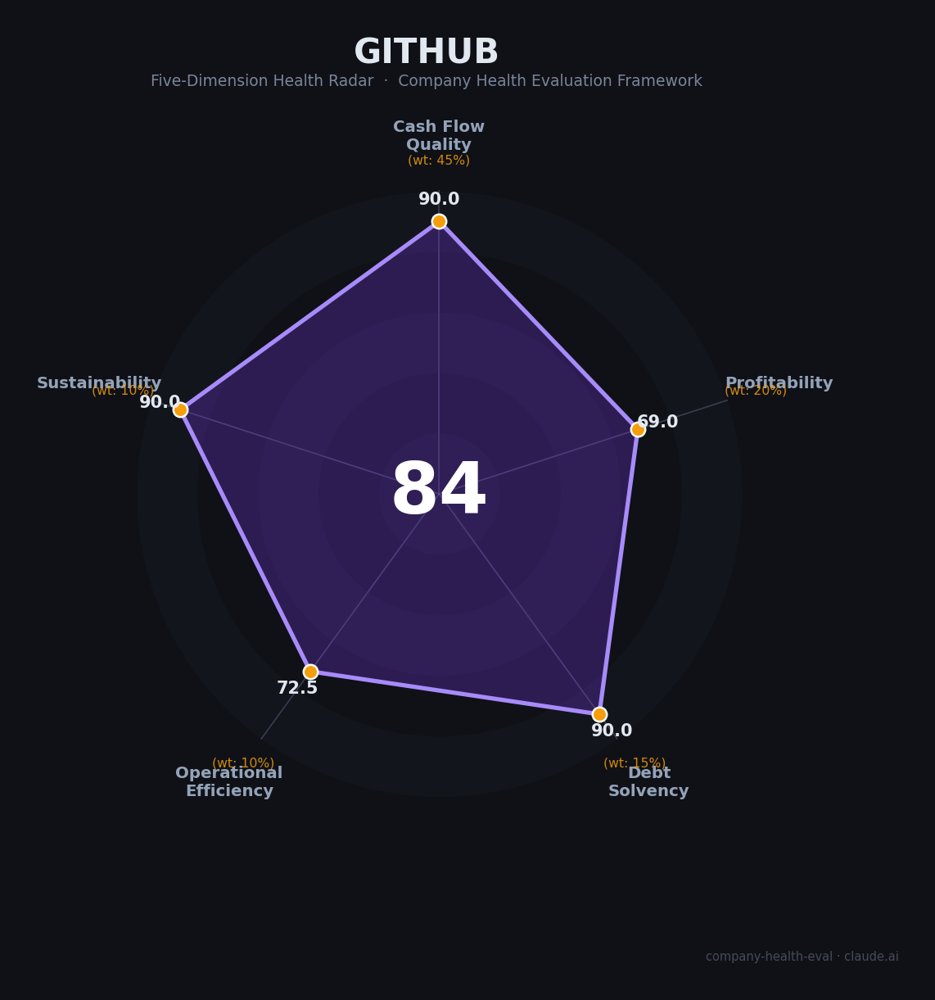

# GitHub 财务健康评估（2026-07-07）

## 一句话结论
🟡 **中等偏上（84.0/100）** | 世界级开发者平台，微软现金流托底，Copilot 和生态网络效应很强；唯一明显短板是独立性下降、AI 成本/定价压力和近期稳定性波动。

---

## 一、公司基本画像

| 项目 | 内容 |
|------|------|
| **公司全称** | GitHub, Inc. |
| **成立时间** | 2008年 |
| **总部** | 美国加利福尼亚州旧金山 |
| **股权结构** | 🔒 2018年被微软以 $75 亿收购，现为 Microsoft 旗下子公司 |
| **员工规模** | 🔒 3,000+ Hubbers（GitHub leadership page） |
| **平台规模** | 🔒 180M+ 开发者、4M+ Organizations、420M+ Repositories、90% Fortune 100 |
| **主营业务** | 🔒 代码托管、协作开发、Actions/Codespaces/Packages、GitHub Advanced Security、Copilot |
| **融资状态** | 🔒 非独立上市公司；现金流与资本开支由微软母公司背书 |
| **营收披露** | 未单独披露；Copilot 与企业订阅是主要商业化引擎 |

**一句话定性**：GitHub 不是一家传统意义上的“独立财务公司”，更像是微软面向开发者世界的基础设施入口和 AI 分发渠道。它的业务质量极强，但组织独立性在 2025 年后明显下降。

---

## 二、五维财务健康评估

### 1. 现金流质量（90/100）

| 评估指标 | 判定等级 | 数据 | 分析 |
|----------|----------|------|------|
| 经营现金流净额 | 🟢 健康 | 🔒 Microsoft FY2025 `Net cash from operations` = **$136.2B** | GitHub 不单独披露现金流，但它背靠微软最强现金牛之一，经营性资金安全垫极厚 |
| 现金及等价物 | 🟢 健康 | 🔒 Microsoft FY2025 现金及短期投资约 **$94B+** | 单看母公司即可覆盖大量研发、基础设施与组织调整支出，GitHub 无单独流动性压力 |
| 有息负债 | 🟢 健康 | 🔒 GitHub 未单独举债，母公司负债结构可控 | 作为微软子公司，资本结构风险接近零 |
| 净现比（OCF/净利润） | 🟢 健康 | 🔒 Microsoft FY2025 `OCF / Net income` = **1.34x** | 利润质量高，现金生成能力强，足以支撑 GitHub 的平台扩张和 Copilot 投入 |

**分析**：GitHub 的现金流健康度主要来自微软母公司的财务底盘，而不是它自己单独披露的报表。对求职者来说，这意味着公司不会因为短期融资断裂而突然“断粮”，但也意味着你拿到的是微软体系内的一块业务，而不是独立创业公司的上升弹性。

### 2. 盈利能力（69/100）

| 评估指标 | 判定等级 | 数据 | 分析 |
|----------|----------|------|------|
| 毛利率 | 🟡 良好 | 📊 估算：平台软件毛利高，但 Copilot 推理与支持成本上升 | GitHub 的软件平台属性决定了毛利底色不错，但 AI 计算成本把它从“纯软件极优”拉回到“良好” |
| 净利率 | 🟠 一般 | 📊 未单独披露 | Microsoft 级别的利润池很深，但 GitHub 自身正处于 AI 产品扩张期，且组织重构成本上升，不能按成熟 SaaS 直接套顶级净利率 |
| 营收增速（3年CAGR） | 🟡 良好 | 🔒 GitHub Copilot >20M 用户；GitHub 180M+ 开发者 | 核心增长来自开发者规模扩张和 Copilot 渗透。增长是明确的，但受定价切换和 AI 竞品冲击影响，波动也更大 |
| 研发费用率 | 🟡 良好 | 🔒 3,000+ 人团队，产品与 AI 迭代持续加码 | GitHub 是典型高研发密度业务，研发投入符合平台公司定位 |
| 人均产出 | 🟡 良好 | 📊 估算：> $10 亿级 ARR / 3,000+ 人 | 即便按保守口径，平台型收入对人效的支撑也很强 |

**分析**：GitHub 的盈利能力不是“差”，而是“未完全被独立披露、且 AI 化后成本结构更复杂”。它的核心卖点是开发者网络效应和商业化入口价值，而不是像纯 SaaS 公司那样用单一财务口径讲故事。这个维度给 69 分，属于保守但合理。

### 3. 偿债能力（90/100）

| 评估指标 | 判定等级 | 数据 | 分析 |
|----------|----------|------|------|
| 资产负债率 | 🟢 健康 | 🔒 母公司资产负债结构稳健 | GitHub 本身不单独承担独立融资压力 |
| 有息负债率 | 🟢 健康 | 🔒 无独立公开有息负债 | 作为微软子业务，债务风险低 |
| 流动比率 | 🟢 健康 | 🔒 母公司流动性极强 | 不存在“现金跑道”焦虑 |
| 现金比率 | 🟢 健康 | 🔒 Microsoft FY2025 现金储备充足 | 组织层面的支付能力非常强 |
| 股权质押比例 | 🟢 健康 | 🔒 不适用 | 非独立上市公司，无股权质押风险 |

**分析**：这一维几乎完全由微软托底，GitHub 的偿债风险非常低。对员工而言，这意味着大概率不会碰到创业公司那种“下一轮融资前全线收缩”的极端场景。

### 4. 运营效率（72.5/100）

| 评估指标 | 判定等级 | 数据 | 分析 |
|----------|----------|------|------|
| 应收周转 | 🟢 健康 | 📊 平台订阅+企业计费为主，回款模式稳定 | 订阅型平台回款比项目制软件服务更可控 |
| 客户集中度 | 🟢 健康 | 🔒 180M+ 开发者、4M+ Organizations、90% Fortune 100 | 客户和开发者群体极度分散，不依赖单一客户 |
| 员工规模趋势 | 🟡 关注 | 🔒 3,000+ Hubbers；组织并入 Microsoft CoreAI 后仍在重组 | 规模不是缩编型，但组织边界正在变化，岗位定义和汇报线可能持续调整 |
| 高管稳定性 | 🟡 关注 | 🔒 2025 年 8 月 CEO Thomas Dohmke 宣布离任，GitHub 不再保留独立 CEO | 领导层重组会直接影响战略优先级、团队边界和晋升路径 |

**分析**：GitHub 的运营效率不是业务问题，而是组织问题。产品本身仍然有很高的全球分发效率，但 CEO 离任、并入 CoreAI、以及近期 Copilot/Pages 相关告警事件，说明平台处于“高需求 + 高复杂度”的运营阶段。

### 5. 可持续发展能力（90/100）

| 评估指标 | 判定等级 | 数据 | 分析 |
|----------|----------|------|------|
| 市场增速 | 🟢 健康 | 🔒 2025 Octoverse：每秒有新开发者加入 GitHub | 开发者市场仍在扩张，AI 时代反而抬高了 GitHub 的基础设施地位 |
| 技术壁垒 | 🟢 健康 | 🔒 Git 网络效应 + Issues/Actions/Codespaces/Marketplace + Copilot | GitHub 的护城河不是单一功能，而是开发者工作流的全栈占位 |
| 业务多元化 | 🟢 健康 | 🔒 托管、协作、CI/CD、安全、包管理、AI 助手多线并进 | 业务结构比“纯代码仓库”更宽，抗单点冲击能力强 |
| 资本支持 | 🟢 健康 | 🔒 Microsoft 母公司现金和 AI 资源支持 | 资本后盾极强，能持续投入基础设施和 AI 竞赛 |
| 政策/监管风险 | 🟢 健康 | 🔒 风险存在但可管理 | 开源、AI 版权、内容治理和跨境合规有长期压力，但目前还没到生存级别 |

**分析**：GitHub 的长期确定性很强。开发者生态越大，GitHub 的平台价值越高；AI 越深入软件工程，Copilot 和开发工作流越重要。它最大的可持续性风险不是“产品会不会没用”，而是“它会不会变成微软内部一块更普通的 AI 工具业务”。

---

## 三、综合评分与健康等级

| 维度 | 得分 | 权重 | 加权得分 |
|------|:----:|:----:|:--------:|
| 现金流质量 | 90.0 | 45% | 40.5 |
| 盈利能力 | 69.0 | 20% | 13.8 |
| 偿债能力 | 90.0 | 15% | 13.5 |
| 运营效率 | 72.5 | 10% | 7.2 |
| 可持续发展 | 90.0 | 10% | 9.0 |
| **综合得分** | | | **84.0 / 100** |
| **健康等级** | | | **🟡 中等偏上（Moderate-High）** |



---

## 四、同业对标

| 对比项 | GitHub | GitLab | Atlassian / Bitbucket |
|--------|--------|--------|-----------------------|
| 上市/融资状态 | 🔒 微软子公司 | 🔒 NASDAQ 上市 | 🔒 NASDAQ 上市 |
| 规模 | 180M+ 开发者、4M+ Organizations、420M+ Repos | ~30M 注册用户、~2,375 员工 | 300,000+ 客户、13,813 员工 |
| 收入可见度 | 低，未单独披露 | 中，Q1 FY2026 收入 $214.5M | 高，Q1 FY2026 收入约 $1.4B |
| 利润情况 | 依托微软现金池，独立口径不透明 | 仍亏损，FY2027 指引偏保守 | 仍亏损，2026 年 3 月裁员约 10% |
| 核心差异 | 平台网络效应最强、品牌最强、母公司最强 | 更偏 DevOps 一体化，财务压力更显性 | 产品线更宽，但组织与利润压力更明显 |

**对标结论**：GitHub 在“开发者心智 + 平台网络效应”上明显领先 GitLab 和 Bitbucket 方向的同类产品；在“组织独立性”和“财务透明度”上则不如独立上市公司。作为求职标的，它比多数开发工具公司更稳，但也更像微软体系内的战略平台，而不是一只可讲独立成长故事的纯创业股。

---

## 五、核心风险清单

1. **独立性下降与组织重组（高）**：GitHub 已并入 Microsoft CoreAI 叙事，若后续继续内嵌到微软内部组织，岗位边界、汇报链和资源优先级会持续变化。触发条件是新一轮组织整合或产品线重排。
2. **AI 定价与算力成本压力（高）**：Copilot 进入 token/credit 计费后，重度用户成本敏感度上升；若算力成本继续上升，价格、额度和体验之间会继续拉扯。触发条件是用户对新计费模型持续反弹。
3. **平台稳定性波动（中高）**：GitHub Status 页面在 2026-07-01、2026-06-28、2026-06-30、2026-07-02 出现 Copilot / Pages / signup 流程相关事故。触发条件是 AI 与高并发业务继续放大系统复杂度。
4. **政策与 IP 风险（中）**：开源许可、AI 训练数据、跨境访问控制、内容治理都会在未来长期存在。触发条件是监管、法院判例或平台政策变化。

---

## 六、求职/择业视角

### 核心优势

- **品牌和履历价值极强**：GitHub 是现代软件开发的基础设施入口，简历辨识度和行业通用性都很高。
- **技术面覆盖面广**：你能接触到协作开发、CI/CD、安全、AI 编码助手、代码托管等多个核心场景，经验可迁移性强。
- **微软背书带来稳定性**：相较独立创业公司，GitHub 的现金流和基础设施确定性明显更高。
- **AI 时代的前沿位置**：Copilot 让 GitHub 直接站在“代码生产方式重构”的主战场上，技术含金量仍然很高。

### 现存短板

- **独立性弱化**：如果你想加入的是“像早期 GitHub 那样的独立产品公司”，现在已经不是那个状态。
- **组织调整风险高**：并入 CoreAI 后，团队边界和优先级更容易受微软整体战略影响。
- **薪酬未必是行业天花板**：品牌很强，但若你的目标是最高现金总包，通常仍要和 Meta、OpenAI、顶级 AI 创业公司比。
- **AI 变现压力会传导到团队**：计费、额度、体验和成本控制的拉扯，会让产品和工程节奏更硬。

### 分场景建议

| 个人诉求 | 推荐 | 次选 | 规避 |
|----------|------|------|------|
| 稳定+深耕 | GitHub / Microsoft CoreAI | Microsoft Azure | 高波动创业公司 |
| 高薪+跳板 | Meta / 顶级 AI 平台 | GitHub | 传统中厂 |
| 成长+前沿技术 | GitHub Copilot / Developer Platform | OpenAI / Anthropic | 纯维护型平台团队 |
| 多元+跨领域 | GitHub + Microsoft 生态 | Atlassian | 单一工具型公司 |

---

## 七、总结

```
GitHub 是 开发者平台 领域「全球最大代码协作基础设施」的公司：
最强优势是开发者网络效应与微软现金流托底，唯一短板是独立性下降后的组织不确定性与 AI 成本/稳定性压力。
在 AI 编码工具快速重排的大环境下，属于中等偏上，适合追求技术通用性、品牌背书和平台影响力的人。
```

---

## 来源与可信度

- 🔒 GitHub About: 180M+ developers、4M+ organizations、420M+ repositories、90% Fortune 100
- 🔒 GitHub Leadership: 3,000+ Hubbers；现任 COO/CTO/CFO/CRO/CPO/CPO 架构
- 🔒 GitHub Status: 90-day uptime、2026-07-01/06-28/06-30/07-02 incidents
- 🔒 Microsoft 2025 Annual Report: revenue $281.7B、net income $101.8B、net cash from operations $136.2B、GitHub Copilot >20M users
- ⚠️ Axios / The Verge / other coverage: 2025-08 CEO Thomas Dohmke step-down and CoreAI integration
- 📊 GitHub standalone revenue and profitability: 未单独披露，按平台属性与微软背书做保守估算

*评估日期：2026-07-07 | 数据截至：2026-07-07 可见公开信息 | 评分引擎：`.claude/skills/company-health-eval/scripts/score.py`*
