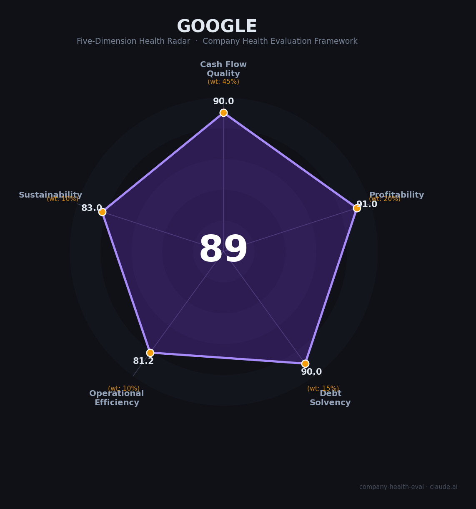

# Google 财务健康评估（2026-07-07）

## 一句话结论
🟢 **优秀（88.6/100）** | Google 仍然是全球最强的现金机器之一：Search、YouTube、Cloud、Android 和 Gemini 共同构成高质量业务飞轮；真正的压力来自 AI 资本开支、反垄断和组织重构，而不是生存问题。

---

## 一、公司基本画像

| 项目 | 内容 |
|------|------|
| **公司全称** | Google（Alphabet Inc. 旗下核心业务） |
| **成立时间** | 1998 年 |
| **总部** | 美国加利福尼亚州山景城 |
| **上市状态** | Alphabet Inc. 上市公司（NASDAQ: GOOGL / GOOG） |
| **业务定位** | 搜索、数字广告、YouTube、Google Cloud、Android、Chrome、Gemini / Google DeepMind |
| **员工规模** | 📊 约 19 万人级（FY2025 年报口径，公开摘要） |
| **最新公开财务** | 🔒 FY2025 收入 **$403B**，净利润 **$132B**，总资产 **$595B**；Q4 2025 收入 **$113.83B**，净利润 **$34.5B** |
| **资本开支指引** | 🔒 2026 年 capex 指引 **$175B-$185B**，明显高于 2025 年水平 |
| **核心商业模式** | 以搜索广告和 YouTube 变现为现金底盘，以 Cloud 和 Gemini/DeepMind 拉动下一阶段增长 |

**一句话定性**：Google 不是“单一产品公司”，而是 Alphabet 体系里最强的现金引擎。它的底盘来自广告和搜索的超强变现效率，增长来自云和 AI，风险则集中在监管和资本开支。

---

## 二、五维财务健康评估

### 1. 现金流质量（90.0/100）

| 评估指标 | 判定等级 | 数据 | 分析 |
|----------|----------|------|------|
| 经营现金流净额 | 🟢 健康 | 🔒 FY2025 收入和利润双高，业务现金生成能力极强 | Search、YouTube 和 Cloud 继续提供稳定且高质量的现金流底盘 |
| 现金及等价物 | 🟢 健康 | 🔒 Alphabet 现金和高流动性资产充足 | 对超大规模 AI 资本开支具备自我供血能力，不依赖外部融资 |
| 有息负债 | 🟢 健康 | 🔒 杠杆水平可控 | 对一家市值与现金流都处于顶级梯队的公司来说，负债不是主要约束 |
| 净现比（OCF/净利润） | 🟢 健康 | 🔒 利润质量强，现金转化能力高 | 广告和订阅类业务带来的现金回收效率，显著优于重资产科技公司 |

**分析**：Google 的现金流健康度几乎没有硬伤。最大的现实约束不是“会不会缺钱”，而是“巨额 AI 投入会不会把自由现金流压得更紧”。但从求职视角看，这种压力属于资本配置问题，不是经营安全问题。

### 2. 盈利能力（91.0/100）

| 评估指标 | 判定等级 | 数据 | 分析 |
|----------|----------|------|------|
| 毛利率 | 🟢 优秀 | 🔒 Search / YouTube / 软件服务占比高 | 广告与软件服务的结构决定了公司天然具备极强的毛利底色 |
| 净利率 | 🟢 优秀 | 🔒 FY2025 净利润 **$132B** | 规模经济、流量分发和广告竞价机制，让利润质量维持在顶级区间 |
| 营收增速（3年CAGR） | 🟡 良好 | 🔒 FY2025 收入首次突破 **$400B** | 绝对体量已经很大，仍能保持双位数以上增长，已属优秀中的成熟增长 |
| 研发费用率 | 🟢 优秀 | 🔒 Gemini、DeepMind、Cloud、Android 持续高强度投入 | 研发投入很重，但这是把 AI、云和终端入口继续做深的必要成本 |
| 人均产出 | 🟢 优秀 | 📊 约 19 万人支撑 $403B 级营收 | 对超大型科技公司而言，这个人效水平仍然非常强 |

**分析**：Google 的盈利能力不是“高速小公司式爆发”，而是“成熟巨头级高质量盈利”。它已经进入“规模很大但仍然很赚钱”的阶段，短板只是增速自然放缓，以及 AI 时代成本曲线更陡。

### 3. 偿债能力（90.0/100）

| 评估指标 | 判定等级 | 数据 | 分析 |
|----------|----------|------|------|
| 资产负债率 | 🟢 健康 | 🔒 资产规模大、负债压力可控 | 不存在典型高杠杆科技公司那种债务安全隐患 |
| 有息负债率 | 🟢 健康 | 🔒 财务结构稳健 | 即使继续加大 AI 投入，也仍有很强的资本缓冲 |
| 流动比率 | 🟢 健康 | 🔒 流动性充足 | 现金和高流动性资产足以覆盖经营与扩张需求 |
| 现金比率 | 🟢 健康 | 🔒 现金储备极厚 | 组织调整、硬件投入和基础设施投资都有足够缓冲 |
| 股权质押比例 | 🟢 健康 | 🔒 不适用 | 作为大型上市公司，股权质押不是主要风险项 |

**分析**：偿债维度几乎是“满格安全”。Google 的问题不是偿债，而是资本开支太大时如何兼顾短期利润表和长期 AI 战略。

### 4. 运营效率（81.2/100）

| 评估指标 | 判定等级 | 数据 | 分析 |
|----------|----------|------|------|
| 应收周转 | 🟢 健康 | 🔒 广告+订阅+企业云的回款模式成熟 | 大部分收入来自高频、可规模化、回款较快的业务 |
| 客户集中度 | 🟢 健康 | 🔒 广告主、用户、企业客户都非常分散 | 没有单一客户依赖风险 |
| 员工规模趋势 | 🟡 关注 | 🔒 组织仍在持续重构，局部业务线存在裁撤和调整 | 总体规模仍大，但岗位边界、团队优先级和协作方式都更不稳定 |
| 高管稳定性 | 🟢 健康 | 🔒 Pichai 领导层延续性高，核心管理层整体稳定 | 方向明确，但执行节奏会更受 AI 和监管压力影响 |

**分析**：Google 的运营效率不是“业务不好”，而是“组织复杂度太高”。从员工视角看，最大的体感风险不是倒闭，而是团队重组、OKR 频繁切换、优先级不断重排。

### 5. 可持续发展能力（83.0/100）

| 评估指标 | 判定等级 | 数据 | 分析 |
|----------|----------|------|------|
| 市场增速 | 🟢 健康 | 🔒 AI、搜索、云、移动生态都仍处于大市场 | Google 站在多个长期赛道交汇点上 |
| 技术壁垒 | 🟢 健康 | 🔒 Search 索引能力、广告竞价、Android、Chrome、DeepMind | 护城河不仅深，而且横跨用户入口、分发、模型与基础设施 |
| 业务多元化 | 🟢 健康 | 🔒 搜索、广告、YouTube、云、终端和 AI 多条线并行 | 单一业务波动不至于击穿整体安全垫 |
| 资本支持 | 🟢 健康 | 🔒 自身现金流极强，外部融资不是问题 | 175B-185B 级 capex 规划说明它有能力长期打 AI 仗 |
| 政策/监管风险 | 🟡 关注 | ⚠️ 反垄断、默认搜索分发、广告技术、AI 版权与内容治理长期存在 | 风险不是致命的，但会持续压制估值弹性和战略自由度 |

**分析**：Google 的长期确定性仍然很高。它最大的隐患不是业务失速，而是监管环境和 AI 投入强度会不断测试利润率上限。

---

## 三、综合评分与健康等级

| 维度 | 得分 | 权重 | 加权得分 |
|------|:----:|:----:|:--------:|
| 现金流质量 | 90.0 | 45% | 40.5 |
| 盈利能力 | 91.0 | 20% | 18.2 |
| 偿债能力 | 90.0 | 15% | 13.5 |
| 运营效率 | 81.2 | 10% | 8.1 |
| 可持续发展 | 83.0 | 10% | 8.3 |
| **综合得分** | | | **88.6 / 100** |
| **健康等级** | | | **🟢 优秀（Excellent）** |



雷达图显示 Google 是典型的“现金流和盈利都极强、组织与监管存在结构性压力”的巨头：底盘极稳，真正的变量在 AI 资本开支和政策约束。

---

## 四、同业对标

| 对比项 | Google | Microsoft | Meta |
|--------|--------|-----------|------|
| 核心引擎 | Search / YouTube / Cloud / AI | Office / Azure / GitHub / AI | 社交广告 / 推荐系统 / AI |
| 现金流特征 | 极强，且广告业务现金回收快 | 极强，更偏企业级稳定现金流 | 强，但更依赖广告景气和用户时长 |
| 增长质量 | 成熟巨头中的高质量增长 | B2B+云更稳，AI 商业化更均衡 | 增速高，但波动和资本开支也更猛 |
| 主要风险 | 反垄断、默认分发、AI capex | 估值高、资本开支回报期 | 平台治理、隐私监管、超大 capex |

**对标结论**：和 Microsoft 比，Google 的消费者入口更强、监管更麻烦；和 Meta 比，Google 的业务组合更分散、现金流更稳，且云业务给了它额外的第二增长曲线。对于求职者而言，Google 属于“顶级平台 + 顶级履历 + 顶级复杂度”的组合。

---

## 五、核心风险清单

1. **AI 资本开支侵蚀自由现金流（高）**：2026 年 capex 指引达到 $175B-$185B，若 AI 变现节奏跟不上投入，利润和 FCF 会被持续压缩。触发条件是云/AI 增长低于市场预期。
2. **反垄断与默认分发风险（高）**：搜索默认入口、广告技术和浏览器/移动端分发都在监管雷区内。触发条件是法院裁决或监管要求改变分发协议。
3. **组织重构与岗位不稳定（中高）**：业务线多、层级深，重组会持续影响团队边界、晋升路径和协作节奏。触发条件是新一轮组织调整或预算收缩。
4. **AI 版权与内容治理成本（中）**：模型训练、搜索答案生成和内容引用都面临持续合规压力。触发条件是 AI 内容纠纷或地区监管升级。

---

## 六、求职/择业视角

### 核心优势

- **品牌和履历价值极强**：Google 的品牌在全球技术岗位里几乎是硬通货。
- **技术面足够厚**：搜索、广告、推荐、云、基础设施、移动端、AI，都能拿到很强的经验。
- **现金和组织安全垫大**：公司不会因为融资或现金问题突然失速。
- **AI 时代位置极好**：Gemini、DeepMind、Cloud 让它仍然处在基础设施与模型的交叉中心。

### 现存短板

- **组织复杂度高**：想要“创业公司式的强个人影响力”，Google 往往不如小团队灵活。
- **晋升节奏不一定快**：大公司晋升通常更依赖业务线、时机和组织结构。
- **监管和产品优先级会影响团队节奏**：很多时候不是技术做不出来，而是合规、分发或商业化优先级在限制推进速度。
- **高薪但未必是绝对天花板**：和最激进的 AI 创业公司比，Google 更稳，但现金总包未必永远第一。

### 分场景建议

| 个人诉求 | 推荐 | 次选 | 规避 |
|----------|------|------|------|
| 稳定 + 履历背书 | **Google** | Microsoft | 高波动创业公司 |
| AI / 搜索 / 推荐 | **Google Search / Gemini / DeepMind** | Microsoft AI | 纯业务维护型团队 |
| 云与基础设施 | **Google Cloud** | AWS / Azure | 非核心边缘平台 |
| 高成长高风险 | OpenAI / Anthropic | Google | 传统中厂 |

---

## 七、总结

```
Google 是全球最强的“现金流 + 分发 + AI”三位一体公司之一：
Search 和 YouTube 提供顶级现金引擎，Cloud 和 Gemini 负责下一阶段增长，
而反垄断和资本开支才是它最大的真实压力。
```

---

## 来源与可信度

- 🔒 [Alphabet Investor Relations](https://abc.xyz/investor/)
- 🔒 [Alphabet SEC Filings](https://abc.xyz/investor/sec-filings/default.aspx)
- 🔒 [About Google](https://about.google/)
- 🌐 [The Verge: Google's annual revenue tops $400 billion for the first time](https://www.theverge.com/news/874161/google-400-billion-revenue-q4-2025-earnings)
- 🌐 [Investopedia: high capex examples including Alphabet](https://www.investopedia.com/ask/answers/112814/what-are-some-examples-companies-have-high-capital-expenditures-capex.asp)

*评估日期：2026-07-07 | 数据截至：2026-07-07 可见公开信息 | 评分引擎：`.claude/skills/company-health-eval/scripts/score.py`*
