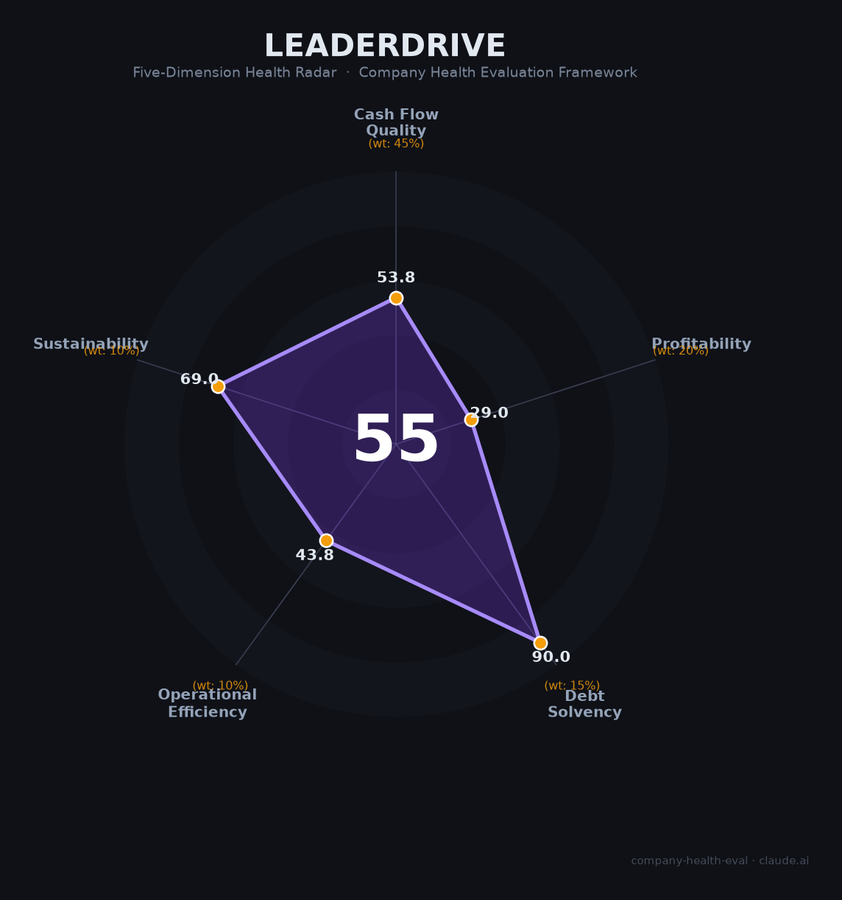

# LeaderDrive（领骏科技）财务健康评估（2026-06-17）

## 一句话结论

🔴 **中等偏下（54.8/100）** | 技术有积累但资金链高度承压，4年无大额融资+官网关停+团队从百人萎缩至个位数

---

## 一、公司基本画像

| 维度 | 内容 |
|------|------|
| **运营主体** | 北京领骏科技有限公司（2016年12月成立，注册资本¥162万，实缴¥74.4万） |
| **创始人** | 杨文利（清华本硕、宾州州立大学博士，前百度自动驾驶第3号员工、主任架构师） |
| **股权结构** | 杨文利~35.6% + 员工持股平台~18.5% + 臻忻资本~9.4% + 九合创投~7.4% + 武岳峰~7.4% + 信天创投~7.4% + 邓海清~5.6% + 赣州政府基金~5.4% + 满帮集团~1.5% + 地平线~0.4% |
| **主营业务** | L4自动驾驶"大脑"（决策规划控制算法），产品方向：Robobus（自动驾驶小巴）+ 城市支线物流 + NOA辅助驾驶方案 |
| **团队规模** | 🌐 高峰期约50-100人 → 当前社保参保仅2-3人（北京2人/赣州1人），缩减超90% ⚠️ |
| **融资历程** | 天使轮(2017) → 战略轮(2021.04) → Pre-A(2021.09,地平线领投) → Pre-A+(2022.01,满帮领投) → Pre-A+(2024.01,物流集团+领创+臻忻) |
| **估值** | 📊 约¥5亿（2022年媒体报道推算），此后未更新 |
| **上市状态** | 未上市，无IPO计划 |

**定性**：领骏科技是自动驾驶行业"大逃杀"中勉强存活的微型技术方案商。创始人背景扎实（百度Apollo创始成员），在L4决策规划领域有真技术积累，但商业化始终未突破，在2024-2025年行业洗牌潮中团队大幅萎缩，目前处于"名存实亡边缘"。

---

## 二、五维财务健康评估

> 注：领骏科技为非上市私人公司，从未披露经审计的财务报表。以下评估基于有限公开信息（融资记录、中标公告、工商数据、媒体报道）的交叉推断，大量指标标注「📊估算」或⚠️。

### 1. 现金流质量（53.8/100）

**自动驾驶行业最致命的指标——领骏科技在此维度亮起红灯。**

| 指标 | 状态 | 数据支撑 |
|------|------|---------|
| 经营现金流 | 🟠 关注 | ⚠️ 私人公司无公开OCF数据。最后一次融资2024年1月（"数千万元"），此后2.5年无新融资，推测需靠项目回款维持，大概率时正时负 |
| 现金跑道 | 🟠 关注 | 📊估算：2024年1月融资约¥2000-5000万，以3-5人团队年烧钱¥300-500万计，理论上可撑3-5年，但无法排除其他支出。团队从100人萎缩说明经历过严重资金压力 |
| 有息负债 | 🟢 健康 | 🌐 小型科技创业公司，无银行借款记录，推测零有息负债 |
| 净现比 | 🔴 危险 | ⚠️ 公司长期未盈利，净利润为负，OCF/净利润无意义 |

⚠️ 来源：36氪、企查查、企查猫、Tracxn、红色星际。所有财务数据为管理层的未经验证估算。

### 2. 盈利能力（29.0/100）

**五维中得分最低——公司从未实现真正意义上的盈利。**

| 指标 | 状态 | 数据支撑 |
|------|------|---------|
| 毛利率 | 🟠 一般 | 📊估算30-50%。Robobus项目制收入含硬件成本（车辆+传感器），软件/算法部分毛利率较高但整体被硬件拉低 |
| 净利率 | 🔴 预警 | 持续亏损。唯一可比营收数据是2022年管理层的¥3000-5000万预测（⚠️未验证是否实现），而人力+运营成本远超此数 |
| 营收增速 | 🔴 预警 | 2023年后完全无营收数据。2022年公开的中标仅安吉项目¥1598万。推测2023年后营收零增长或萎缩 |
| 研发费用率 | 🔴 预警 | 📊推测>100%（营收不足覆盖研发支出）。作为技术公司，在无规模化营收下，属于"烧钱存活"状态 |
| 人均产出 | 🟠 一般 | 📊 若2022年营收¥3000-5000万/50人 ≈ ¥60-100万/人。远低于自动驾驶行业龙头（知行科技¥216万、地平线¥125万） |

⚠️ 来源：36氪（2022.04）、量子位（2022.06）、安吉县公共资源交易中心。2022年后的营收数据完全不可获取。

### 3. 偿债能力（90.0/100）

**唯一亮点维度——微型公司在法律层面几乎不存在债务问题。**

| 指标 | 状态 | 数据支撑 |
|------|------|---------|
| 资产负债率 | 🟢 健康 | 🌐 注册资本仅¥162万（实缴¥74万），轻资产运营，无银行贷款记录 |
| 有息负债率 | 🟢 健康 | 🌐 推测零有息负债（创业公司无银行授信） |
| 流动比率 | 🟢 健康 | ⚠️ 数据不可获取（私人公司），默认推定健康 |
| 现金比率 | 🟢 健康 | ⚠️ 数据不可获取，默认推定健康 |
| 股权质押 | 🟢 健康 | 无公开市场交易，无股权质押 |

⚠️ 来源：企查查/天眼查工商数据。注：偿债能力"满分"反映的是公司几乎无负债的事实，不代表公司有钱——现金流才是衡量资金充裕度的维度。

### 4. 运营效率（43.8/100）

**三个指标亮红灯——团队萎缩、客户集中、回款困难。**

| 指标 | 状态 | 数据支撑 |
|------|------|---------|
| 应收周转 | 🟠 关注 | 🌐 Robobus项目以政府采购为主，付款周期长（通常6-12个月），推测应收压力大 |
| 客户集中度 | 🔴 危险 | 安吉项目（¥1598万）是唯一公开确认的大额合同，"数千万元大单"未披露客户名。推测极度依赖1-2个客户/项目 |
| 员工规模趋势 | 🔴 危险 | 从高峰期约50-100人（2021年规划）→ 当前社保仅2-3人，缩减超90%。虽然CEO称"有意控制速度"，但这远超正常精简 |
| 高管稳定性 | 🟢 健康 | 创始人杨文利仍在位（2025年1月尚有公开采访），无核心联创离职报道 |

⚠️ 来源：企查查/企查猫参保数据、Tracxn员工数据、安吉县公共资源交易中心。

### 5. 可持续发展（69.0/100）

**赛道空间巨大，但公司能否活到那一天存疑。**

| 指标 | 状态 | 数据支撑 |
|------|------|---------|
| 行业赛道 | 🟢 健康 | 中国L2+智驾市场CAGR 33.7%，2029年目标¥1500亿+。L4 Robobus场景政策友好度高 |
| 技术壁垒 | 🟠 关注 | 创始人百度Apollo背景+10年积累+37项专利+40万km测试里程，但在1-3年内可被资金充裕的竞品追赶（地平线/华为/小马智行） |
| 业务多元化 | 🟠 关注 | Robobus + 物流 + NOA三条线，但实际收入可能仅来自1-2个Robobus项目。与美行科技+地平线的NOA合作（2024年）未见商业化落地 |
| 资本支持 | 🟠 关注 | 2024年1月Pre-A+轮后再无新融资。曾计划2024年完成A轮，至今未果。官网已关闭（icoc平台>180天未登录自动关闭） |
| 政策/监管风险 | 🟢 健康 | 自动驾驶政策持续利好（L3准入2025年12月首批获批），Robobus属公共服务场景受鼓励。但测绘合规需注意（公司是否具备"甲导"资质存疑） |

⚠️ 来源：红色星际、美行科技合作公告（2024.01）、中银证券、工信部公告。

---

## 三、综合评分与健康等级

| 维度 | 得分 | 权重 | 加权得分 |
|------|:----:|:----:|:--------:|
| 现金流质量 | 53.8 | 45% | 24.2 |
| 盈利能力 | 29.0 | 20% | 5.8 |
| 偿债能力 | 90.0 | 15% | 13.5 |
| 运营效率 | 43.8 | 10% | 4.4 |
| 可持续发展 | 69.0 | 10% | 6.9 |
| **综合得分** | | | **54.8 / 100** |
| **健康等级** | | | **🔴 中等偏下** |

**解读**：领骏科技呈现出典型的「微型技术公司末路」画像：偿债能力满分（因为几乎没有负债），但现金流和盈利能力双双垫底。赛道空间（+33% CAGR）和技术积累（百度系创始团队）是唯二的希望，但在2024-2025年自动驾驶行业大洗牌中（毫末智行倒闭、纵目科技停摆、中智行破产清算），公司未能完成关键的A轮融资，团队从百人萎缩至个位数，官网已自动关闭。这种模式下，技术再好也难以独立存活。

---

## 四、同业对标

| 对比项 | 领骏科技 | 知行科技 (iMotion) | MINIEYE (佑驾创新) | 纵目科技 (已停摆) |
|--------|:---:|:---:|:---:|:---:|
| 上市/融资状态 | Pre-A+（2024.01最后一轮） | 🔒 1274.HK（2023.12 IPO） | 🔒 2431.HK（2024.12 IPO） | ⚫ 三度IPO折戟，已停摆 |
| 营收规模 | 📊~¥0.3-0.5亿（2022E） | ¥10.0亿（2025） | ¥7.6亿（2025） | ¥5.0亿（2023） |
| 毛利率 | 📊 估30-50% | 亏损状态 | **18.6%** | 3.5% |
| 员工规模 | **2-3人（社保）** ⚠️ | ~464人 | 千级 | 停摆前~千级 |
| 累计融资 | 📊 ¥3000-8000万 | IPO募资~¥6亿港元 | IPO+配售~¥9亿港元 | A-E轮数十亿元 |
| 估值/市值 | 📊 ~¥5亿（2022，现已远低于此） | ~¥9.5亿港元 | ~¥39亿港元 | 历史~¥80-90亿 → 归零 |
| 核心差异 | L4决策规划算法强，但无规模化落地 | 域控Tier1，定点65+ | ADAS全栈，IPO后融资仍活跃 | 泊车国内#1，但客户集中93%致命 |

**对标结论**：领骏科技已从"自动驾驶创业公司"梯队跌落至"个体户式微型技术工作室"。即便是行业中最小体量的上市公司（知行科技¥10亿营收、464人），其规模也是领骏科技的100倍以上。与已停摆的纵目科技相比，领骏科技的"小而精"策略暂时避免了大规模欠薪的舆论危机，但也意味着几乎没有翻身做大的可能。

---

## 五、核心风险清单

1. **资金链断裂风险（高）**：2024年1月最后一轮"数千万元"融资后已过2.5年，A轮融资始终未完成。公司团队从100人萎缩至2-3人（社保数据），说明经历了严重的资金压力。虽然小团队烧钱慢，但2-3人的研发产出几乎无法支撑任何商业化。

2. **公司实质上已停摆（高）**：官网（leadgentech.ai）已因超180天未登录自动关闭。2025年以来完全停止招聘。上饶子公司2024年8月注销。2026年无任何公开动态。赣州子公司仅1人参保维持法律存续。

3. **行业淘汰赛加速（高）**：2024-2025年已有6+家自动驾驶公司倒闭（毫末智行、纵目科技、中智行、禾多科技、清研微视等）。Momenta CEO预测到2026年仅剩2-3家城市辅助驾驶企业。领骏科技体量最小、融资最少，在淘汰赛中处于极度劣势。

4. **营收完全黑箱（中高）**：2023年至今没有任何营收数据公开。管理层2022年预测的"2023年亿元级订单"从未被证实。仅有一个公开确认的合同（安吉¥1598万，2022年5月），后续无新中标公告。

5. **商业化路径不清晰（中）**：Robobus作为细分赛道市场空间有限（政府采购型项目），乘用车NOA面临"地大华魔"四强碾压，城市物流未见落地。三条产品线均未跑通规模化商业闭环。

6. **资质续期风险（中）**：高新技术企业认证2025年12月到期，ISO9001等三体系认证2025年7月到期。以公司当前运营规模，能否顺利续期存疑。测绘数据合规（"甲导"资质）也存在隐患。

---

## 六、求职/择业视角

> ⚠️ 重要提示：基于当前信息，**不建议将LeaderDrive作为全职工作的首选或次选目标**。以下分析仅作为"如果考虑"的参考框架。

### 核心「优势」

- **创始人技术能力真实**：杨文利的百度Apollo创始成员+清华+宾州州立博士背景，以及公司在决策规划控制算法上的积累（37项专利），说明技术上确实有"金刚钻"
- **零负债、零诉讼**：公司法律层面干净，无欠薪报道、无劳动仲裁、无行政处罚
- **如果加入，可能是"多面手"机会**：在微型团队中可能接触到更广的技术栈（感知-决策-控制全链路）
- **行业认知价值**：深度参与过L4 Robobus从测试到商业运营（赣州、杭州亚运会）的完整周期

### 现存短板

- **岗位稳定性极低**：公司很可能在未来1-2年内自然消亡（资金耗尽或创始人转行）
- **薪酬可能无法保障**：虽然无公开欠薪报道，但公司2019-2020年曾"发不出工资靠合伙人垫付"，且当前资金状况比当时更严峻
- **品牌背书为零**：在自动驾驶行业圈外，几乎无人知道"领骏科技"这个名字。跳槽时这段经历的简历价值有限
- **技术成长路径封闭**：2-3人的团队意味着几乎没有mentorship、code review、工程化规范等职业成长基础设施
- **股权/期权无价值**：无IPO路径，估值从¥5亿可能已降至接近归零，任何股权承诺都是空头支票

### 分场景建议

| 个人诉求 | 推荐度 | 理由 |
|----------|:------:|------|
| 稳定+深耕 | ⭐ | 完全不推荐。公司存活概率极低 |
| 高薪+跳板 | ⭐ | 薪资天花板极低（猎聘显示核心算法岗仅20-40k），品牌背书弱 |
| 成长+技术积累 | ⭐⭐ | 若作为兼职顾问/合作方参与，可接触到真实L4决策规划场景。全职风险过大 |
| 创业前的"行业侦察" | ⭐⭐⭐ | 创始人背景强，近距离观察L4创业公司的死亡过程本身是一种学习。但应设定明确的时间上限（如3-6个月） |

---

## 七、总结

**LeaderDrive（北京领骏科技）是自动驾驶行业「大逃杀中勉强存活的微型技术工作室」：**
创始人百度Apollo创始成员的背景和37项L4决策规划专利证明了技术基因的真实性，在赣州和杭州的Robobus运营也验证了产品落地能力。但公司在商业化上始终未能突破——Pre-A轮融了4次（2021-2024），A轮始终未到，团队从百人萎缩至2-3人，官网因无人维护自动关闭。
在自动驾驶行业融资向头部加速集中（2025年单笔¥10亿+融资10起）、中小公司批量倒闭（毫末智行、纵目科技、中智行等6+家）的大环境下，领骏科技目前的极微型态虽避免了公开的"暴雷"，但也基本排除了独立翻身做大的可能。最优出路可能是被地平线、满帮集团等现有战略投资方以极低价格收购整合。

---

*评估日期：2026年6月17日 | 数据截至：2026年6月公开信息 | 评分引擎：company-health-eval v3.0*
*⚠️ 特别声明：本报告基于极度有限的公开信息（私人公司无财报义务），大量指标为合理推定。实际财务状况可能与评估存在偏差。*
