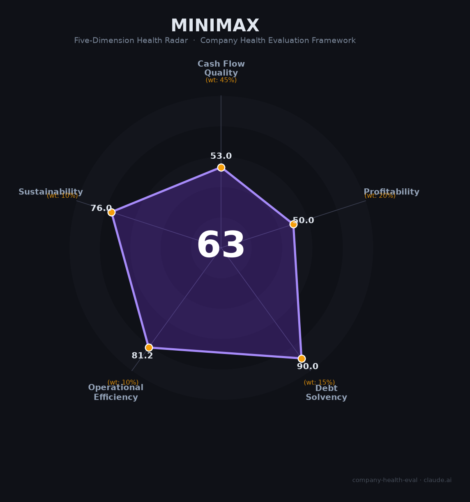

# MiniMax（稀宇科技 0100.HK）财务健康评估（2026-06-12）

## 一句话结论

🔴 **中等偏下 · 综合得分 63/100** | 中国"大模型第一股"，海螺AI多模态产品全球3亿用户、ARR 60天翻倍至3亿美元、Q4毛利率29.7%快速攀升。但经营现金流-2.8亿美元、经调整亏损2.5亿美元、股价从高点回落69%——这是一家「增长曲线惊艳，但烧钱速度同样惊人」的早期AI上市公司。

---

## 一、公司基本画像

| 项目 | 详情 |
|------|------|
| **运营主体** | MiniMax（稀宇科技），2021年12月组建，2022年初正式成立 |
| **创始人/CEO** | 闫俊杰（1989年，中科院自动化所博士，前商汤科技副总裁/研究院执行院长） |
| **上市信息** | 港交所主板，2026年1月9日上市，代码 0100.HK 🔒 |
| **IPO详情** | 发行价165港元，首日涨109%；当前约412港元，市值约1,293亿港元 🔒 |
| **员工规模** | 428人（2025年末），研发占比73.8%，平均年龄29岁 🔒 |
| **核心产品** | 海螺AI（Hailuo）视频/语音/音乐多模态大模型 + MiniMax Expert Agent平台 |
| **全球用户** | 约3亿（2026年5月） |
| **2025年营收** | 7,904万美元（约5.43亿人民币，+158.9% YoY） 🔒 |
| **2026年5月ARR** | 超3亿美元（2月为1.5亿，60天翻倍） 📊 |
| **A+H双上市** | 2026年5月与中信证券签署科创板上市辅导协议 💬 |

**一句话定性**：MiniMax是中国大模型赛道商业化最激进的玩家——海螺AI多模态产品矩阵（视频+语音+音乐）覆盖全球3亿用户，ARR从1.5亿到3亿美元仅用60天，海外收入占比73%是AI出海的标杆。但年经营现金流-2.8亿美元、经调整亏损2.5亿美元、股价从1,330港元高点暴跌69%，反映市场对"高增长能否持续到盈亏平衡"的深层疑虑。

---

## 二、五维财务健康评估

### 1. 现金流质量（52/100）🔴 | 权重45%

| 评估指标 | 状态 | 判断 | 依据 |
|----------|------|------|------|
| 经营现金流 | 2024 -2.58亿 → 2025 **-2.80亿美元**（-8.2%） | 🔴 持续负值 | 🔒 年报。烧钱速度边际改善（增速远低于收入+159%） |
| 现金储备（2025末） | 约10.46亿美元 + IPO募资净额约7.1亿美元 ≈ **17.5亿美元** | 🟢 充裕 | 🔒 年报。月烧约2,300-2,800万美元，跑道约4-5年 |
| 研发支出 | 2025年**2.53亿美元**（+33.8%），占收入320% | 🔴 极端偏高 | 🔒 年报。云服务/算力占研发的74% |
| 自由现金流 | 经营现金流-2.80亿 - 资本开支估算 ≈ **-3亿美元+** | 🔴 大幅为负 | 📊 估算。高研发投入+高算力成本的双重消耗 |

**本维度分析**：MiniMax的现金流故事是典型的"烧钱换增长"——年烧2.8亿美元但收入增速159%。积极信号是烧钱增速（8.2%）远低于收入增速，且IPO+融资累计现金约17.5亿美元，按当前速度可支撑4-5年。ARR从1.5亿到3亿美元的60天翻倍暗示2026年收入可能大幅跃升。

**扣分项**：经营现金流连续多年为负（-25分）；研发占收入320%极端偏高（-15分）；月均消耗近2,500万美元（-12分）。

---

### 2. 盈利能力（50/100）🔴 | 权重20%

| 评估指标 | 状态 | 判断 | 依据 |
|----------|------|------|------|
| 毛利率 | 2024 12.2% → 2025 25.4% → **Q4 2025 29.7%** | 🟡 快速攀升 | 🔒 年报。一年翻倍+，规模效应显著 |
| 经调整净利率 | 2024 -80% → 2025 **-31.7%** | 🟡 大幅收窄 | 🔒 年报。亏损率一年减半 |
| 营收增速 | 2025年**+158.9%**；ARR $1.5亿→$3亿（60天翻倍） | 🟢 爆炸式增长 | 🔒 年报/公司披露。全球AI公司中增速最快之一 |
| 会计净利润 | -18.72亿美元（含优先股公允价值变动-15.9亿，非现金） | 🟡 会计噪音 | 🔒 年报。上市后该影响已消除 |
| 人均创收 | ~18.5万美元/人（约134万人民币） | 🟡 改善中 | 🔒 年报。较2024年翻倍，但研发/算力成本吞噬利润 |

**本维度分析**：MiniMax在盈利改善曲线上表现优异——毛利率一年翻倍（12%→30%）、亏损率减半（-80%→-32%）、收入增速159%。但绝对值仍然令人担忧：年收入仅7,900万美元而经调整亏损2.5亿美元，意味着每赚1美元要花4美元。ARR的高增速（60天翻倍）若持续，2026年收入有望跃升至2-3亿美元级别，盈亏平衡可能在2027年前后。

**扣分项**：经调整亏损率仍达-32%（-20分）；毛利率30%在大模型公司中偏低（-15分）；非现金损失19亿扰乱市场认知（-5分）。

---

### 3. 偿债能力（90/100）🟡 | 权重15%

| 评估指标 | 状态 | 判断 | 依据 |
|----------|------|------|------|
| 现金储备 | 约17.5亿美元（含IPO募资） | 🟢 充裕 | 🔒 年报。覆盖4-5年运营 |
| 上市平台 | 港股主板 + 科创板辅导中（A+H双上市） | 🟢 融资通道 | 💬 公司公告。双市场融资能力极强 |
| 股东背景 | 阿里13.66%、米哈游~6.4%、腾讯、阿布扎比投资局基石 | 🟢 顶级 | 🔒 招股书。产业资本+主权基金背书 |
| 负债 | 未发现大额有息负债 | 🟢 健康 | 🔒 年报 |

---

### 4. 运营效率（81/100）🟠 | 权重10%

| 评估指标 | 状态 | 判断 | 依据 |
|----------|------|------|------|
| 人均创收 | 约18.5万美元（2025），同比翻倍 | 🟡 改善中 | 🔒 年报。小团队高增长模式的代价是人均成本极高 |
| 研发占比 | 73.8%（316人/428人） | 🟢 技术导向 | 🔒 年报。但销售/行政费用也增长迅速 |
| 团队稳定性 | 平均年龄29岁，近乎全员持股，无大规模裁员记录 | 🟢 稳定 | 📊 公开报道。初创公司文化健康 |
| 招聘状态 | 约400人规模下加速招聘Agent/MCP方向人才 | 🟢 扩张中 | 📊 Boss直聘/飞书招聘 |

---

### 5. 可持续发展（76/100）🟡 | 权重10%

| 评估指标 | 状态 | 判断 | 依据 |
|----------|------|------|------|
| 多模态技术壁垒 | 海螺AI视频/语音/音乐三模态均国际第一梯队 | 🟢 领先 | 📊 评测榜单。语音全球第一超OpenAI |
| ARR增长势头 | $1.5亿→$3亿（60天），全球企业客户超100万 | 🟢 极强 | 📊 公司披露。增长飞轮已启动 |
| 海外收入依赖 | 73%来自海外，面临地缘政治和数据合规风险 | 🟠 双刃剑 | 🔒 年报。海外市场贡献主要增长但也带来不确定性 |
| A+H双上市 | 科创板辅导中，若成功将成为首家A+H大模型公司 | 🟢 融资优势 | 💬 公司公告。但红筹架构回A存在合规挑战 |
| 股价波动 | 从1,330港元高点暴跌69%至412港元 | 🔴 市场信心脆弱 | 🔒 公开行情。高估值+亏损+竞争加剧引发回调 |

---

## 三、综合评分与健康等级

| 维度 | 得分 | 权重 | 加权得分 |
|------|:----:|:----:|:--------:|
|现金流质量| 52 |45%| 23.4 |
|盈利能力| 50 |20%| 10.0 |
|偿债能力| 90 |15%| 13.5 |
|运营效率| 81 |10%| 8.1 |
|可持续发展| 76 |10%| 7.6 |
| **63/100** |**—**|**100%**|**62.60**|

**健康等级**：🟠 **中等（Moderate）** — ARR爆炸式增长（60天翻倍至3亿美元）和毛利率快速攀升（一年翻倍至30%）是最大亮点。但年烧2.8亿美元、经调整亏损2.5亿美元、股价暴跌69%反映了市场对烧钱速度和估值合理性的担忧。

---

## 四、求职/择业视角

### 核心优势
- **Agent方向极高匹配**：match score 90，Agent服务端工程师直接对口MCP/Agent架构
- **近乎全员持股**：428人小团队+港股上市，期权流动性好，若业绩兑现回报可观
- **技术氛围顶级**：多模态+Agent双赛道前沿，海螺AI视频/Speech全球第一梯队
- **上海徐汇办公**：漕河泾开发区，距浦东通勤便利
- **年轻化团队**：平均29岁，扁平组织

### 核心短板
- **股价暴跌69%**：期权价值大幅缩水，员工财富效应打折扣
- **烧钱速度快**：月烧2,500万美元，若ARR增速放缓可能面临裁员压力
- **4轮面试全考代码**：入职门槛极高
- **亏损未止**：距离盈亏平衡还有1-2年

### 推荐度：🟡 适合对多模态Agent方向有信念、能承受股价波动和早期亏损风险的技术人才。

---

*评估日期：2026-06-12 | 数据截至：2025年年报、2026年5月公司披露*
