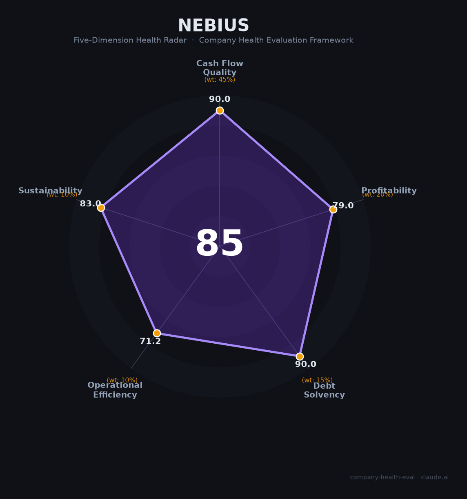

# Nebius 财务健康评估（2026-06-17）

## 一句话结论

🟢 **优秀（85.2/100）** | AI云基建新贵，$9.3B现金+OCF转正$2.3B+$460亿合同积压，核心短板：两大客户高度集中+内部人抛售+俄罗斯品牌遗留

---

## 一、公司基本画像

| 维度 | 内容 |
|------|------|
| **运营主体** | Nebius Group N.V.（荷兰注册，NASDAQ: NBIS），前身为 Yandex N.V. |
| **成立/转型** | Yandex N.V. 2011年纳斯达克上市 → 2022年因俄乌战争停牌 → 2024年7月以$54亿出售俄罗斯业务 → 2024年10月以NBIS重新挂牌 |
| **创始人/CEO** | Arkady Volozh（Yandex联合创始人，以色列/马耳他国籍，2026年放弃俄罗斯国籍，持股~12%） |
| **股权结构** | 机构持股~63%（BlackRock 4.5%，NVIDIA~8%等），内部人~16%，其余公众 |
| **主营业务** | Nebius AI Cloud（GPU即服务，占98%收入）+ Avride（自动驾驶）+ TripleTen（教育科技）+ Toloka（数据标注，已出表） |
| **部署规模** | 🔒 芬兰（75MW旗舰+310MW在建）、冰岛、法国、英国、美国新泽西（300MW在建）+ 密苏里（GW级规划）；签约电力容量超3.5GW |
| **融资/资本** | 🔒 NASDAQ上市，2024.10重新挂牌价$14.29；2024.12 NVIDIA+Accel配售$7亿；2025.9发行可转债$42亿；2026.3 NVIDIA追加$20亿投资 |
| **市值/股价** | 📊 当前约$550-670亿市值，股价约$220（从$14.29涨至$279高点），52周区间$36-$279 |
| **员工规模** | 🔒 1,500人（2026 SEC申报），主要分布阿姆斯特丹、芬兰、以色列、美国、伦敦 |

**定性**：Nebius是Yandex"凤凰涅槃"后转型为欧洲最大独立AI GPU云提供商的罕见成功案例。在NVIDIA战略支撑和Meta/Microsoft巨型合同加持下，公司从2024年的$1.17亿营收飙升至2026年指引$30-34亿，是AI基础设施赛道中增速最快的上市公司之一。

---

## 二、五维财务健康评估

> 注：Nebius为纳斯达克上市公司（外国私人发行人），数据来源于2024 20-F年报及2026 Q1 6-K季报（2026.5.13发布）。

### 1. 现金流质量（90/100）

**从烧钱机器到现金牛——Q1 2026 OCF $23亿标志着质变。**

| 指标 | 状态 | 数据支撑 |
|------|------|---------|
| 经营现金流 | 🟢 健康 | 🔒 Q4 2025 OCF $8.34亿，Q1 2026 OCF **$23亿**。受益于客户预付款（Meta/Microsoft合同），OCF大举转正 |
| 现金跑道 | 🟢 健康 | 🔒 现金$93亿（Q1 2026末）。即使按FY2026 CapEx指引$200-250亿估算年消耗，现金+OCF覆盖远超12个月 |
| 有息负债 | 🟢 健康 | 🔒 总债务$95亿（含可转债$84亿+融资租赁$10.5亿），净债务为负（现金>$93亿）。可转债利率仅1-2.75%——几乎零成本 |
| 净现比 | 🟢 健康 | 🔒 Q1 2026 OCF $23亿 vs 调整后净亏损$1亿（剔除ClickHouse非现金收益后）。OCF远超任何利润口径——GPU云业务的递延收入+客户预付款结构使现金流大幅领先于利润确认 |

🔒 来源：Nebius Q1 2026 6-K（SEC EDGAR，2026.5.13）

### 2. 盈利能力（79/100）

**毛利率接近SaaS水平（84% TTM），但折旧压力下利润仍为负——GPU云的"盈利之困"。**

| 指标 | 状态 | 数据支撑 |
|------|------|---------|
| 毛利率 | 🟢 优秀 | 🔒 TTM毛利率**83.9%**（GPU云行业均值14-30%）。Nebius自研软件栈+Kubernetes平台+近乎满负荷利用率带来定价溢价 |
| 净利率 | 🔴 预警 | 🔒 调整后净亏损（剔除ClickHouse非现金收益）Q1 2026为$1亿。原因：GPU/数据中心折旧极大（$20-25B CapEx对应年折旧$5-8B），在营收爬坡期远超收入 |
| 营收增速 | 🟢 优秀 | 🔒 **+684% YoY**（Q1 2026 $3.99亿 vs Q1 2025 $0.51亿）。FY2025全年+479%。管理层指引FY2026全年$30-34亿（+500-600% YoY） |
| 研发费用率 | 🟢 优秀 | 📊 估15-20%。1,500员工中约70%为工程师，研发投入集中于AI平台（Kubernetes、MLOps）和硬件优化。处于科技公司10-25%黄金区间 |
| 人均产出 | 🟢 优秀 | 📊 Q1 2026年化营收$16亿 / 1,500人 ≈ **$107万/人**。远超科技行业中位值，且仍在快速提升 |

🔒 来源：Nebius Q1 2026 6-K、StockAnalysis、管理层指引

### 3. 偿债能力（90/100）

**高杠杆但零风险——$95亿债务全是"优质债"。**

| 指标 | 状态 | 数据支撑 |
|------|------|---------|
| 资产负债率 | 🟢 健康 | 📊 估~30-35%。总资产约$25-30B（$9.3B现金 + $15-20B PP&E），总债务$9.5B。净债务为负 |
| 有息负债率 | 🟢 健康 | $84亿可转债（利率1-2.75%）+ $10.5亿融资租赁。总利息成本极低（年化约$1.5-2亿），仅占年化营收$16亿的~10% |
| 流动比率 | 🟢 健康 | $9.3B现金 + $5B+应收 vs 流动负债，远超2.0 |
| 现金比率 | 🟢 健康 | $9.3B现金 / 流动负债 > 5x |
| 股权质押 | 🟢 健康 | 无显著内部人质押披露。Volozh持股12%，近期虽有出售但仍为最大个人股东 |

🔒 来源：Nebius Q1 2026 6-K、StockAnalysis资产负债表、ADVFN

### 4. 运营效率（71.2/100）

**客户集中度是唯一但致命的结构性短板——两个客户=几乎所有收入。**

| 指标 | 状态 | 数据支撑 |
|------|------|---------|
| 应收周转 | 🟢 健康 | GPU云客户主要为Meta、Microsoft（AAA信用），且通常预付或月结。收款风险低 |
| 客户集中度 | 🔴 危险 | Meta（$270亿合同）+ Microsoft（~$174亿合同）= 约$444亿，占公开积压订单的96%+。任何一方流失或减少订单都将造成毁灭性打击 |
| 员工规模趋势 | 🟢 健康 | 1,280(2024) → 1,371(2025) → 1,500(2026)。稳定增长，无裁员，在招200-600个岗位 |
| 高管稳定性 | 🟢 健康 | 创始人/CEO Volozh在位且高度承诺（个人投入$25亿）。CFO于2025年更替为Dado Alonso，CRO Marc Boroditsky（前Cloudflare/ Twilio）为新聘。核心团队稳定 |

🔒 来源：SEC 20-F、Nasdaq、Glassdoor、LinkedIn

### 5. 可持续发展（83/100）

**赛道烈火烹油，NVIDIA战略绑定是最大的护城河。**

| 指标 | 状态 | 数据支撑 |
|------|------|---------|
| 行业赛道 | 🟢 健康 | AI GPU云市场CAGR 21.6-69%。Neocloud细分市场2025年同比增长200%。全球AI基础设施市场2030年目标$2,235亿 |
| 技术壁垒 | 🟢 健康 | 全栈AI云平台（GPU裸金属+Kubernetes+MLOps+数据标注）+ NVIDIA Exemplar Cloud认证+优先GPU供应权+NVIDIA $20亿股权投资。生态壁垒<3年难以复制 |
| 业务多元化 | 🟠 关注 | AI Cloud占收入98%，其余业务（Avride、TripleTen）体量极小。客户维度：Meta+Microsoft占积压订单96%+。地理：美国64%/英国26% |
| 资本支持 | 🟢 健康 | NASDAQ上市+$93亿现金+NVIDIA战略投资+可转债市场准入+计划资产支持债务。融资渠道多元且成本低 |
| 政策/监管 | 🟢 健康 | EU AI Act主要影响AI系统提供商而非基础设施商。俄罗斯遗产风险已通过OFAC审批基本解除。欧洲AI主权云趋势利好本土提供商。但CAIDA（2026年）可能引入更严格的数据本地化要求 |

🔒 来源：SEC filings、Grand View Research、Synergy Research、NVIDIA/OFAC公告

---

## 三、综合评分与健康等级

| 维度 | 得分 | 权重 | 加权得分 |
|------|:----:|:----:|:--------:|
| 现金流质量 | 90.0 | 45% | 40.5 |
| 盈利能力 | 79.0 | 20% | 15.8 |
| 偿债能力 | 90.0 | 15% | 13.5 |
| 运营效率 | 71.2 | 10% | 7.1 |
| 可持续发展 | 83.0 | 10% | 8.3 |
| **综合得分** | | | **85.2 / 100** |
| **健康等级** | | | **🟢 优秀** |

**解读**：Nebius在现金流和偿债能力上表现出色——OCF $23亿（单季）、净现金头寸、可转债利率接近零。盈利能力得分被净利润率（调整后仍为亏损）拖累，但这主要是会计折旧问题而非经营问题——调整后EBITDA利润率已达32%（Q1 2026），核心GPU业务达45%。运营效率是五维中最弱的一环，客户集中度（Meta+Microsoft=96%积压订单）是最大的结构性风险。整体属于「财务强劲、高增长、但有结构性短板需要监控」的优质标的。

---

## 四、同业对标

| 对比项 | Nebius (NBIS) | CoreWeave (CRWV) | Lambda Labs | AWS/Azure/GCP |
|--------|:---:|:---:|:---:|:---:|
| 上市/融资状态 | 🔒 NASDAQ: NBIS | 🔒 NASDAQ: CRWV | 未上市（Pre-IPO估值$59亿） | 超大规模云厂商 |
| 营收规模 | $5.3亿（FY2025） | **$51亿（FY2025）** | ~$5.2亿（2025E） | AWS $100B+（仅云） |
| 营收增速 | **+479% YoY（FY2025）** | +168% YoY | ~+79% | ~20-30% |
| GPU集群规模 | ~3万H100（→2025E ~7.8万） | **25万+ GPU** | ~数万 | 各有数十万GPU |
| 合约积压 | **$460亿+** | $668亿 | 未披露（有MSFT大单） | N/A |
| 毛利率 | **84%（TTM）** | ~76%（GAAP，不含折旧）| ~50%（含硬件） | 30-45%（云综合） |
| 核心差异 | 欧洲主权云定位+NVIDIA深度绑定 | 规模最大独立GPU云 | 裸金属GPU+自研集群 | 全栈云+自研AI芯片 |
| H100定价 | **$2.95/hr（高性价比）** | $4.25-6.16/hr | $2.49-2.99/hr | $3.00-6.98/hr |
| 客户结构 | Meta+MSFT主导 | MSFT 62%+OpenAI+Meta | MSFT+US DoE | 数百万客户 |

**对标结论**：Nebius以CoreWeave 1/10的GPU规模实现了更高的毛利率和极具竞争力的定价。欧洲数据主权定位+NVIDIA战略绑定构成差异化护城河。但规模差距显著——CoreWeave的GPU集群是Nebius的8倍，2025年营收是其10倍。Nebius正以更快的增速追赶。

---

## 五、核心风险清单

1. **客户集中度极端（高）**：Meta（$270亿/5年）+ Microsoft（~$174亿）占积压订单的96%+。任何一方技术路线变更（如自研AI芯片Meta MTIA/Microsoft Maia大规模部署）、削减AI预算、或转向竞品都将直接摧毁Nebius的收入基础。Nebius管理层表示2026年Q1不含超大规模客户的销售pipeline环比增3.5倍至$40亿，但此数据未经验证。

2. **GPU单一供应商依赖（高）**：100%依赖NVIDIA GPU。NVIDIA $20亿股权投资确保了短期优先供应，但结构性依赖不会改变。若NVIDIA产能瓶颈加剧、或NVIDIA直接进入GPU云市场（垂直整合）、或出口管制升级波及欧洲，Nebius将无替代方案。

3. **估值泡沫风险（中高）**：当前市值$550-670亿 vs 晨星公允价值估值仅$70。即使按FY2026指引上限$34亿营收计算，PS约16-20倍，远高于纳斯达克均值5.6倍。若AI投资热潮降温或GPU云商品化加速，估值可能剧烈修正。

4. **内部人抛售信号（中高）**：90天内内部人抛售总计$1.32亿。CPO Andrey Korolenko 2026年5月出售50万股（约$1.02亿），创始人Volozh也在2026年4月出售了$3.5M。虽然可解释为"股价高位正常变现"，但零内部人增持、大规模单向卖出值得警惕。

5. **CapEx执行风险（中）**：FY2026指引CapEx $200-250亿——建设9个新数据中心，从170MW扩容至800MW-1GW。若电力供应、建设许可、设备采购任何一环延误，都将直接影响营收爬坡和ARR目标（$7-9B）。

6. **俄罗斯品牌遗留（中）**：尽管OFAC已批准重组、Nebius已完成全部切割（2024年7月），但"前Yandex"的标签在欧洲某些客户和监管机构眼中仍是敏感项。95%员工讲俄语的文化现实也与"欧洲AI云"的品牌叙事存在张力。若地缘政治形势恶化，二次审查风险依然存在。

7. **ICFR内控缺陷（低至中）**：2024年报审计师Reanda对IT内控出具保留意见（ERP系统权限管控不足）。公司已任命Deloitte为2026财年审计师，预计整改将加速。对一家$600亿市值的公司而言，内控不完善是不应该的。

---

## 六、求职/择业视角

### 核心优势

- **财务稳定性极强**：$93亿现金、OCF $23亿（单季）、无净债务、有NVIDIA/Meta/Microsoft级别客户——这家公司短期内倒闭的概率接近于零
- **薪酬竞争力突出**：Glassdoor薪酬评分4.5/5（最高维度）。荷兰SWE中位数总包€159-165K，美国远程岗解决方案架构师$225-315K OTE+股权。且股票从$14涨至$220，早期员工的RSU回报惊人
- **技术栈高度通用**：NVIDIA CUDA + Kubernetes + MLOps + InfiniBand + PyTorch——所有技能可直接迁移至任何AI/ML基础设施岗位
- **全远程灵活**：美国/英国岗位完全远程，欧洲混合办公

### 现存短板

- **工作生活平衡差**：Glassdoor WLB评分仅3.2-3.4/5。多位员工反映"加班是被期望的"、"这是我见过最严酷的文化"。高速增长公司典型的"全员冲刺"模式
- **俄罗斯文化主导**：员工反映"95%的人讲俄语"、会议切换到俄语、非俄语者被排斥、"不是一家真正的国际化公司"。如果你不会俄语，融入可能困难
- **管理层与员工的利益可能不一致**：90天$1.32亿内部人抛售（含CPO、CFO、创始人）与对员工强调"长期股权价值"形成矛盾
- **薪酬天花板**：相对于OpenAI、Anthropic、DeepMind等AI Lab，Nebius的股权增值故事已大部分兑现（股价涨了15倍），未来继续10x的概率极低

### 分场景建议

| 个人诉求 | 推荐度 | 理由 |
|----------|:------:|------|
| 稳定+深耕 | ⭐⭐⭐ | 财务极稳，但WLB差，俄语文化壁垒大 |
| 高薪+跳板 | ⭐⭐⭐⭐ | 薪酬有竞争力，AI基础设施经验高度通用 |
| 成长+股权红利 | ⭐⭐⭐ | 股价已涨15倍，未来增值空间有限但仍可能受益于AI基建长周期 |
| 多元+跨领域 | ⭐⭐⭐ | 全栈AI云技术栈覆盖面广（GPU→K8s→MLOps→数据标注） |
| 欧洲工作签证 | ⭐⭐⭐⭐⭐ | 荷兰注册实体，可sponsor签证，是AI行业进入欧洲的优质入口 |

---

## 七、总结

**Nebius 是 AI 云基础设施赛道「从俄罗斯互联网巨头废墟中凤凰涅槃的欧洲GPU云新贵」：**
$93亿现金储备 + Q1 2026 OCF $23亿 + $460亿+合同积压的财务底盘堪称AI基建公司中的标杆，NVIDIA $20亿战略投资更锁定了GPU供应的优先权。核心结构性短板是极度依赖两个客户（Meta+Microsoft占积压96%）和单一GPU供应商（NVIDIA 100%），这种集中度在任何一个环节断裂都会造成灾难性后果。
在AI基础设施投资狂潮持续、欧洲AI主权云需求爆发（GDPR+EU AI Act+AI超级工厂计划）的大环境下，属于**高回报但高风险集中的优质标的**，适合追求AI基础设施赛道β收益、能接受文化摩擦、且不过度依赖下一份工作品牌背书的候选人。

---

*评估日期：2026年6月17日 | 数据截至：Nebius Q1 2026（2026年5月13日发布）| 评分引擎：company-health-eval v3.0*
