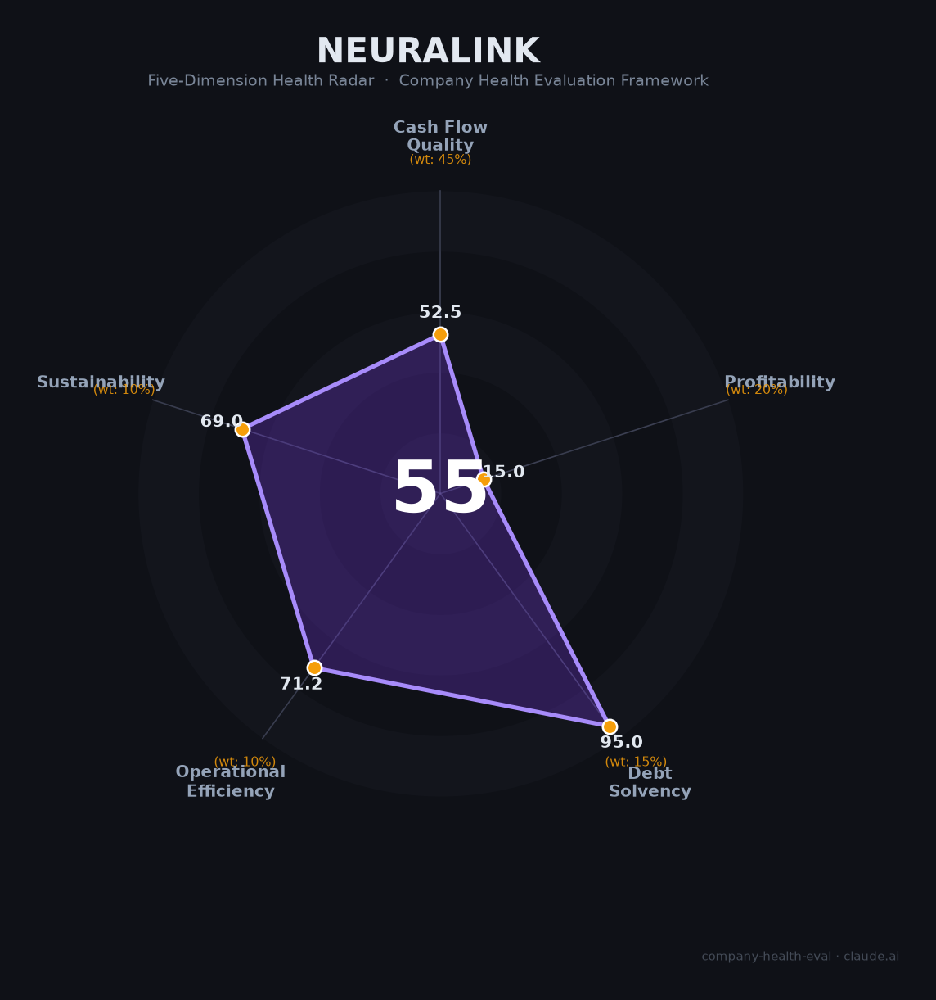

# Neuralink 财务健康评估（2026-06-16）

## 一句话结论

🔴 **中等偏下（55/100）** | 零负债+百亿估值+马斯克无限资本背书，但零收入+年烧$3-5亿+7/8联合创始人出走+FDA商业化至少3-7年

## 一、公司基本画像

| 维度 | 内容 |
|------|------|
| **主体** | Neuralink Corp（内华达州注册，原特拉华州），私营公司 |
| **成立** | 2016年7月（Elon Musk与7位科学家联合创立） |
| **创始人** | Elon Musk（实际控制人/President）+ 7位联合创始人（仅DJ Seo仍留任） |
| **CEO** | Jared Birchall（Musk家族办公室负责人） |
| **总部** | Fremont, CA；Austin/Del Valle, TX（扩建中） |
| **融资** | 累计$13.3亿（Seed→Series E），2025年E轮$6.5亿，投后估值$97亿 |
| **主要投资方** | Founders Fund、ARK Invest、Sequoia、Thrive Capital、Lightspeed、G42、QIA |
| **员工** | ~300-500人（2025年中），扩张中 |
| **核心产品** | N1脑植入芯片（1,024通道）+ R1手术机器人 + Telepathy/Blindsight应用 |
| **监管阶段** | FDA早期可行性研究（EFS），2023年5月获批IDE，至今已植入~21名患者 |
| **营收** | 零（临床阶段，预计最早2029年才有商业化收入） |

Neuralink是全球融资最多、估值最高的脑机接口（BCI）公司，也是马斯克"个人企业集团"中负责脑机接口层的关键一环。公司2024年1月完成首例人体植入后，至今已植入约21名患者，正在美国、加拿大、英国扩展临床试验。但距离FDA商业化批准（PMA）至少还需3-7年，且首例患者即出现电极线回缩问题。

## 二、五维财务健康评估

### 1. 现金流质量（52.5/100）

| 指标 | 现状 | 判定 |
|------|------|------|
| 经营现金流 | 零收入，年烧$3-5亿，OCF深度为负 | 🔴 危险 |
| 现金跑道 | E轮$6.5亿单独可撑~1-2年，累计融资$13.3亿可撑~3年，Musk个人$5亿可进一步补充 | ✅ 健康（覆盖12个月+） |
| 有息负债 | **零**负债，全部股权融资 | ✅ 健康 |
| 净现比 | OCF和NI均为负值，无意义 | 🔴 危险 |

**解读**：Neuralink的现金流质量呈现典型的「烧钱研发公司」特征——经营现金流持续深度为负（零收入+高研发投入），但现金储备充足（累计$13.3亿股权融资+零负债）。关键风险点：如果在现金耗尽前未能获批商业化，需要持续融资。乐观情景（含Musk个人投入）跑道约4-5年，刚好覆盖到2029年预期商业化时点。但若FDA审批延迟（极可能），2027-2028年可能需要新一轮融资。

### 2. 盈利能力（15.0/100）

| 指标 | 现状 | 判定 |
|------|------|------|
| 毛利率 | 无商业化产品 | 🔴 预警 |
| 净利率 | 深度亏损 | 🔴 预警 |
| 营收增速 | 零收入 | 🔴 预警 |
| 研发费用率 | ~100%+（所有支出均为研发和临床） | 🔴 预警（亏损+>35%） |
| 人均产出 | $0（零收入/300-500人） | 🔴 预警 |

**解读**：盈利能力维度触达引擎最低值15.0分，这是临床阶段医疗器械公司的必然结果。需要强调的是，这并非"经营不善"——Neuralink的战略就是在商业化前进行大量研发和临床投入。公司内部预测2029年（Telepathy获批后）实现$1亿营收，2031年达到$10亿+。在到达那个时点之前，盈利能力将始终为零或负。

### 3. 偿债能力（95.0/100）

| 指标 | 数值 | 判定 |
|------|------|------|
| 资产负债率 | ~0%（零负债） | ✅ 健康（<<40%） |
| 有息负债率 | 0% | ✅ 健康 |
| 流动比率 | 极高（$6.5亿+现金，极少流动负债） | ✅ 健康（>2） |
| 现金比率 | 极高 | ✅ 健康（>1） |
| 股权质押 | 无（私营公司） | ✅ 健康 |

**加分项**：零有息负债，触发引擎+5加分至95分。

**解读**：Neuralink的资产负债表极为干净——完全是股权融资驱动，不负任何银行或债券债务。这是私营VC-backed科技公司的典型财务结构，也是本评估中得分最高的维度。唯一微妙的点：零负债意味着不存在偿债危机，但也意味着公司完全依赖股权稀释来维持运营。每轮融资都在稀释早期投资者和员工的权益。

### 4. 运营效率（71.2/100）

| 指标 | 现状 | 判定 |
|------|------|------|
| 应收周转 | 无商业化应收 | ✅ 健康（无应收风险） |
| 客户集中度 | 临床试验阶段无商业客户，患者分布在多个试验中心 | ✅ 健康 |
| 员工规模趋势 | 300（2024）→~500（2025），持续扩张招聘中 | ✅ 健康 |
| 高管稳定性 | 8位联合创始人中7位已离开，仅DJ Seo留任 | 🔴 危险 |

**解读**：运营效率的极端分化——员工在增长、无客户集中风险、无应收风险，但高管团队几乎全部出走。流失的联合创始人中，Max Hodak（创办Science Corp.直接竞争）、Benjamin Rapoport（创办Precision Neuroscience直接竞争）、Paul Merolla（创办MK1被AMD收购）均成为行业对手。这意味着核心技术和商业机密广泛散布于竞争对手中。Musk本人精力分散于6家公司+政府职务，对Neuralink的日常管理介入有限，代理由家族办公室负责人Jared Birchall担任CEO。

### 5. 可持续发展（69.0/100）

| 指标 | 现状 | 判定 |
|------|------|------|
| 行业赛道 | 全球BCI市场CAGR 10-15%，侵入式BCI CAGR 35%+ | ✅ 健康（>15%） |
| 技术壁垒 | 1,024通道+手术机器人领先，但Synchron血管内路线3年内可能率先获批 | ⚠️ 关注（1-3年可复制追赶） |
| 业务多元化 | 单一BCI管线，无其他收入来源 | ⚠️ 关注 |
| 资本支持 | 估值$97亿+E轮$6.5亿+Musk个人$5亿+顶级VC背书 | ✅ 健康 |
| 政策/监管 | FDA首次申请被拒+动物实验争议+参议院报告+Musk政治风险 | ⚠️ 关注 |

**解读**：BCI行业确定性在增强（博睿康已在中国获批、Synchron启动关键性试验、Precision获FDA 510(k)），但Neuralink的监管路径并非最顺畅。首例患者的电极线回缩事件和动物实验争议（~1,500只动物死亡）增加了FDA审评的审慎度。Synchron若在2028年前率先获批，将在医生教育、保险覆盖和品牌认知上建立先发优势。Musk的政治化（DOGE联合领导人角色）虽可能在特朗普任期内削弱监管压力，但也创造了长期的政治风险——若政权更替，此前被压制的调查可能加倍反弹。

## 三、综合评分与健康等级

| 维度 | 得分 | 权重 | 加权得分 |
|------|:----:|:----:|:--------:|
| 现金流质量 | 52.5 | 45% | 23.6 |
| 盈利能力 | 15.0 | 20% | 3.0 |
| 偿债能力 | 95.0 | 15% | 14.2 |
| 运营效率 | 71.2 | 10% | 7.1 |
| 可持续发展 | 69.0 | 10% | 6.9 |
| **综合得分** | | **100%** | **54.9 / 100** |

**健康等级**：🔴 **中等偏下（Moderate-Low）**

**特别说明**：此评分主要反映Neuralink作为「临床阶段零收入公司」的财务健康状态。54.9分的核心拖累来自盈利能力（15.0分，触及引擎最低值）和现金流质量（52.5分，烧钱中），这与公司所处的发展阶段高度相关，不代表公司技术或商业前景差。如果将「技术领先性」和「资本背书强度」赋予更高权重，Neuralink实际的前景远优于同分数段的传统行业公司。

## 四、同业对标

| 对比项 | Neuralink | Synchron | 博睿康（Neuracle） |
|--------|:---------:|:--------:|:-----------------:|
| 成立时间 | 2016 | 2012 | 2013 |
| 累计融资 | $13.3亿 | $3.45亿 | 未披露（科创板IPO辅导中） |
| 最新估值 | $97亿 | ~$10亿 | — |
| 营收 | $0 | $0 | ¥1.08亿（2025） |
| 技术路线 | 开颅侵入式（1,024通道） | 血管内介入（16电极） | 硬脑膜外微创（8通道） |
| 人体植入数 | ~21人 | 10人 | 32人 |
| 监管进度 | FDA EFS（早期可行性） | FDA关键性试验 | **NMPA已获批上市** |
| 员工规模 | ~300-500 | ~100-200 | ~200-300 |
| 核心差异 | 最高通道数+最高精度+Musk资本 | 最低手术风险+监管路径最短 | **全球首个获批植入式BCI** |

**对标结论**：Neuralink在技术指标（通道数/信号精度）和资本规模上遥遥领先，但在监管审批进度上落后于Synchron（FDA关键性试验）和博睿康（中国已获批上市）。Synchron若能于2028年获得FDA批准，将成为美国市场首个商业化BCI，对Neuralink构成先发劣势。

## 五、核心风险清单

1. **FDA审批延迟/拒绝（高）**：2022年FDA首次拒绝人体试验申请，首例患者电极回缩进一步增加审评审慎度。距离商业化PMA至少3-7年，期间任何安全性事件都可能导致临床暂停。触发条件：新患者出现严重不良事件（感染、脑损伤、电极大规模脱落）。

2. **Synchron率先获批（高）**：Synchron已进入FDA关键性试验阶段（2026年），若2028年前获批将建立显著的先发优势（医生教育、保险覆盖、品牌认知）。触发条件：Synchron关键性试验达到主要终点。

3. **烧钱不可持续（中高）**：年烧$3-5亿，当前跑道~3年。若FDA审批延迟至2029年之后，2027-2028年将需要新一轮融资。在市场不利环境下融资可能面临估值下调（down round）。触发条件：FDA要求在PMA前进行更大规模关键性试验。

4. **核心人才流失（中）**：7/8联合创始人出走，其中至少2位创办了直接竞争对手（Science Corp.、Precision Neuroscience）。Musk分散精力于6家公司+DOGE。触发条件：DJ Seo（最后一位在任联合创始人）离职。

5. **马斯克政治/声誉风险（中）**：Musk深陷美国政治争斗（DOGE角色、$2.37亿潜在联邦罚款），政治化可能影响FDA监管的中立性和公众对BCI技术的信任。触发条件：政权更替后联邦调查升级。

6. **动物实验争议余波（中低）**：USDA调查虽未发现正式违规，但参议院报告指出潜在$159万处罚+SEC调查$2.81亿潜在责任。已在一定程度上被市场消化，不太可能单独构成致命风险。

7. **中国BCI产业追赶（中低）**：博睿康已在中国获批NMPA三类注册证（全球首款获批植入式BCI），脑虎科技完成汉语实时解码。中国BCI企业的快速进展可能在亚洲市场形成区域壁垒。

## 六、求职/择业视角

### 核心优势

- **品牌背书极强**：Elon Musk旗下公司标签在科技行业认可度极高，Neuralink经验对未来在Tesla/SpaceX/xAI等Musk系公司内部流动有帮助，对其他硬科技/生物科技公司也具吸引力。
- **技术前沿性无与伦比**：参与全球最先进的脑机接口研发，涉及芯片设计、神经科学、AI解码、机器人手术等交叉领域，技术积累在BCI产业爆发时价值极高。
- **薪酬有竞争力**：Senior软件工程师总包中位数~$401K（含RSU），虽低于FANG同级（$500-800K），但在BCI/生物科技行业中属顶级。若公司最终IPO，RSU可能产生巨大杠杆效应。
- **持续扩张中**：E轮$6.5亿后大规模招聘，暂无裁员风险（与2022-2024年科技巨头形成对比）。

### 现存短板

- **工作强度极高**：Blind工作生活平衡评分仅2.5/5，继承Musk系"hardcore"文化——长时间工作、不切实际的截止日期、恐惧驱动的问责环境。不适合追求WLB的人。
- **RSU流动性为零**：私营公司，RSU在IPO或二级交易前无法变现。若公司最终未能IPO（被收购或长期保持私有），RSU价值存疑。
- **CEO认可度仅45%**：Glassdoor上Musk作为CEO的认可度远低于行业平均，多位前员工描述"toxic work environment powered by fear of Elon"。
- **职业发展不明**：缺乏资深工程师指导、管理层频繁变动、晋升路径模糊（多位Glassdoor/Blind反馈）。
- **地理位置限制**：全部岗位要求onsite（Fremont CA或Austin TX），不支持远程。湾区生活成本极高。

### 分场景建议

| 个人诉求 | 推荐度 | 说明 |
|----------|:------:|------|
| 硬科技信仰+愿意为前沿技术牺牲WLB | 🟢 推荐 | 全球BCI最前沿，技术经验无价，IPO杠杆潜力大 |
| 高薪+快速变现 | 🟡 次选 | RSU流动性为零，总包低于FANG，IPO时间表不确定（5-10年？） |
| 稳定+WLB | 🔴 规避 | 高压硬核文化，WLB评分行业底部，burnout风险高 |
| 生物科技/医疗器械职业路径 | 🟡 次选 | BCI行业尚处早期，经验在当前狭小的行业中迁移性有限，但行业爆发时将是核心资产 |
| 作为跳板（2-3年后跳槽） | 🟢 推荐 | Musk系标签在科技行业极具信号价值，尤其在硬科技/AI/机器人领域 |

## 七、总结

Neuralink是全球脑机接口领域「资本最多、技术最激进、监管不确定性最高」的三位一体公司：1,024通道侵入式植入+机器人手术+零负债$13亿资本背书，技术上遥遥领先；但零收入+年烧$3-5亿+首例患者电极回缩+7/8联合创始人出走+Synchron可能在2028年前率先获批，构成了从技术→监管→竞争→人才的全方位风险矩阵。

在BCI行业CAGR 10-15%且侵入式细分35%+的大背景下，Neuralink属于**中等偏下风险、极高潜在回报**类型：财务健康度评分受制于临床阶段的天然局限（零收入、高烧钱），但其资本厚度（Musk个人$5亿+顶级VC支持）远超同分段的传统公司。适合信仰硬科技、能承受高强度工作、愿意押注5-10年BCI商业化周期的技术人才，不适合追求短期变现或WLB的人群。

---

*评估日期：2026-06-16 | 数据截至：2025年E轮融资 + 2026年初公开信息*  
*评分引擎：.claude/skills/company-health-eval/scripts/score.py（确定性加权算法）*  
*数据来源：📊 基于公开报道/融资公告估算（私营公司无公开财报） | 🌐 Glassdoor/Blind/媒体报道 | ⚠️ 部分指标为基于行业类比估算*  
*特别提示：Neuralink为私营临床阶段公司，财务数据不公开，本评估中烧钱率、跑道等均为基于员工规模和行业基准的估算值。*
