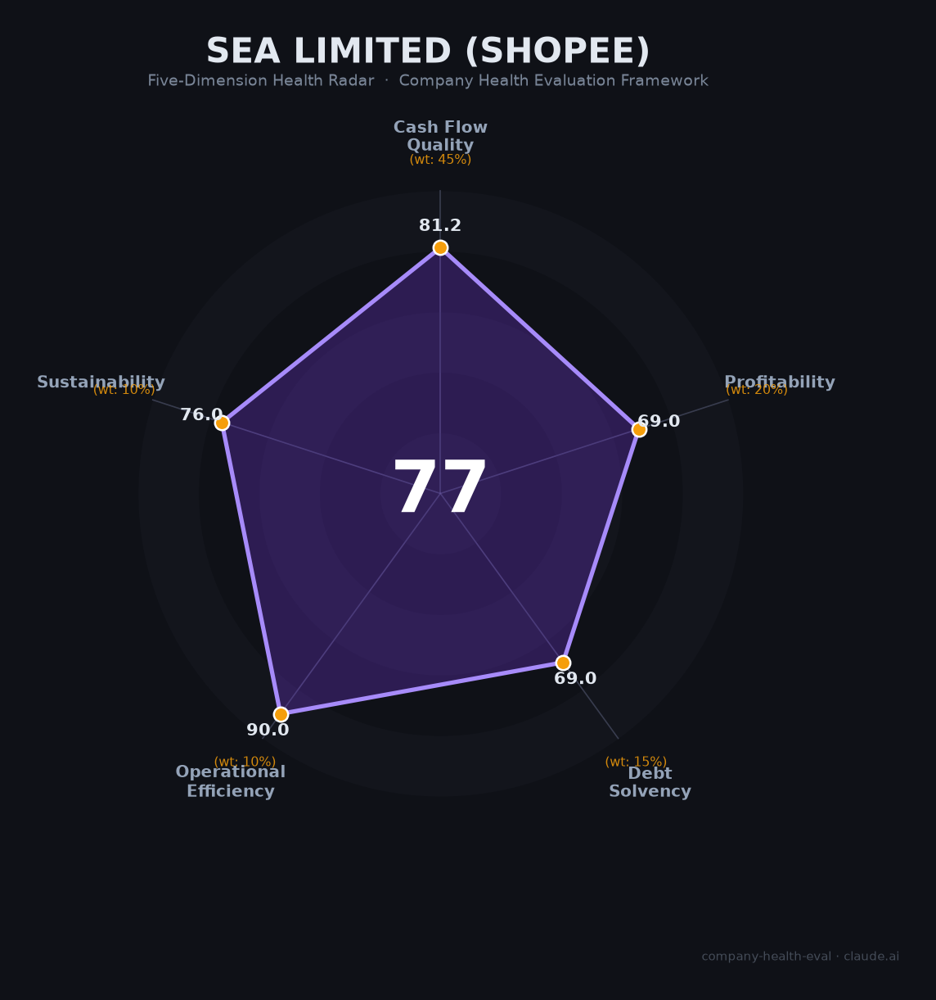

# Sea Limited（Shopee）财务健康评估（2026-06-16）

## 一句话结论

🟡 **中等偏上（77/100）** | 东南亚电商霸主+现金流转正+净现金状态，最大威胁是TikTok Shop以2倍增速蚕食份额

## 一、公司基本画像

| 维度 | 内容 |
|------|------|
| **主体** | Sea Limited（NYSE: SE），新加坡注册，2017年纽交所上市 |
| **成立** | 2009年5月（前身Garena），创始人Forrest Li（李小冬） |
| **创始人** | 李小冬（天津出生，上海交大学士+斯坦福MBA），控制59.1%投票权 |
| **主要股东** | 腾讯18.5%（零投票权）、李小冬~18.5%、Baillie Gifford 6.45% |
| **员工** | 全球102,700人（2025年），中国区约5,659人，2022年曾裁员~7,000人 |
| **IPO** | 2017年10月纽交所，发行价$15/股，募资$8.84亿，历史最高$372.7（2021.10） |
| **市值** | 约$900亿（2026年6月估算，较2021峰值$2,000亿+腰斩） |
| **FY2024营收** | 🔒 $168.2亿（+28.8% YoY），Shopee $124亿（74%）+ Garena $19亿（11%）+ SeaMoney $24亿（14%） |
| **FY2024净利润** | 🔒 $4.48亿（+175%），经营现金流$32.8亿，自由现金流$29.6亿 |
| **Shopee GMV** | 🔒 $1,005亿（2024），东南亚市占率53%稳居第一 |
| **流动性** | 🔒 现金+短期投资$86亿 vs 有息负债$41亿，净现金$45亿 |

Sea Limited 是东南亚最大的互联网公司，旗下Shopee是东南亚+台湾绝对领先的电商平台（GMV破千亿美元），Garena运营全球级手游Free Fire（累计收入$40亿+），SeaMoney（Monee）是增长最快的东南亚数字银行之一。公司2022年经历「烧钱扩张→巨亏→大裁员」的至暗时刻后，2023年成功扭亏为盈，2024年三大业务首次同时实现正向调整后EBITDA。

## 二、五维财务健康评估

### 1. 现金流质量（81.2/100）

| 指标 | 现状 | 判定 |
|------|------|------|
| 经营现金流 | FY2022: -$10.6亿 → FY2023: +$20.8亿 → FY2024: +$32.8亿 | ⚠️ 关注（仅2/3年为正） |
| 现金跑道 | $86亿流动性覆盖运营，且OCF为正向流入 | ✅ 健康 |
| 有息负债 | $41亿，净现金+$45亿，债务/总资产仅0.18 | ✅ 健康 |
| 净现比 | OCF $32.8亿 / NI $4.48亿 = 7.3x | ✅ 健康 |

**解读**：Sea Limited的现金流质量经历了教科书式的V型反转。2022年经营现金流净流出$10.6亿（烧钱换增长），2023年战略转向「降本增效」后立刻转正至$20.8亿，2024年进一步升至$32.8亿。唯一扣分项是OCF尚未连续3年为正（2022年为负），但趋势极强。净现比7.3x说明盈利质量极高——利润远非纸面数字。净现金$45亿的状态意味着公司可以用现金清偿所有有息负债后仍有大量剩余。

### 2. 盈利能力（69.0/100）

| 指标 | FY2024数据 | 判定 |
|------|:----------:|------|
| 毛利率 | 42.8% | ✅ 良好（高于行业均值39-41.5%） |
| 净利率 | 2.7%（$4.48亿 / $168.2亿） | ⚠️ 一般（0-5%区间） |
| 营收增速（2Y CAGR） | 16.2%（FY2022 $124.5亿→FY2024 $168.2亿） | ✅ 良好（10-20%） |
| 研发费用率 | 估8-12%（📊估算，Shopee平台+游戏+金融科技研发） | ✅ 良好 |
| 人均产出 | ~$20.8万/人（$168.2亿 / 80,700人） | ✅ 良好 |

**解读**：盈利能力是Sea最弱的主力维度。42.8%的毛利率在平台型电商中属中上水平，但2.7%的净利率反映了电商行业「规模大、利润薄」的本质——东南亚电商中位数净利润率仅3%。核心利润引擎不是Shopee（2024年调整后EBITDA仅$1.56亿），而是Garena（$12亿，EBITDA/Bookings 55.8%）和SeaMoney（$7.12亿）。Shopee在2024年才首次实现全年调整后EBITDA转正，盈利尚处「证明期」早期。营收增速从2023年的4.9%回升至2024年的28.8%（Q1 2025+30%），二次加速态势明确。

### 3. 偿债能力（69.0/100）

| 指标 | 数值 | 判定 |
|------|------|------|
| 资产负债率 | 62.5%（总负债$141.5亿 / 总资产$226.3亿） | ⚠️ 关注（40-70%区间） |
| 有息负债率 | 18.2%（$41.1亿 / $226.3亿） | ✅ 健康（<20%） |
| 流动比率 | 估1.0-1.5（📊估算，平台模式负营运资金） | ⚠️ 关注（1-2区间） |
| 现金比率 | 估~0.96（📊估算，$86亿流动性/流动负债） | ⚠️ 关注（0.5-1区间） |
| 股权质押 | 无显著质押，双重股权结构下创始人控制权稳固 | ✅ 健康 |

**解读**：62.5%的总资产负债率看似偏高，但这是平台型电商的正常财务特征——大量应付商户款推高流动负债（负营运资金模式），而非真正的债务风险。核心安全边际在于：（1）有息负债率仅18.2%且持续下降（FY2022: 26% → FY2024: 18%）；（2）$86亿流动性远超$41亿有息负债；（3）双重股权结构下不存在A股式股权质押爆仓风险。流动比率<1是电商平台普遍现象（Amazon长期<1），不代表偿债危机。

### 4. 运营效率（90.0/100）

| 指标 | 现状 | 判定 |
|------|------|------|
| 应收周转 | 电商平台C端即时支付，B端账期短 | ✅ 健康 |
| 客户/商户集中度 | 数百万商户+数亿消费者，极度分散 | ✅ 健康 |
| 员工规模趋势 | 62,700（2023）→80,700（2024,+28.7%）→102,700（2025,+27.3%） | ✅ 健康 |
| 高管稳定性 | 三位联合创始人2009年至今均在位，核心管理层平均任期10年+ | ✅ 健康 |

**解读**：运营效率是Sea最突出的维度，四项指标全满分。2022年大裁员（~7,000人，集团总人力-10%）后，公司迅速重回扩张轨道，2024-2025年连续两年新增超2万人。核心管理层自2009年创业至今未变动（Forrest Li CEO、Gang Ye COO、David Chen CPO），在经历了$1,600亿市值蒸发后又实现扭亏为盈的过山车式历程中，创始团队的稳定性经受了极端考验。

### 5. 可持续发展（76.0/100）

| 指标 | 现状 | 判定 |
|------|------|------|
| 行业赛道 | 东南亚电商CAGR~15.7%（2023-2025），数字经济$2,630亿 | ✅ 健康（>15%） |
| 技术壁垒 | 自建物流SPX Express+支付闭环，但TikTok Shop 3年追上 | ⚠️ 关注（1-3年可复制） |
| 业务多元化 | 3条业务线（电商+游戏+金融）+7国市场 | ✅ 健康 |
| 资本支持 | NYSE上市+$86亿流动性+全年盈利 | ✅ 健康 |
| 政策/监管 | 多国电商税代扣代缴+印尼反垄断调查+印度禁令前科 | ⚠️ 关注 |

**解读**：东南亚电商渗透率仅20-25%（中国47%、美国84%），增量空间确定。但TikTok Shop以内容电商模式（直播/短视频）切入，2025年GMV翻倍至$456亿，增速是Shopee的近2倍，在泰国已超Lazada成为第二、越南份额逼近Shopee。Shopee的防御策略（Shopee Live直播、SPX Express物流、ShopeeVIP会员）尚在构筑中。另一方面，Garena的Free Fire已进入生命周期第8年，收入持续下滑（FY2024 GAAP收入-12%），作为集团利润支柱（占调整后EBITDA 60%）的可持续性存疑。印尼反垄断调查（2024年5月起）最高可处净利润50%罚款，是悬而未决的合规风险。

## 三、综合评分与健康等级

| 维度 | 得分 | 权重 | 加权得分 |
|------|:----:|:----:|:--------:|
| 现金流质量 | 81.2 | 45% | 36.5 |
| 盈利能力 | 69.0 | 20% | 13.8 |
| 偿债能力 | 69.0 | 15% | 10.3 |
| 运营效率 | 90.0 | 10% | 9.0 |
| 可持续发展 | 76.0 | 10% | 7.6 |
| **综合得分** | | **100%** | **77.3 / 100** |

**健康等级**：🟡 **中等偏上（Moderate-High）**

## 四、同业对标

| 对比项 | Sea Limited (Shopee) | 阿里巴巴 (Lazada) | TikTok Shop (字节) |
|--------|:-------------------:|:-----------------:|:-------------------:|
| 上市/融资状态 | NYSE上市 | NYSE/HKEX上市 | 未上市（字节跳动） |
| 东南亚电商GMV（2025） | $832亿 | $180亿 | $456亿 |
| 东南亚市占率 | 53% | 11% | 29% |
| 集团营收（FY2024） | $168.2亿 | ¥9,416亿（~$1,302亿） | 未披露（估$1,200亿+） |
| 电商毛利率 | 42.8%（集团整体） | ~38-42%（AIDC估） | 未披露（估亏损） |
| 净利润率 | 2.7% | ~9%（集团整体） | 未披露 |
| 员工规模 | 102,700人 | ~198,000人（集团） | ~150,000人 |
| 核心差异 | 东南亚本土化最深，自建物流 | 全球品牌+阿里生态协同 | 内容电商+算法驱动 |

**对标结论**：Shopee在东南亚电商领域维持绝对规模优势（GMV ≈ Lazada的4.6倍），但TikTok Shop是结构性威胁——不是「另一个电商平台」，而是「内容即货架」的范式迁移。Sea的差异化防御在于：游戏（Garena）提供稳定利润输血、金融科技（SeaMoney）提供第二增长曲线，这是纯电商竞品不具备的。

## 五、核心风险清单

1. **TikTok Shop竞争侵蚀（高）**：2025年GMV翻倍至$456亿，越南/泰国份额快速逼近Shopee。若TikTok Shop在2026-2027年实现盈亏平衡，将有能力发动新一轮补贴战。触发条件：TikTok Shop东南亚实现单季盈利。

2. **Garena/Free Fire收入持续下滑（中高）**：游戏收入占集团调整后EBITDA的60%，但Free Fire已进入第8年生命周期，GAAP收入连续下降。若2026-2027年无新爆款接棒，集团整体盈利能力将显著承压。触发条件：Free Fire季度活跃用户跌破5亿（目前6.18亿）。

3. **印尼政策/反垄断风险（中）**：KPPU反垄断调查（2024年5月起）最高可处净利润50%罚款（~$2.24亿）；印尼电商监管（个人店清退、跨境低价商品限制）持续加码。触发条件：KPPU做出不利裁决。

4. **中国区劳动合规隐患（中）**：361末位淘汰制+无偿加班（晚9-10点）+2024年员工猝死事件，虽尚未引发大规模劳动仲裁/诉讼，但合规风险在积累。触发条件：劳动监察介入或集体诉讼。

5. **多国税务合规成本上升（中低）**：越南（2025.7代扣代缴）、泰国（拟议5%预扣）、菲律宾（12%数字服务税）、马来西亚（8%服务税+LVIG），合规成本持续上升但可转嫁给商户/消费者。触发条件：多国同步叠加实施。

6. **证券集体诉讼（已解决）**：2025年7月以$4,600万和解，占2024年净利润9.9%，一次性影响已消化。

## 六、求职/择业视角

### 核心优势

- **品牌背书强**：东南亚第一互联网公司+纽交所上市，跳槽时「Shopee/Sea」标签在互联网行业认可度高，尤其对后续去字节、阿里、或出海公司有帮助。
- **技术栈通用**：深圳研发中心覆盖后端/前端/移动端/大数据/算法全栈，技术栈与国内一线互联网公司通用，经验可迁移。
- **薪酬中上**：深圳校招24-36万RMB（低于字节/腾讯的30-50万），公积金10%+年假15天优于多数国内公司。新加坡技术岗$78K-$156K SGD在国际上有竞争力。
- **国际化视野**：业务覆盖7国，有跨国协作和东南亚市场经验积累机会。

### 现存短板

- **工作强度大**：常规下班时间晚9-10点，无加班费，361末位淘汰制（季度考核，10%拿C，连续两次进PIP），2024年曾发生员工猝死事件。工作生活平衡（Glassdoor 3.3/5）是最大槽点。
- **薪酬天花板**：相比国内一线大厂（字节/腾讯/拼多多），总包上限偏低，股票（SE）波动剧烈（2021年峰值$372→2022年底$39→现在~$150），期权价值不确定。
- **晋升缓慢**：Glassdoor和脉脉多反馈晋升路径不清晰，存在薪资倒挂现象。
- **「外企光环」褪色**：从2021年「神仙外企」到2024年「361+猝死」，口碑明显下滑，RTO（强制回办公室）政策在2023年后严格执行。

### 分场景建议

| 个人诉求 | 推荐度 | 说明 |
|----------|:------:|------|
| 应届生+出海/国际化方向 | 🟢 推荐 | 品牌好+技术通用+国际化经验，2-3年后跳槽选择面广 |
| 追求WLB+稳定深耕 | 🟡 次选 | 加班严重，末位淘汰压力大，不如外企（微软/Shopify）或国企 |
| 高薪+快速晋升 | 🟡 次选 | 薪酬上限低于字节/拼多多，晋升缓慢 |
| 新加坡/海外发展 | 🟢 推荐 | 新加坡总部技术岗$78K-$156K SGD，税收低，可作为海外跳板 |
| 深圳研发+长期留任 | 🔴 规避 | 劳动强度与国内大厂相当但薪酬无优势，PIP风险真实存在 |

## 七、总结

Sea Limited（Shopee）是东南亚互联网领域「流量霸主+盈利新兵」的二元体：Shopee以53%市占率+千亿美元GMV稳居电商王座，Garena和SeaMoney贡献了集团绝大部分利润，2024年$32.8亿经营现金流和净现金$45亿的状态提供了坚实的财务安全垫。唯一核心短板是盈利能力尚薄（净利率2.7%）且面临TikTok Shop的结构性竞争——不是「会不会被追上」，而是「差距以多快速度缩小」。

在东南亚数字经济CAGR~15.7%的增量大背景下，Sea属于**中等偏上风险**，适合追求品牌背书+国际化经验+能接受较高工作强度的求职者，不适合追求WLB或长期深耕单一岗位的人选。

---

*评估日期：2026-06-16 | 数据截至：FY2024年报（2025年3月发布）+ Q1 2025季报 + 2025年6月公开信息*
*评分引擎：.claude/skills/company-health-eval/scripts/score.py（确定性加权算法）*
*数据来源：🔒 SEC 20-F/6-K公开财报 | 🌐 Glassdoor/脉脉/媒体报道 | 📊 部分指标为基于公开信息估算*
