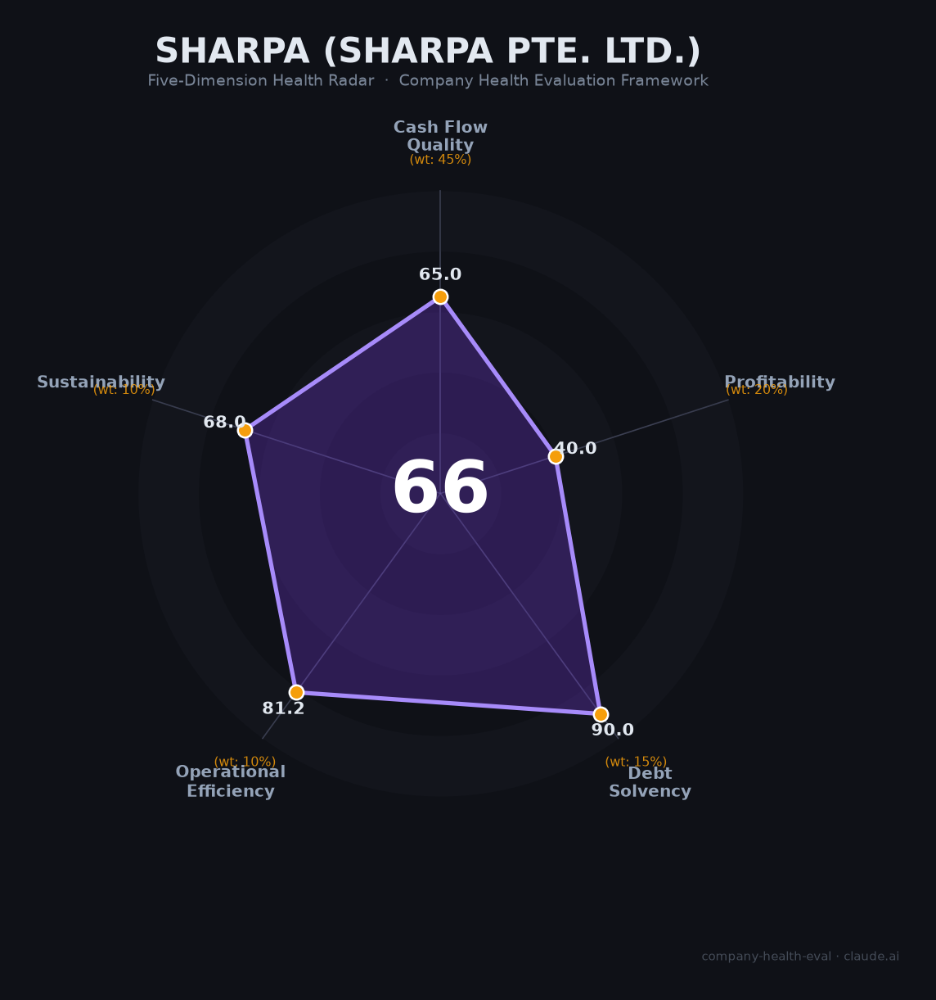

# Sharpa 财务健康评估（2026-06-19）

## 一句话结论

🟠 **中等（66/100）** | 零收入独角兽，禾赛三剑客+英伟达背书的顶级「叙事先行」公司

> ⚠️ **重要提示**：本报告评估对象为**Sharpa（Sharpa Pte. Ltd. / 上海大裂谷智能科技有限公司）**——2024年底在新加坡成立的AI机器人初创公司，**非**日本夏普（Sharp Corporation）。

## 一、公司基本画像

| 项目 | 内容 |
|------|------|
| **运营主体** | Sharpa Pte. Ltd.（新加坡） / 上海大裂谷智能科技有限公司 |
| **控股架构** | Rift Valley HK Limited（香港）→ 100%控股Sharpa，外部机构投资者通过Rift Valley HK持股 |
| **成立时间** | 2024年底 |
| **法定代表人** | 施叶舟（法律代表）；实际控制人为李一帆、向少卿、孙恺 |
| **团队规模** | 100+人（2026年初，新加坡+上海+山景城） |
| **创始人** | 李一帆（清华+UIUC博士/禾赛CEO）、向少卿（清华+斯坦福双硕士/禾赛CTO）、孙恺（上交+斯坦福博士/禾赛首席科学家） |
| **融资状态** | 选择性邀请制融资（仅禾赛老股东+少数全球资本），估值~$10亿（早期轮）→ CES 2026后传闻$20-30亿 |
| **核心产品** | SharpaWave灵巧手（22自由度/$50K/2025.10量产）+ Sharpa North人形机器人（CES 2026首秀） |
| **关键背书** | 英伟达Isaac GR00T参考人形机器人指定灵巧手供应商 |
| **盈利状态** | 零收入（pre-revenue），持续亏损 |

**一句话定性**：Sharpa是具身智能赛道最受关注的「叙事先行」型公司——由禾赛科技三位联合创始人体外孵化，凭借团队光环+英伟达生态认证+赛道情绪，在零收入阶段即获$10-30亿估值。本质是高风险高回报的「创业赌注」，非常规意义上的「公司」。

## 二、五维财务健康评估

### 1. 现金流质量（65.0/100）

| 指标 | 判断 | 说明 |
|------|------|------|
| 经营现金流 | 🔴 危险 | 零收入初创公司，持续烧钱（研发+团队扩张），经营现金流必然为负 |
| 现金储备 | ✅ 健康 | 估值$10-30亿的私募融资+禾赛老股东支持，现金跑道充裕（估12-24个月+） |
| 有息负债 | ✅ 健康 | 纯股权融资，零有息负债 |

**评估**：典型的VC-backed初创财务结构——烧钱换增长，零负债但有资本弹药。现金跑道取决于融资节奏和烧钱速度（100+人团队+制造+研发，年烧钱估￥1-3亿）。

### 2. 盈利能力（40.0/100）

| 指标 | 判断 | 说明 |
|------|------|------|
| 毛利率 | 📊 一般 | 📊 估40-50%（灵巧手$50K定价，参考宇树60%毛利率），量小初期拉低 |
| 净利率 | 🔴 预警 | 深度亏损，零收入+高研发投入+团队扩张 |
| 营收增速 | 📊 一般 | 无可比历史数据，刚进入量产阶段 |
| 研发费用率 | ✅ 良好 | 📊 估30-60%+（100+人团队以研发为主），远超行业均值12% |
| 人均产出 | 🔴 预警 | 📊 趋近于零（2025年基本无收入/100+人） |

**评估**：盈利能力是早期深科技公司的典型状态——无收入、高研发、深度亏损。这在初创公司中是正常的，但从财务健康评估角度看是最弱维度。

### 3. 偿债能力（90.0/100）

| 指标 | 判断 | 说明 |
|------|------|------|
| 资产负债率 | ✅ 健康 | 纯股权融资，无有息负债 |
| 有息负债率 | ✅ 健康 | 零有息负债 |

**评估**：零负债是VC-funded初创公司的常态，偿债风险为零。

### 4. 运营效率（81.2/100）

| 指标 | 判断 | 说明 |
|------|------|------|
| 应收周转 | ✅ 健康 | B2B高端产品（$50K/只），客户为科研机构/NVIDIA等，回款良好 |
| 客户集中度 | ⚠️ 关注 | 早期阶段客户极其有限（英伟达GR00T是核心客户），存在单一客户依赖风险 |
| 员工规模趋势 | ✅ 健康 | 激进招聘中（2026校招+社招并行，新加坡承诺3年扩至150人） |
| 高管稳定性 | ✅ 健康 | 创始团队完整，禾赛三剑客品牌背书 |

**评估**：运营效率表现良好，团队扩张和招聘活跃度是积极信号。「百万年薪+早期期权」的薪酬策略吸引顶尖人才。

### 5. 可持续发展能力（68.0/100）

| 指标 | 判断 | 说明 |
|------|------|------|
| 行业赛道 | ✅ 健康 | 全球人形机器人出货量2025年同比+508%，2030E达50万+台，CAGR远超15% |
| 技术壁垒 | ✅ 健康 | 22自由度直驱灵巧手+1000+触觉像素+英伟达GR00T认证，短期难以复制 |
| 业务多元化 | ⚠️ 关注 | 仅有灵巧手+人形机器人两条线，均在极早期商业化阶段 |
| 资本支持 | ✅ 健康 | 禾赛老股东+选择性全球资本+独角兽估值，融资能力极强 |
| 政策风险 | 🔴 危险 | 禾赛被列入美国国防部1260H清单（2026.6仍在列），中美AI投资禁令已生效。创始人关联企业的地缘风险是最大外部威胁 |

**评估**：可持续发展呈现极端的「高潜力+高风险」格局。赛道增速和技术壁垒极强，但政策风险（禾赛被制裁的连带效应）是致命的外部变量。

## 三、综合评分与健康等级

| 维度 | 得分 | 权重 | 加权得分 |
|------|------|------|----------|
| 现金流质量 | 65.0 | 45% | 29.2 |
| 盈利能力 | 40.0 | 20% | 8.0 |
| 偿债能力 | 90.0 | 15% | 13.5 |
| 运营效率 | 81.2 | 10% | 8.1 |
| 可持续发展 | 68.0 | 10% | 6.8 |
| **综合得分** | | | **65.7/100** |
| **健康等级** | | | 🟠 **中等** |

## 四、同业对标

| 对比项 | Sharpa | 宇树科技（Unitree） | 智元机器人（AgiBot） | 灵心巧手 |
|--------|------|-------------------|---------------------|---------|
| 成立时间 | 2024年底 | 2016年 | 2023年 | — |
| 上市/融资状态 | 种子/早期轮，$10-30亿估值 | 科创板过会，~420亿元 | B轮~150亿，赴港IPO | ~205亿估值 |
| 2025营收 | ~0（pre-revenue） | ¥17.0亿 | ¥10.5亿 | ~亿级（未披露） |
| 毛利率 | 📊 估40-50% | 60.13% | 未披露 | 未披露 |
| 净利率 | 深度亏损 | **+35%（行业唯一盈利）** | 亏损 | 亏损 |
| 员工规模 | 100+人 | ~2,000+人 | ~1,000+人 | 未知 |
| 核心差异 | 灵巧手获英伟达认证，零收入独角兽 | 全品类出货量第一，已盈利 | 全栈具身智能平台，出货5,168台 | 灵巧手月产4,000+只 |

**对标结论**：Sharpa在财务维度与同行完全不可比——零收入、深度亏损 vs. 宇树已盈利6亿。其估值完全建立在「禾赛创始团队品牌+英伟达生态认证+赛道情绪」之上，属于「叙事先行」型估值逻辑。

## 五、核心风险清单

1. **零收入估值泡沫（高）**：$10-30亿估值建立在纯叙事之上。对比宇树（营收17亿/盈利6亿/估值420亿），Sharpa的PS为无穷大。若产品无法快速起量或下一轮融资遇冷，估值可能大幅回调。

2. **中美地缘政治连带制裁（高）**：禾赛已被列入美国国防部1260H清单（2026.6仍在列），美国对华AI投资禁令已生效。尽管Sharpa注册在新加坡且独立运营，创始人与禾赛的关联可能使其被视为「与中国军方有关联的实体」，影响美国客户获取和融资。

3. **创始人体外孵化争议（中高）**：Sharpa与禾赛无股权从属关系，若Sharpa做大，收益归创始人+外部投资者，禾赛股东无法分享。创始人精力分散（同时掌舵禾赛400亿市值+Sharpa百亿级）也是潜在隐患。

4. **商业化落地不确定（中高）**：创始人自述ROI周期5-10年。从科研场景→服务场景→家庭场景的路径漫长，每阶段都有技术、成本、市场接受度的不确定性。Tesla Optimus计划年产百万台的规模优势可能碾压所有创业公司。

5. **赛道拥挤+价格战风险（中）**：灵巧手赛道已有因时机器人（累计交付万只）、灵心巧手（月产4,000+只）等先行者。人形机器人均价3年跌超70%（59万→16.6万），价格战正在加剧。

6. **信息不透明（中）**：融资金额、股东名单、财务数据均未公开，所有分析基于媒体报道推测，「黑箱」程度极高。

## 六、求职/择业视角

### 核心优势
- **顶级技术团队**：创始团队来自禾赛/苹果/大疆/斯坦福/清华，技术基因极强
- **早期期权价值**：$10-30亿估值的早期阶段，入职即获期权，若公司成长至百亿级别，回报可观
- **薪酬竞争力强**：宣传「百万年薪」「行业Top」，15薪+期权，五险一金+14天带薪年假
- **英伟达生态加持**：技术栈与全球AI基础设施领导者深度绑定，经验有高度通用性
- **无裁员风险（目前）**：激进扩张期，新加坡承诺3年扩至150人

### 现存短板
- **极高不确定性**：公司成立仅1.5年，零收入，能否活到商业化爆发期未知
- **期权是「纸」还是「钱」？**：未上市+无明确IPO时间表+体外孵化结构，期权流动性几乎为零
- **工作强度未知**：初创公司通常高强度，公司太新无员工口碑积累
- **地缘政治风险**：禾赛被美国制裁的连带阴影，可能影响海外业务和个人职业发展（签证/出差等）
- **品牌知名度有限**：在机器人圈外几乎无人知晓，对跳槽帮助不如大厂

### 分场景建议

| 个人诉求 | 推荐 | 次选 | 规避 |
|----------|------|------|------|
| 稳定+深耕 | 宇树科技（已盈利+科创板过会） | 智元机器人（IPO中） | **Sharpa**（零收入高风险） |
| 高薪+期权回报 | **Sharpa**（早期期权+百万年薪） | 宇树科技 | 传统机器人公司 |
| 技术成长 | **Sharpa**（英伟达生态+前沿具身智能） | 智元机器人 | — |
| 风险规避 | 任何已上市机器人/硬件公司 | 宇树科技 | **Sharpa** |

> **适合**：愿意承担极高风险换取早期期权回报的顶尖技术人员（尤其是具身智能/灵巧操作方向），相信「禾赛三剑客」能复制禾赛的成功。
> **不适合**：追求稳定性、需要现金流（期权变现遥遥无期）、对地缘政治风险零容忍的人。

## 七、总结

**Sharpa是具身智能赛道「最具叙事先行色彩的零收入独角兽」：**
技术壁垒和赛道增速顶级（英伟达GR00T认证灵巧手+508%行业增速），资本背书极强（禾赛老股东+$10-30亿估值），偿债无虞（零负债）。
核心短板是零收入+深度亏损（pre-revenue初创的天然特征）+中美地缘政治风险（禾赛被列入美国国防部清单的连带效应）。
在具身智能「从0到1」的爆发前夜，属于**赌赛道+赌团队的风险投资级标的**，不适合追求稳定性的求职者，但可能是追求早期期权回报的顶尖技术人才的「彩票型」选择。

---

*评估日期：2026-06-19 | 数据截至：2026年6月公开信息 | 评分引擎：company-health-eval v1.0*

> ⚠️ **数据局限性声明**：Sharpa为非上市公司，成立仅1.5年，所有财务数据（营收、利润、毛利率等）均为基于行业对标和媒体报道的估算，无官方披露。估值数据来自第三方报道引用，融资金额未公开。本评估具有高度推测性。
