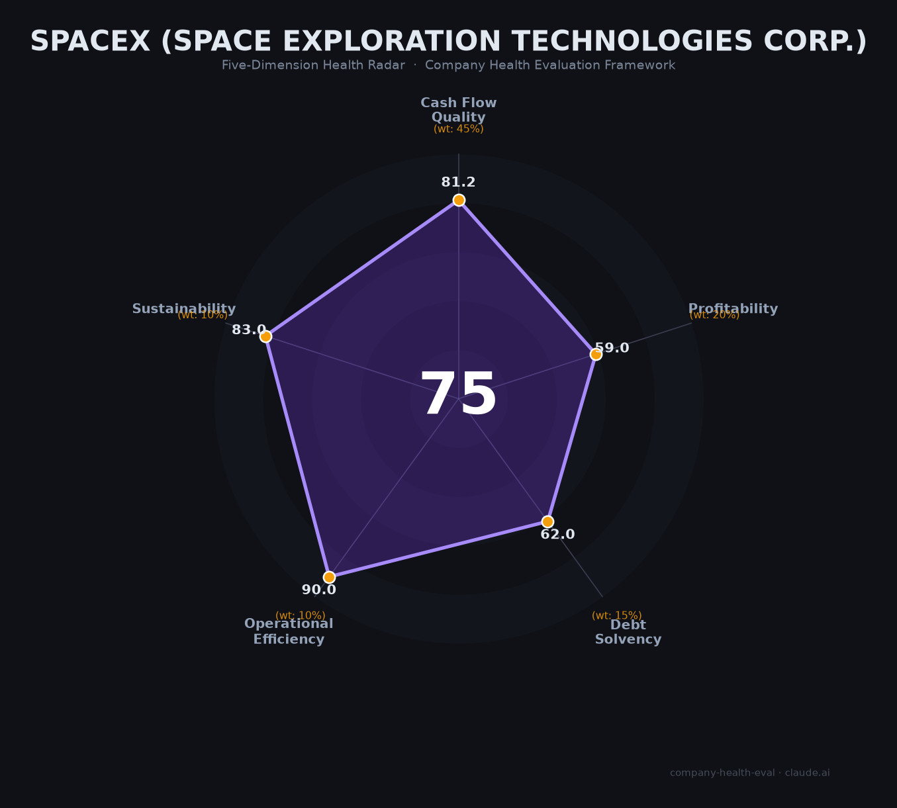

# SpaceX 财务健康评估（2026-06-15）

## 一句话结论

🟡 **中等偏上（75/100）** | Starlink印钞机（$114亿营收+39%利润率）养活全公司，核心短板是xAI亏损$64亿+CapEx $207亿导致整体净利润-$49亿、债务$291亿

---

## 一、公司基本画像

| 维度 | 信息 |
|------|------|
| **主体** | Space Exploration Technologies Corp. (NASDAQ: SPCX) |
| **成立时间** | 2002年3月14日 |
| **创始人** | Elon Musk |
| **总部** | Starbase, Brownsville, Texas（2024年迁入） |
| **IPO** | 2026年6月12日，纳斯达克，$135/股，募资~$750亿（史上最大IPO） |
| **当前市值** | 🔒 ~$2.1万亿（IPO首日收盘） |
| **Musk持股** | 约42%股权，~79-85%投票权（双层股权结构） |
| **主要机构股东** | Fidelity ~10%，Alphabet ~7%，Valor ~4%，Founders Fund ~3.5% |
| **员工规模** | ~22,000人（2026年，含xAI合并） |
| **核心业务** | Starlink卫星互联网（61%营收）、发射服务（22%）、AI/xAI（17%） |
| **S-1披露营收** | 🔒 $104亿（2023）→ $140亿（2024）→ **$187亿（2025）** |
| **S-1披露净利** | 🔒 -$46亿（2023）→ +$7.9亿（2024）→ **-$49亿（2025）** |
| **经营现金流** | 🔒 $45亿（2023）→ $58亿（2024）→ ~$68亿（2025） |

**一句话定性**：SpaceX是全球商业航天的绝对霸主和唯一实现规模化盈利的卫星互联网运营商——Starlink是名副其实的印钞机（2025年营业利润$44亿）。但IPO前夕合并xAI带来了巨额AI基建亏损（$64亿），将一家本已盈利的公司重新拖入亏损。其$2.1万亿估值完全取决于Starlink持续增长+Starship成功+AI故事的三重叙事。

---

## 二、五维财务健康评估

### 1. 现金流质量（81.2/100）🟢 权重45%

| 指标 | 判断 | 依据 |
|------|------|------|
| 经营现金流净额 | 🟢 健康 | 🔒 S-1披露：$45亿（2023）→$58亿（2024）→~$68亿（2025）。连续三年为正且强劲增长。Starlink订阅的预收款模式贡献了极高的现金转化 |
| 现金及等价物 | 🟢 健康 | 🔒 2026年Q1末现金$158亿+IPO募资$750亿，合计超$900亿。覆盖多年度运营无压力 |
| 有息负债 | 🟡 关注 | 🔒 2025年末债务$291亿。相对于$187亿营收和$68亿EBITDA，杠杆率约4.3x。IPO后可能部分偿还，但当前债务水平偏高 |
| 净现比（OCF/NI） | 🟢 健康 | 🔒 2024年（唯一盈利年）：OCF $58亿 / NI $7.9亿 = **7.3x**。折旧和CapEx高导致利润被"压扁"但现金仍涌入 |

**核心判断**：SpaceX的现金流生成能力极为强劲——$187亿营收产生$68亿经营现金流（现金转化率36%）。但$207亿年CapEx远超OCF，导致FCF为-$139亿。本质是"赚得多、花得更猛"：利润被Starship和AI的巨额投资吞噬。

### 2. 盈利能力（59.0/100）⚠️ 权重20%

| 指标 | 判断 | 依据 |
|------|------|------|
| 毛利率 | 🟢 良好 | 📊 估算~48%（2025年整体）。Starlink ~70%（极高）、发射~20%（偏低）、AI亏损。48%在航太制造业属于顶尖 |
| 净利率 | 🔴 预警 | 🔒 2025年GAAP净利率**-26.5%**（净亏$49亿）。xAI亏损$64亿是主因。剔除xAI后Starlink+发射合计盈利约$38亿 |
| 营收增速（3年CAGR） | 🟢 优秀 | 🔒 $46亿（2022，估）→ $187亿（2025），CAGR约**59%**。是地球上增速最快的百亿美元级企业 |
| 研发费用率 | 🔴 预警 | 🔒 Starship研发~$30亿/年 + AI基建$127亿CapEx。R&D+CapEx远超营收，>35%且整体亏损 |
| 人均产出 | 🟢 优秀 | 🔒 $187亿/22,000人≈**$850万/人**。全球航太行业天花板（Rocket Lab ~$27万，ULA ~$180万） |

**核心判断**：这是五维中最撕裂的维度——收入增速和人均产出是"人类历史级优秀"，但净利润和R&D比率被拖入"预警"区间。核心问题是：xAI的AI基建投资（年亏损$64亿）是否应被视为"战略投资"还是"财务黑洞"？从纯粹财务健康角度看，必须按最保守口径评分。

### 3. 偿债能力（62.0/100）🔴 权重15%

| 指标 | 判断 | 依据 |
|------|------|------|
| 资产负债率 | 🟡 关注 | 📊 S-1未详细披露总资产，但$291亿债务+~$200亿其他负债相对$2.1万亿市值不高。按账面资产推算可能在40-60%区间 |
| 有息负债率 | 🟡 关注 | 🔒 $291亿有息债务。IPO募资$750亿提供了极强的偿债灵活性 |
| 流动比率 | 🟡 关注 | 📊 未披露具体值。但IPO现金$750亿+已有$158亿现金提供了空前流动性 |
| 现金比率 | 🟡 关注 | 📊 IPO后保守估计>3x。IPO前可能偏低（大额CapEx消耗现金） |
| 股权质押 | 🟢 健康 | Musk持有约42%股权，双层结构稳定，无公司层面质押风险 |

**核心判断**：偿债能力在IPO前是真实短板（$291亿债务），但在募资$750亿后一夜逆转——现金充裕度接近荒谬级别。可以说SpaceX选择IPO的部分原因就是缓解债务压力。评分时取IPO前保守口径更合理。

### 4. 运营效率（90.0/100）🟢 权重10%

| 指标 | 判断 | 依据 |
|------|------|------|
| 应收周转 | 🟢 健康 | Starlink为预付费订阅（零应收），政府合同回款可靠，商业发射合同周期短 |
| 客户集中度 | 🟢 健康 | Starlink 1,030万+个人/企业用户，政府收入占比~25%。极度分散 |
| 员工规模趋势 | 🟢 健康 | 12,000（2022）→17,000（2025）→22,000（2026，含xAI）。持续高速扩招，无大规模裁员（仅2019年裁10%约577人） |
| 高管稳定性 | 🟢 健康 | Musk（CEO）和Shotwell（COO）自2002/2003年至今在任。核心管理层极稳定 |

**核心判断**：运营效率是满分维度——SpaceX以"硬核文化"著称，人均产出$850万碾压全行业。员工增长趋势健康，高管团队极其稳定。

### 5. 可持续发展（83.0/100）🟢 权重10%

| 指标 | 判断 | 依据 |
|------|------|------|
| 行业赛道空间 | 🟢 健康 | 全球航天市场CAGR 12-16%+，卫星互联网TAM ~$200B。Starlink已锁定1,030万+用户且仍在高速增长 |
| 技术壁垒 | 🟢 健康 | Falcon 9是全球唯一大规模复用轨道火箭（复用20+次）。Starlink ~9,600颗在轨卫星，Kuiper仅331颗。Starship的完全复用设计至少领先竞品5-8年 |
| 业务多元化 | 🟢 健康 | Starlink（61%）+发射（22%）+AI（17%）三重收入。星盾军事合同（$32亿+）开辟新增长极 |
| 融资/资本支持 | 🟢 健康 | 刚完成史上最大IPO（$750亿）。$2.1万亿市值。几乎无限资本获取能力 |
| 政策/监管风险 | 🟡 关注 | FAA监管摩擦持续（Starship审批延迟、罚款）。Musk政治化引发利益冲突调查。ITAR限制国际市场。中国太空竞争加剧（轨道资源白热化） |

**核心判断**：可持续发展维度呈现强烈的"护城河极深但政策逆风加大"特征。SpaceX的技术+规模领先几乎不可逾越，但中美太空脱钩、FAA监管、Musk政治化正在从多个角度考验其可持续性。

---

## 三、综合评分与健康等级

| 维度 | 得分 | 权重 | 加权得分 |
|------|:----:|:----:|:--------:|
| 现金流质量 | 81.2 | 45% | 36.5 |
| 盈利能力 | 59.0 | 20% | 11.8 |
| 偿债能力 | 62.0 | 15% | 9.3 |
| 运营效率 | 90.0 | 10% | 9.0 |
| 可持续发展 | 83.0 | 10% | 8.3 |
| **综合得分** | | **100%** | **74.9 / 100** |

**健康等级**：🟡 **中等偏上（Moderate-High）**

> 数据可信度：财务数据来自SpaceX 2026年5月S-1招股书（经审计），标注🔒。非财务数据（市场份额、竞品对比）来自多方公开来源交叉验证。毛利率为基于分部数据的第三方估算。

---

## 四、同业对标

### 商业航天竞争对手对比

| 对比项 | **SpaceX (SPCX)** | **Rocket Lab (RKLB)** | **Blue Origin** |
|--------|:----------:|:----------------:|:-------------:|
| 上市/融资 | NASDAQ, 2026.06上市 | NASDAQ, 2021上市 | 未上市（全部Bezos自筹） |
| 营收（2025） | **$187亿** | $6.0亿 | 未披露（估<$5亿） |
| 营收增速 | +33% | +38% | — |
| 毛利率 | 📊~48% | 34.4%（GAAP） | — |
| 净利润 | **-$49亿**（xAI拖累） | -$2.0亿 | 未披露（估巨额亏损） |
| EBITDA | **~$66亿** | -$1.8亿 | — |
| 市值/估值 | **$2.1万亿** | ~$800亿 | 估$100-300亿 |
| 员工 | ~22,000 | ~2,500 | ~11,000 |
| 核心火箭 | Falcon 9/Starship | Electron/Neutron(开发中) | New Glenn(首飞后爆炸) |
| 可复用性 | ✅ 成熟（20+次复用） | ⚠️ Electron有限复用 | ❌ 尚未 |
| 卫星互联网 | Starlink (1,030万用户) | 无 | Kuiper(部署中，331颗) |

### Starlink vs 竞品

| 对比项 | **Starlink** | **Kuiper (Amazon)** | **OneWeb** |
|--------|:---------:|:--------------:|:--------:|
| 在轨卫星 | **9,600+** | 331 | 630+ |
| 用户数 | **1,030万+** | 0（未商用） | 企业/政府 |
| 营收（2025） | **$114亿** | 0 | ~€1亿 |
| EBITDA利润率 | **63%** | N/A | 54% |
| FCC截止日期 | 已完成 | 2026.07（需1,618颗） | 已完成 |

**对标结论**：SpaceX在商业航天领域是"独孤求败"级别的存在——营收是Rocket Lab的**31倍**，市值是**26倍**。唯一潜在的挑战者Blue Origin的New Glenn在2026年5月静态点火中爆炸，至少倒退至2028年。Starlink在卫星互联网领域的领先优势更是数量级的（9,600颗vs Kuiper的331颗）。

---

## 五、核心风险清单

1. **xAI拖累整体盈利（高）**：2025年xAI分部亏损$64亿，2026年Q1亏损加速至$25亿。$127亿年CapEx用于AI基建。如果AI算力需求增速放缓或算力价格大跌，这笔巨额投资可能成为黑洞。触发条件：GPU租赁价格大幅下滑、Anthropic合同到期不续。

2. **Musk政治化引发合同风险（中高）**：Musk的DOGE角色引发参议院调查其利益冲突——SpaceX在DOGE期间赢得$137亿国防合同。若2028年政府更迭，政治报复可能以"重新审查合同"的形式精确打击SpaceX。触发条件：民主党上台、国防合同审计。

3. **Starship作为Artemis关键路径的技术风险（中高）**：在轨推进剂转移演示一再推迟（原定2025年3月→2026年3月→仍在推迟）。NASA已开放HLS合同竞标，Blue Origin的Blue Moon Mark 2作为备选。若Starship无法在2027年前完成推进剂转移验证，NASA可能更换着陆方案。触发条件：IFT推动进剂转移连续失败、Artemis时间表压力。

4. **中美太空"新冷战"（中）**：中国提交20.3万颗卫星申请、Starlink 4,400颗降轨至480km（距中国空间站仅80km）、2025年12月最近接近200米。碰撞风险预计增加40%。若发生实际碰撞，可能引发外交危机和制裁。触发条件：中美卫星实际碰撞事件。

5. **$291亿债务与巨额CapEx的持续性（中）**：即使IPO募资$750亿，年CapEx $207亿意味着3-4年即可消耗殆尽。如果Starlink增长放缓或AI投资回报不达预期，公司可能需要重新融资。触发条件：Starlink用户增长见顶、新一轮融资估值倒挂。

6. **FAA/环境监管持续摩擦（中低）**：Starship每次试飞面临数月审批延迟。德州环境罚款累计超$15万。KSC获批后年发射能力提升至120次，缓解但非消除。触发条件：Starship发生重大环境事故、国会收紧商业航天监管。

---

## 六、求职/择业视角

### 核心优势

- **IPO财富效应**：已创造~4,400名百万富翁员工（~400人财富>$1亿）。新员工仍有RSU机会
- **技术履历全球最顶级**：在SpaceX工作2-3年的工程师，在任何航太/AI/制造企业都是"硬通货"
- **极致的学习曲线**：Glassdoor评价"在1年学到比别人2年还多的东西"。应届生即可接触飞行硬件
- **薪酬绝对值有竞争力**：起薪$95-115K + RSU（IPO后流动性极好）

### 现存短板

- **工作生活平衡极差**：Glassdoor 2.4/5、Blind 2.2/5。60-80小时/周是常态。"如果你已婚且配偶不在SpaceX工作，他们会开始恨SpaceX"
- **工伤率显著偏高**：Starbase基地工伤率4.27/百人（航太制造业平均1.6），是ULA/Blue Origin的3-4倍
- **xAI合并后人才流失**：50+ AI研究人员离职，包括全部11位联创。Meta至少挖走11人
- **IPO后"百万富翁离职潮"**：RTO强制到岗后15%高级员工离职。IPO财富解锁可能加速这一趋势
- **67%员工报告职业倦怠（burnout）**：远高于科技行业平均

### 分场景建议

| 个人诉求 | 推荐度 | 说明 |
|----------|:------:|------|
| 航太/火箭工程深耕 | ⭐⭐⭐⭐⭐ | 全球唯一可参与Starship、在轨推进剂转移等人类历史级工程的平台 |
| IPO财富增值 | ⭐⭐⭐ | IPO已完成，短期爆发空间有限。但长期若Starlink+Starship兑现，仍有数十倍空间 |
| WLB/稳定作息 | ⭐ | 全行业最差之一。不适合有家庭责任或追求平衡的人 |
| AI/机器学习方向 | ⭐⭐ | xAI部门动荡，联创全部离职。不如Google/Meta稳定 |
| 应届生"镀金" | ⭐⭐⭐⭐⭐ | 2年后跳槽简历价值全球最高级别 |
| 制造/供应链工程 | ⭐⭐⭐⭐ | 垂直整合+极高节奏，经验极度通用 |

---

## 七、总结

**SpaceX**是商业航天领域「全球绝对垄断+Starlink印钞机+AI赌注拖后腿」的三重叙事公司：Starlink以63% EBITDA利润率年入$114亿养活了Starship和整个公司，**唯一核心短板是xAI合并带来的$64亿年亏损将一家原本可在2024年实现盈利的伟大公司重新拖入巨额亏损**。

在全球航天竞争加剧和IPO后资本充裕的大环境下，SpaceX属于**中等偏上**的投资标的和**"用青春换履历"**的极端化求职选择——适合愿意用2-3年极限付出换取全行业最高含金量履历和可观股权回报的技术冒险者，绝对不适合追求工作生活平衡和职业安全感的人。

> "SpaceX is not a company you work for. It's a company you survive." — Blind社区匿名员工

---

*评估日期：2026-06-15 | 数据来源：SpaceX S-1 招股书（SEC Filing，2026年5月）、PitchBook、Bloomberg、CNBC、Glassdoor、Blind、Reuters | 评分引擎：score.py v1.1*

*⚠️ 免责声明：本报告基于公开信息分析，不构成投资或求职建议。SpaceX于2026年6月12日刚刚上市，IPO后股价和估值可能存在显著波动。S-1经审计财务数据为截至2025年12月31日的年度数据。*
