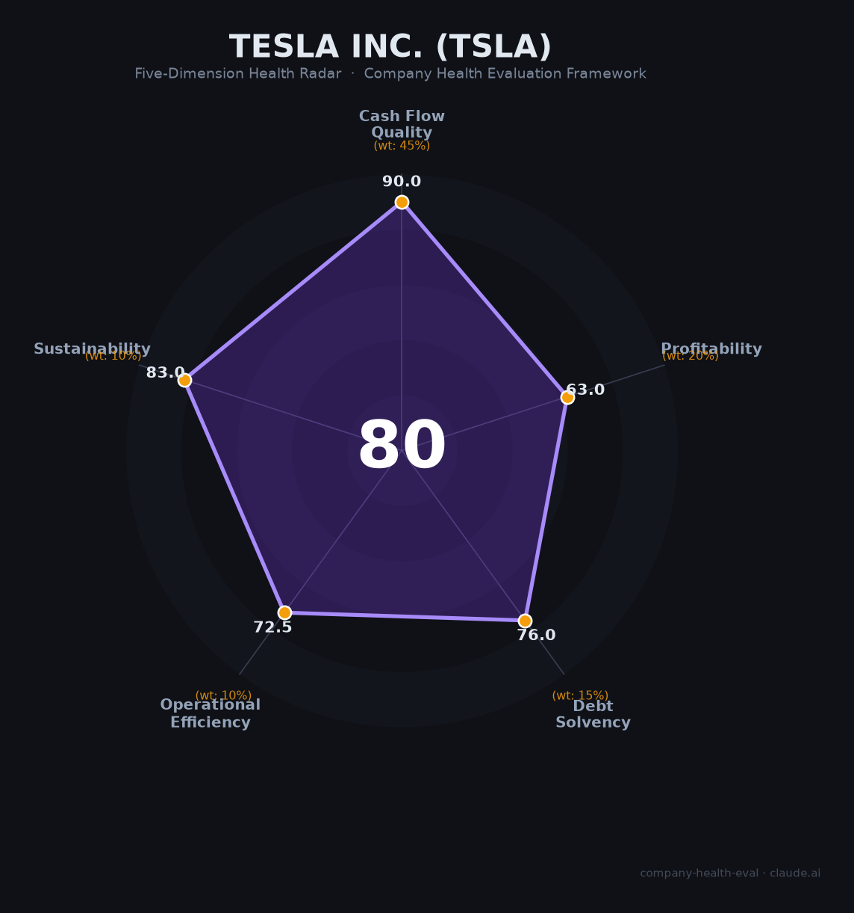

# 特斯拉 (Tesla) 财务健康评估（2026-06-15）

## 一句话结论

🟡 **中等偏上（80/100）** | $441亿现金+净现比3.89x堪称财务堡垒，核心短板是交付量连降两年、净利润腰斩、Musk政治化引发全球品牌危机

---

## 一、公司基本画像

| 维度 | 信息 |
|------|------|
| **主体** | Tesla, Inc. (NASDAQ: TSLA) |
| **成立时间** | 2003年7月（Martin Eberhard & Marc Tarpenning创立） |
| **Elon Musk加入** | 2004年2月（领投A轮$750万），2008年起任CEO |
| **上市** | 2010年6月29日，NASDAQ，IPO价$17/股 |
| **当前市值** | ~1.54万亿美元（2026年6月），全球第9大公司 |
| **历史峰值市值** | ~1.66万亿美元（2026年5月） |
| **Musk持股** | ~20.3%（SEC 2026年4月13G/A） |
| **最大机构股东** | Vanguard ~6.6%，BlackRock ~5.5% |
| **员工规模** | 🔒 134,785人（FY2025年末） |
| **主营业务** | 纯电动车（73%营收）、能源存储（13.5%）、服务及其他（13.2%） |
| **核心产品** | Model 3/Y（占交付量96%+）、Cybertruck、Megapack、Powerwall、FSD |
| **工厂布局** | Fremont（加州）、Giga Texas、Giga Shanghai、Giga Berlin、上海储能工厂 |

**一句话定性**：特斯拉是全球纯电动车先驱和能源创新公司，拥有汽车行业最强的资产负债表（$441亿现金+投资），但正处于"青黄不接"期——老车型交付下滑、新增长点（FSD/Optimus/Robotaxi）未兑现，Musk政治化加速了欧美消费者出走。

---

## 二、五维财务健康评估

### 1. 现金流质量（90.0/100）🟢 权重45%

| 指标 | 判断 | 依据 |
|------|------|------|
| 经营现金流净额 | 🟢 健康 | 🔒 FY2023-2025连续三年为正：$132.6亿→$149.2亿→$147.5亿。即使在交付下滑期现金流仍极其稳健 |
| 现金及等价物 | 🟢 健康 | 🔒 2025年末现金$165亿+短期投资$276亿=合计**$441亿**。即使月消耗$10亿也覆盖3年+ |
| 有息负债 | 🟢 健康 | 🔒 总债务~$136亿（FY2024），债务/总资产仅11.2%，**净现金头寸约$300亿** |
| 净现比（OCF/NI） | 🟢 健康 | 🔒 FY2025 OCF $147.5亿 / NI $37.9亿 = **3.89x**；FY2024为2.10x。利润含金量极高——折旧和非现金费用是利润的近4倍 |

**核心判断**：特斯拉的现金流质量在所有大型车企中独树一帜。$441亿现金储备+净现金$300亿+净现比3.89x——这不是一家汽车公司的典型财务画像，而是接近科技平台的现金特征。即使汽车业务利润腰斩，经营现金流仅微降1%，说明折旧和递延收入正在释放大量现金。

### 2. 盈利能力（63.0/100）⚠️ 权重20%

| 指标 | 判断 | 依据 |
|------|------|------|
| 毛利率 | 🟠 一般 | 🔒 FY2025汽车毛利率（含碳积分）~17%，不含碳积分15-16%。行业平均：丰田~20%，比亚迪~20.5%，理想~17.9%。18%处于行业中游偏下 |
| 净利率 | 🟠 一般 | 🔒 FY2025 GAAP净利率4.0%（$37.9亿/$948亿）。在0-5%的一般区间。且净利润中碳积分贡献约$15-20亿，占比超50% |
| 营收增速（3年CAGR） | 🟠 一般 | 🔒 FY2022 $815亿→FY2025 $948亿，3年CAGR约**5.2%**。FY2025年营收-3%首次下滑 |
| 研发费用率 | 🟢 良好 | 🔒 FY2025 R&D $64.1亿/营收$948亿=**6.8%**，在5-10%的良好区间。投入方向：FSD、Optimus、4680电池 |
| 人均产出 | 🟢 优秀 | 🔒 $948亿/134,785人=**$70.3万/人**。远超传统车企（丰田~$40万，大众~$35万），处于行业最前列 |

**核心判断**：特斯拉的盈利能力正在经历"成长的代价"——降价保份额导致毛利率从2021年峰值~30%下滑至当前的17-18%，净利润两年内从$150亿腰斩至$38亿。碳积分收入占比超过50%的结构性依赖值得警惕（若竞争对手提高电动车比例、积分需求下降，这块"免费收入"可能萎缩）。

### 3. 偿债能力（76.0/100）🟡 权重15%

| 指标 | 判断 | 依据 |
|------|------|------|
| 资产负债率 | 🟢 健康 | 🔒 FY2025为39.9%，刚好在40%健康线之下。远优于传统车企（福特~84%，通用~75%） |
| 有息负债率 | 🟢 健康 | 🔒 总债务$136亿/总资产$1,378亿=9.9%，低于20% |
| 流动比率 | 🟡 关注 | 流动性资产/流动负债约1.5-1.8。低于2.0标准，但$441亿流动性提供了极强的缓冲 |
| 现金比率 | 🟡 关注 | 纯现金$165亿/流动负债~$280亿≈0.59。包含短投则1.57。保守口径略低于1.0 |
| 股权质押 | 🟢 健康 | Musk持有约20.3%，不存在公司层面的股权质押风险。Musk个人质押需另案看待 |

**核心判断**：偿债能力从传统评分看并非满分（流动比率和现金比率偏低），但对特斯拉而言是"伪短板"——$441亿现金储备+每年$145亿+经营现金流意味着它随时可以清偿所有有息债务且仍有大量剩余。39.9%的资产负债率在汽车行业中属于极优水平。

### 4. 运营效率（72.5/100）⚠️ 权重10%

| 指标 | 判断 | 依据 |
|------|------|------|
| 应收周转 | 🟢 健康 | 🔒 净现比3.89x说明现金回收效率极高。新能源车直销模式+DTC无经销商垫资 |
| 客户集中度 | 🟢 健康 | B2C直销模式，数百万个人消费者，前5大客户<1% |
| 员工规模趋势 | 🟡 关注 | 2023年140,473人(峰值)→2024年大规模裁员14%至125,665人→2025年回升至134,785人。裁员虽以效率为导向，但反映了增长不及管理层预期的现实 |
| 高管稳定性 | 🟡 关注 | 2024-2025年多名核心高管离职：动力总成VP Drew Baglino（18年老将）、政策VP、Cybertruck/Model 3/Y/S/X项目负责人先后离开。Musk本人精力分散于X/DOGE/SpaceX |

**核心判断**：特斯拉正在经历高管团队的大换血。Musk的"硬核工作文化"既是特斯拉成功的秘诀，也是高管流失的推手。2024年14%裁员虽已恢复，但这一剧烈波动在求职视角中是重要警示信号。

### 5. 可持续发展（83.0/100）🟢 权重10%

| 指标 | 判断 | 依据 |
|------|------|------|
| 行业赛道空间 | 🟢 健康 | 全球EV市场CAGR 25%+至2030年，储能市场增速更快。即使EV增速放缓，特斯拉在AI/机器人领域布局打开了更大的TAM |
| 技术壁垒 | 🟢 健康 | FSD全栈自研（纯视觉端到端）、Dojo超算、4680电池、一体压铸、Optimus机器人。全球超充网络是无可替代的护城河。即使产品老化，技术壁垒3-5年内难以完全突破 |
| 业务多元化 | 🟢 健康 | 汽车73%+能源13.5%+服务13.2%，后两者两年翻倍。非汽车板块从FY2023的15%升至27%，结构趋于多元 |
| 融资/资本支持 | 🟢 健康 | $1.54万亿市值、$441亿现金、全球第9大公司。几乎可以零成本融资。标普/穆迪投资级评级 |
| 政策/监管风险 | 🟡 关注 | 混合信号：IRA电动车抵免取消（负面）、EPA排放标准撤销（降低行业竞争力压力，但削弱特斯拉的EV先发优势）、特朗普关税重创储能业务、EU对华关税影响上海出口、NHTSA调查FSD（320万辆）、全球消费者抵制"Tesla Takedown" |

**核心判断**：特斯拉的可持续发展是五维中最具两面性的——技术壁垒和资本支持极强，但政策环境从"顺风"转为"逆风"。所有未来增长预期都建立在FSD和Optimus成功的基础上，而这两个赌注的时间表和商业化路径仍高度不确定。

---

## 三、综合评分与健康等级

| 维度 | 得分 | 权重 | 加权得分 |
|------|:----:|:----:|:--------:|
| 现金流质量 | 90.0 | 45% | 40.5 |
| 盈利能力 | 63.0 | 20% | 12.6 |
| 偿债能力 | 76.0 | 15% | 11.4 |
| 运营效率 | 72.5 | 10% | 7.2 |
| 可持续发展 | 83.0 | 10% | 8.3 |
| **综合得分** | | **100%** | **80.0 / 100** |

**健康等级**：🟡 **中等偏上（Moderate-High）**

> 数据可信度：所有财务数据来自SEC 10-K（经审计），标注🔒。交付量和业务数据来自Tesla Quarterly Updates。部分竞品数据来自公开年报和行业研报。

---

## 四、同业对标

### 全球电动车企业对比

| 对比项 | **特斯拉** | **比亚迪 (BYD)** | **理想汽车 (Li Auto)** | **Rivian** |
|--------|:----------:|:-------------:|:------------------:|:--------:|
| 上市状态 | NASDAQ | 002594.SZ/1211.HK | 2015.HK/LI | NASDAQ |
| 2025年交付量 | 164万辆 (-8.6%) | **460万辆 (+7.7%)** | 40.6万辆 (-18.8%) | 4.2万辆 (-18.1%) |
| 其中BEV | 164万辆 | **226万辆** (超特斯拉) | 40.6万辆 | 4.2万辆 |
| 2025年营收 | **$948亿 (-3%)** | ~¥8,040亿 (~$1,120亿) | ¥1,123亿 (~$161亿) | $53.9亿 (+8.4%) |
| 毛利率 | 18.0% | 17.7% | 18.7% | 2.7% (首度转正) |
| 净利率 | 4.0% | 4.1% | 1.0% | 持续亏损 |
| 现金储备 | **$441亿** | 未披露 | ¥1,012亿 (~$147亿) | $60.8亿 |
| 员工规模 | 13.5万 | ~70万 | ~2.5万 | ~8,000 |
| 市值/估值 | **$1.54万亿** | ~¥7,500亿 (~$1,100亿) | ~$160亿 | ~$120亿 |
| 核心差异 | AI+能源叙事支撑高估值 | 规模第一+全球化加速 | 增程路线+纯电转型中 | VW合资输血+R2待验证 |

**对标结论**：特斯拉在市值和现金储备上碾压所有竞品（市值=比亚迪x14），但交付量已被比亚迪纯电超越。当前的估值完全基于"特斯拉不是汽车公司，而是AI/机器人公司"的叙事——如果这个叙事失效，估值将面临大幅重估。

---

## 五、核心风险清单

1. **Musk政治化导致品牌不可逆损伤（高）**：DOGE失败、与特朗普公开决裂、"Tesla Takedown"全球250+城市抗议、欧洲销量暴跌28%、60%欧洲潜在买家因Musk拒绝特斯拉。品牌声誉从Axios-Harris第63名暴跌至第95名。这是传统财务模型无法量化的风险。触发条件：Musk继续政治活动、新争议事件。

2. **产品线老化与竞争蚕食（高）**：Model 3/Y（占交付96%+）分别发布于2017/2019年，在20-30万价格带被中国新势力（小米SU7/智界R7/极氪007）充分对标甚至超越。全新低价平台（传说中的"Model 2"）迟迟未发布。2025年中国份额从6.0%降至4.9%，欧洲从16%降至9%。触发条件：竞争对手再推现象级新品、新平台跳票至2027年后。

3. **净利润高度依赖碳积分出售（中高）**：FY2025碳积分收入约$15-20亿，占GAAP净利润$37.9亿的超50%。随着传统车企提高电动车比例和EPA标准撤销，碳积分需求可能萎缩。触发条件：主要买家（如Stellantis、丰田）电动车达标、EPA不恢复排放标准。

4. **FSD商业化远不及预期（中高）**：NHTSA已将320万辆FSD调查升级至"工程分析"阶段（召回前最后一步），已确认1起致命事故+2起受伤事故。Cybercab量产时间表不明。FSD全球仅~130万付费用户。触发条件：NHTSA下令大规模召回、致命事故增加、Cybercab延迟至2028年后。

5. **特朗普关税对储能业务的冲击（中）**：中国产锂电池关税已升至约54%，储能电池关税132.4%。2025年Q3特斯拉仅电池关税就承担约$2亿。储能是唯一高增长业务（+27%），关税直接打击其成本和竞争力。触发条件：关税进一步升级、CATL供应中断。

6. **高管持续流失（中低）**：2024-2025年核心产品线负责人几乎全部轮换。Musk精力被X/SpaceX/DOGE严重分散。触发条件：CFO或核心AI负责人离职。

---

## 六、求职/择业视角

### 核心优势

- **简历含金量极高**：特斯拉经历在工程和制造领域全球认可。"Do it for the resume"是Blind上的经典评价
- **技术前沿性**：FSD、Optimus、Dojo超算、4680电池——几乎涵盖了AI/机器人/新能源所有前沿方向
- **快速成长机会**：扁平化组织+硬核文化，有能力的年轻人可以快速承担大项目
- **财富潜力**：如果FSD/Optimus成功，股价有较大上升空间（RSU价值）

### 现存短板

- **薪酬低于科技巨头**：高级工程师总包$263K vs Meta $445K、Google $304-450K。马斯克明确反对远程工作
- **工作生活平衡极差**：Glassdoor工作生活平衡评分2.8/5，Blind评分2.4/5（全公司最低分项）。"无限假期就是谎言"
- **裁员文化**：2024年裁14%（约20,000人），整个Supercharger部门被一刀切。员工形容"高压锅文化"
- **马斯克个人风格**：内部"恐惧管理"风格。2025年政治化后，部分员工对与特斯拉关联感到尴尬
- **种族/性骚扰诉讼**：EEOC联邦诉讼待决，约6,000名黑人员工集体诉讼进行中

### 分场景建议

| 个人诉求 | 推荐度 | 说明 |
|----------|:------:|------|
| AI/自动驾驶方向技术积累 | ⭐⭐⭐⭐⭐ | FSD+Optimus+Dojo 无可替代的实战平台 |
| 稳定+长期发展 | ⭐⭐ | 裁员不可预测，高管流失严重 |
| 高薪+WLB平衡 | ⭐⭐ | 薪酬低于FAANG，工作强度高于FAANG |
| 制造业/硬件工程方向 | ⭐⭐⭐⭐ | Giga工厂+一体压铸+4680，硬核制造经验 |
| 应届生镀金 | ⭐⭐⭐⭐ | 2-3年后跳槽，简历价值极高 |
| 能源/储能方向 | ⭐⭐⭐ | Megapack/Powerwall业务增长快，但受关税冲击 |

---

## 七、总结

**特斯拉**是全球电动车和能源领域「财务堡垒级的现金牛+高风险的叙事驱动型」公司：$441亿现金储备+净现比3.89x是汽车行业天花板级别的财务安全垫，**唯一核心短板是交付量连降两年+净利润腰斩+品牌声誉急剧恶化三重叠加下，P/E 376倍的估值完全依赖于FSD/Optimus的未来兑现**。

在全球EV竞争白热化和Musk政治化的大环境下，特斯拉属于**中等偏上**的投资标的和**高风险高回报**的求职选择——适合愿意用工作强度换取顶尖技术履历、相信FSD/Optimus长期叙事的冒险者，不适合追求安稳和WLB的工程师。

> "Do it for the resume." — Tesla Blind社区最高赞评价

---

*评估日期：2026-06-15 | 数据来源：Tesla 10-K (FY2024/FY2025)、SEC Filing、Tesla IR、IDC、J.D. Power、Glassdoor、Blind、Reuters | 评分引擎：score.py v1.1*

*⚠️ 免责声明：本报告基于公开信息分析，不构成投资或求职建议。特斯拉股价和估值高度依赖对FSD/Optimus/Robotaxi的未来预期，存在显著不确定性。*
