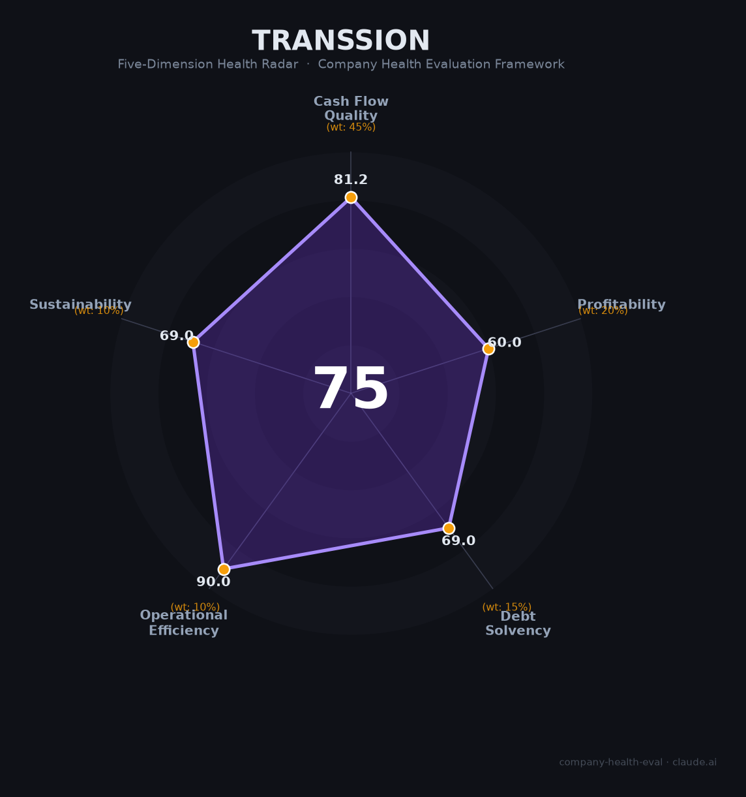

# 传音控股 财务健康评估（2026-06-17）

## 一句话结论

🟡 **中等偏上（74.8/100）** | 非洲手机之王利润腰斩后强势修复，Q1 2026净利+43%，核心短板：汇率裸奔+专利围剿+存储涨价三重暴击

---

## 一、公司基本画像

| 维度 | 内容 |
|------|------|
| **运营主体** | 深圳传音控股股份有限公司（688036.SH），2013年注册，前身可追溯至2006年竺兆江在香港创立传音品牌 |
| **创始人/掌门人** | 竺兆江（1973年出生，前波导海外销售总监，2006年创立传音，身家约¥125-155亿），持股约56%（直接+间接） |
| **股权结构** | 传音投资（控股平台）~46.7% + 竺兆江个人~9.7% + 员工持股平台~6.3% + 机构/公众~37%。股权质押仅0.07%，极低 |
| **主营业务** | 🔒 手机（Tecno中高端/Infinix年轻化/itel大众化）+ oraimo数码配件 + Syinix家电 + Boomplay移动互联网 + Carlcare售后 |
| **上市状态** | 🔒 2019年科创板IPO（¥35.15/股，募资¥28.12亿），上市后无再融资但累计分红¥137亿；正推进港股二次上市（2026Q2目标） |
| **市场地位** | 非洲智能手机市占率48%（#1，但较2024年51%下滑），巴基斯坦>40%（#1），孟加拉35%（#1）；全球手机出货量#3（12.3%） |
| **员工规模** | 🔒 24,025人（2025年报），研发5,037人（21%），3个研发中心+5个制造基地，海外工厂本地员工>95% |

**定性**：传音控股是"A股最懂非洲的公司"——凭借深度本地化（深肤色拍照、多卡多待、超长续航）和毛细血管级渠道覆盖，在非洲手机市场占据近半壁江山。但FY2025遭遇存储涨价+非洲货币贬值+竞争加剧三重暴击，利润腰斩至¥25.8亿。Q1 2026已强势修复（净利+43%），正推进港股二次上市。

---

## 二、五维财务健康评估

> 数据来源：传音控股2025年年报（2026.3.28披露）、2026年一季报（2026.4.27披露）。🔒 表示经审计数据。

### 1. 现金流质量（81.2/100）

**OCF虽腰斩但仍为正，现金池充裕但净现比偏弱。**

| 指标 | 状态 | 数据支撑 |
|------|------|---------|
| 经营现金流 | 🟢 健康 | 🔒 FY2024 OCF ¥28.48亿 → FY2025 OCF ¥14.20亿（腰斩-50%），但自上市以来持续为正。Q1 2026利润修复预示OCF将同步改善 |
| 现金跑道 | 🟢 健康 | 🔒 现金¥111.23亿。公司OCF正流入+年分红约¥30亿+港股IPO拟募$5-10亿，流动性充裕 |
| 有息负债 | 🟢 健康 | 🔒 财务费用仅¥1.33亿（且主要为汇兑损失非利息支出），有息负债规模极小 |
| 净现比 | 🟠 关注 | 🔒 OCF ¥14.20亿 / NI ¥25.81亿 = 0.55。低于1.0，主要受存货增加和应收增长拖累。FY2024为0.51，趋势较稳定 |

🔒 来源：传音控股2025年年报、东方财富现金流量表

### 2. 盈利能力（60.0/100）

**存储涨价重创毛利率，但Q1 2026已强势修复。**

| 指标 | 状态 | 数据支撑 |
|------|------|---------|
| 毛利率 | 🟡 一般 | 🔒 FY2025 19.15%（历史新低，-2.13pp），Q1 2026修复至22.00%。智能手机OEM行业平均15-25%，传音处于中位 |
| 净利率 | 🟡 一般 | 🔒 FY2025 3.97%（-4.18pp），Q1 2026修复至4.58%。在0-5%区间内 |
| 营收增速 | 🟡 良好 | 🔒 FY2022-FY2025 CAGR约12%。FY2025 -4.55%（存储涨价+竞争双重压制），但Q1 2026 +24.58%强势反弹 |
| 研发费用率 | 🟡 一般 | 🔒 ¥29.50亿，占营收4.50%。远低于小米（7.2%）和华为（20%+），且低于科技公司5%的最低门槛 |
| 人均产出 | 🟡 良好 | 📊 ¥655.91亿 / 24,025人 = ¥273万/人。优于大多数低ASP手机OEM，但远低于小米（¥1,088万/人） |

🔒 来源：传音控股2025年年报。券商一致预测FY2026归母净利润均值¥31.24亿（+21%），EPS ¥2.71。

### 3. 偿债能力（69.0/100）

**资产负债率偏高（53%），但无有息负债压力，股权质押极低。**

| 指标 | 状态 | 数据支撑 |
|------|------|---------|
| 资产负债率 | 🟠 关注 | 🔒 53.48%（总负债¥237亿 / 总资产¥444亿），处于40-70%区间。制造业偏高但可控 |
| 有息负债率 | 🟢 健康 | 🔒 财务费用仅¥1.33亿（且主要为汇兑损失）。有息负债水平极低 |
| 流动比率 | 🟠 关注 | 📊 估1.1-1.2。流动资产（现金¥111亿+存货¥89亿+应收¥37亿）/ 流动负债（大部分为应付账款）。制造业典型水平 |
| 现金比率 | 🟠 关注 | 📊 现金¥111亿 / 流动负债估~¥200亿 ≈ 0.56。在0.5-1区间 |
| 股权质押 | 🟢 健康 | 🔒 仅82.66万股（0.07%），前十大股东0质押。无爆仓风险 |

🔒 来源：传音控股2025年年报、东方财富资产负债表

### 4. 运营效率（90.0/100）

**传音在运营上表现出色——这是在非洲等复杂市场长期深耕的结果。**

| 指标 | 状态 | 数据支撑 |
|------|------|---------|
| 应收周转 | 🟢 健康 | 🔒 应收¥37.26亿 / 营收¥655.91亿 = 5.68%。周转天数约21天。对手机分销行业而言极为健康 |
| 客户集中度 | 🟢 健康 | 🔒 通过经销商+零售渠道覆盖70+国家，终端消费者数以亿计。无单一客户依赖 |
| 员工规模趋势 | 🟢 健康 | 🔒 16,232(2022)→17,327(2023)→~19,870(2024)→24,025(2025)，连续增长，2025年逆势扩招+21% |
| 高管稳定性 | 🟢 健康 | 🔒 "波导系"核心团队自2006年创业以来高度稳定，竺兆江身兼董事长+总经理。仅需关注2026年10月董事会换届 |

🔒 来源：传音控股年报、证券之星

### 5. 可持续发展（69.0/100）

**渠道壁垒深厚，但手机赛道本身增速放缓+非洲竞争升温+专利弹药不足。**

| 指标 | 状态 | 数据支撑 |
|------|------|---------|
| 行业赛道 | 🟠 关注 | 🌐 全球智能手机CAGR仅~2.3%（成熟期）。非洲智能手机增速略高（~7-13%），但整体低于15%的健康线 |
| 技术壁垒 | 🟢 健康 | 🔒 非洲70+国渠道网络+深肤色AI影像+多卡多待硬件适配+5个自有工厂+品牌认知度（三大品牌均入选非洲百强）——<3年难以整体复制 |
| 业务多元化 | 🟠 关注 | 🔒 手机收入占比89%（高度集中）。IoT+配件占比9.3%，互联网仅1.4%。生态变现远未成熟 |
| 资本支持 | 🟢 健康 | 🔒 科创板上市+港股二次上市推进中（拟募$5-10亿）+累计分红¥137亿+银行授信充裕 |
| 政策风险 | 🟠 关注 | 🌐 非洲关税壁垒上升（埃及38.5%进口税）+尼日利亚SIM注册影响+全球专利围剿（高通/华为/爱立信/InterDigital）+非洲本地货币贬值 |

🔒 来源：IDC/Canalys、传音年报、Counterpoint

---

## 三、综合评分与健康等级

| 维度 | 得分 | 权重 | 加权得分 |
|------|:----:|:----:|:--------:|
| 现金流质量 | 81.2 | 45% | 36.5 |
| 盈利能力 | 60.0 | 20% | 12.0 |
| 偿债能力 | 69.0 | 15% | 10.3 |
| 运营效率 | 90.0 | 10% | 9.0 |
| 可持续发展 | 69.0 | 10% | 6.9 |
| **综合得分** | | | **74.8 / 100** |
| **健康等级** | | | **🟡 中等偏上** |

**解读**：传音呈现出"运营优秀但财务平庸"的典型特征。在运营效率（90分）上表现卓越——应收健康、客户分散、团队稳定、员工持续扩张——这是长期深耕复杂市场的核心竞争力。但在盈利能力（60分）和偿债能力（69分）上表现平平，FY2025更遭遇存储涨价+汇率贬值+竞争加剧三重暴击导致利润腰斩。Q1 2026的强势修复（营收+25%，净利+43%，毛利率从19%→22%）是积极信号，证明公司的"非洲基本盘"韧性仍在。但研发投入偏低（4.5%）、专利储备薄弱（仅1,201件发明专利）、以及非洲手机市场增速放缓是中长期隐忧。

---

## 四、同业对标

| 对比项 | 传音控股 | 小米集团 | 苹果 | OPPO/vivo |
|--------|:---:|:---:|:---:|:---:|
| 上市/融资 | 🔒 688036.SH + 港股推进中 | 🔒 1810.HK | 🔒 AAPL | 未上市 |
| 营收规模（2025） | ¥656亿 | ¥3,659亿 | $4,161亿 | 估$250-350亿 |
| 毛利率 | **19.2%** | 22.3% | 46.9% | 估15-20% |
| 净利率 | **3.97%** | 9.1% | 26.9% | 估5-8% |
| 研发费用率 | **4.5%** | 7.2% | 8.3% | 估5-8% |
| 手机出货量（全球） | 1.69亿部（#3） | ~1.7亿部 | 2.25亿部 | 各~1亿部 |
| 非洲市场份额 | **48%（#1）** | 13%（#3） | 极小 | 4%（#5） |
| 员工规模 | 24,025 | 33,627 | ~16.4万 | 各~4-5万 |
| 核心差异 | 非洲深度渠道+低价模式 | 全球全品类IoT生态+互联网变现 | 极致高端品牌溢价+服务生态 | 线下渠道+中高端品牌 |

**对标结论**：传音是"缩小版小米"——同样走硬件引流+生态变现路线，但受困于非洲用户低ARPU（¥3/年 vs 小米¥48/年），互联网变现远未跑通。毛利率20% vs 小米22%的差距看似不大，但小米已有IoT+互联网贡献可观利润，而传音仍高度依赖手机硬件。传音的优势在于非洲渠道壁垒极深、竞争对手短期无法复制。

---

## 五、核心风险清单

1. **供应链风险——存储芯片涨价（高）**：存储占手机BOM从22%飙至34%，DRAM涨幅超600%。每部手机存储成本估算增加$16。这是当前最直接的利润杀手。传音正加大国产存储（长鑫DRAM 60%+长江NAND 30%）采购对冲，但国产存储产能和良率存在天花板。

2. **外汇风险——非洲货币贬值（高）**：2024年汇兑损失约¥8.2亿（奈拉跌35%+比尔跌28%），2025年财务费用由负转正（-¥1.07亿→+¥1.33亿）。公司直到2025年11月才建立衍生品套保制度，此前长期"裸奔"。非洲多国货币不可自由兑换，套保工具有限。

3. **专利风险——多方围剿（高）**：高通（已和解，专利费估2.75-3%营收≈¥18-20亿/年）、华为（HEVC专利，已和解）、爱立信（多国诉讼进行中）、InterDigital（多国诉讼进行中）、LG电子（2025年11月印度起诉）。传音仅1,201件发明专利（华为的0.8%），专利储备极度薄弱。

4. **竞争加剧——小米+荣耀猛攻非洲（中高）**：传音非洲份额从51%→48%→47%缓慢下滑。小米两年内从7%→14%（+100%），荣耀从2%→7%（+250%）。虽然传音凭借超低端和渠道优势暂时守住基本盘，但市场份额被侵蚀的趋势已经确立。

5. **港股二次上市不确定性（中）**：证监会2026年4月提出5方面补充问询（外资准入、外汇登记、互联网资质、未决诉讼、控股股东关联）。虽然属常规流程，但若审核延迟或募资不达预期的$5-10亿，将影响研发投入和业务拓展。

6. **控股股东减持（中）**：传音投资2024-2025年累计减持套现约¥28.79亿（均价¥125.55→¥81.81），接盘机构浮亏超30%。控股股东的减持行为在利润腰斩时期进一步挫伤市场信心。

---

## 六、求职/择业视角

### 核心优势

- **行业地位稳固**："非洲手机之王"不是虚名——在70+个国家的渠道网络、三大品牌矩阵、5个自有工厂形成的竞争壁垒短期不可撼动。即使利润承压，公司不会轻易倒下。
- **出海经验价值极高**：在传音积累的"中国制造+新兴市场本地化"经验，在当前中国企业集体出海的浪潮中极度稀缺且高度通用
- **无裁员记录**：即使在FY2025利润腰斩的情况下，公司依然扩招21%（从~2万到2.4万人），稳定性好于大部分科技公司
- **薪酬在行业内中等偏上**：校招"海东青计划"硕士可达36-43万/年、社招资深岗45-75K×18薪，在深圳/上海有竞争力

### 现存短板

- **加班文化严重**：研发普遍995（早9晚9做五休二），"技术人员没有一个安稳的周六日"，无加班费
- **品牌背书有限**：在互联网/AI行业圈，传音知名度不如华为/小米/OPPO。跳槽到互联网大厂时品牌溢价有限
- **技术成长天花板**：研发费用率仅4.5%（vs 华为20%），主打中低端手机的研发挑战度和薪资上限低于旗舰手机/芯片/自动驾驶等领域
- **海外岗位有风险**：外派非洲薪资高但面临疾病、治安、汇率贬值等实际挑战

### 分场景建议

| 个人诉求 | 推荐度 | 理由 |
|----------|:------:|------|
| 稳定+深耕 | ⭐⭐⭐⭐ | 非洲之王地位+无裁员记录+持续扩招，稳定性拉满 |
| 高薪+跳板 | ⭐⭐⭐ | 薪酬中等偏上，出海经验在出海浪潮中通用性高，但技术品牌背书有限 |
| 成长+技术积累 | ⭐⭐⭐ | 深肤色AI影像+多卡多待等"差异化创新"有独特价值，但缺乏前沿技术（AI大模型、芯片设计） |
| 出海+海外经验 | ⭐⭐⭐⭐⭐ | 非洲/南亚/东南亚深度经验，70+国家渠道运营能力，是中国企业出海的稀缺人才培养皿 |

---

## 七、总结

**传音控股是全球手机行业「非洲之王与新兴市场深度渠道运营商」的独特存在：**
在70+个国家建立的毛细血管级渠道网络、20年积累的本地化产品能力（深肤色拍照、超长续航、多卡多待）构成了<3年难以复制的护城河。FY2025利润腰斩（¥25.8亿，-53%）暴露了公司面临的三重结构性风险——存储涨价击穿低端利润红线、非洲货币贬值持续吞噬收益、专利储备极薄弱（1,201件发明仅为华为的0.8%）在法律层面被动挨打。但Q1 2026的强势修复（营收+25%，净利+43%，毛利率回升至22%）证明非洲基本盘韧性仍在。
在全球手机市场增速见顶、非洲竞争从"蓝海"逐渐转"红海"（小米+荣耀两年份额翻倍）的大环境下，属于**稳健偏周期型标的**，适合追求出海经验积累、能接受995加班文化、且不依赖股权暴富（股价已从高点腰斩）的候选人。

---

*评估日期：2026年6月17日 | 数据截至：传音控股FY2025年报（2026.3.28）+ Q1 2026季报（2026.4.27）| 评分引擎：company-health-eval v3.0*
