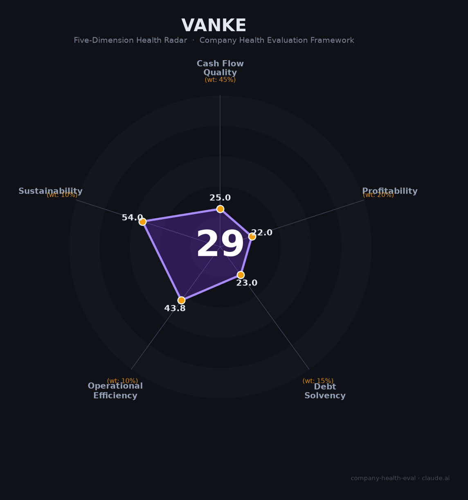

# 万科企业（000002.SZ / 02202.HK）财务健康评估（2026-08-13）

## 一句话结论

⚫ **高风险（29/100）** | 曾经的行业龙头陷入"历史巨亏+财务大洗澡+流动性承压"——2025归母净亏885.56亿、两年累亏1314亿、审计带持续经营不确定性，虽现金流未断但主业内生造血枯竭

---

## 一、公司基本画像

| 项目 | 内容 |
|------|------|
| 主体 | 🔒 万科企业股份有限公司（万科A），注册深圳，A股：000002.SZ（1991）、H股：02202.HK（2014）；中国老牌地产龙头 |
| 成立 | 🔒 1984年成立（前身深圳现代科教仪器展销中心），1988年进军房地产 |
| 股权 | 🔒 深圳地铁集团（深铁，深圳国资）为大股东，持股约29.4%；无实际控制人（股权分散） |
| 规模 | 🔒 总资产1.13万亿（2025末，-12%）；员工约8-10万人（收缩中） |
| 主营 | 房地产开发+经营服务（万物云物业、泊寓长租、万纬物流、印力商业） |
| 财务 | 🔒 2025营收2,334.33亿（-31.98%），归母净亏损-885.56亿（-78.98%，2024年-494.78亿）；两年累亏1,313.83亿 |
| 销售 | 🔒 2025合同销售金额1,340.6亿（-45.5%）、面积1,025万㎡（-43.4%）；开发业务毛利率8.1%（历史极低） |
| 审计 | ⚠️ 带"持续经营重大不确定性段落"的无保留意见 |

> 一句话定性：万科是中国房地产行业深度调整的"样本企业"——曾经销售额6200亿的龙头，2025年销售腰斩至1340亿（-45.5%）、归母巨亏886亿、连续两年亏损超1300亿。虽经营服务业务（万物云等）稳健、保交楼到位、大股东深铁输血未暴雷，但主业造血枯竭、净资产缩水、杠杆恶化，是典型的"周期底部困境反转"标的，而非稳健雇主。

---

## 二、五维财务健康评估

### 1. 现金流质量（25/100）| 权重45%

| 指标 | 🔒 公开数据 | 评估 |
|------|-----------|------|
| 经营现金流净额 | 2025转正约+10亿（2024年+38亿，Q1-Q3曾-58.89亿） | ⚠️ 关注：勉强回正 |
| 现金及等价物 | 2026Q2到期超65亿元，流动性仍紧 | 🔴 危险：覆盖不足 |
| 有息负债 | 有息负债约3,600亿元，2025筹资现金流-300亿+ | 🔴 危险：高杠杆偿债 |
| 净现比 | 巨亏（净利-885.56亿）下净现比无意义且现金流受输血/处置支撑 | 🔴 危险 |

**小结**：现金流质量是万科最核心的"续命"维度——经营现金流2025年勉强转正（+10亿），但主要靠大股东深铁输血、资产处置（338.5亿）+低量销售回款支撑，而非主业正常造血。2026年Q2仍有超65亿到期债务，流动性结构紧张、依赖借新还旧。这不是健康现金流，而是"勉强维持运转"。

> 🔒 数据来源：万科2025年年报（雪球深度解读、新浪财经、深交所公告）

### 2. 盈利能力（22/100）| 权重20%

| 指标 | 🔒 公开数据 | 评估 |
|------|-----------|------|
| 毛利率 | 开发业务8.1%（税后仅约2%） | 🔴 预警：历史极低 |
| 净利率 | 归母净亏885.56亿，负净利率 | 🔴 预警：巨额亏损 |
| 营收增速 | -31.98%（2025）；销售-45.5% | 🔴 预警：负增长 |
| 研发费用率 | 地产开发几乎无研发投入 | ⚠️ 一般 |
| 人均产出 | 亏损+营收收缩，人均产出大幅恶化 | 🔴 预警 |

**小结**：盈利能力崩塌——开发业务毛利率降至8.1%（结算"卖一套亏一套"）、归母净亏886亿（两年累亏1314亿）。收入端销售腰斩（-45.5%）、结算缩量，毛利总额大幅缩水。仅经营服务业务（万物云373.6亿+泊寓+物流+商业合计580亿）稳健，但体量不足以覆盖巨亏。

### 3. 偿债能力（23/100）| 权重15%

| 指标 | 🔒 公开数据 | 评估 |
|------|-----------|------|
| 资产负债率 | 总负债8300亿/总资产11300亿 ≈ 73% | 🔴 危险 |
| 有息负债率 | 有息负债约3600亿 | 🔴 危险 |
| 流动比率 | 货币资金/流动负债偏低，流动性紧 | 🔴 危险 |
| 现金比率 | 2026Q2到期65亿+，现金紧张 | 🔴 危险 |
| 股权质押 | 部分股权质押操作 | ⚠️ 关注 |

**小结**：偿债能力严重承压——资产负债率73%、有息负债3600亿，2025筹资现金流-300亿持续偿债收缩，2026年二季度仍有65亿到期。虽未实质性违约（各种债券展期、大股东支持），但杠杆高企+流动性紧，偿债压力大。

### 4. 运营效率（44/100）| 权重6%

| 指标 | 🔒 数据 | 评估 |
|------|-----------|------|
| 应收/存货周转 | 销售腰斩+存货积压，去化承压 | 🔴 危险 |
| 客户集中度 | 个人消费者为主，高度分散 | ✅ 健康 |
| 员工规模趋势 | 行业收缩，减员/内部优化 | 🔴 危险 |
| 高管稳定性 | 原董事长郁亮卸任，新董事长黄力平 | ⚠️ 关注 |

**小结**：运营效率效果"生态为D"——销售去化承压、减员缩编；但客户分散（C端为主）与经营服务业务（出租率95%+、万物云+7.2%）提供运营韧性。

### 5. 可持续发展（54/100）| 权重10%

| 指标 | 🔒 公开数据 | 评估 |
|------|-----------|------|
| 行业赛道空间 | 地产行业下行、城市化放缓，市场萎缩 | 🔴 危险 |
| 技术壁垒 | 地产开发模式同质化，无强护城河 | ⚠️ 关注 |
| 业务多元化 | 万物云/泊寓/物流/商业，经营服务较多元 | ✅ 健康 |
| 资本支持 | 深圳国资（深铁）+大股东持续输血与协调 | ⚠️ 关注：支撑但有上限 |
| 政策/监管风险 | 地产调控、救市政策与行业调整 | ⚠️ 关注 |

**小结**：可持续性受制于行业周期（地产市场整体下行）与高杠杆，但多元化经营服务（万物云为行业龙头、泊寓出租率95%+）和国资背景提供了底部支撑。

---

## 三、综合评分与健康等级

| 维度 | 得分 | 权重 | 加权得分 |
|------|:----:|:----:|:--------:|
| 现金流质量 | 25.0 | 45% | 11.2 |
| 盈利能力 | 22.0 | 20% | 4.4 |
| 偿债能力 | 23.0 | 15% | 3.4 |
| 运营效率 | 43.8 | 10% | 4.4 |
| 可持续发展 | 54.0 | 10% | 5.4 |
| **综合得分** | **29/100** | **100%** | **28.9/100** |

**健康等级：⚫ 高风险（High-Risk）** — 重大财务或法律隐患，建议作为雇主的身份审慎对待。

---

## 四、同业对标

| 对比项 | 万科 | 保利发展 | 招商蛇口 | 华润置地（参考） |
|--------|:----:|:-------:|:-------:|:-------------:|
| 2025营收 | 2,334.33亿（-32%） | 央企稳健 | - | - |
| 2025归母净利 | -885.56亿 | 有盈利央企 | 央企梯队 | 央企稳健 |
| 核心差异 | 民企艰难出清 | 央企托底、国资背景 | 央企、园区+地产 | 央企、资金强 |

**对标结论**：相对保利/招商/华润等央企地产（国资背景+现金流稳定），万科作为无实控人的民企龙头在行业下行中承压更大。经营服务（万物云）是其相对优势，但主业、规模、信用全面落后于央企对手。

---

## 五、核心风险清单

1. **巨亏+资不抵债压力（极高）**：2025年亏885.56亿，两年累亏1,313.83亿，净资产2100亿被快速侵蚀；若行业不回暖，净资产可能继续缩水。
2. **持续经营不确定性（极高）**：审计意见含"持续经营重大不确定性"段落，反映对能否持续经营的忧虑。
3. **债务压力（高）**：有息负债3600亿、资产负债率73%、2026Q2到期65亿+，融资收缩（筹资-1024亿）。
4. **销售/收入持续低迷（高）**：2025销售-45.5%，若楼市不回温，现金流/结算继续承压。
5. **减值与资产质量（高）**：2025年资产/信用减值超500亿，若行业继续下行，减值风险持续。

---

## 六、求职/择业视角

### 核心优势
- **万物云/经营服务板块**：万物云（物业龙头373.6亿营收）、泊寓（长租27万间）、万隆物流、印力商业——经营服务业务稳健盈利，作为雇主在物业/商业/物流领域有机会。
- **国资+体量大**：深铁国资背书、体量仍在（营收2334亿），抗风险能力优于小房企。
- **"反转弹性"**：若地产周期回暖，困境反转空间大。

### 现存短板
- **主业巨亏、裁员降薪**：开发业务亏损、销售腰斩、员工收缩，土建/开发相关岗位风险大、待遇承压。
- **持续经营疑虑**：审计带持续经营疑虑，长期稳定性存疑，债务压力大。
- **薪酬/晋升承压**：地产行业深度调整，多数房企开启降薪裁员，职业发展前景蒙尘。

### 分场景建议

| 个人诉求 | 推荐 | 次选 | 规避 |
|----------|------|------|------|
| 稳定+深耕 | 央企地产（保利/招商/华润） | 万科经营服务/万物云 | 万科开发/高负债民企 |
| 高薪+跳板 | 基金/头部AMC（困境资产） | 万科万物云 | 地产开发 |
| 成长+过渡 | 物业/商业运营（万物云/印力） | 万科经营服务 | 纯开发加杠杆 |

---

## 七、总结

**万科是中国房地产行业"从龙头到困境"的典型案例——2025年归母巨亏885.56亿、两年累亏1313.83亿，审计带持续经营不确定性，主业造血枯竭、负债高企。**

作为雇主，唯一的相对优势是**万物云等经营服务业务稳健+国资输血保住现金流+总量大**；但开发主业衰败、裁员降薪、债务压力，决定了它属于**高风险**等级。

在行业深度调整、地产下行的大环境下，适合愿意博"周期底部反转"、进入物业/商业服务等相对稳健运营岗位、且能承受波动的求职者；对追求稳定薪酬、长期职业和安全感的求职者而言，地产开发/万科整体并非首选。

---

*评估方法：商泰汽车（iAUTO）五维企业健康度框架 · 数据截至2026年8月 · 🔒财务数据来源万科2025年报（雪球深度解读、新浪财经、深交所公告）· 同业对标为公开市场数据*