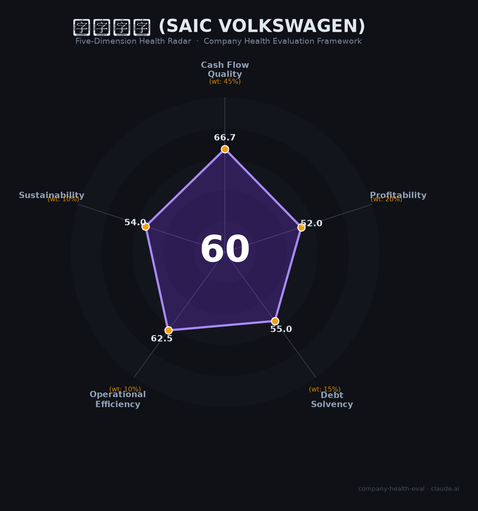

# 上汽大众（SAIC Volkswagen）财务健康评估（2026-06-19）

## 一句话结论

🟠 **中等（60/100）** | 百万级销量底盘尚在（¥1,357亿营收/¥47亿净利），但销量三连降+产能利用率58%+新能源渗透仅14%+双积分压力是结构性危机

## 一、公司基本画像

| 项目 | 内容 |
|------|------|
| **公司全称** | 上汽大众汽车有限公司 |
| **成立时间** | 1985年2月（中国最早的合资车企之一） |
| **股权结构** | 上汽集团50%：大众汽车集团50%（2018年奥迪获1%股权） |
| **注册资本** | ¥115亿（已全额实缴） |
| **员工规模** | 社保~15,492人（2024，-8.3%），总数估计3-4万 |
| **工厂分布** | 上海安亭、南京（2025.7已关闭）、仪征、宁波（闲置）、长沙、乌鲁木齐、MEB新能源工厂 |
| **设计产能** | ~208.8万辆/年；产能利用率仅58% |
| **品牌** | 大众（VW）、斯柯达（Skoda）、奥迪（Audi，上汽奥迪，年销~4.7万） |
| **核心车型** | 朗逸（27万+/年）、帕萨特（23.4万）、途观（20.3万）、ID.系列（13万） |
| **合资期限** | 2024.11续约至2040年（仅延10年，较上次20年缩短一半） |

**一句话定性**：上汽大众是「中国合资车时代的活化石」——2018年巅峰销量206万辆/净利¥280亿，如今销量腰斩至102万辆/净利缩水83%至¥47亿，正经历燃油车基本盘萎缩+新能源转型滞后的双重结构性危机。

## 二、五维财务健康评估

### 1. 现金流质量（66.7/100）

| 指标 | 判断 | 说明 |
|------|------|------|
| 经营现金流 | ⚠️ 关注 | 2024净利润¥47.4亿为正但大幅缩水；产能利用率58%意味着大量固定资产沉淀成本。关厂减值可能产生一次性现金流出 |
| 现金储备 | ✅ 健康 | 上汽集团+大众集团双重母公司信用背书，合资续约至2040年 |
| 有息负债 | ⚠️ 关注 | 汽车制造业资本密集型，推测有息负债率中等 |

**评估**：作为非上市JV，上汽大众的现金状况依托于两大母公司的支持。虽然自身仍在盈利，但销量持续下滑+工厂关闭的减值损失将持续侵蚀现金流。

### 2. 盈利能力（52.0/100）

| 指标 | 判断 | 说明 |
|------|------|------|
| 毛利率 | 📊 一般 | 📊估12-15%（行业均值15-16%，上汽大众受价格战+产能闲置拖累） |
| 净利率 | 📊 一般 | 🔒3.5%（¥47.4亿/¥1,357亿），从2018年的~15%大幅下滑 |
| 营收增速 | 🔴 预警 | 🔒2023：¥1,403亿（-14.8%），2024：¥1,357亿（-3.2%），两年连降 |
| 研发费用率 | 📊 一般 | 合资企业研发主要由大众集团承担，自研投入<5% |
| 人均产出 | ✅ 优秀 | 🔒~¥452万/人（¥1,357亿/~3万人），远超行业均值~¥150万 |

**评估**：盈利从暴利（2018净利率~15%）退化为薄利（2024仅3.5%）。2024年利润回升（¥31.3→47.4亿）是价格战下「一口价」策略的短期成效，可持续性存疑。双积分合规成本（油耗负积分-30.8万分）每年侵蚀利润数亿元。

### 3. 偿债能力（55.0/100）

评估：汽车制造业典型的高资产/中负债结构。产能过剩（利用率58%）意味着大量固定资产对应低效产出，实际资产质量承压。

### 4. 运营效率（62.5/100）

| 指标 | 判断 | 说明 |
|------|------|------|
| 应收周转 | ✅ 健康 | 经销商体系成熟，回款周期行业正常 |
| 客户集中度 | ✅ 健康 | 百万级消费者，完全分散 |
| 员工规模趋势 | 🔴 危险 | 社保16,888→15,492（-8.3%），南京工厂2-3千人裁员，安亭一厂已关；隐性降薪（交通补贴减半/节日福利取消） |
| 高管稳定性 | ⚠️ 关注 | 合资双方管理层持续调整，大众中国CEO更换 |

### 5. 可持续发展能力（54.0/100）

| 指标 | 判断 | 说明 |
|------|------|------|
| 行业赛道 | ⚠️ 关注 | ICE市场萎缩，NEV渗透率>50%。上汽大众NEV仅~14%，ID.3 2025年大幅下滑 |
| 技术壁垒 | ⚠️ 关注 | 大众品牌力仍强（燃油车市占率8.3%单一品牌第一），但「父辈品牌」标签+智能化落后（车机黑屏/OTA困难） |
| 业务多元化 | ⚠️ 关注 | 依赖大众+斯柯达双品牌燃油车，ID.电动+上汽奥迪体量极小 |
| 资本支持 | ✅ 健康 | 两大世界500强母公司+2040年续约，2026年规划7款新能源车型 |
| 政策/合规风险 | 🔴 危险 | 双积分油耗负分-30.8万+EU对SAIC反补贴关税35.3%+合资股比放开削弱地位+大众安徽（金标大众）内部分流资源 |

## 三、综合评分与健康等级

| 维度 | 得分 | 权重 | 加权得分 |
|------|------|------|----------|
| 现金流质量 | 66.7 | 45% | 30.0 |
| 盈利能力 | 52.0 | 20% | 10.4 |
| 偿债能力 | 55.0 | 15% | 8.2 |
| 运营效率 | 62.5 | 10% | 6.2 |
| 可持续发展 | 54.0 | 10% | 5.4 |
| **综合得分** | | | **60.3/100** |
| **健康等级** | | | 🟠 **中等** |

## 四、同业对标

| 对比项 | 上汽大众 | 一汽大众 | 华晨宝马 | 比亚迪 |
|--------|---------|---------|---------|-------|
| 2024销量 | 114.8万 | 165.9万 | 60.4万 | **427万** |
| 2024营收 | ¥1,357亿 | 未单独披露 | ¥2,056亿 | ¥7,771亿 |
| 单车净利 | ~¥4,100 | ~¥1万 | **~¥2.9万** | ~¥0.8万 |
| NEV渗透率 | 14% | 4.5% | 低 | **100%** |
| 产能利用率 | **58%** | — | — | ~90%+ |

**对标结论**：上汽大众在中国合资车企中处于「比上不足、比下有余」的中间位置——远好于巨亏的上汽通用（¥-267亿）、亏损的东风日产，但远不及华晨宝马的单车¥2.9万暴利。与自主品牌比亚迪相比，销量仅为其27%，利润仅为其~10%。

## 五、核心风险清单

1. **结构性销量下滑（极高）**：从206万→102万（5年腰斩），2026年Q1再降-26%。工厂关停（南京/安亭一厂）+宁波闲置，产能利用率仅58%。

2. **新能源转型严重滞后（高）**：NEV渗透率仅14% vs 行业>50%，ID.3 2025年同比腰斩。2026年7款新能源车型是关键赌注——但大众新车型立项周期36-48个月 vs 中国车企12-18个月。

3. **双积分合规成本（高）**：油耗负积分-30.8万分，按¥1,500/分需年耗数亿元购买。2026-2027年NEV积分比例升至48-58%，压力递增。

4. **大众集团战略重心转移（中高）**：大众在华战略向大众安徽（控股75%）和小鹏/地平线合作倾斜，上汽大众从「战略伙伴」降为「执行伙伴」。2026年小鹏合作B级车将直接竞争。

5. **品牌溢价持续缩水（中高）**：大众均价从¥15.16万降至¥12.83万（-15.4%），「父辈品牌」标签固化。

## 六、求职/择业视角

### 核心优势
- **稳定铁饭碗（缩减中）**：合资老牌+国企背景，N+1遣散，50岁以上可内退（85%工资）。虽有关厂裁员，补偿合规
- **WLB相对好**：59%员工准时下班，双休，食堂极好（15个食堂，肯德基/星巴克）
- **养老待遇好**：退休金¥7,000-8,000/月，补充公积金+补充医疗保险
- **品牌大厂光环**：简历上的合资车企经验对供应链/制造业仍有价值

### 现存短板
- **薪资竞争力下降**：校招10-15K/月 vs 蔚来28-38万年薪 vs 比亚迪博士40万
- **无普调机制**：「第三年后约6年随缘涨薪」，老员工薪资倒挂严重
- **组织动荡**：关厂/裁员/降薪/隐性福利缩减，「安乐窝不再」
- **技术栈局限**：合资企业核心研发由德方主导，中方工程师成长空间有限

### 分场景建议

| 个人诉求 | 推荐 | 次选 | 规避 |
|----------|------|------|------|
| 稳定+WLB | **上汽大众**（合资老牌+补偿合规+食堂好） | 一汽大众 | 新势力（蔚来/小鹏） |
| 高薪+成长 | 比亚迪（博士40万）/蔚来 | 特斯拉中国 | **上汽大众** |
| 智能制造/新能源 | 特斯拉/比亚迪 | 蔚来 | **上汽大众**（NEV 14%落后） |

> **适合**：追求稳定/养老/安家（安亭公租房+食堂+退休金），不追求快速涨薪的中年工程师或供应链人员。  
> **不适合**：追求高薪/快速晋升/前沿技术的年轻人。

## 七、总结

**上汽大众是中国合资车时代「从巅峰滑落的最典型样本」：**
百万级销量底盘尚在（102万辆/年）+两大500强母公司背书+2040年续约，短期内不会倒下。
但销量三连降+产能利用率58%+NEV仅14%+利润缩水83%+大众集团战略重心转移+双积分合规压力的「结构性危机」正在加速演变。
在中国汽车行业「自主品牌NEV碾压合资燃油车」的大趋势下，属于**「黄昏巨人」**——体量庞大但病痛缠身，适合追求稳定的传统制造业人才，不适合追求高成长和创新的前沿人才。2026年7款新能源车型的投放是决定其未来命运的关键转折点。

---

*评估日期：2026-06-19 · 数据来源：上汽集团600104年报/乘联会/企查查/券商研报 · 评分引擎 v1.0*
