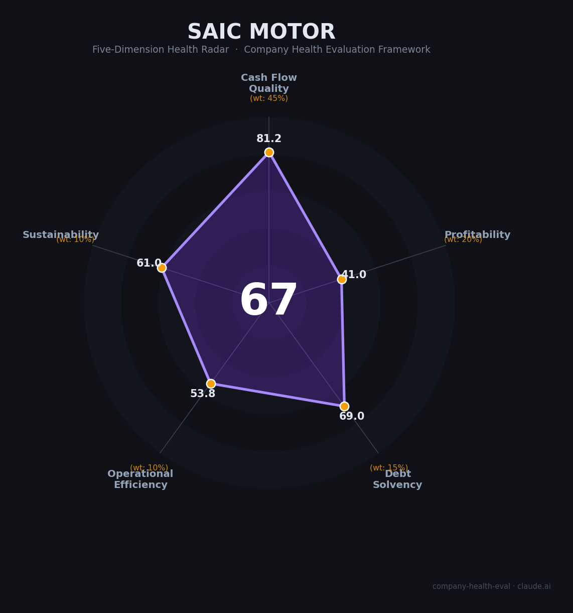

# 上汽集团（SAIC Motor）财务健康评估（2026-08-12）

## 一句话结论

🟠 **中等（67/100）** | 上海汽车工业「国家队」——近¥1,500-1,980亿巨额现金+连续多年经营现金流为正，但合资利润塌方（2024扣非亏¥54亿）+连续4年减员约3.6万人+新能源转型迟缓是核心隐忧

---

## 一、公司基本画像

| 项目 | 内容 |
|------|------|
| 主体 | 上海汽车集团股份有限公司（SAIC Motor Corporation Limited），A股上市（600104.SH） |
| 成立/上市 | 1984年成立（前身上海汽车），1997年A股上市；1996年上汽工业集团组建 |
| 股权 | 上海市国资委通过上汽工业集团间接控股约63.7%——省属国资控股 |
| 总部 | 上海市 |
| 主席 | 王晓秋（2024年接替退休的陈虹任董事长）；总裁贾健旭 |
| 主营 | 整车制造与销售（乘用车/商用车）+零部件+金融：19个品牌覆盖传统燃油到新能源 |
| 规模 | 员工约18.8万（2024年报口径，-9.3%）；总资产约¥9,602亿（2025末） |
| 品牌版图 | 上汽大众（SVW，50%合资）、上汽通用（SGM，50%合资）、上汽通用五菱（~50.1%）、智己（约50.3%）、荣威、飞凡（并入乘用车）、MG、名爵、上汽大通、尚界（2025与华为合作品牌）等 |
| 全球地位 | 中国产销量最大车企之一：2025年销量450.7万辆（+12.3%），行业前列；2025年营收¥6,562亿，世界500强上游 |

> 一句话定性：上汽是中国汽车工业的「长子企业」——自主+合资双轮驱动、近20万员工、千亿级现金的上海国资龙头。但近年来合资利润大幅萎缩（上汽通用巨亏）、销量与员工规模连年收缩，正处于燃油车基本盘下滑与新能源转型滞后并存的艰难调整期。作为雇主，优势是国企铁饭碗+巨额现金保障+规模平台；短板是子公司频现裁员、薪酬竞争力下滑、转型阵痛期业务不确定性高。

---

## 二、五维财务健康评估

> 财务数据为上市公司经审计年报（2022-2025），🔒标注；子公司数据🌐/📊。

### 1. 现金流质量（81.2/100）| 权重45%

| 指标 | 🔒 公开数据 | 评估 |
|------|-----------|------|
| 经营现金流净额 | 2023: ¥423亿 → 2024: ¥693亿 → 2025: ¥343亿（连续多年为正） | ✅ 健康：现金牛 |
| 现金及等价物 | 货币资金 2024: **¥1,980亿** → 2025: ¥1,511亿（+交易性金融资产¥714亿） | ✅ 健康：千亿级现金垫底 |
| 有息负债 | 2025: 短借¥406亿+长期¥146亿+债券¥49亿≈¥899亿（2023年约¥1,352亿→持续降杠杆） | ⚠️ 关注：有净债但现金覆盖 |
| 应收周转 | 应收账款周转天数约28天（2022），经销商体系成熟 | ⚠️ 关注：行业正常 |
| 净现比（OCF/净利） | 2023: 3.0x、2024: 41x（低利润失真）、2025: 3.4x | ✅ 健康：利润含金量高 |

**小结**：现金流是上汽最强项——经营现金流连续多年为正且净现比常年在2-3倍以上，货币资金+金融资产合计超¥2,200亿（2024年末），即便2024年利润崩到¥16.7亿，经营现金流仍高达¥693亿。这是「量大利薄但回款扎实」的制造业龙头典型特征，也是上汽稳定的根本。

### 2. 盈利能力（41/100）| 权重20%

| 指标 | 🔒 公开数据 | 评估 |
|------|-----------|------|
| 毛利率 | 2022: 9.6% → 2023: ~10% → 2025: 11.3%（行业均值约10-16%） | 一般：薄利 |
| 净利率 | 2025: 归母口径1.5%（2024年仅0.27%）；2024扣非 **-¥54亿**（净亏损） | 🔴 预警：薄利/亏损边缘 |
| 营收增速 | 2022: ¥7,441亿 → 2023: ¥7,447亿 → 2024: ¥6,276亿（-15.7%） → 2025: ¥6,562亿（+4.6%） | 🔴 预警：增长停滞回落后微升 |
| 研发费用率 | 研发投入 2025: ¥217亿（3.36%）；研发费用 2023: ¥184亿 → 2025: ¥181亿 | 一般：占比偏低 |
| 人均产出 | 2025: ¥6,562亿/18万≈**¥365万/人**（2024: ¥334万/人） | ✅ 良好：重资产制造中上 |

**小结**：盈利是上汽当前**最大的短板**——2021年归母净利润¥245亿的峰值，到2024年萎缩至¥16.7亿（降88%），扣非净利更是**亏损¥54亿**（上汽通用巨额减值+价格战），2025年虽恢复至¥101亿（+506%）但主要靠低基数修复，扣非也仅¥74亿。毛利率常年仅10%上下、净利率1-2%，与比亚迪（2024净利¥402亿、净利率5.2%）等头部自主品牌差距悬殊，「量大利薄」是结构性问题。

### 3. 偿债能力（69/100）| 权重15%

| 指标 | 🔒 公开数据 | 评估 |
|------|-----------|------|
| 资产负债率 | 2022: 66.0% → 2023: 65.9% → 2024: 63.8% → 2025: 62.4%（逐年下降） | ⚠️ 关注：偏高但在改善 |
| 有息负债率 | 2025: 约¥899亿/¥9,602亿≈9.4%（现金覆盖率强） | ✅ 健康：绝对额可控 |
| 流动比率 | 2022: 1.07（含巨额应付、合同负债） | ⚠️ 关注：偏低 |
| 现金比率 | 货币资金/流动负债≈1（2025） | ⚠️ 关注→健康：接近1 |
| 股权质押 | 上海国资控股，无实质质押 | ✅ 健康 |

**小结**：偿债结构稳健——资产负债率虽常年62-66%（汽车行业普遍水平），但现金资产（含金融投资）远超有息负债，2025年有息负债已降至约¥899亿、货币资金¥1,511亿覆盖近2倍，且连续三年降杠杆。国资背书+子公司财务公司体系，年利息收入可观，财务风险处于可控区间。

### 4. 运营效率（53.8/100）| 权重10%

| 指标 | 🔒/📊 公开数据 | 评估 |
|------|-----------|------|
| 应收周转 | 应收周转天数约28天，行业正常 | ⚠️ 关注 |
| 客户集中度 | 面向消费者+经销商体系，客户高度分散 | ✅ 健康 |
| 员工规模趋势 | 2022: 21.6万 → 2024: **18.8万（-9.3%）** → 三年累计减员约3.6万人；2025年再降至~18万 | 🔴 危险：连续大面积减员 |
| 高管稳定性 | 2024年董事长陈虹退休→王晓秋继任；子公司高管（智己CEO等）更替频繁 | ⚠️ 关注 |

**小结**：运营效率中上汽的最大隐忧是**人力收缩**——2024年一年集团减员19,262人（-9.3%，居A股车企之首，且首次裁减研发人员），叠加2022-2025累计减员约3.6万人，反映出合资关厂（上汽通用沈阳北盛/上汽大众南京）+飞凡并网+自主板块重组的剧烈调整。对员工而言这是直接的岗位稳定性信号。

### 5. 可持续发展（61/100）| 权重10%

| 指标 | 🔒/📊 公开数据 | 评估 |
|------|-----------|------|
| 行业赛道空间 | 2025年中国汽车销量3,440万辆（+10%），新能源渗透率约48%；但价格战白热化、行业利润率仅约1.5% | ⚠️ 关注：总量见顶、利润承压 |
| 技术壁垒 | 新能源+智能化布局推进（智己高阶智驾、与华为合作尚界），但较比亚迪/新势力研发投入与进度落后；燃油车基本盘萎缩 | ⚠️ 关注 |
| 客户/业务多元化 | 19个品牌覆盖乘用/商用/出口/零部件/金融多板块，客户分散 | ✅ 健康 |
| 资本支持 | 上海市国资支持+巨额现金+2026-07控股股东承诺6个月不减持 | ✅ 健康：强力国资背书 |
| 政策/监管风险 | 欧盟对SAIC加征**37.6%**反补贴关税（2024-07生效，行业最高档）+美国禁止连网车/CES等；双积分+合资股比放开 | 🔴 危险：出口关税与地缘敞口大 |

**小结**：可持续性喜忧参半——上汽的**规模护城河和国资后盾**仍在（中国最大车企之一+千亿现金+上海核心产业地位），但外部环境（欧盟37.6%关税压制MG欧洲出口、中美科技脱钩、合资股比放开）和自身转型滞后（燃油车占比仍高、新能源渗透率与比亚迪差距大）决定了其长期增长乏力。

---

## 三、综合评分与健康等级

| 维度 | 得分 | 权重 | 加权得分 |
|------|:----:|:----:|:--------:|
| 现金流质量 | 81.2 | 45% | 36.5 |
| 盈利能力 | 41.0 | 20% | 8.2 |
| 偿债能力 | 69.0 | 15% | 10.3 |
| 运营效率 | 53.8 | 10% | 5.4 |
| 可持续发展 | 61.0 | 10% | 6.1 |
| **综合得分** | **67/100** | **100%** | **66.6/100** |

**健康等级：🟠 中等（Moderate）** — 有明确风险点（盈利+人力收缩），但现金流和国资背书托底。

---

## 四、同业对标

| 对比项 | 上汽集团 | 比亚迪 BYD | 吉利汽车 | 广汽集团 GAC |
|--------|---------|------------|----------|--------------|
| 2025销量 | 450.7万辆 | >460万辆（+7.7%） | ~200万辆+ | ~170万辆 |
| 2024营收 | ¥6,276亿 | ¥7,771亿 | ~¥2,400亿 | ¥1,078亿 |
| 2024归母净利 | **¥16.7亿** | **¥402.5亿** | ~¥100亿+ | ¥8.2亿 |
| 2024净利率 | **0.27%** | 5.18% | ~4-5% | 0.76% |
| 2025归母净利 | ¥101.1亿（+506%） | ¥326亿（-19%） | 承压 | **-¥88亿（转亏）** |
| 员工规模 | ~18.8万 | ~70万 | ~4万+ | ~6万 |
| 核心标签 | 合资衰落·现金巨厚 | 新能源龙头·利润王 | 转型加速 | 合资崩塌·亏转 |

**对标结论**：上汽在体量上仍是「中国最大车企之一」，但**盈利质量远逊于比亚迪**（2024净利率0.27% vs 5.18%，不足其1/20）；与同样合资依赖的广汽相比，上汽的现金实力和自主转型（+出口107万辆）明显更强，2025年已率先走出亏损区。作为雇主，其**规模与现金安全性在国企车企中居前列**，但比不过比亚迪的高增长与高激励。

---

## 五、核心风险清单

1. **合资利润塌方（高）**：上汽通用2024年归母净亏约¥267亿（含巨额减值），上汽大众净利从巅峰¥280亿跌至¥47亿；2020年代利润大头（合资）已系统性萎缩，2024年权益法投资收益一度为负。
2. **2024扣非亏损（中高）**：2024年扣非净利-¥54亿为历史首次年度经营性亏损，是价格战+上汽通用减值+新能源投入共振的结果；2025年修复但盈利质量仍弱。
3. **持续减员/组织收缩（中高）**：三年累计减员约3.6万（2024年单年-19,262人居A股车企之首），上汽通用（沈阳北盛关厂）、上汽大众（南京关厂）、飞凡并网等结构性收缩持续，SSE员工岗稳定是相对优势但子公司全面裁减。
4. **欧盟/美国关税（高）**：欧盟对SAIC加征**37.6%**反补贴关税（行业最高）+美国2027年连网车禁令，压制MG欧洲/美国出口——2025年出口仅+3.1%，增速已明显放缓。
5. **新能源转型滞后（中）**：NEV渗透率与比亚迪差距大，尚界（华为合作）等新牌仍在爬坡；燃油车基本盘萎缩对公司收入端持续拖累。

---

## 六、求职/择业视角

### 核心优势
- **高度稳定（收缩中）**：上海市国资A股龙头，千亿级现金+连续多年正经营现金流，即便子公司重组也无整体崩塌风险；2026年控股股东承诺6个月不减持。
- **规模平台与背书**：19个品牌+全球布局（泰国/印度/埃及/欧洲MG），车企履历在行业通用性高，跳槽供应链/新势力有背书。
- **福利完整**：国企体系，上海户口+高比例公积金+补充商业保险+食堂班车+员工购车折扣（5.5-6折）等。
- **薪酬在国企中偏上**：人均薪酬约¥23万（2024），工程师20-35万区间，明显高于一般制造业。

### 现存短板
- **子公司裁员频发（核心警示）**：上汽通用、上汽大众、飞凡等板块收缩明显——上汽通用沈阳北盛关厂（~2,000人）、大众中国补偿N+6（历史最高档）虽仁厚，但岗位流失真实存在；智己渠道端2026年多地经销商暴雷。
- **薪酬竞争力下滑**：校招起薪（10-15K/月）与蔚来/比亚迪/新势力（28-40万年薪档）差距拉大，技术人才面临流失。
- **晋升与体制约束**：国企文化、论资排辈、无普调机制，薪资倒挂普遍；研发分合并频繁（智己/飞凡并入研发总院）带来岗位动荡。
- **转型不确定**：燃油车底盘在萎缩、新能源/智能化仍处追赶位，业务方向存在调整风险。

### 分场景建议

| 个人诉求 | 推荐 | 次选 | 规避 |
|----------|------|------|------|
| 稳定+深耕 | **上汽集团总部/研发总院**（铁饭碗） | 上汽大众（48%，相对稳） | 上汽通用/飞凡相关岗位（收缩最烈） |
| 高薪+成长 | 智己（若接受高波动）/比亚迪 | 吉利 | 上汽传统制造岗 |
| 落户+福利 | 上汽集团任何上海岗（户口加分） | 其他上海国企 | — |
| 技术转型 | 智己/研发总院智能化方向 | 尚界（华为合作） | 燃油车相关岗位 |

---

## 七、总结

**上汽集团是中国汽车工业的「长子企业」与上海制造业的中流砥柱：**

它是**千亿现金+连续多年正经营现金流+国资强力背书**的「现金型」巨头——利润虽然从2024年低谷修复到¥101亿，但多年净利润下滑、扣非亏损、连续减员3.6万人都暴露了合资时代红利消退后的转型阵痛。作为雇主，它提供「国企铁饭碗+上海户口+完整福利+规模平台」的稳定性，但**子公司裁员与转型不确定**是真实存在的风险。

唯一短板是**盈利质量疲软与转型滞后**——合资利润塌方后，靠自主/出口/新能源接棒的进程尚未完全兑现，人力收缩仍在继续。选上汽，你得到的是「超大平台+稳定底色+国资托底」，代价是「岗位收缩风险+薪酬上限+转型期波动」。

在行业价格战、欧盟关税、新能源加速渗透的大环境下，属于**中等**稳定性——作为整体财务健康「不会倒」，但作为雇主要细分到具体子公司判断（研发总院/智己相对优选，上汽通用/飞凡相对收缩）。适合追求**稳定+落户+规模背书**的求职者；不适合追求高增长、期权红利或高薪酬弹性的候选人。

---

*评估方法：商泰汽车（iAUTO）五维企业健康度框架 · 数据截至2026-08-12 · 财务数据来自上汽集团（600104.SH）2022-2025年报（东方财富/同花顺/新浪财经）· 员工/裁员数据来自年报及媒体报道 · 对标数据来自各公司年报/行业协会*
