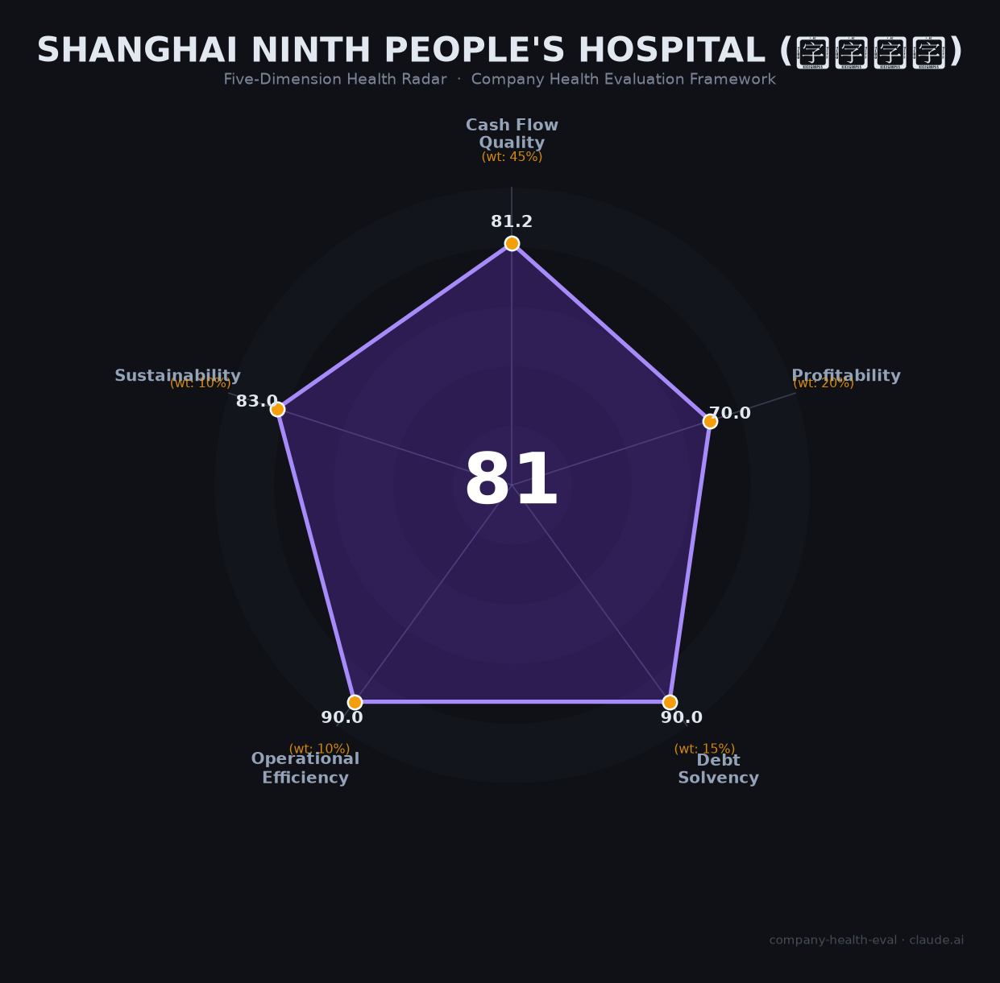

# 上海第九人民医院 雇主评估（2026-06-14）

## 一句话结论

🟡 **中等偏上（81/100）** | 整形全国第1+口腔第3=中国医学界金字招牌，但DRG降薪+编制门槛+过劳是硬伤

---

## 一、机构基本画像

| 项目 | 内容 |
|------|------|
| **全称** | 上海交通大学医学院附属第九人民医院 |
| **性质** | 政府主办非营利性三级甲等综合性公立医院（差额拨款事业单位），上海交大医学院直属附属医院 |
| **成立时间** | 1920年（前身伯特利医院），1952年命名"上海第九人民医院" |
| **院区分布** | 南部（黄浦总部）、北部（宝山）、浦东、祝桥（2026年3月新启用，800床+700牙椅）四个医疗院区 + 浦东科教园区 |
| **规模** | 核定床位2,150张，口腔综合椅位1,000张，总建筑面积27.7万㎡ |
| **职工** | 5,160人（2024年末），其中中国工程院院士5位、博导约148名、硕导约195名 |
| **年业务量** | 门急诊474万+人次、住院16万+人次、住院+门诊手术约30万人次、平均住院日4.6天 |
| **学科排名** | 复旦医院排行榜A+++级（全国TOP21-40）；整形外科全国第1、口腔科全国第3、眼科全国第6 |
| **国家级平台** | 国家口腔医学中心、国家口腔疾病临床医学研究中心、3个国家重点学科、11个国家临床重点专科 |
| **年度预算** | 2024年总收入94.23亿元（上海市级医院第4），事业收入81.47亿元（86.5%），财政拨款10.09亿元（10.7%） |

**一句话定性**：上海九院是中国整形外科和口腔医学的绝对权威，拥有5位工程院院士的顶级学术阵容，年收入近百亿的体量使其在公立医院体系中具有极强的财务稳定性，但编制获取难度、DRG/DIP降薪压力和超高工作强度是求职者必须权衡的核心代价。

---

## 二、五维评估（公立医院适配版）

> **框架说明**：原文针对企业设计的五维框架在此适配为公立医院语境——"现金流质量"映射资金稳定性（政府拨款+医疗收入）、"盈利能力"映射薪酬竞争力、"偿债能力"映射财务安全、"运营效率"映射管理质量、"可持续发展"映射品牌壁垒与政策韧性。

### 1. 现金流质量——资金稳定性（81.2/100）

| 评估指标 | 判断 | 依据 |
|----------|------|------|
| 运营现金流 | 🟢 健康 | 94.23亿收入vs 93.01亿支出，保持正向结余（1.22亿元）；年增速约20%，连续增长🔒 |
| 资金储备 | 🟢 健康 | 年末结转8.32亿元；政府财政10.09亿元/年拨款提供结构性保障，不存在资金断裂风险🔒 |
| 负债水平 | 🟢 健康 | 公立医院非营利属性，祝桥院区建设以政府拨款+自筹为主，无显著商业负债🔒 |
| 收支结余率 | 🟡 关注 | 结余率仅约1.3%，基本"以收定支"；DRG/DIP支付改革+集采压缩收入空间，结余率可能进一步收窄📊 |

**核心判断**：上海九院作为市级三甲医院，具有极强的资金安全垫——政府拨款+品牌门诊量是双重保障。但2025年DRG/DIP改革导致83%三甲医院人均收入下滑，九院也无法独善其身。结余率极低（1.3%）意味着几乎没有抗收入波动的缓冲。

### 2. 盈利能力——薪酬竞争力（70.0/100）

| 评估指标 | 判断 | 依据 |
|----------|------|------|
| "毛利率"（薪酬竞争力） | 🟢 优秀 | 口腔/整形主任医师年薪110-150万（上海三甲领先约20%），博士后25-33万+科研启动金，博士入职通常有编制+安家费60-100万🌐 |
| "净利率"（薪酬满意度） | 🔴 预警 | 编制内外收入差距达3.2倍（合同工收入仅编制内1/3）；合同制护士月薪7,500元；57%员工收入下降（全国数据）🌐 |
| "营收增速"（薪资增长预期） | 🟢 优秀 | 医院收入年增20%，对强势科室（口腔/整形）绩效增长有支撑；科研经费（国自然130项/2025年）持续提升📊 |
| 科研投入 | 🟠 一般 | 国自然130项（2025，全国第8-9）、科研经费约5,000-8,000万；但近年2篇撤稿和学术诚信事件削弱科研品牌📊 |
| 人均产出 | 🟢 优秀 | 人均营收182.6万元（94.23亿/5,160人），上海三甲中上水平；口腔科/整形外科人均贡献远超全院均值📊 |

**核心判断**：九院的薪酬呈"冰火两重天"——强势科室（口腔/整形/眼科）待遇上海三甲领先，但护理、医技、行政等非核心岗位收入偏低。薪酬制度正在从"绩效导向"向"固定为主"转型（2027年固定薪酬目标70%），短期可能导致绩优医生收入下降，但长期有利于基层员工待遇改善。

### 3. 偿债能力——财务安全性（90.0/100）

| 评估指标 | 判断 | 依据 |
|----------|------|------|
| 资产负债 | 🟢 健康 | 公立医院政府兜底，无商业破产风险；年末结转8.32亿，净资产持续增加🔒 |
| 有息负债 | 🟢 健康 | 无商业贷款披露；祝桥院区建设以政府拨款为主🔒 |
| 流动性 | 🟢 健康 | 政府财政拨款+医保结算+门诊现金收入，流动性充足🔒 |
| "股权质押" | 🟢 健康 | 公立医院无股权概念，不存在质押风险🔒 |

**核心判断**：九院不存在任何偿债风险。公立医院的政府信用背书+百亿级收入体量构成双重保障。唯一可能的财务压力来自祝桥院区（22万㎡新院区）的运营成本——新增800床+700牙椅在初期可能拖累全院结余率。

### 4. 运营效率——管理质量（90.0/100）

| 评估指标 | 判断 | 依据 |
|----------|------|------|
| 收款效率 | 🟢 健康 | 医保结算周期稳定（30-90天），门诊现金/移动支付即时到账；自费患者（口腔/整形）付款及时🔒 |
| "客户"多样性 | 🟢 健康 | 年门急诊474万人次，患者高度分散；外地患者占比超60%，品牌辐射全国🔒 |
| 员工规模趋势 | 🟢 健康 | 2023年5,028→2024年5,160人（+2.6%），祝桥院区启用后将进一步扩招🌐 |
| 管理层稳定性 | 🟢 健康 | 党委书记马延斌、2026年1月院长王旭东（口腔颌面外科专家）履新，属正常换届；核心学科带头人（5位院士）多年稳定🔒 |

**核心判断**：运营效率整体健康。值得关注的是祝桥院区（2026年3月启用）带来的管理挑战——多院区同质化、人才配置、信息系统整合等。九院黄浦分院（2024年巡察发现采购/工程/资产管理存在廉政风险隐患）也暴露了快速扩张中的内控短板。

### 5. 可持续发展——品牌壁垒与政策韧性（83.0/100）

| 评估指标 | 判断 | 依据 |
|----------|------|------|
| 行业赛道 | 🟢 健康 | 医疗服务需求刚性增长（老龄化+消费医疗升级），上海三甲医院收入年增20%，赛道确定性极强📊 |
| 技术壁垒 | 🟢 健康 | 整形外科#1（数十年不可撼动）+口腔科#3+5位院士，品牌壁垒远超一般三甲医院。外界复制九院的学术深度和临床积累需要数十年🔒 |
| "业务"多元化 | 🟢 健康 | 一院四区+口腔门诊部网络；国家口腔医学中心入驻祝桥；国际医疗部（2024年首年27.3万门诊+3万手术）；学科矩阵覆盖从整形到骨科到眼科📊 |
| "资本"支持 | 🟢 健康 | 政府全额兜底+事业编制+国家医学中心政策红利+上海交大医学院学术资源，不存在资金或政策中断风险🔒 |
| 政策/监管风险 | 🟡 关注 | DRG/DIP压缩收入、集采（骨科耗材降价80%+、种植牙降价30-40%）持续冲击、医疗反腐高压（2024年立案5.2万人）、多点执业管控趋严、学术诚信事件损害声誉📊 |

**核心判断**：九院的品牌壁垒（整形#1+口腔#3）在可预见的未来几乎不可撼动——这是公立医院中最接近"护城河"的资产。但三重政策逆风（DRG/DIP+集采+反腐）将在未来2-3年持续挤压收入空间，部分医生的实际可支配收入已见下降。

---

## 三、综合评分

| 维度 | 得分 | 权重 | 加权得分 |
|------|------|------|----------|
| 现金流质量（资金稳定性） | 81.2 | 45% | 36.5 |
| 盈利能力（薪酬竞争力） | 70.0 | 20% | 14.0 |
| 偿债能力（财务安全性） | 90.0 | 15% | 13.5 |
| 运营效率（管理质量） | 90.0 | 10% | 9.0 |
| 可持续发展（品牌壁垒） | 83.0 | 10% | 8.3 |
| **综合得分** | | | **81.3 / 100** |

**健康等级**：🟡 **中等偏上（Moderate-High）**

---

## 四、同业对标（上海顶尖三甲医院）

| 对比项 | 上海九院 | 瑞金医院 | 中山医院 | 仁济医院 |
|--------|:-------:|:-------:|:-------:|:-------:|
| 复旦评级 | A+++ | A++++ | A++++ | A++++ |
| 核定床位 | 2,150张 | 2,942张 | 2,005张 | 2,750张 |
| 年门急诊量 | 474万人次 | ~450万人次 | ~400万人次 | 691万人次 |
| 职工人数 | 5,160人 | ~6,506人 | ~4,000余人 | 4,832人 |
| 院士数 | 5位 | 5位 | 4位 | 2位 |
| 2024年总收入 | 94.23亿元 | 162.5亿元 | 未公开 | 126.31亿元 |
| 国自然立项(2024) | 104项(全国第9) | 158项(全国第4) | 166项(全国第3) | — |
| 核心优势学科 | 整形#1、口腔#3、眼科#6 | 内分泌#1、血液科 | 心内、肝外 | 消化病#1、风湿病 |
| 薪酬参考 | 主任医师110-150万 | 主任医师100-130万 | 主任医师95-125万 | — |
| 本体系得分 | **81** 🟡 | 未评估 | 未评估 | 未评估 |

**对标结论**：上海九院在"上海四大综合三甲"（瑞金/中山/仁济/九院）中规模最小（收入为瑞金的58%），但品牌壁垒最强——整形外科全国第1和口腔科全国第3是两个"独门绝技"，其他三甲无法复制。薪酬水平在强势科室领先同行约20%，但低收入岗位（护士/规培生）与其他三甲差距不大。

---

## 五、核心风险清单

1. **DRG/DIP+集采双重压缩（高风险）**：九院骨科（耗材降价80%+）、口腔种植（降价30-40%）等高耗材/高手术量科室收入结构受冲击最显著。全国83%三甲医院人均收入下滑，57.9%医护人员收入下降。对依赖绩效奖金的医生而言，实际可支配收入可能持续走低。

2. **编制门槛极高+同工不同酬（中高风险）**：编制内外收入差距达3.2倍，合同制护士月薪仅7,500元。每年仅100个编制名额，博士是敲门砖。非编转正率约6%。在薪酬改革"阳光化"趋势下，非编人员的待遇改善前景有限。

3. **工作强度触目惊心（中高风险）**：57%员工经常加班，神经外科45岁主任自曝因过劳致脑梗（无高血压/高血脂等基础病）。整形外科年门诊46万人次+手术14万人次。祝桥院区启用后工作量将进一步上升。

4. **品牌被冒用+学术诚信风险（中风险）**：和睦家"冒牌九院专家"事件（2025年）暴露出品牌管理漏洞；2025年连续两篇论文因图像重复被撤稿，科研诚信形象受损。直接影响：私立机构"蹭"九院品牌可能导致医疗纠纷中九院被连带追责。

5. **多点执业管控趋严（中风险）**：九院口腔/整形医生的市场价值极高（私立跳槽薪资翻2-3倍），但2024-2025年医疗反腐高压+祝桥院区启用后院内工作量增加，医院对多点执业的管控趋严。保留编制+多点执业的"最优策略"正面临更大的政策执行阻力。

---

## 六、求职/择业视角（核心参考）

### 核心优势

- **中国医学界最强品牌背书之一**：整形外科全国第1+口腔科全国第3，"九院出身"在医疗行业是金字招牌
- **跳槽溢价极高**：整形/口腔科主治及以上医生，私立医院市场薪资通常比同级医生高30-50%；"原上海九院专家"是民营医美机构的核心营销卖点
- **学术天花板**：5位院士、148位博导、国家口腔医学中心+国家临床医学研究中心，科研起点全国顶级
- **财务绝对安全**：公立医院政府兜底+94亿年收入，没有倒闭/裁员风险——这一点在2026年经济下行期尤为珍贵
- **强势科室薪酬领先**：口腔/整形主任医师110-150万/年，上海三甲中领先约20%
- **博士入编友好**：博士毕业入职通常直接给事业编+安家费60-80万+科研启动金100-150万

### 现存短板

- **编制是鬼门关**：每年仅100个编内名额，博士是硬门槛，硕士大概率只能走合同制（收入仅为编制内1/3）
- **护理/医技岗位性价比低**：合同制护士月薪7,500元（上海租房4,000-5,000元/月），夜班补贴仅120元/次
- **工作强度碾压级**：45岁主任脑梗、57%加班率、整形外科年门诊46万——九院不是"佛系"的地方
- **薪酬改革阵痛**：DRG/DIP+集采压缩绩效空间，绩优医生短期收入可能下降
- **规培生不包住宿**：月入约1万但上海租房4,000-5,000元/月，三年规培期经济压力大

### 分场景建议

| 个人诉求 | 推荐 | 次选 | 规避 |
|----------|------|------|------|
| 学术大佬+科室主任路线 | 九院（5位院士+顶尖平台+博导资源） | 瑞金/中山（综合排名更高但专科壁垒不如九院） | — |
| 整形/口腔高收入+自由执业 | 九院（积累5-10年→跳槽私立薪资翻2-3倍或多点执业） | 八大处/北大口腔（同为顶级但北京限制更多） | 非顶级三甲的整形/口腔科（品牌溢价低） |
| 稳定+编制+WLB | 九院编制内（绝对稳定但WLB差） | 上海二甲/社区卫生中心（编制门槛低+WLB好+社区改革利好） | 九院合同制/派遣（同工不同酬严重） |
| 护理/医技岗位 | 瑞金/中山（护士待遇略高或相当） | — | 九院合同制护理（月薪7,500元+夜班120元/次在上海生存压力大） |

---

## 七、总结

**上海第九人民医院** 是中国医学界「整形外科不可撼动的王者+口腔医学的三大殿堂之一」：5位院士+整形#1+口腔#3+眼科#6，品牌壁垒在可预见的未来无医院可复制；唯一短板是**公立体系的系统性代价——编制门槛极高（每年仅100个名额）、工作强度碾压级（45岁主任脑梗）、薪酬制度在DRG/DIP+集采+反腐三重压力下正在从"绩效激励"向"固定保底"转型，短期收入承压**。

在「医疗服务需求刚性增长+祝桥院区扩张+国家口腔医学中心入驻」的大环境下，上海九院属于**低风险（财务绝对安全）、高回报（品牌溢价极高）、高代价（强度和编制门槛双高）**的选择。最适合**有学术追求、能承受超高工作强度、目标5-10年后凭借"九院出身"品牌兑现市场价值的整形/口腔/眼科医生**。对于追求WLB或从事护理/医技岗位的求职者，需要认真权衡编内外差距和生活成本压力。

---

*评估日期：2026-06-14 | 数据截至：2026年6月*
*评分引擎：company-health-eval v1.1（公立医院适配版） | 数据来源标注：🔒官方决算/工商 📊估算 🌐网络口碑*
