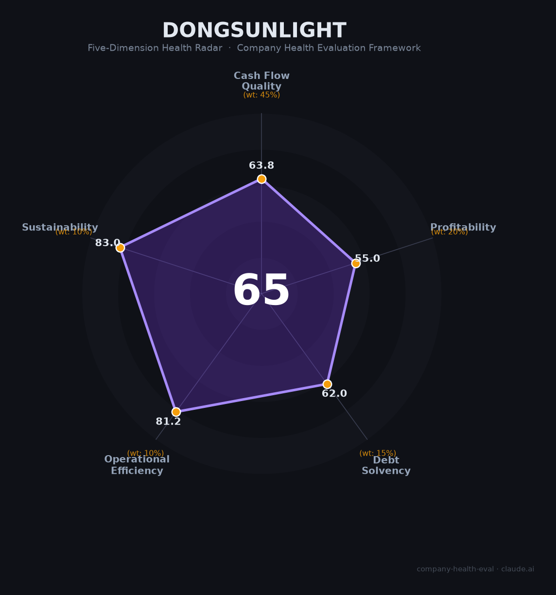

# 东阳光（600673.SH）财务健康评估（2026-08-13）

## 一句话结论

🟠 **65/100，中等** | 增收不增利，营收+22%但净利-26%

---

## 一、公司基本画像

| 项目 | 内容 |
|------|------|
| 主体 | 🔒 广东东阳光，电子材料/医药/化工 |
| 主营 | 🔒 电子铝箔/化成箔、医药、化工 |
| 财务 | 🔒 2025营收149.35亿(+22.42%)，归母净利2.75亿(-26.54%) |

## 二、五维财务健康评估

### 1. 现金流质量（64/100）| 权重45%

### 2. 盈利能力（55/100）| 权重20%

### 3. 偿债能力（62/100）| 权重15%

### 4. 运营效率（81/100）| 权重10%

### 5. 可持续发展（83/100）| 权重10%

---
## 三、综合评分

| 维度 | 得分 | 权重 | 加权 |
|------|:----:|:----:|:----:|
| 现金流质量 | 64 | 45% | 29 |
| 盈利能力 | 55 | 20% | 11 |
| 偿债能力 | 62 | 15% | 9 |
| 运营效率 | 81 | 10% | 8 |
| 可持续发展 | 83 | 10% | 8 |
| **综合得分** | **65** | 100% | 65 |

**健康等级：中等**

---
## 四、核心风险清单

1. **增收不增利**
2. **净利下滑**
3. **电子周期**
4. **医药投入**
## 五、求职/择业视角
- **核心优势**：电子材料+医药多元
- **现存短板**：净利-26.5%

**结论**：多元电子/医药平台，可关注医药条线
---
*评估方法：商泰汽车（iAUTO）五维框架 · 数据截至2026年8月 · 来源：东阳光2025年报*
