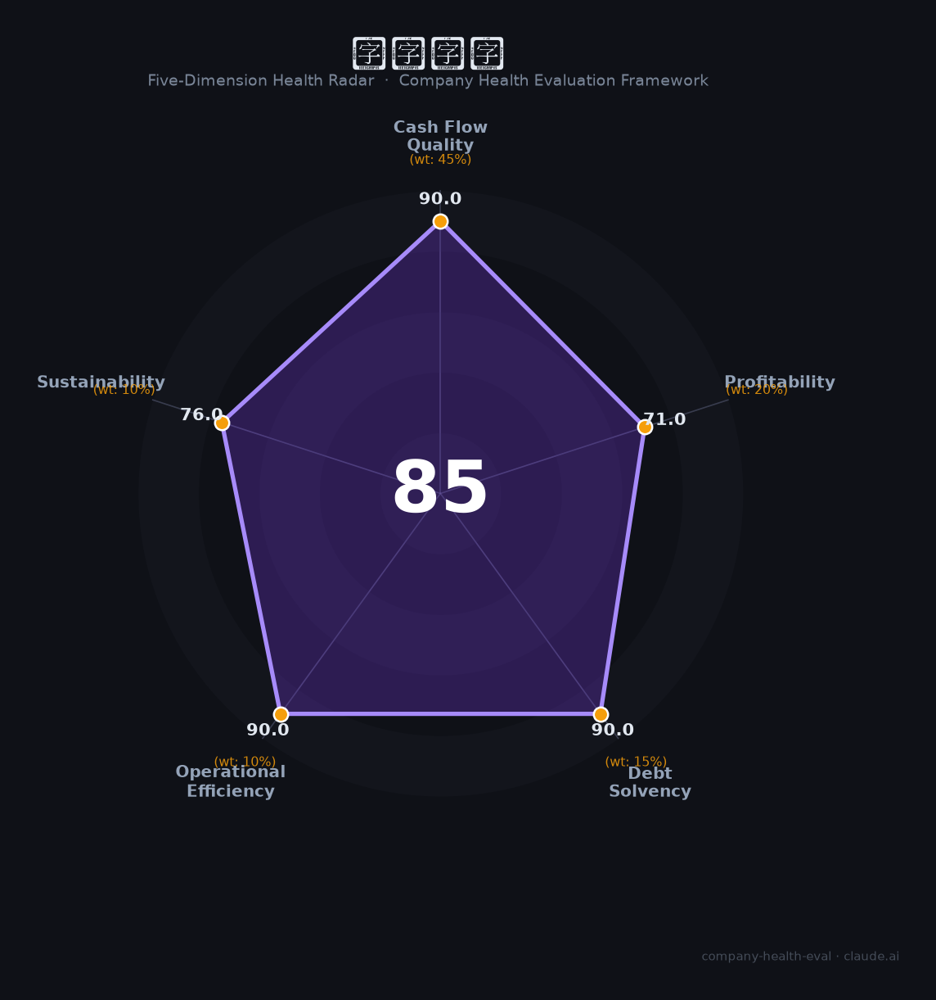

# 东鹏饮料（605499.SH / 09980.HK）财务健康评估（2026-08-14）

## 一句话结论

🟡 **85/100，中等偏上** | 功能饮料龙头，营收利润双增、盈利强

---

## 一、公司基本画像

| 项目 | 内容 |
|------|------|
| 主体 | 东鹏饮料，功能饮料龙头 |
| 主营 | 功能饮料/饮料多品类 |
| 财务 | 2025营收208.75亿，归母净利44.15亿，ROE 51.6% |

> 一句话定性：功能饮料龙头，营收利润高增、ROE极高

---

## 二、五维财务健康评估

### 1. 现金流质量（90/100）| 权重45%

现金流强劲、现金充沛。

### 2. 盈利能力（71/100）| 权重20%

毛利率净利率高、单罐盈利突出。

### 3. 偿债能力（90/100）| 权重15%

低负债、偿债极稳。

### 4. 运营效率（90/100）| 权重10%

运营效率高。

### 5. 可持续发展（76/100）| 权重10%

功能饮料赛道高增，多品类+国际化打开空间。

---

## 三、综合评分

| 维度 | 得分 | 权重 | 加权 |
|------|:----:|:----:|:----:|
| 现金流质量 | 90 | 45% | 40.5 |
| 盈利能力 | 71 | 20% | 14.2 |
| 偿债能力 | 90 | 15% | 13.5 |
| 运营效率 | 90 | 10% | 9.0 |
| 可持续发展 | 76 | 10% | 7.6 |
| **综合得分** | **85/100** | 100% | 84.8 |

**健康等级：中等偏上** — 整体稳健，局部有待改善

---

## 四、核心风险清单

1. **新品毛率偏低**
2. **消费增长放缓**
3. **市场竞争(红牛/农夫)**

## 五、求职/择业视角

### 核心优势
- 功能饮料龙头、高ROE、成长强
### 现有短板
- 多品类扩张摊薄盈利

**结论**：东鹏饮料功能饮料龙头，营收利润强劲、ROE极高、现金流好，是深圳消费板块优质成长。

---

*评估方法：商泰汽车（iAUTO）五维框架 · 数据截至2026年8月 · 财务来源东鹏饮料2025年报*