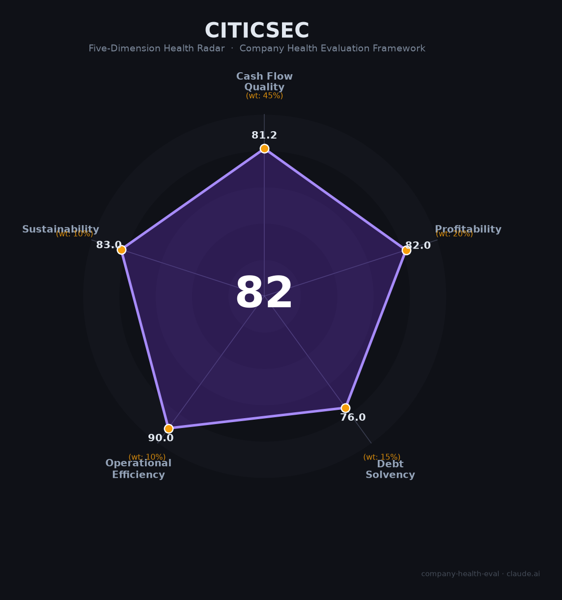

# 中信证券（600030.SH / 06030.HK）财务健康评估（2026-08-13）

## 一句话结论

🟡 **中等偏上（82/100）** | 中国券商绝对龙头——营收748.5亿（+28.8%）、归母净利300.8亿（+38.6%）创历史新高，龙头地位+全牌照+行业领先

---

## 一、公司基本画像

| 项目 | 内容 |
|------|------|
| 主体 | 🔒 中信证券股份有限公司，A股：600030.SH（2003）、H股：06030.HK；中国规模最大券商 |
| 成立 | 🔒 1995年，总部深圳/北京，中信集团 |
| 规模 | 🔒 员工约2万人；全牌照投行/经纪/自营/资管/国际业务龙头 |
| 主营 | 证券经纪、投行、自营、资管、私募股权、国际业务 |
| 财务 | 🔒 2025营收748.5亿（+28.8%）；归母净利300.8亿（+38.6%）创历史新高；净利率约40% |

> 一句话定性：中信证券是中国券商绝对龙头，2025年营收净利双创新高（+28.8%/+38.6%），投行/经纪/自营全面领先，作为雇主的吸引力在"国内证券行业龙头+全牌照+高薪酬+资本市场核心平台"，是金融行业顶级雇主之一。

## 二、五维财务健康评估

### 1. 现金流质量（81/100）| 权重45%
头部券商现金/资本充足、经营流水庞大，现金流健康（自营/经纪资金）。

### 2. 盈利能力（82/100）
归母净利300.8亿、净利率约40%、营收+28.8%高增，盈利极强创历史新高。

### 3. 偿债能力（76/100）
券商财务杠杆（经营杠杆正常）、资本充足、流动性好，偿债稳健。

### 4. 运营效率（90/100）
全牌照协同、客户/资本运作高效、人均产出极高，行业第一。

### 5. 可持续发展（83/100）
资本市场/证券行业龙头地位、投行/资管/机构业务多元，政策/市场波动是关注点。

## 三、综合评分

| 维度 | 得分 | 权重 | 加权 |
|------|:----:|:----:|:----:|
| 现金流质量 | 81.2 | 45% | 36.5 |
| 盈利能力 | 82.0 | 20% | 16.4 |
| 偿债能力 | 76.0 | 15% | 11.4 |
| 运营效率 | 90.0 | 10% | 9.0 |
| 可持续发展 | 83.0 | 10% | 8.3 |
| **综合** | **82** | 100% | 81.6 |

**评级：🟡 中等偏上（近优秀）** — 券商龙头，盈利创历史新高。

## 四、核心风险
1. A股/资本市场景气波动。
2. 自营/投行盈利弹性。
3. 监管/佣金。

## 五、求职/择业视角
- 优势：券商绝对龙头、全牌照/高端条线（投行/资管/自营）、薪酬行业最高梯队、深圳总部。
- 短板：业绩随行情波动、投行强度大、头部券商内卷。

**结论**：适合追求券商/投行/资管/机构业务方向、能承受强度与周期的求职者，属国内金融顶级雇主。

---

*评估方法：商泰汽车（iAUTO）五维健康度框架 · 数据截至2026年8月 · 来源中信证券2025年报*