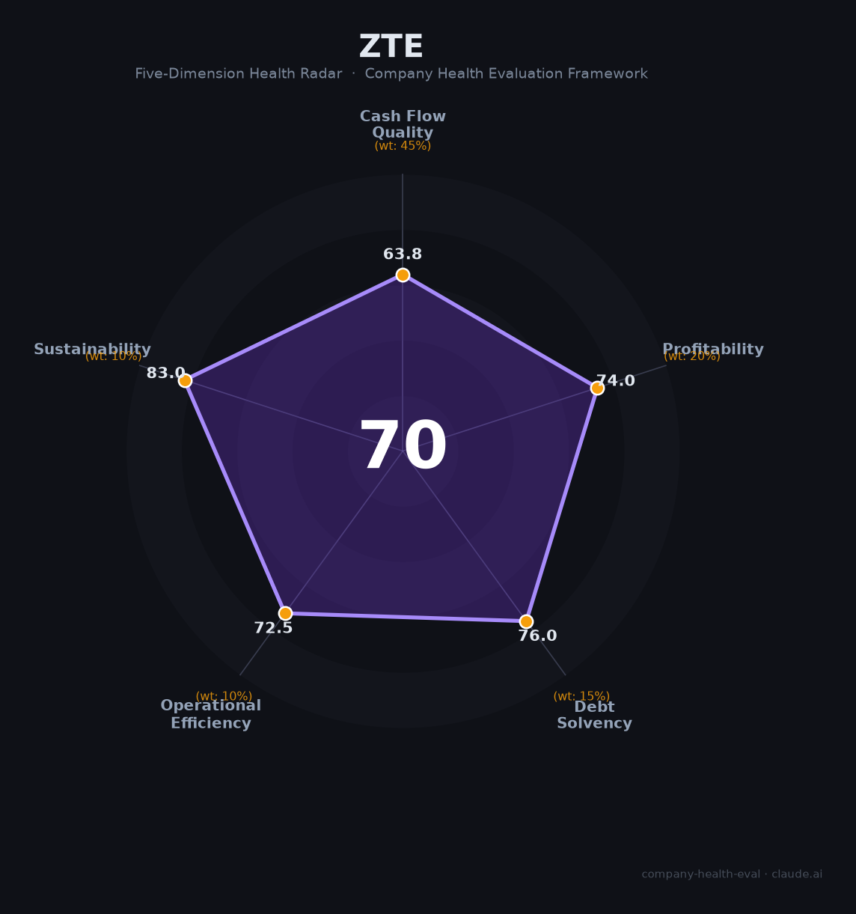

# 中兴通讯（000063.SZ / 0763.HK）财务健康评估（2026-08-13）

## 一句话结论

🟡 **中等偏上（70/100）** | 全球通信设备四强——营收重返增长（+10.4%）+政企算力爆发（+100%），但净利-33.3%（政企业务精准）+现金流-66%，增收不增利压力

---

## 一、公司基本画像

| 主体 | 🔒 中兴通讯股份有限公司，A股：000063.SZ（1997）、H股：0763.HK；全球五大通信设备商之一，注册深圳 |
| 成立 | 🔒 1985年深圳创立 |
| 规模 | 🔒 员工约6.5万；全球电信设备份额前列 |
| 主营 | 运营商网络、政企业务（算力/服务器）、消费者业务 |
| 财务 | 🔒 2025营收1,338.96亿（+10.4%）；归母净利56.18亿（-33.3%）；扣非33.70亿（-45.5%）；经营现金流39.19亿（-65.9%） |
| 毛利 | 🔒 毛利率30.3%；净利率4.2%；负债率约46.3% |
| 业务 | 🔒 运营商628.6亿（-10.6%）、政企372.2亿（+100.5%）、消费者338.2亿（+4.4%） |

> 一句话定性：中兴通讯是全球通信设备主力，2025年营收重返增长（政企算力+100%），但归母净利-33%、毛利率下滑、现金流-66%，"增收不增利"。作为雇主的吸引力在于"通信技术壁垒+政企AI算力第二曲线+研发强"，但利润压力与行业竞争并存。

---

## 二、五维财务健康评估

### 1. 现金流质量（64/100）
经营现金流39亿（-65.9%）、净利下滑，现金流关注；但实际财务杠杆率46.3%、资金相对稳健。

### 2. 盈利能力（74/100）
毛利率30.3%（通信设备优质），净利率4.2%；归母净利-33%（政企低价+研发投入），研发费用率高（强投入）。

### 3. 偿债能力（76/100）
资产负债率46.3%、财务稳健，现金储备充足，偿债健康。

### 4. 运营效率（73/100）
运营商客户集中、政企扩张，研发人员规模大；管理层稳定。

### 5. 可持续发展（83/100）
AI算力/服务器/云网+5G-A+信创，技术壁垒高、多元化，资本支持强；竞争与地缘关注。

---

## 三、综合评分

| 维度 | 得分 | 权重 | 加权 |
|------|:----:|:----:|:---:|
| 现金流质量 | 63.8 | 45% | 28.7 |
| 盈利能力 | 74.0 | 20% | 14.8 |
| 偿债能力 | 76.0 | 15% | 11.4 |
| 运营效率 | 72.5 | 10% | 7.2 |
| 可持续发展 | 83.0 | 10% | 8.3 |
| **综合** | **70** | 100% | 70.5 |

**评级：🟡 中等偏上** — 技术龙头、算力第二曲线，盈利短期承压。

---

## 四、核心风险
1. 净利-33%、政企低毛利放量压缩利润。
2. 现金流-66%（备货/回款）。
3. 运营商资本开支周期性。

## 五、求职/择业视角
- **优势**：通信技术壁垒（5G/算力/光通信）+研发投入强、政企/算力/AI第二曲线高增，深圳总部。
- **短板**：盈利承压、薪酬弹性较华为/大厂弱、运营商需求长周期。

**结论**：适合追求通信技术+AI算力/政企转型方向的工程师与产品人才；稳定但增长弹性有限。

---

*评估方法：商泰汽车（iAUTO）五维健康度框架 · 数据截至2026年8月 · 来源中兴通讯2025年报*