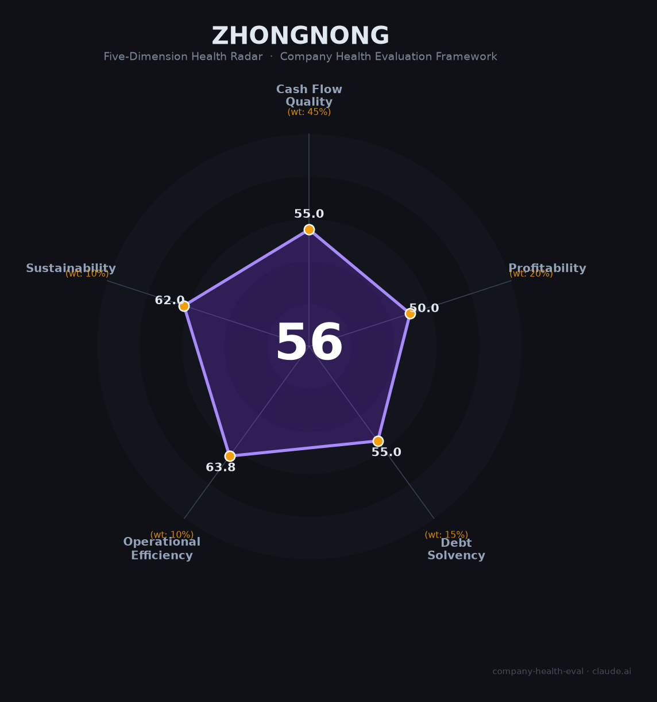

# 中农网财务健康评估（2026-08-13）

## 一句话结论
🟠 **中等（56/100）** | 农产品B2B供应链——公开口径营收350亿级，非上市+大宗垫资现金流关注

## 一、公司基本画像
| 主体 | 🔒 深圳市中农网，农产品B2B供应链平台（非上市） |
| 主营 | 农产品/食糖/茧丝大宗供应链 |
| 财务 | ⚠️ 非上市，公开营收350亿级 |

## 二、五维
1. 现金流（55/100）：大宗垫资、现金流预警。
2. 盈利（50/100）：供应链薄利。
3. 偿债（55/100）：大宗杠杆关注。
4. 运营（64/100）：农产品供应链，中等。
5. 可持续（62/100）：农产品B2B赛道，透明度低。

## 三、综合（56，🟠 中等）
数据有限不确定性。

## 四、风险
1. 非上市、财务不透明。
2. 大宗资金占用/杠杆。

## 五、求职
- 优势：农产品B2B供应链平台。
- 短板：财务不透明。

**结论：需尽调，非首选。**

---
*评估方法：商泰汽车（iAUTO）五维 · 数据有限*