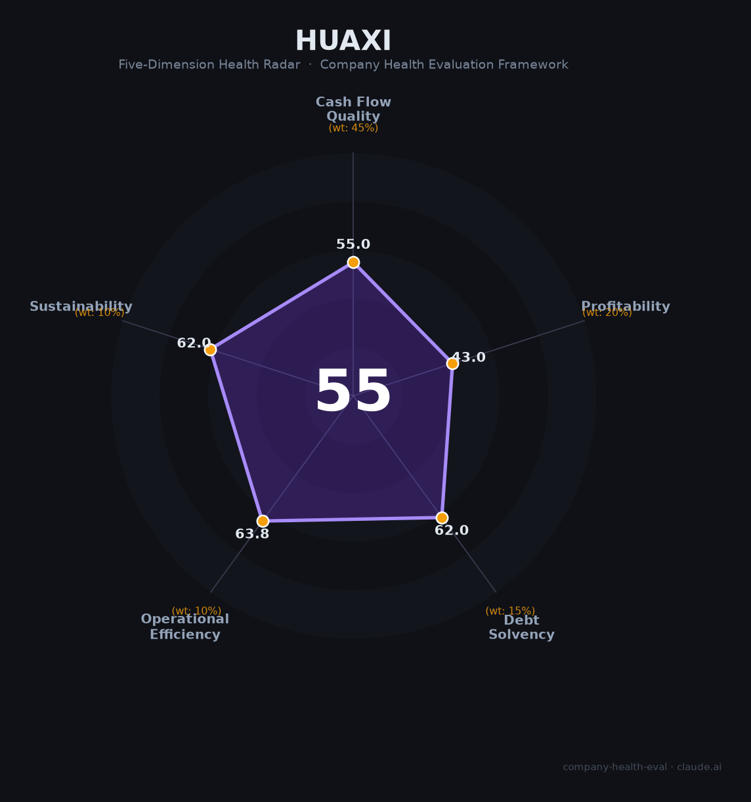

# 中国华西（—（央企/华西集团））财务健康评估（2026-08-14）

## 一句话结论

🟠 **55/100，中等** | 建筑施工平台，规模大、利润薄

---

## 一、公司基本画像

| 项目 | 内容 |
|------|------|
| 主体 | 中国华西，华西集团华南分支/建筑 |
| 主营 | 建筑施工/工程总承包 |
| 财务 | 华西集团2024营收1085.97亿，深圳分支盈利一般 |

> 一句话定性：建筑央/国企，营收大、利润薄、周期承压

---

## 二、五维财务健康评估

### 1. 现金流质量（55/100）| 权重45%

工程回款周期长，现金流偏紧。

### 2. 盈利能力（43/100）| 权重20%

建筑毛利率低、净利薄。

### 3. 偿债能力（62/100）| 权重15%

高杠杆经营。

### 4. 运营效率（64/100）| 权重10%

运营效率一般。

### 5. 可持续发展（62/100）| 权重10%

建行业下行+竞争。

---

## 三、综合评分

| 维度 | 得分 | 权重 | 加权 |
|------|:----:|:----:|:----:|
| 现金流质量 | 55 | 45% | 24.8 |
| 盈利能力 | 43 | 20% | 8.6 |
| 偿债能力 | 62 | 15% | 9.3 |
| 运营效率 | 64 | 10% | 6.4 |
| 可持续发展 | 62 | 10% | 6.2 |
| **综合得分** | **55/100** | 100% | 55.2 |

**健康等级：中等** — 整体稳健，局部有待改善

---

## 四、核心风险清单

1. **建工回款**
2. **地产/基建下行**
3. **利润薄**

## 五、求职/择业视角

### 核心优势
- 大型建筑/国企平台，规模大、稳定
### 现有短板
- 利润薄、周期下行

**结论**：中国华西建筑央企/国企平台，规模大但利润薄、回款周期长，适合求稳定者，成长性有限。

---

*评估方法：商泰汽车（iAUTO）五维框架 · 数据截至2026年8月 · 财务来源华西集团年报/公开资料*