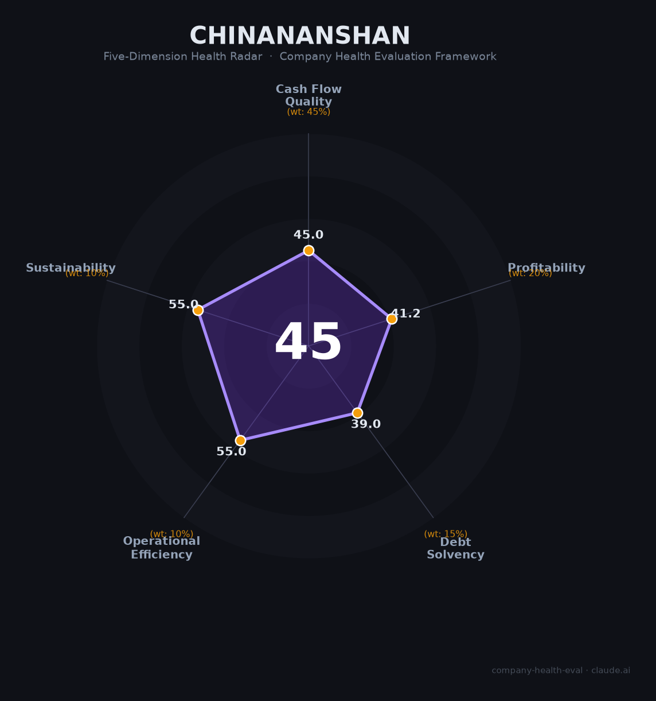

# 中国南山（—（央企））财务健康评估（2026-08-13）

## 一句话结论

🔴 **45/100，中等偏下** | 央企综合集团，物流稳健但地产拖累盈利

## 一、公司基本画像

| 项目 | 内容 |
|------|------|
| 主体 | 中国南山开发集团，深圳央企 |
| 主营 | 综合物流/产城综合开发/地产 |
| 财务 | 旗下南山控股2024营收84亿(-30%)、净利-17.7亿 |

> 一句话定性：深圳央企，综合物流+地产，盈利受地产拖累

---

## 二、五维财务健康评估

### 1. 现金流质量（45/100）| 权重45%

地产去化慢，现金流偏紧。

### 2. 盈利能力（41/100）| 权重20%

地产业务亏损拖累整体盈利。

### 3. 偿债能力（39/100）| 权重15%

高负债、偿债承压。

### 4. 运营效率（55/100）| 权重10%

运营效率一般。

### 5. 可持续发展（55/100）| 权重10%

物流优质、地产下行，可持续性分化。

---

## 三、综合评分

| 维度 | 得分 | 权重 | 加权 |
|------|:----:|:----:|:----:|
| 现金流质量 | 45 | 45% | 20.2 |
| 盈利能力 | 41 | 20% | 8.2 |
| 偿债能力 | 39 | 15% | 5.8 |
| 运营效率 | 55 | 10% | 5.5 |
| 可持续发展 | 55 | 10% | 5.5 |
| **综合得分** | **45/100** | 100% | 45.3 |

**健康等级：中等偏下** — 存在较多风险点，需谨慎评估

---

## 四、核心风险清单

1. **地产亏损**
2. **高负债**
3. **物流/地产周期波动**

## 五、求职/择业视角

### 核心优势
- 央企背景、物流业务优质、资产雄厚
### 现有短板
- 地产拖累盈利、高杠杆

**结论**：中国南山央企物流+地产，物流稳健但地产承压、盈利受损，中等偏下。

---

*评估方法：商泰汽车（iAUTO）五维框架 · 数据截至2026年8月 · 财务来源南山控股2025年报*