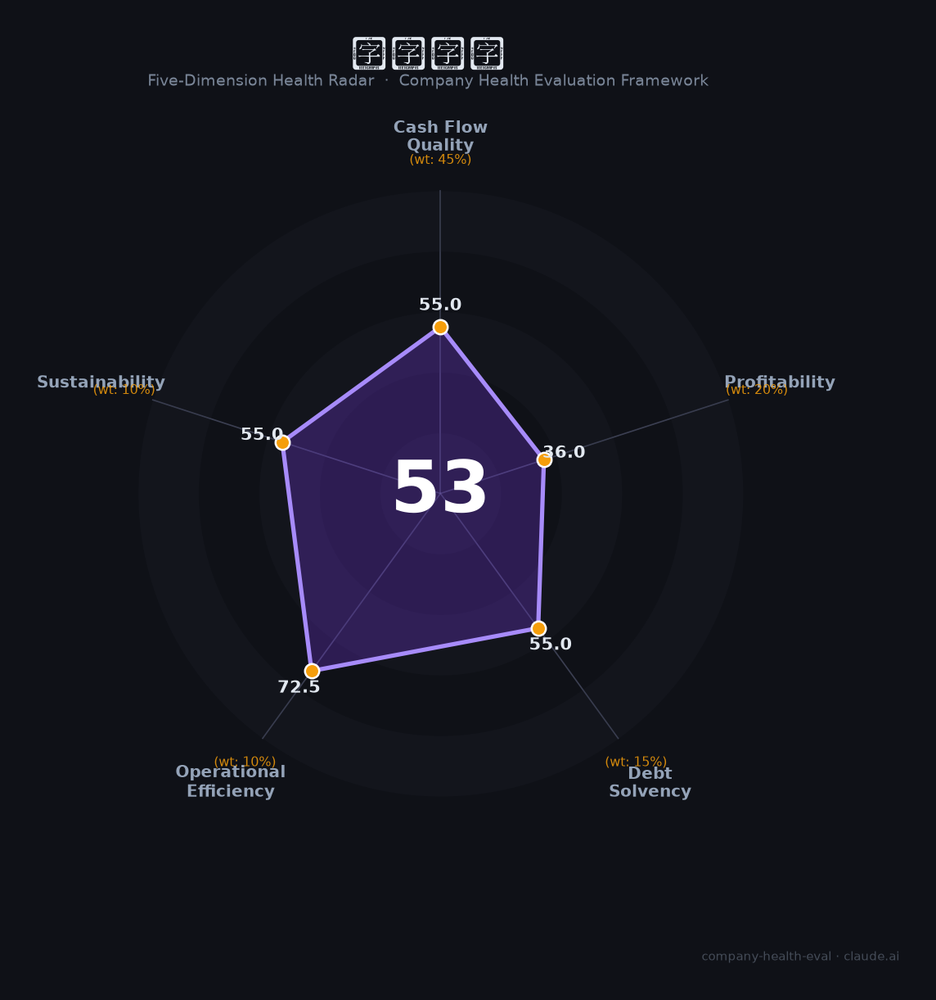

# 中国南玻（000012.SZ）财务健康评估（2026-08-14）

## 一句话结论

🔴 **53/100，中等偏下** | 玻璃制造龙头，营收稳但净利极薄、盈利乏力

---

## 一、公司基本画像

| 项目 | 内容 |
|------|------|
| 主体 | 中国南玻，玻璃/光伏玻璃龙头 |
| 主营 | 玻璃/光伏玻璃/电子玻璃 |
| 财务 | 2025营收137.19亿，归母净利1.26亿(净利大降) |

> 一句话定性：玻璃龙头，营收大但净利极薄、盈利承压

---

## 二、五维财务健康评估

### 1. 现金流质量（55/100）| 权重45%

现金流一般。

### 2. 盈利能力（36/100）| 权重20%

净利率极低，盈利承压。

### 3. 偿债能力（55/100）| 权重15%

中高负债。

### 4. 运营效率（72/100）| 权重10%

运营效率一般。

### 5. 可持续发展（55/100）| 权重10%

光伏玻璃竞争+需求波动，行业盈利承压。

---

## 三、综合评分

| 维度 | 得分 | 权重 | 加权 |
|------|:----:|:----:|:----:|
| 现金流质量 | 55 | 45% | 24.8 |
| 盈利能力 | 36 | 20% | 7.2 |
| 偿债能力 | 55 | 15% | 8.2 |
| 运营效率 | 72 | 10% | 7.2 |
| 可持续发展 | 55 | 10% | 5.5 |
| **综合得分** | **53/100** | 100% | 53.0 |

**健康等级：中等偏下** — 存在较多风险点，需谨慎评估

---

## 四、核心风险清单

1. **光伏玻璃过剩**
2. **净利极薄**
3. **行业周期**

## 五、求职/择业视角

### 核心优势
- 玻璃龙头、规模大、产线全
### 现有短板
- 净利薄、高杠杆、光伏承压

**结论**：中国南玻玻璃龙头，营收规模大但净利极薄、光伏竞争承压，盈利乏力。

---

*评估方法：商泰汽车（iAUTO）五维框架 · 数据截至2026年8月 · 财务来源南玻A2025年报*