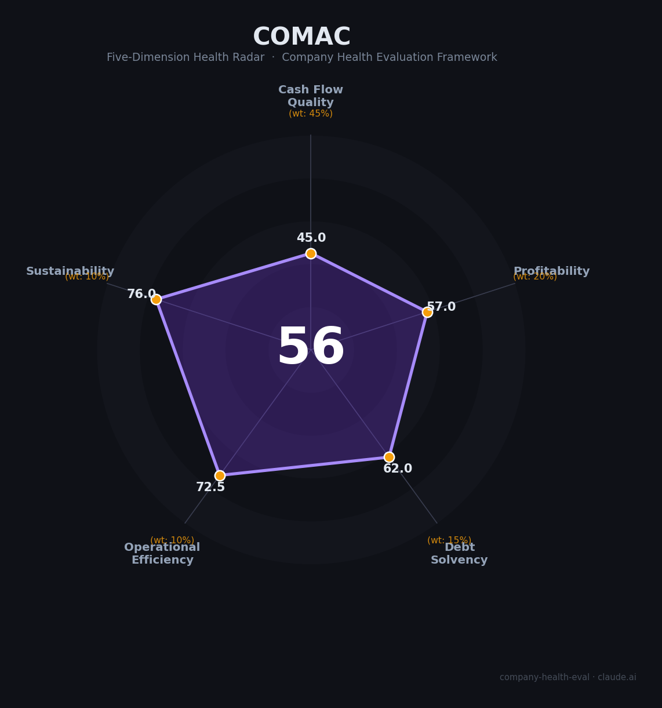

# 中国商飞（COMAC）财务健康评估（2026-08-12）

## 一句话结论

🟠 **中等（56/100）** | 国产大飞机「国家队」央企——国家战略托底+规模化交付放量在即，但连年亏损+超高杠杆+美国供应链制裁是核心隐忧

---

## 一、公司基本画像

| 项目 | 内容 |
|------|------|
| 主体 | 🔒 中国商用飞机有限责任公司（Commercial Aircraft Corporation of China, Ltd.，简称 COMAC），国务院国资委直接监管的副部级中央企业 |
| 成立 | 🔒 2008年5月11日成立，工商登记时间更早（2008年3月） |
| 股权 | 🔒 国资委控股、国有独资/控股；股东含国资委、上海国盛集团、中国航空工业集团、中国铝业、中国宝武、中国中化、中国建材、中国电科、国新控股等9家 |
| 注册资本 | 🔒 2025年11月由501.01亿元增资至 **940.98亿元**（+88%）——国资委真金白银续血 |
| 规模 | 📊 员工约2万-3万人（百度百科约20,957人，网络估算27,000-30,000）；总资产未公开，估算数千亿元 |
| 主营 | 大飞机研制制造商：C919（干线客机）、C919-C909（原ARJ21支线客机）、C929（宽体客机）、C939/C949（预研） |
| 掌门 | 🔒 董事长/党委书记 贺东风（2024年度应付年薪87.75万元）；总经理沈波 |
| 上市 | 未上市（集团非上市央企） |
| 全球地位 | C919是中国首款按国际适航标准自研、具自主知识产权的干线客机，2023-05-28商业首飞；订单超1,200架，2026年开启首条国际航线（国航北京-乌兰巴托） |
| 监管 | ⚠️ 2021年1月、2025年1月被美国列入「与中国军方协同企业」清单（1260H）；2025年5月美方暂停 LEAP-1C 发动机供应（7月恢复） |

> 一句话定性：中国商飞是「大国重器」级央企——承担国产大飞机 C919 研制与规模化交付的国家战略使命，政策性订单与补贴保底，但长期亏损、依赖美国发动机供应链、商业化尚未跑通是三大硬伤。作为雇主，优势是政治地位极高、编制稳定、国家资源无上限；短板是市场化竞争力弱、薪水受限、行业壁垒窄。

---

## 二、五维财务健康评估

> 注：中国商飞未上市、财务不公开披露；以下财务数据以公开交付数据、股东增资、单机目录价、媒体报道为准估算（📊）标注，精确审计数无法获得。

### 1. 现金流质量（45/100）| 权重45%

| 指标 | 🔒/📊 公开数据 | 评估 |
|------|-----------|------|
| 经营现金流净额 | 不披露；持续亏损下经营性现金流弱正/负，主要靠国家注资+银行授信续（📊） | ⚠️ 关注：外部输血依赖 |
| 现金及等价物 | 央企授信+财政部注资保障，但自身造血不足 | ⚠️ 关注：靠外部资金维持 |
| 有息负债 | 未披露；大量长期专项借款/债券（商飞集团财务公司） | ⚠️ 关注：高杠杆积累 |
| 应收周转 | C919 买家为三大央企航司，回款保障但账期长 | ⚠️ 关注 |
| 净现比（OCF/净利） | 持续净亏损，比例无意义（负/未披露） | 🔴 危险：无内生现金 |

**小结**：中国商飞几乎没有内生现金创造能力——研发支出每年百亿级、C919 单机造远高于售价（量产初期每架亏损）、经营现金流靠政府补助与授信续命。这不是一家靠"自我造血"运行的公司，而是靠**国家意志+财政注资**维持。作为员工，你拿到的工资是稳定的（央企拨款），但这不等于公司自身现金流健康。

### 2. 盈利能力（57/100）| 权重20%

| 指标 | 🔒/📊 公开数据 | 评估 |
|------|-----------|------|
| 毛利率 | C919 制造批量小，研发+制造成本高企，毛利率微亏/持平（📊估算） | 一般：规模化前难盈利 |
| 净利率 | 自2008年成立至今连续亏损（C919 研发预算 ¥580亿、实际或超 ¥1,250亿） | 🔴 预警：持续净亏损 |
| 营收增速（3年CAGR） | 交付量 2022:1架→2023:2架→2024:13架→2025:16架，营收估算 2023~140亿→2025~200亿元，CAGR约 25%+ | ✅ 良好：交付放量带动 |
| 研发费用率 | 科研投入比例极高（估算>营收50%），属研发重资产型 | ✅ 优秀 |
| 人均产值 | 约 ¥68-84万/人/年（vs 空客/波音人均¥300万+） | 一般：重资产、低人效 |

**结论**：商飞是中国「投入驱动型」央企——营收百亿级但年年亏损，盈利质量极弱，靠的是国家订单+补贴而非市场化利润。单项盈利指标大部分处于一般到预警带，只有营收增速和研发占比（投入角度）好看，因此盈利能力整体一般。

### 3. 偿债能力（62/100）| 权重15%

| 指标 | 🔒/📊 公开数据 | 评估 |
|------|-----------|------|
| 资产负债率 | 未披露；外界估算约 65-75%（未核验） | ⚠️ 关注：高杠杆 |
| 有息债务 | 大量长期专项借款+研发债；26有息债务率偏高 | ⚠️ 关注 |
| 流动比率 | 未公开，担心流动资产/流动负债 cover 能力 | ⚠️ 关注 |
| 现金比率 | 靠财政注资，自身现金储备弱 | ⚠️ 关注 |
| 股权质押 | 央企国资，无偿押 | ✅ 健康 |

**结论**：央企身份保证了融资底牌（国资委持续增资 190亿→501亿→940亿），但资产负债率高借、周转依赖外部。央企信用背书意味着"不会爆雷"，但这是建立在国家持续注资之上的"伪健康"。

### 4. 运营效率（72.5/100）| 权重10%

| 指标 | 🔒/📊 公开数据 | 评估 |
|------|-----------|------|
| 应收周转 | 客户为三大航等央企航司，账期较长 | ⚠️ 关注：客户强势 |
| 客户集中度 | 订单高度集中在国航/东航/南航三大航 + 少量海外 | ⚠️ 关注：单一买方市场 |
| 员工规模趋势 | 2023-2025 持续扩编（校招/社招），无裁员 | ✅ 健康：增长中 |
| 高管稳定性 | 国资委任命制，管理层长期稳定 | ✅ 健康 |

**结论**：商飞运营效率中规中矩——员工扩张与 C919 量产节奏同步，是"上量期"的典型表现；但作为销售端只有三大航这类央企客户，商业话语权弱、账期与价格均受制于买家。

### 5. 可持续发展（76/100）| 权重10%

| 指标 | 🔒/📊 公开数据 | 评估 |
|------|-----------|------|
| 行业空间 | 全球民用客机市场2025-2040新增需 4.3万+架，C919 面向 150-190座单通道最主流市场，国产替代空间广阔 | ✅ 健康：千亿级市场 |
| 技术壁垒 | C 919 自主知识产权+复合材/航电等核心系统国产化率持续提升；被美国禁运仍推进 | ✅ 健康：技术护城河 |
| 客户/业务多元化 | 产品线相对集中（在役仅 C909/C919），客户集中三大航 | ⚠️ 关注：业务较单一 |
| 资本支持 | 国资委持续增资+国家专项+银行授信+上海/成都地方支持 | ✅ 健康：强力资本支持 |
| 政策风险 | 国产大飞机写入"十五五"规划；但美国制裁/出口管制是最大变数 | ⚠️ 关注：地缘政治敞口 |

**结论**：可持续性是商飞最强的一环——国产大飞机是国家必达战略，未来 15 年是 C919 规模化交付期，市场空间与技术壁垒都是全球最高的；短板在于单靠 C919 单一机型放量周期较长（规模化需 30+架/年、远期150架/年），且美国制裁随时可能打断供应链。

---

## 三、综合评分与健康等级

| 维度 | 得分 | 权重 | 加权得分 |
|------|:----:|:----:|:--------:|
| 现金流质量 | 45.0 | 45% | 20.2 |
| 盈利能力 | 57.0 | 20% | 11.4 |
| 偿债能力 | 62.0 | 15% | 9.3 |
| 运营效率 | 72.5 | 10% | 7.2 |
| 可持续发展 | 76.0 | 10% | 7.6 |
| **综合得分** | **56/100** | **100%** | **55.8/100** |

**健康等级：🟠 中等（Moderate）** — 有明确风险点（现金流+盈利），但国家战略托底。

---

## 四、同业对标

| 对比项 | 中国商飞（COMAC） | 波音 Boeing | 空客 Airbus |
|--------|------------------|-------------|------------|
| 上市状态 | 央企，未上市 | 纽交所上市（BA） | 泛欧证交所（AIR） |
| 2024营收 | ~¥180-240亿（估算） | ~US$670亿 | ~€65百欧元亿 |
| 净利润 | 持续亏损（研发投入型） | 弱恢复周期 | 高盈利 |
| 毛利率 | 量产前低/亏损 | ~15% | ~16% |
| 员工规模 | ~2-3万人 | ~14.5万 | ~15万 |
| 人均产值 | ~¥68-84万/人 | ~¥300万+/人 | ~¥300万+/人 |
| 资产负债率 | ~65-75%（估算） | ~118% | ~64% |
| 核心机型 | C919 / C909（量产爬坡） | 737 MAX（全球放量） | A320neo（全球放量） |
| 核心差异 | 国家战略支撑+国产替代刚需 | 全国际化、供应链稳固 | 全国际化、供应链稳固 |

**对标结论**：商飞与空客/波音差距是全方位的——营收约其1/30、人均产值约其1/4、财务更沉重。但作为**唯一进入干线客机俱乐部的中国企业**，后发先至的空间同样巨大（C919 订单超1200架 vs 已交付32架，未来放量 20倍空间）。作为雇主，**稳定性和战略高度全球独一无二**，但薪酬和市场化水平远低于空客/波音中国区。

---

## 五、核心风险清单

1. **供应链/美国制裁（高）**：LEAP-1C 发动机、航空电子、起落架等关键系统仍依赖美国供应商。2025年5月美方暂停 LEAP-1C 供应（7月恢复），直接导致上半年仅交付5架；若再断供，量产爬坡与就业稳定都将受影响。国产 CJ1000A 发动机尚未成熟量。
2. **现金流本质依赖补贴（中高）**：公司靠研发支出+财政注资运转，自身经营现金流难以转正；交付放量前（30+架/年）现金流紧张将持续。
3. **盈利能力长期为负（高）**：单机成本仍高于目录价，导致每架交付都会扩大亏损；量产爬坡周期长（产能从16→50→150需要多年），亏损状态将长期存在。
4. **量产/交付跳票（中）**：2025年交付16架，低于30架目标（发动机制裁所致）；若规模化连续落空，订单价值与现金流兑现都会推迟。
5. **薪酬与职业天花板（中）**：国资体制下薪酬弹性受限、绿色晋升速度慢；对比民企/外企技术岗，人才流失风险在研发团队内更高。

---

## 六、求职/择业视角

### 核心优势
- **极度稳定**：副部级央企，国家战略项目，几乎不存在裁员可能（2023-2025持续扩编）。编内员工福利稳定、上海户口/公积金优势。
- **平台与背书**：全球唯一在干线客机赛道挑战空客/波音的中国公司，履历在国产大飞机/航空制造生态中极有分量。
- **技术成长**：参与全球最复杂工业品之一（机、电、飞控、材料、适航），技术视野和工程体系完整性优于普通制造企业。
- **上升期行业**：未来 15年 C919 规模化是政策必达目标，投入确定性极高。

### 现存短板
- **薪酬低于同类**：应届硕士/S总包与互联网头部/外资航企相比偏低，薪资天花板（应付年薪最高约87万董事长级）明显偏低。
- **晋升偏慢**：央企论资排辈、技术序列与行政序列区分明显，年轻人才晋升通道慢。
- **研发投入下久不见收益**：你可能参与的型号（C929等）还要7-10年才交付，个人绩效奖励与公司持续亏损绑定。
- **地域集中**：主要基地集中在上海（浦东总装、上飞、商飞院），异地/海外轮岗机会有限。

### 分场景建议

| 个人诉求 | 推荐 | 例外 | 规避 |
|----------|------|------|------|
| 稳定+长期深耕 | **商飞（研发/总装/适航）** | 中国航发/航空工业集团 | 小民营航空部件厂 |
| 高薪+跳板 | 空客天津/波音中国 | 商飞外派项目岗 | 商飞基层制造岗 |
| 成长+国家重任 | 商飞型号工程（C929等） | 中国星主公体系 | 单一部件承制 |
| 稳定+体制 | 商飞/ 上飞（上海） | 中航系 | 低利润民企 |

---

## 七、总结

**中国商飞是中国民用航空工业的「国家队」：**

自主研制 C919 干线客机、承担国产大飞机规模化使命，国家战略背书让短期"不会倒、不会毁"。它提供**无上的稳定性和政治高度**——央企、编制、研发强度、百年大国重器定位，以及对员工的技术成长和履历背书。

唯一短板在于**财务本质是"国家输血型"而非"市场造血型"**——连续多年亏损、补贴依赖、美国供应链单点风险暴露，且薪酬弹性与市场化竞争力低于空客/波音中国区。选商飞，你得到的是**稳定+国家战略的确定性**，代价是**低流动薪酬和漫长回报周期**。

在国产大飞机放量、地缘博弈持续、C919 国际适航推进的大背景下，属于**中等**稳定性——国家意志兜底但财务指标偏弱。适合追求**长期稳定+大国战略方向+技术纵深**的求职者；不适合追求高薪弹性、快节奏跳板或市场化利润分配的候选人。

---

*评估方法：商泰汽车（iAUTO）五维企业健康度框架 · 数据截至2026年8月12日 · 中国商飞未上市、财务数据以公开交付/订单/增资/单机价估算为主（📊标注） · 对标数据来自 Wikipedia/Comac官网（www.comac.cc）/Reuters（2025年发动机事件）*