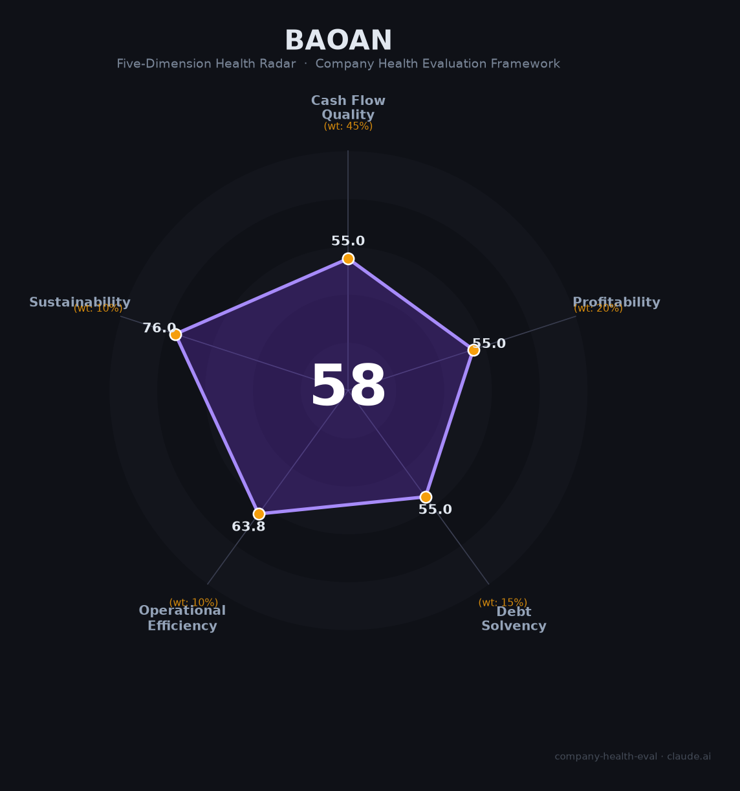

# 中国宝安（000009.SZ）财务健康评估（2026-08-14）

## 一句话结论

🟠 **58/100，中等** | 综合控股集团，营收增长、盈利薄负债重

---

## 一、公司基本画像

| 项目 | 内容 |
|------|------|
| 主体 | 中国宝安，深圳综合控股集团 |
| 主营 | 控股高新技术/生物医药/地产 |
| 财务 | 2025营收230.36亿(+13.87%)，归母净利2.03亿(+17.62%) |

> 一句话定性：多元控股，营收增长但净利率极低、负债偏高

---

## 二、五维财务健康评估

### 1. 现金流质量（55/100）| 权重45%

经营现金流偏弱。

### 2. 盈利能力（55/100）| 权重20%

净利率极低，盈利承压。

### 3. 偿债能力（55/100）| 权重15%

负债率偏高、偿债一般。

### 4. 运营效率（64/100）| 权重10%

运营效率一般。

### 5. 可持续发展（76/100）| 权重10%

多元布局分散风险，但盈利薄。

---

## 三、综合评分

| 维度 | 得分 | 权重 | 加权 |
|------|:----:|:----:|:----:|
| 现金流质量 | 55 | 45% | 24.8 |
| 盈利能力 | 55 | 20% | 11.0 |
| 偿债能力 | 55 | 15% | 8.2 |
| 运营效率 | 64 | 10% | 6.4 |
| 可持续发展 | 76 | 10% | 7.6 |
| **综合得分** | **58/100** | 100% | 58.0 |

**健康等级：中等** — 整体稳健，局部有待改善

---

## 四、核心风险清单

1. **净利率极薄**
2. **高负债**
3. **多板块管理复杂**

## 五、求职/择业视角

### 核心优势
- 多元产业集团、布局医疗/新材料
### 现有短板
- 盈利薄弱、高杠杆

**结论**：中国宝安多元控股集团，营收增长但盈利薄、负债重，稳健性偏弱。

---

*评估方法：商泰汽车（iAUTO）五维框架 · 数据截至2026年8月 · 财务来源中国宝安2025年报*