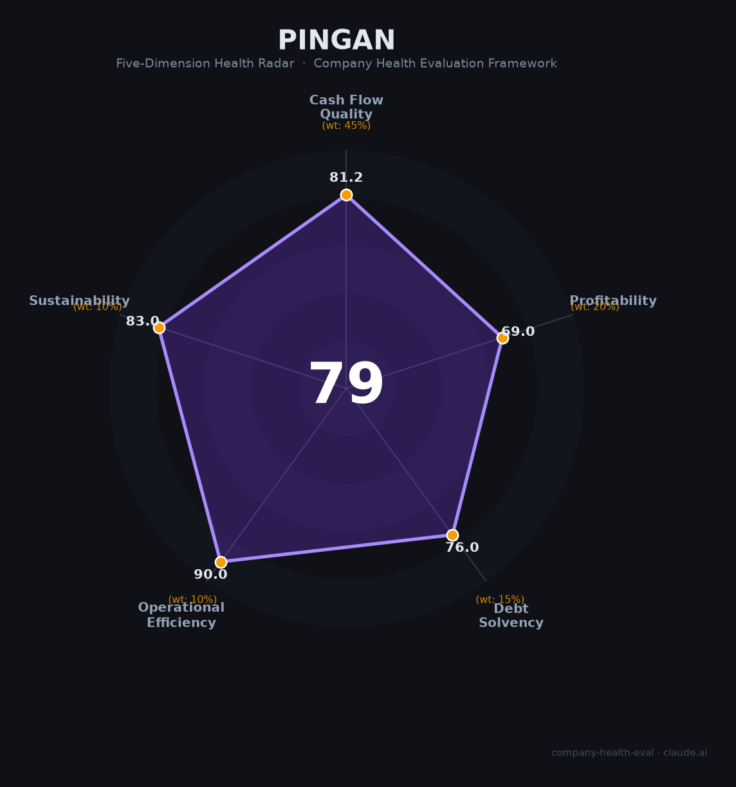

# 中国平安保险（集团）（601318.SH / 02318.HK）财务健康评估（2026-08-13）

## 一句话结论

🟡 **中等偏上（79/100）** | 中国综合金融龙头、深圳营收第一——万亿营收+千亿净利+6.49万亿投资组合，但高杠杆经营属性、利率下行利差损与地产敞口是核心隐忧

---

## 一、公司基本画像

| 项目 | 内容 |
|------|------|
| 主体 | 🔒 中国平安保险（集团）股份有限公司，注册深圳，A股：601318.SH（2007）、H股：02318.HK（2004）；中国最老牌的以保险为核心的综合金融集团 |
| 成立 | 🔒 1988年成立于深圳蛇口，1995年改制，2004年H股上市 |
| 股权 | 🔒 无控股股东、无实际控制人；香港中央结算、商发基金会及多家机构持股 |
| 规模 | 🔒 个人客户2.51亿（2025，+3.5%）；保险资金投资组合6.49万亿元；员工约30万+（集团口径，含代理人渠道） |
| 主营 | 「综合金融+医疗健康」双轮：寿险及健康险、财产保险、银行（平安银行）、资产管理、证券、信托、金融科技 |
| 财务 | 🔒 2025归母净利润1,347.78亿（扣非1,437.73亿，+22.5%）；营运利润1,344.15亿（+10.3%）；全年现金分红488.91亿（连续14年增长） |
| 资产 | 🔒 2025归母净资产10,004.19亿（首破万亿）；保险资金投资组合规模6.49万亿元；综合投资收益率6.3%（+0.5pct） |
| 分红 | 🔒 每股派息中期0.95元+末期1.75元，全年合计488.91亿元 |

> 一句话定性：中国平安是「综合金融+保险+银行+资管」全牌照的金融巨兽，也是深圳营收与利润的"压舱石"。作为雇主的吸引力在于「巨型平台+体系化晋升+稳定分红保障」，但保险业务增长放缓、利率下行利差损与不动产敞口是其长期结构性压力。

---

## 二、五维财务健康评估

> 说明：平安属于持牌综合金融集团，其"偿债"用偿付能力充足率、流动性管理与净现金视角理解（金融机构天然高杠杆，不以制造企业资产负债率标准衡量）。

### 1. 现金流质量（81/100）| 权重45%

| 指标 | 🔒 公开数据 | 评估 |
|------|-----------|------|
| 经营现金流净额 | 2024经营现金流净额3,825亿（雪球年报梳理）；产险2025经营活动现金净流入同比+48.3% | ✅ 健康：现金创造能力极强 |
| 现金及等价物 | 保险集团账面流动性充足，各子公司偿付能力符合监管要求 | ✅ 健康 |
| 有息负债 | 保险浮存金+债券/次级债经营负债，规模庞大（金融机构属性） | ⚠️ 关注：经营杠杆高但匹配资产 |
| 净现比 | 经营现金流/净利润显著 >1 | ✅ 健康：盈利含金量高 |

**小结**：作为综合金融集团，平安的现金流创造能力极强（经营现金流数千亿级），盈利含金量高，保险浮存特性天然带来稳定现金流入。需关注的是保险业务特有的"刚性兑付+长负债久期"属性对现金管理的依赖。

> 🔒 数据来源：中国平安2024-2025年报、雪球/新浪公开梳理、平安官网

### 2. 盈利能力（69/100）| 权重20%

| 指标 | 🔒 公开数据 | 评估 |
|------|-----------|------|
| 净利率 | 归母净利润1,347.78亿，净利率约13-14%（金融口径） | ✅ 良好：5-15%+ |
| 营收增速 | 2024营收1.029万亿，2025继续稳健小幅增长（平安整体营收基数极大） | ⚠️ 一般：高基数下低速 |
| 综合投资收益率 | 6.3%（2025，+0.5pct） | ✅ 较好：资产端回暖 |
| 偿付能力 | 各子公司偿付能力复核满足监管要求 | ✅ 强 |
| 人均产出 | 归母净利1,348亿/数十万人力，人均创利极高 | ✅ 优秀 |

**小结**：平安盈利规模庞大（归母净利1,348亿、扣非+22.5%），扣非增长强劲。但作为万亿营收航母，营收增速温和是其固有特征；盈利主要依赖投资端表现，综合投资收益率回升至6.3%是关键支撑。

### 3. 偿债能力（76/100）| 权重15%

| 指标 | 🔒 公开数据 | 评估 |
|------|-----------|------|
| 偿付能力充足率 | 集团及主要子公司偿付能力充足率复核满足监管要求 | ✅ 健康 |
| 资产负债率 | 金融机构高杠杆（资产负债率约85%+，属行业属性） | ⚠️ 关注：金融常态但绝对额大 |
| 流动性管理 | 资金流动性稳健、现金充沛 | ✅ 健康 |
| 资本充足 | 平安银行核心一级资本充足率9.36%（+0.24pct，监管7.75%） | ✅ 健康 |
| 股权质押 | 无实质性质押风险 | ✅ 健康 |

**小结**：平安的"偿债"以偿付能力充足率和资本充足率为核心，均稳健满足监管；但作为金融机构天然高杠杆，资产负债率绝对水平高，需要以偿付能力而非制造企业标准看待。分红后偿付能力仍符合要求，抗风险能力稳健。

### 4. 运营效率（90/100）| 权重10%

| 指标 | 🔒 公开数据 | 评估 |
|------|-----------|------|
| 运营效率 | 综合金融协同，"一个客户、多个产品"交叉销售，效率高 | ✅ 健康 |
| 客户集中度 | 2.51亿个人客户高度分散，零售+企业多客群 | ✅ 健康 |
| 员工/代理人趋势 | 代理人渠道改革提效，寿险新业务价值+29.3% | ✅ 健康：提效增长 |
| 高管稳定性 | 董事长马明哲长期掌舵，管理层连续稳定 | ✅ 健康：核心团队稳定 |

**小结**：平安运营效率优秀——13个月保单继续率97.4%、NBV+29.3%、银行净利400亿+，综合金融协同显著，管理层长期稳固。

### 5. 可持续发展（83/100）| 权重10%

| 指标 | 🔒 公开数据 | 评估 |
|------|-----------|------|
| 行业赛道空间 | 中国保险/养老/医疗健康长期赛道，深度老龄化红利 | ✅ 健康 |
| 技术壁垒 | 平安科技（AI、区块链、医疗科技）多年投入，护城河突出 | ✅ 健康 |
| 客户/业务多元化 | 寿险、产险、银行、资管、医疗五大板块高度多元化 | ✅ 健康 |
| 融资/资本支持 | 上市AH双平台+全牌照，资本补强能力强 | ✅ 健康 |
| 政策/监管风险 | 金融强监管+利率下行+地产风险暴露 | ⚠️ 关注：政策与利率核心变量 |

**小结**：长寿时代+养老医疗国家战略为平安提供长期空间，科技力和客户经营构筑护城河。但利率中枢下行导致的"长债资产收益率低+刚性负exec恩成本"利差损风险、以及地产/投资端资产质量是最需跟踪的变量。

---

## 三、综合评分与健康等级

| 维度 | 得分 | 权重 | 加权得分 |
|------|:----:|:----:|:--------:|
| 现金流质量 | 81.2 | 45% | 36.5 |
| 盈利能力 | 69.0 | 20% | 13.8 |
| 偿债能力 | 76.0 | 15% | 11.4 |
| 运营效率 | 90.0 | 10% | 9.0 |
| 可持续发展 | 83.0 | 10% | 8.3 |
| **综合得分** | **79/100** | **100%** | **79.0/100** |

**健康等级：🟡 中等偏上（Moderate-High）** — 稳健型，局部有短板但整体可控。

---

## 四、同业对标

| 对比项 | 中国平安 | 中国人寿 | 中国人保 | 中国太保 |
|--------|---------|---------|---------|----------|
| 2025归母净利 | 1,347.78亿 | ~400-500亿 | ~300亿级 | ~300亿级 |
| 综合投资收益率 | 6.3% | — | — | — |
| 保险护城河 | 综合金融+医疗 | 寿险龙头 | 财险龙头 | 寿险+财险 |
| 偿付能力 | 符合监管 | 符合监管 | 符合监管 | 符合监管 |
| 核心差异 | 综合金融服务+科技赋能 | 寿险规模最大 | 财险（PICC）绝对龙头 | 长三角寿险 |

**对标结论**：作为深圳营收第一的综合金融龙头，平安在规模、创新与综合金融协同上领先同业。相对纯寿险/纯财险公司，其多元化和科技布局是差异点；但同样是利率与投资环境敏感的高杠杆金融标的。

---

## 五、核心风险清单

1. **利率下行/利差损（高）**:长债资产收益率趋势性下行，若投资收益覆盖不了负债成本，将侵蚀利差；综合投资收益率虽回升至6.3%，但长期仍受利率中枢压制。
2. **资产端地产与投资敞口（中-高）**：集团在地产、另类资产的投资敞口在部分年份承压，需持续跟踪资产质量。
3. **金融强监管（中）**：保险、资管、银行综合持有对监管要求高，合规与资本充足率要求严格。
4. **新单增长承压（中）**：寿险寿险定价利率下调，新增业绩增长放缓，行业整体增长中枢下行。
5. **代理人转型（中）**：代理人改革进行中，"人海战术"向"产能驱动"转变，短期人力下降影响浮力。

---

## 六、求职/择业视角

### 核心优势
- **平台与品牌**：中国综合金融第一梯队的稳定平台，平安系在金融行业认知背书强；
- **体系与培养**：成熟的人才培养、晋升与轮岗体系；核心人员持股+长期服务计划覆盖超16万人；
- **稳定性**：现金流充沛、5000亿分红托底，未见过大规模裁员，裁员风险低；
- **业务多元**：银行、保险、资管等多板块，跨赛道转岗/跳槽机会多。

### 现存短板
- **薪酬竞争力**金融总部/后台岗位薪酬中等，弹性收入占比受业绩波动影响；一线销售（保险代理人）压力大、流动率高；
- **国企化与层级**：体量大、层级多，创新空间和高成长个股弹性不如互联网/科技；
- **利差与地产风险**：行业利率环境与投资端压力影响长期增长信心。

### 分场景建议

| 个人诉求 | 推荐 | 次选 | 规避 |
|----------|------|------|------|
| 稳定+深耕 | **中国平安**（总部/后台，稳定+体系） | 招商/工行 | 高波动小平台 |
| 高薪+跳板 | 互联网大厂/券商投行 | 平安金融科技/投资条线 | 纯销售岗 |
| 成长+融资红利 | 平安科技/AI团队 | 保险资管/投研 | 传统代理 |
| 多元+跨领域 | 平安（综合金融多板块） | 银行/券商集团 | 单一险种 |

---

## 七、总结

**中国平安是深圳营收第一、中国综合金融龙头的“压舱石”企业：**

现金流数千亿级、净利超千亿、综合投资收益率6.3%回升、2.51亿客户与十年连续分红（488亿），作为雇主平台极其稳定。

唯一短板是**收益率对利率深度敏感+资管与地产敞口+金融强监管**——长期业绩弹性有限，财富/零售金融转型仍在进行。

在利率下行、保险深度改革的大环境下，属于**中等偏上**风险等级，适合追求**稳定、体系化成长、金融平台背书**的求职者；不适合期待极高薪酬弹性（相对互联网）或快速高成长机会的人。

---

*评估方法：商泰汽车（iAUTO）五维企业健康度框架 · 数据截至2026年8月 · 🔒财务数据来源中国平安2024-2025年报（上市公司公告、雪球/新浪财经/平安官网）· 同业对比为公开市场估算*