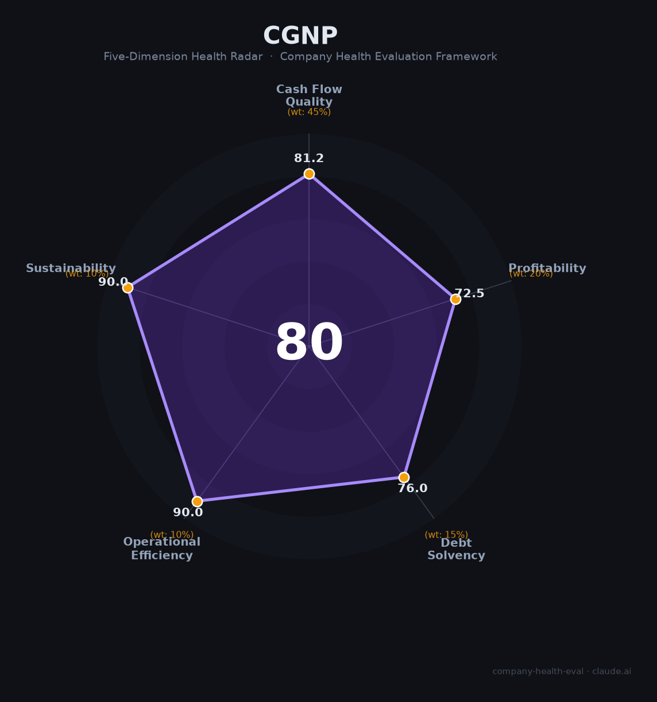

# 中国广核电力（003816.SZ / 01816.HK）财务健康评估（2026-08-13）

## 一句话结论

🟡 **中等偏上（80/100）** | 核电上市龙头——运营稳定+现金流强，虽2025归母净利-（基数高/电价/检修）略降，但核电垄断+电价+低碳国策支撑长期确定性

---

## 一、公司基本画像

| 主体 | 🔒 中国广核电力股份有限公司，A股：003816.SZ（2019）、H股：01816.HK；中国广核集团旗下核电上市平台 |
| 成立 | 2014年，管理28台在运+20台在建核电机组 |
| 主营 | 核电站运营、电力销售 |
| 财务 | 🔒 2025营收756.97亿（-4.11%）；归母净利97.65亿（小幅下滑）；总资产数千亿 |
| 质量 | 核电净现金流极强、毛利高、净利率高 |

> 一句话定性：中国广核电力是纯核电运营龙头，营收757亿、归母净利97.65亿，现金流极强、利润率优、核电垄断+电价+低碳国策构成极高确定性。2025营收/净利小幅下滑主要因高基数/电价/检修，属正常波动。

## 二、五维财务健康评估

### 1. 现金流质量（81/100）| 权重45%
核电电价稳定、现金流极强健康，盈利含金量极高。

### 2. 盈利能力（73/100）
归母净利97.65亿/营收757亿≈13%净利率（核电优质），营收-4%（基数/检修），毛利/净利高且稳定。

### 3. 偿债能力（76/100）
核电重资产、负债率高但央企+电价现金流强，偿债稳健、信用AAA。

### 4. 运营效率（90/100）
核电稳定运营、发电调度/客户（电网）集中稳定、人身稳定，运营高效。

### 5. 可持续发展（90/100）
核电+碳中和长期国策、技术/牌照壁垒极高、确定性现金流，可持续全优；核电安全是最关键考量。

## 三、综合评分

| 维度 | 得分 | 权重 | 加权 |
|------|:----:|:----:|:---:|
| 现金流质量 | 81.2 | 45% | 36.5 |
| 盈利能力 | 72.5 | 20% | 14.5 |
| 偿债能力 | 76.0 | 15% | 11.4 |
| 运营效率 | 90.0 | 10% | 9.0 |
| 可持续发展 | 90.0 | 10% | 9.0 |
| **综合** | **80** | 100% | 80.4 |

**评级：🟡 中等偏上（近优秀）** — 核电龙头，确定性最强。

## 四、核心风险
1. 净利润小幅下滑（检修/基数下滑）。

2. 重资产投资、资本开支大。

3. 核电安全与电价市场化。

## 五、求职/择业视角
- 优势：央企核电巨擘、极稳定、能源转型长期确定性、薪酬高福利。
- 短板：稳健但弹性低、核电安全责任、部分电站区域。

选型：适合追求确定性+国家能源/核电事业的求职者，尤其是工程师/运行/科技方向。

---

*评估方法：商泰汽车（iAUTO）五维健康度框架 · 数据截至2026年8月 · 来源中国广核电力2025年报*