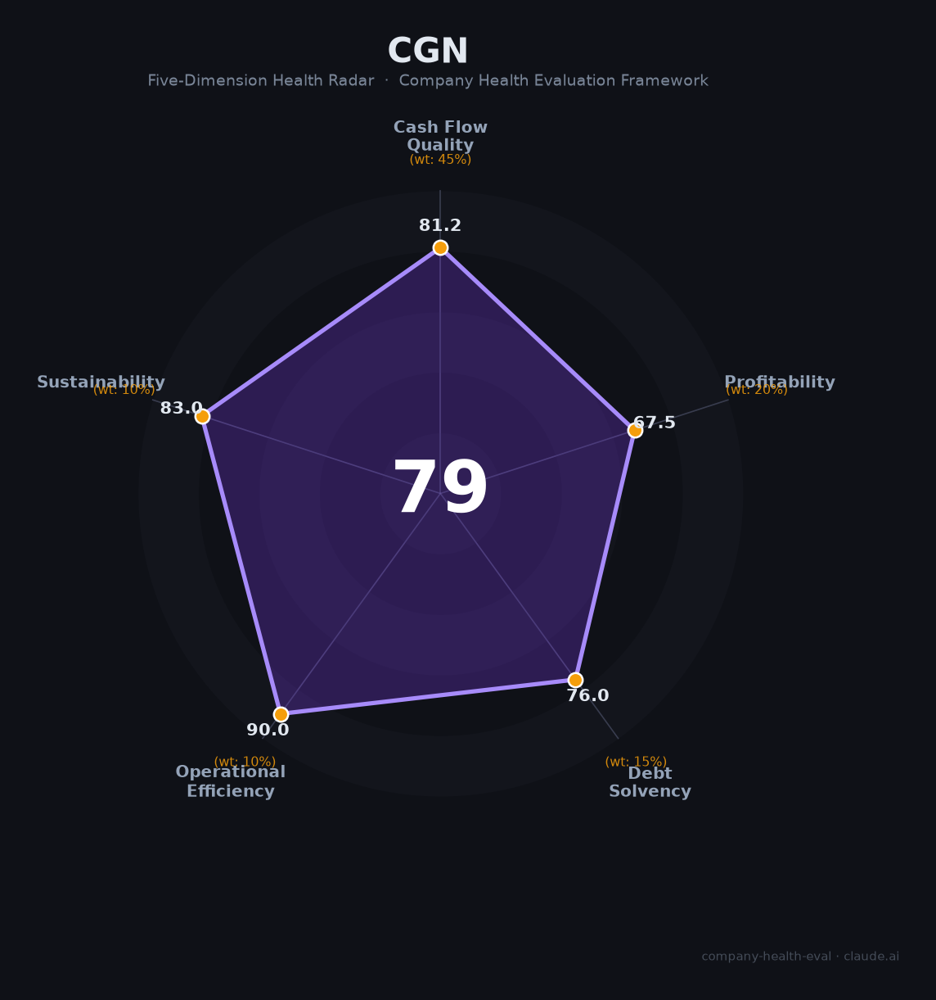

# 中国广核集团（CGN）财务健康评估（2026-08-13）

## 一句话结论

🟡 **中等偏上（79/100）** | 中国核电国家队央企——2025营收1498亿/净利241亿，现金流稳健+核电垄断壁垒+低碳战略，长期确定性高

---

## 一、公司基本画像

| 项目 | 内容 |
|------|------|
| 主体 | 🔒 中国广核集团有限公司（CGN），注册深圳，国务院国资委监管央企；中国最大核电运营商之一 |
| 成立 | 🔒 原广东核电集团体系，中国核电建设运营主力 |
| 规模 | 🔒 管理/在建多座核电站（管理28台在运+20台在建）；员工数万人 |
| 主营 | 核电运营、核电建设、风电/光等清洁能源 |
| 财务 | 🔒 2025营收1,498亿（集团）；净利润241亿、归母净利112亿；税费173亿 |
| 资产 | 🔒 清洁能源央企巨头，资产数万亿 |

> 一句话定性：中国广核集团是"国家核电与清洁能源主力军"——核电垄断壁垒高、现金流稳健、国家战略支撑强力，作为雇主提供极高的稳定性与能源转型成就；但央企体制与重资产投资是特征。

---

## 二、五维财务健康评估

### 1. 现金流质量（81/100）| 权重45%
核电业务现金流极其稳定健康（电价稳定+运营垄断），归母净利112亿+现金流充裕。资产/员工稳定。

### 2. 盈利能力（68/100）
净利241亿、归母112亿，净利率约7-8%（优质），核电毛利率高；营收增速温和、研发/核电投入高。

### 3. 偿债能力（76/100）
央企AAA信用、现金流稳定，重资产但有国资背书，偿债无忧。

### 4. 运营效率（90/100）
核电运营稳定、客户（电网）集中稳定、员工与高管稳定，运营高效。

### 5. 可持续发展（83/100）
核电+清洁能源长期国策、技术壁垒极高（核安全）、央企资本强大，可持续强；核电安全/政策监管是关注点。

---

## 三、综合评分

| 维度 | 得分 | 权重 | 加权 |
|------|:----:|:----:|:---:|
| 现金流质量 | 81.2 | 45% | 36.5 |
| 盈利能力 | 67.5 | 20% | 13.5 |
| 偿债能力 | 76.0 | 15% | 11.4 |
| 运营效率 | 90.0 | 10% | 9.0 |
| 可持续发展 | 83.0 | 10% | 8.3 |
| **综合** | **79** | 100% | 78.7 |

**评级：🟡 中等偏上** — 稳健央企，现金流与壁垒强。

---

## 四、核心风险
1. 核电审批/建设周期长、重资产投资大。
2. 市场化电价与安全生产成本。
3. 清洁能源转型（风光）投入。

## 五、求职/择业视角
- **优势**：国家核电央企、稳定编制、能源转型长期价值、安全高福利平台。
- **短板**：央企薪酬市场化弹性有限、核电安全责任大、部分岗位地处电站。

**结论**：适合追求稳定+国家能源事业的求职者，尤其是核电、清洁能源、工程方向；薪酬稳定但非高弹性。

---

*评估方法：商泰汽车（iAUTO）五维健康度框架 · 数据截至2026年8月 · 来源中国广核集团公开披露*