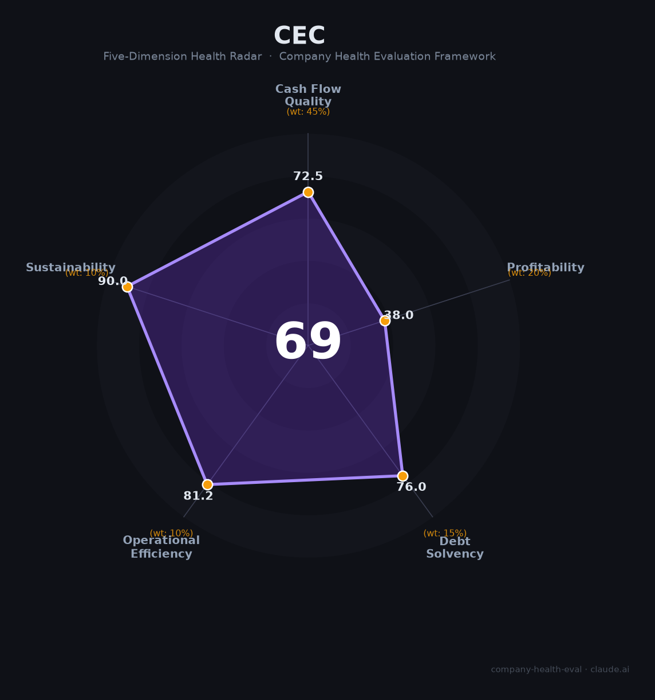

# 中国电子信息产业集团（CEC）财务健康评估（2026-08-13）

## 一句话结论

🟠 **中等（69/100）** | 中国"自主可控/网络安全"国家队央企——18万员工+涉军电子+安全可控生态，但盈利极薄（净利率0.1%、ROE 0.3%）+营收下滑是核心矛盾

---

## 一、公司基本画像

| 项目 | 内容 |
|------|------|
| 主体 | 🔒 中国电子信息产业集团有限公司（CEC，China Electronics），总部深圳南山，国务院国资委监管的中央企业；《财富》中国500强第114位、世界500强 |
| 代表 | 🔒 已故原电子工业部系统，中国电子工业"国家队"，聚焦集成电路、网络安全、自主可控 |
| 规模 | 🔒 员工183,469人（约18.3万）；总资产约6,109亿美元（约4.4万亿RMB）+ |
| 主营 | 自主可控（芯片/操作系统/整机）、网络安全、军工电子、电子信息制造 |
| 财务 | 🔒 2023营收353.91亿美元（约2,664亿RMB，-12.2%）；净利润仅2,680万美元（极低） |
| 盈利 | 🔒 净利率0.1%、ROE 0.3%（2023，财富口径）；盈利极弱 |
| 性质 | 🔒 涉军电子+信创自主可控+网络安全国家队的超级央企平台 |

> 一句话定性：中国电子（CEC）是"国家网络安全与自主可控"的核心央企，整合了中电长城、中软、奇安信系、中国信安等资产，规模庞大（18万员工、营收2644亿）、涉足涉密与安全可控生态，承担"卡脖子"攻关。但作为雇主的另一面是**盈利极薄（净利率0.1%）**与国资体制的双重特征——稳定、有国家战略背书，但市场化激励与利润弹性弱。

---

## 二、五维财务健康评估

### 1. 现金流质量（72/100）| 权重45%

| 指标 | 🔒 公开数据 | 评估 |
|------|-----------|------|
| 经营现金流 | 央企体系现金流稳定，涉军/政府业务回款有保障 | ✅ 健康 |
| 现金及等价物 | 央企资本+政府订单现金流 | ⚠️ 关注：市场化业务回款期长 |
| 有息负债 | 万亿级资产+投资，负债规模大 | ⚠️ 关注 |
| 净现比/分红 | 央企分红与资产运营回笼 | ✅ 健康 |

**小结**：作为央企，CEC现金流整体稳定（国资信用背书+涉密订单），但投资规模大、涉密/网络安全业务回款周期长。整体"稳定但重投资"。

> 🔒 数据来源：中国电子财富中国500强档案、爱企查年报、CEC官网

### 2. 盈利能力（38/100）| 权重20%

| 指标 | 🔒 公开数据 | 评估 |
|------|-----------|------|
| 净利率 | 0.1%（2023，财富口径） | 🔴 预警：极低/亏损边缘 |
| 毛利率 | 电子装备/整机毛利低 | ⚠️ 一般 |
| 营收增速 | -12.2%（2023） | 🔴 预警：负增长 |
| 研发/自主可控 | 自掌控芯片/OS/安全投入高 | ✅ 优秀 |
| 人均产出 | 营收2640亿/21万人，人均产出低 | 🔴 预警 |

**小结**：盈利能力是CEC最大短板——净利率仅0.1%、ROE 0.3%，几乎"为使命而运转"。营收负增长（-12.2%），虽有自主可控高研发投入（值得肯定），但整体盈利质量极薄，反映涉密/整机业务毛利率低+体量大而利润薄。

### 3. 偿债能力（76/100）| 权重15%

| 指标 | 🔒 财务数据 | 评估 |
|------|-----------|------|
| 资产负债率 | 央企杠杆，负债规模大 | ⚠️ 关注 |
| 有息负债率 | 大额投资融资 | ⚠️ 关注 |
| 流动性 | 国资体系资金充裕 | ✅ 健康 |
| 信用/背书 | 央企AAA信用 | ✅ 健康 |
| 质押 | 央企无实质质押 | ✅ 健康 |

**小结**：偿债能力强——央企国资背书、AAA信用、资金调配灵活，虽然杠杆大（万亿级），但作为国资委直管央企违约风险极低。

### 4. 运营效率（81/100）| 权重10%

| 指标 | 🔒 数据 | 评估 |
|------|-----------|------|
| 应收周转 | 涉密/政企回款周期长 | ⚠️ 关注 |
| 客户分散 | 政府/军队/企业多方 | ✅ 健康 |
| 员工规模 | 18.3万，稳定 | ✅ 健康 |
| 管理稳定 | 国资委任命，稳定 | ✅ 健康 |

**小结**：运营效率中上——18万人央企体系管理，客户多元（涉军/政务/企），但政企回款周期长、生产体系庞大冗余，效率受国企体制限制。

### 5. 可持续发展（90/100）| 权重10%

| 指标 | 🔒 数据 | 评估 |
|------|-----------|------|
| 行业赛道 | 自主可控/信创/网络安全/军工电子，政策长期支撑 | ✅ 健康 |
| 技术壁垒 | 芯片/OS/安全可控生态，壁垒高 | ✅ 健康 |
| 多元化 | 电子信息、网络安全、军工、信创多板块 | ✅ 健康 |
| 资本/政策 | 央企国资+国家战略资源 | ✅ 健康 |
| 政策/监管 | 自主可控强政策托底 | ✅ 健康 |

**小结**：可持续性最强——作为"自主可控国家队"，CEC享受国家战略级政策红利（信创、国产化、军工），技术壁垒与多元化、政治背书全优，是"政策护城河"最深的企业之一。

---

## 三、综合评分与健康等级

| 维度 | 得分 | 权重 | 加权得分 |
|------|:----:|:----:|:--------:|
| 现金流质量 | 72.5 | 45% | 32.6 |
| 盈利能力 | 38.0 | 20% | 7.6 |
| 偿债能力 | 76.0 | 15% | 11.4 |
| 运营效率 | 81.2 | 10% | 8.1 |
| 可持续发展 | 90.0 | 10% | 9.0 |
| **综合得分** | **69/100** | **100%** | **68.7/100** |

**健康等级：🟠 中等（Moderate）** — 央企战略价值高但盈利极弱。

---

## 四、同业对标

| 对比项 | 中国电子(CEC) | 中国电科(CETC) | 中国电子科技兵装 | 华为 |
|--------|:-----:|:------:|:------:|:---:|
| 定位 | 自主可控央企 | 军工电子央企 | — | 民营科技 |
| 营收 | ~2664亿 | ~万亿 | — | 8809亿 |
| 净利率 | 0.1% | — | — | 7.7% |
| 员工 | 18.3万 | ~20万 | — | 21.3万 |

**对标结论**：CEC与姊妹单位中国电科（CETC）同属军工+自主可控央企体系，规模和战略地位相当，但盈利能力（净利率0.1%）显著低于市场化科技企业（华为7.7%）。作为雇主，央企稳定性远强于市场化公司，但利润弹性极弱。

---

## 五、核心风险清单

1. **盈利极弱（中-高）**：净利率0.1%、ROE 0.3%，利润几乎为0，长期依赖国资输血与战略订单；盈利激励弱。
2. **营收负增长（中）**：近年营收-12.2%，整合调整期。
3. **国企体制（中）**:薪酬市场化程度低、晋升论资排辈、激励弹性弱。
4. **涉密与市场化限制（低）**：部分业务涉密，职业流动性受限。
5. **整合阵痛（中低）**：央企整合/重组频繁，组织变动。

---

## 六、求职/择业视角

### 核心优势
- **国家战略平台**：自主可控/网络安全国家队，稳定性与成就感受到极高的社会认可；
- **稳定垄断**：央企铁饭碗、编制稳定、涉密业务，裁员风险极低；
- **国产化赛道**：芯片/OS/信创/军工电子，国家钱和政策持续托底。

### 现有短板
- **薪酬天花板低**：央企平均薪水显著低于市场化科技公司，涨薪慢；
- **盈利弱**：集团整体盈利极弱，激励/奖金有限；
- **体制与效率**：层级固化、论资排辈、市场化晋升较慢；
- **涉密限制**：部分岗位涉密，流动/跳槽受限。

### 分场景建议

| 个人诉求 | 推荐 | 次选 | 规避 |
|----------|------|------|------|
| 稳定+国家事业 | **中国电子**（安全可控/军工）| 中国电科 | 高波动 |
| 高薪+市场化 | 华为/大厂 | 中电投 | 普通央企 |
| 自主可控风口 | CEC信创/OS/芯片 | 海光/麒麟 | 传统制造 |
| 多元+技术 | CEC（安全/军工）| 中国电科 | 涉密过深 |

---

## 七、总结

**中国电子（CEC）是"自主可控与网络安全的国家队央企"——18万人、近千亿营收、国家战略地位，作为雇主提供极高的稳定性与国产事业的机遇。**

唯一短板是**盈利极弱（净利率0.1%）+央企体制薪酬天花板**——利润薄、激励弱、市场化弹性不足。

在国产替代、信创、军工电子大趋势下，属于**中等**风险等级，适合追求**稳定+国家战略意义**、愿意在体制内发展的求职者；对追求高薪、高市场度发展者，民营科技/市场化企业平台更优。

---

*评估方法：商泰汽车（iAUTO）五维企业健康度框架 · 数据截至2026年8月 · 财务数据来源财富中国500强档案(2023) · 央企财务状况以公开整理为准*