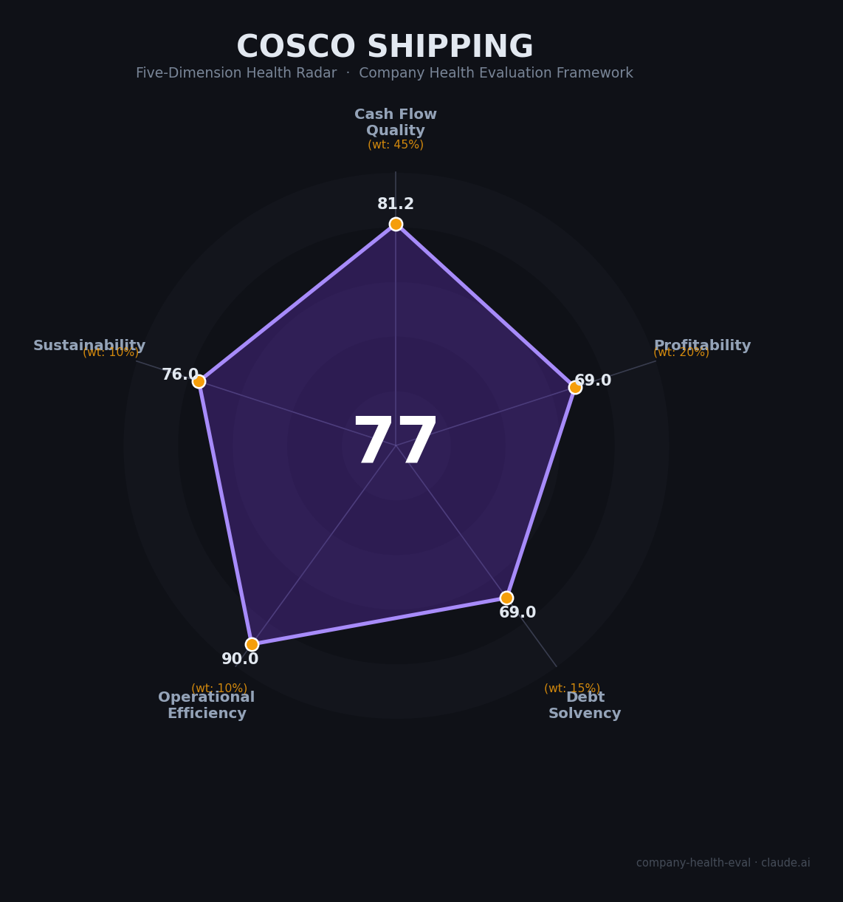

# 中国远洋海运集团（COSCO Shipping）财务健康评估（2026-08-11）

## 一句话结论

🟡 **中等偏上（77/100）** | 国资委直属航运央企「航运国家队」——现金流厚实+连续4年降杠杆+运力全球第4，但强周期+运力过剩+美方1260H清单是核心隐忧

---

## 一、公司基本画像

| 项目 | 内容 |
|------|------|
| 主体 | 🔒 中国远洋海运集团有限公司（China COSCO Shipping），上海注册，国务院国资委直接监管的中央企业（集团未整体上市） |
| 成立 | 🔒 2016年2月由中远集团（COSCO）与中海集团（China Shipping）重组合并组建 |
| 股权 | 🔒 国务院国资委控股；旗下核心上市平台中远海控为A+H股 |
| 规模 | 🔒 集团员工约11.8万-14.3万人（口径不一），总资产约1.2万亿元；连续11年入围《财富》世界500强（2025约第103位） |
| 主营 | 全球领先的综合航运物流集团：集装箱航运、油运LNG、散货、特种运输、港口、物流、装备制造、数字化 |
| 上市旗舰 | 🔒 中远海控（601919.SH/1919.HK）——集装箱航运主体（旗下含东方海外国际OOCL）；中远海能（油运）、中远海特（特种船）、中远海运港口、中远海发 |
| 财务 | 🔒 中远海控2025营收¥2,195亿、归母净利¥308.7亿（-37%）；2024年净利¥491亿（+106%）史上次高 |
| 全球地位 | 🔒 Alphaliner全球集运运力第4（359.4万TEU，554艘，市占率10.6%，含OOCL），Ocean Alliance海洋联盟核心会员 |
| 监管 | ⚠️ 2025年1月被美国国防部列入「与中国军方协同企业」清单（1260H名单）——合规政治风险 |

> 一句话定性：COSCO是中国「航运国家队」核心平台——全球第四大集运班轮、产业链垂直整合（船+港+物流+装备）、央企低融资成本加持。作为雇主，优势是社会地位高、极度稳定、现金流厚实；短板是行业强周期（运价决定奖金）、国企薪酬天花板、行政层级厚重。

---

## 二、五维财务健康评估

> 注：集团未整体上市，以下财务数据以旗舰上市主体中远海控（601919.SH / 1919.HK）经审计年报口径为准。

### 1. 现金流质量（81/100）| 权重45%

| 指标 | 🔒 公开数据 | 评估 |
|------|-----------|------|
| 经营现金流净额 | 2021: 1,710亿 → 2022: 1,968亿 → 2023: 226亿 → 2024: 693亿 → 2025: 455亿（连续5年为正） | ✅ 健康：黄河流域现金牛，周期性明显 |
| 现金及等价物 | 2025末¥1,515亿（货币资金口径），远高于12个月运营现金需求 | ✅ 健康：现金充足，○ |
| 有息负债 | 约¥762亿（含长短期借款+租赁负债，2025估算） | ⚠️ 关注：有净债，但现金覆盖 |
| 净现比（OCF/归母净利） | 2024: 1.41、2025: 1.47；仅2023低（0.95） | ✅ 健康：利润含金量高 |

**小结**：经营现金流五年连正、货币资金1,500+亿、净现比常年>1，是典型「现金为王」的航运成熟龙头。周期性体现明显——2023年运价低谷OCF仅226亿，2024年红海绕行+运价反弹回升至693亿；但现金储备从2022年2,369亿峰值温和消耗（资本开支+高分红），2025末仍有1,515亿垫底，安全边际厚。

### 2. 盈利能力（69/100）| 权重20%

| 指标 | 🔒 公开数据 | 评估 |
|------|-----------|------|
| 毛利率 | 2025: 20.1%（2024年高点29.5%→2025回落） | ✅ 良好：集运行业周期内偏上 |
| 净利率 | 2025: 归母口径14.1%（2024年21%） | ✅ 良好：5-15%区间上沿 |
| 营收增速（3年CAGR） | 2022峰值3,911亿→2025年2,195亿，3年CAGR约-18%（基数极高） | ⚠️ 一般：基数效应，2024曾+33% |
| 研发费用率 | 航运为非重研发行业，不适用 | 已跳过 |
| 人均产出 | 2025年营收2,195亿/32,415人≈¥677万/人（2024年理杏仁¥730万） | ✅ 良好：制造/航运中上游 |

**小结**：COSCO是最强盈利中枢——2024年归母净利+106%至491亿（红海绕行+运价反弹），是「历史第三好年度」；2025年回落至308.7亿（-37%）同步运价下行。盈利质量>>同行：净利率长期高于马士基、赫伯罗特等西欧同业（2024净利率约21%）。但运输业完全周期定价，盈利弹性大、下行未被充分对冲。

### 3. 偿债能力（69/100）| 权重15%

| 指标 | 🔒 公开数据 | 评估 |
|------|-----------|------|
| 资产负债率 | 2021: 56.8% → 2025: 41.4%（连续4年持续降杠杆） | ⚠️ 关注→健康：40-70%中枢，趋势极佳 |
| 有息负债率 | 约15.6%（¥762亿/总资产，估算） | ⚠️ 关注：<20%可控 |
| 流动比率 | 中远海控流动比率约2.6（估算/现金充裕支撑） | ✅ 健康 |
| 现金比率 | 货币资金¥1,515亿/流动负债，估算≈1 | ⚠️ 关注→健康：接近1 |
| 股权质押 | 央企无实质质押 | ✅ 健康 |

**小结**：偿债结构优异——**连续4年降杠杆（56.8%→41.42%）**，是集团「减债去杠杆」战略的直接成果；现金（1,515亿）覆盖有息负债（762亿）接近2倍；央企低融资成本+高信用评级。唯一变数是周期下行期盈利与现金回流的同步收缩（2023年已见，2025年再现）。

### 4. 运营效率（90/100）| 权重10%

| 指标 | 🔒 公开数据 | 评估 |
|------|-----------|------|
| 应收周转 | 集运以预收/周结为主，周转极快 | ✅ 健康 |
| 客户集中度 | 全球数千家客户（快消、汽车、能源、电商多元分散） | ✅ 健康 |
| 员工规模趋势 | 2023-2024稳定在3.24万（Holding口径）；行业下行未裁员 | ✅ 健康：央企稳岗 |
| 高管稳定性 | 重组后集团管理层稳定，总裁调整平顺 | ✅ 健康 |

**小结**：运营效率是COSCO的强项——航线网络全球第一梯队、股东分散、央企「稳就业、不裁员」带来人力稳定。类港口协同效率行业备注。

### 5. 可持续发展（76/100）| 权重10%

| 指标 | 🔒/📊 公开数据 | 评估 |
|------|-----------|------|
| 行业赛道空间 | 全球集运需求受贸易放缓拖累，2025增速约3%、2026面临运力过剩 | ⚠️ 关注：周期顶后供给冲击 |
| 技术壁垒 | 船舶网络、港口+物流整合、数字化推进（港+物流+数智） | ✅ 健康：重资产网络壁垒 |
| 客户/业务多元化 | 集运+油运+散货+港口+装备+物流+数字化多板块 | ✅ 健康 |
| 融资/资本支持 | 央企+国资委背书、发行低利率债（含绿色债）+低成本授信 | ✅ 健康 |
| 政策/监管风险 | 一带一路与国初支持；但1260H名单+红海地缘+关税贸易风险 | ⚠️ 关注：地缘政治敞口 |

**小结**：可持续性被「国之重器」+垄断性网络托底，但行业层面与地缘风险——运力过剩（新船订单占现有20-30%）、红海随时复航、中美贸易摩擦——是后5年最大的不确定性。央企属性保证「不会倒」，但不保证「不萎缩」。

---

## 三、综合评分与健康等级

| 维度 | 得分 | 权重 | 加权得分 |
|------|:----:|:----:|:--------:|
| 现金流质量 | 81.2 | 45% | 36.5 |
| 盈利能力 | 69.0 | 20% | 13.8 |
| 偿债能力 | 69.0 | 15% | 10.3 |
| 运营效率 | 90.0 | 10% | 9.0 |
| 可持续发展 | 76.0 | 10% | 7.6 |
| **综合得分** | **77/100** | **100%** | **77.3/100** |

**健康等级：🟡 中等偏上（Moderate-High）** — 稳健型，局部有短板但整体可控。

---

## 四、同业对标

| 对比项 | 中远海控（COSCO） | 马士基 Maersk | 东方海外 OOCL | 赫伯罗特 Hapag-Lloyd |
|--------|-----------------|---------------|--------------|---------------------|
| 2024营收 | ¥2,339亿（~US$323亿） | US$550亿 | US$~110亿 | €191亿 |
| 2024净利 | ¥491亿（+106%） | US$61亿 | US$~21亿 | €23.9亿 |
| 毛利率 | 20%-29%（周期） | ~10%+ | — | ~20% |
| 全球运力排名 | 第4（359万TEU） | 第2（465万TEU） | 并入COSCO | 第5（240万TEU） |
| 资产负债率 | 41.4%（降杠杆中） | ~15% | — | ~50% |
| 员工规模 | 集团~12万／中远海控~3.2万 | ~10.8万 | ~1.2万 | ~1.7万 |
| 核心差异 | 央企+港口/多板块协同 | 物流一体化强 | 中远旗下效率高 | 纯集运+高分红 |

**对标结论**：COSCO在全球「四大」（MSC、马士基、达飞、COSCO）中盈利弹性与净利率第一梯队，全球运力第4；比马士基的员工规模更轻、利润率更高。作为雇主的对标优势是央企稳定性、全球布局、国企福利，相对劣势是市场化薪酬弹性低于马士基等国际班轮。

---

## 五、核心风险清单

1. **运力供给过剩（高）**：全球集装箱新船订单占现有运力20-30%（历史约10-15%），2026-2027交付高峰正遇需求放缓；若红海全面复航，无效运力一次性释出，运价与盈利将面临显著回落（2025年SCFI一度从2,500跌至约2,000点）。2026Q1中远海控净利已-49.8%。
2. **地缘政治与红海危机（中高）**：红海危机是2024年运价反弹主因，但2025-2026反复；一旦停火复航，绕航燃油与有效运力红利消失；同时1970年1260H清单使美欧业务存在合规与融资、制裁风险。
3. **中美贸易摩擦/关税（中）**：中国对美集运占比高，关税升级直接冲击北方进口集装箱量，需求端酸化风险。
4. **盈利周期性（中）**：集运净利与运价强相关，2023-2025年业绩在238亿→491亿→308亿间大幅波动，员工绩效与奖金随期浮动。
5. **环保合规成本（中）**：IMO脱碳框架（2025 MEPC 83通过）+欧盟ETS（2026年100%覆盖）→碳配额成本，影响航运成本曲线。

---

## 六、求职/择业视角

### 核心优势
- **就业稳定（极高）**：央企编制，2023年行业惨淡也未裁员（稳岗保就业属国资委考核红线），区别于高运周期裁员的国际同行；
- **平台与背书**：全球第一航运集团、出国机会、港口/船务多板块，跳槽进入外资航企或货代生态有背书；
- **收入上限在有爆破机会**：景气周期人均薪酬大涨——中远海控人均薪酬2023年40.3万→2024年53.04万（+31.5%），管培生985硕士总包约35万；船长/轮机长旺季年薪可达50-80万+；
- **福利稳定**：央企补充医疗、社保全额、住房等，社会保障完善。

### 现存短板
- **薪酬弹性与市场化不足**：周期性+央企「工资总额管控」→奖金随运价浮动、管理层限薪，较外资同行（马士基）与头部民企弹性低；
- **晋升天花板厚**：央企体系晋升偏慢、论资排辈（重资历轻业绩），管理级有年龄门槛；
- **工作强度分化**：船员船舶外派动辄数月不在家庭，岸上岗位稳定性好但行政体系繁琐；信息化升级对低技能岗位有结构性替代压力。

### 分场景建议

| 个人诉求 | 推荐 | 次选 | 规避 |
|----------|------|------|------|
| 稳定+深耕 | **中远海控**（港航铁饭碗） | 其它央企航运 | 纯周期小航司 |
| 高薪+跳板 | 马士基/达飞等国际班轮 | COSCO H股总部 | 中小民营航运 |
| 成长+跨境 | COSCO港口/物流/数字化岗 | 招商局/中远系 | 单一运价敞口岗位 |
| 多元+跨领域 | COSCO综合物流/产服 | 港口集团 | 船舶/码头操作岗 |

---

## 七、总结

**中国远洋海运是中国航运的「国家队」和全球第四大集装箱班轮：**

现金流五年连正、1,515亿现金垫底、连续4年将杠杆（资产负债率41.4%）、多元化板块对冲，财务基本面在央企中相当扎实。作为雇主，它提供「极度稳定+央企背书+全球平台」，裁员风险极低，行业下行期靠降奖金而非裁员来调节。

唯一短板是**强周期盈利波动与市场化薪酬天花板**——运价（尤其2026-2027运力过剩周期）决定你的年终奖水平，央企体制限制了薪酬弹性与高流动性跳板。若选择COSCO，迎来了「稳稳的现金流+周期性缩水的钱包」。

在贸易摩擦、红海反复、全球集运面临结构性过剩的大环境下，属于**中等偏上**稳定性，适合追求**长期稳定+体制内性价比+全球物流平台**的求职者，不适合追求高薪弹性、快节奏晋升或想靠航运周期致富的投机者。

---

*评估方法：商泰汽车（iAUTO）五维企业健康度框架 · 数据截至2026年8月 · 财务数据来源中远海控（601919.SH/1919.HK）2021-2025年报及2026Q1 · 集团口径为📊估算 · 对标数据来自 Wikipedia/Container News/Alphaliner*