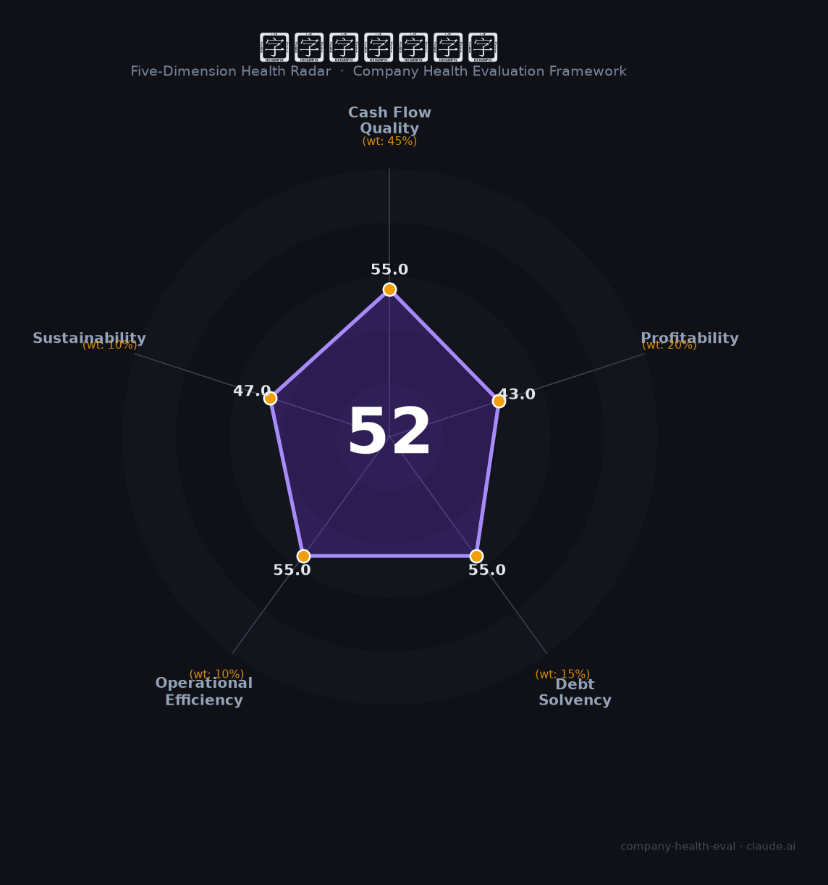

# 中建二局二公司（—（中国建筑旗下））财务健康评估（2026-08-14）

## 一句话结论

🔴 **52/100，中等偏下** | 建筑施工央企平台，规模大、利润薄

---

## 一、公司基本画像

| 项目 | 内容 |
|------|------|
| 主体 | 中建二局二公司，中国建筑区域工程局 |
| 主营 | 房屋建筑/基建施工 |
| 财务 | 依托中建集团，营收大、成本薄 |

> 一句话定性：建筑施工央企，规模大、利润薄

---

## 二、五维财务健康评估

### 1. 现金流质量（55/100）| 权重45%

工程回款，现金流偏紧。

### 2. 盈利能力（43/100）| 权重20%

毛利低。

### 3. 偿债能力（55/100）| 权重15%

高杠杆。

### 4. 运营效率（55/100）| 权重10%

效率一般。

### 5. 可持续发展（47/100）| 权重10%

建工下行+竞争。

---

## 三、综合评分

| 维度 | 得分 | 权重 | 加权 |
|------|:----:|:----:|:----:|
| 现金流质量 | 55 | 45% | 24.8 |
| 盈利能力 | 43 | 20% | 8.6 |
| 偿债能力 | 55 | 15% | 8.2 |
| 运营效率 | 55 | 10% | 5.5 |
| 可持续发展 | 47 | 10% | 4.7 |
| **综合得分** | **52/100** | 100% | 51.8 |

**健康等级：中等偏下** — 存在较多风险点，需谨慎评估

---

## 四、核心风险清单

1. **建工回款**
2. **地产/基建下行**
3. **利润薄**

## 五、求职/择业视角

### 核心优势
- 央企平台、规模、稳定
### 现有短板
- 利薄、周期下行

**结论**：中建二局二公司建筑施工央企，规模大、利润薄、回款长，适合稳定，成长性限。

---

*评估方法：商泰汽车（iAUTO）五维框架 · 数据截至2026年8月 · 财务来源中国建筑2025年报*