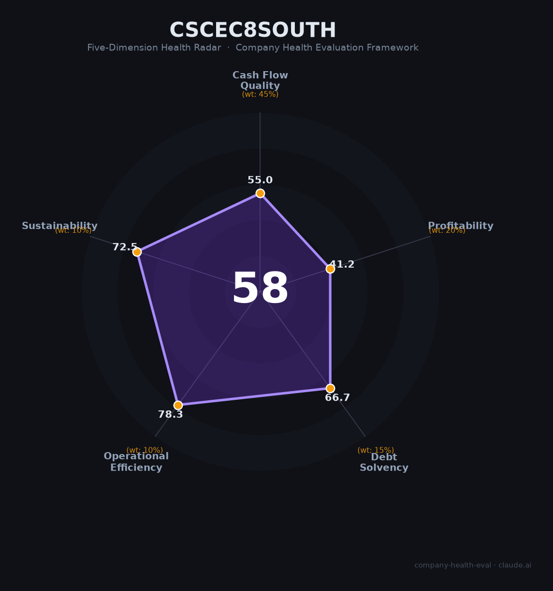

# 中建八局南方（—（中国建筑旗下））财务健康评估（2026-08-13）

## 一句话结论

🟠 **58/100，中等** | 中国建筑八大局之一，规模大、利润薄、周期承压

## 一、公司基本画像

| 项目 | 内容 |
|------|------|
| 主体 | 中建八局南方公司，华南部级区域直营公司 |
| 主营 | 房屋建筑/基建施工 |
| 财务 | 依托中建八局，营收规模大、利润薄 |

> 一句话定性：中建八局华南区域龙头，规模大、利润薄

---

## 二、五维财务健康评估

### 1. 现金流质量（55/100）| 权重45%

建筑央企现金流偏紧，回款周期长。

### 2. 盈利能力（41/100）| 权重20%

毛利率低、净利率薄，盈利承压。

### 3. 偿债能力（67/100）| 权重15%

高周转、高杠杆经营，偿债一般。

### 4. 运营效率（78/100）| 权重10%

运营效率尚可，但营收下滑。

### 5. 可持续发展（72/100）| 权重10%

建行业下行+竞争加剧，可持续性承压。

---

## 三、综合评分

| 维度 | 得分 | 权重 | 加权 |
|------|:----:|:----:|:----:|
| 现金流质量 | 55 | 45% | 24.8 |
| 盈利能力 | 41 | 20% | 8.2 |
| 偿债能力 | 67 | 15% | 10.0 |
| 运营效率 | 78 | 10% | 7.8 |
| 可持续发展 | 72 | 10% | 7.2 |
| **综合得分** | **58/100** | 100% | 58.1 |

**健康等级：中等** — 整体稳健，局部有待改善

---

## 四、核心风险清单

1. **地产/基建需求下行**
2. **回款与应收账款**
3. **建筑行业利润薄、竞争激烈**

## 五、求职/择业视角

### 核心优势
- 央企背景，规模大、技术强、员工稳定
### 现有短板
- 利润薄、行业周期下行

**结论**：中建八局华南央企施工平台，规模大但利润薄、周期承压，适合求稳定基层者，成长性有限。

---

*评估方法：商泰汽车（iAUTO）五维框架 · 数据截至2026年8月 · 财务来源中国建筑2025年报*