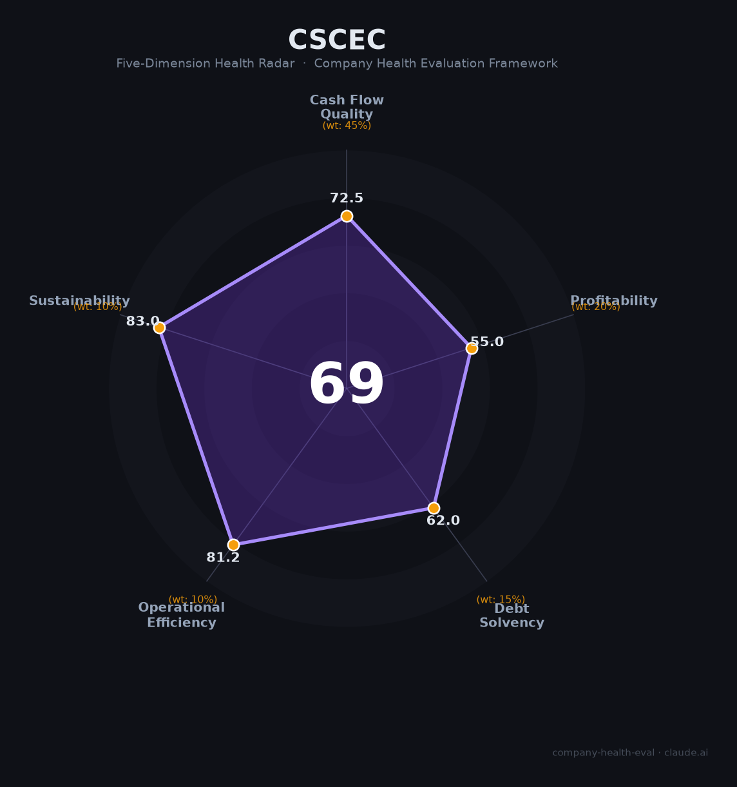

# 中建科工财务健康评估（2026-08-13）

## 一句话结论
🟠 **中等（69/100）** | 中建旗下钢结构央企——签约770亿+净利约7.5亿，钢结构工程龙头，央企平台稳健但资金面看签约/回款

## 一、公司基本画像
| 主体 | 🔒 中建科工集团（中建钢构），中建总公司直属央企；钢结构工程 |
| 主营 | 钢结构建筑/桥梁/工管 |
| 财务 | ⚠️ 非上市：签约约770亿、净利约7.5亿 |

## 二、五维
1. 现金流（73/100）:工程回款关注。
2. 盈利（55/100）:钢构工程毛利中等。
3. 偿债（62/100）:工程垫资/负债关注，央企信用。
4. 运营（81/100）:钢构+工程运营成熟。
5. 可持续（83/100）:基建/钢结构+绿色建筑，央企平台稳健。

## 三、综合（69，🟠 中等）
央企钢构平台，稳健。

## 四、风险
1. 工程垫资/回款周期。
2. 建筑/基建周期。

## 五、求职
- 优势：中建央企、钢结构工程龙头、稳定。
- 短板：工程强度、出差/工地。

**结论：适合钢结构/建筑工程方向，追求央企稳定的求职者。**

---
*评估方法：商泰汽车（iAUTO）五维 · 来源中建科工公开*