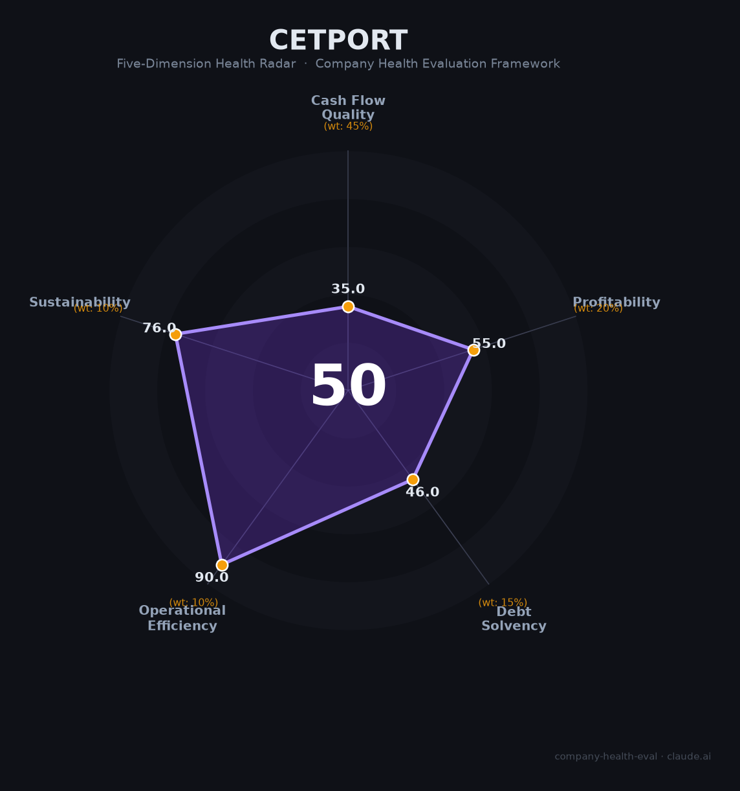

# 中电港（001287.SZ）财务健康评估（2026-08-13）

## 一句话结论
🔴 **中等偏下（50/100）** | 电子元器件分销龙头——营收655亿（+34%）高增+净利+19.9%，但毛利3.2%薄利+经营现金流-11.8亿+负债82%

## 一、公司基本画像
| 主体 | 🔒 深圳中电港，A股001287.SZ；电子元器件分销龙头（中电系） |
| 主营 | 电子元器件分销、ICT解决方案 |
| 财务 | 2025营收655亿(+34%)；归母净利2.8亿(+19.9%)；扣非3.3亿(+69%)；经营现金流-11.8亿；负债率81.9%、毛利3.2% |

## 二、五维
### 1. 现金流（35/100）预警：经营现金流-11.8亿（备货/分销垫资）
### 2. 盈利（55/100）：净利+19.9%增长但毛利3.2%薄、净利0.4%
### 3. 偿债（46/100）危险：负债81.9%、分销资金杠杆
### 4. 运营（90/100）：分销网络/客户（半导体）成熟高效
### 5. 可持续（76/100）：芯片/半导体分销+国产替代，赛道大但薄利

## 三、综合（35|45%=15.8，55|20%=11，46|15%=6.9，90|10%=9，76|10%=7.6）
**50，🔴 中等偏下** — 高杠杆分销薄利

## 四、风险
1. 经营现金流-11.8亿、垫资。
2. 负债81.9%高杠杆。
3. 分销薄利（毛利3.2%）。

## 五、求职
- 优势：电子元件分销龙头（半导体）、需求高增、中电系平台。
- 短板：薄利+杠杆+现金流、薪酬弹性弱。

**结论**：适合对半导体/电子元件分销方向的求职者，平台大但盈利能力薄。

---
*评估方法：商泰汽车（iAUTO）五维框架 · 来源中电港2025年报*