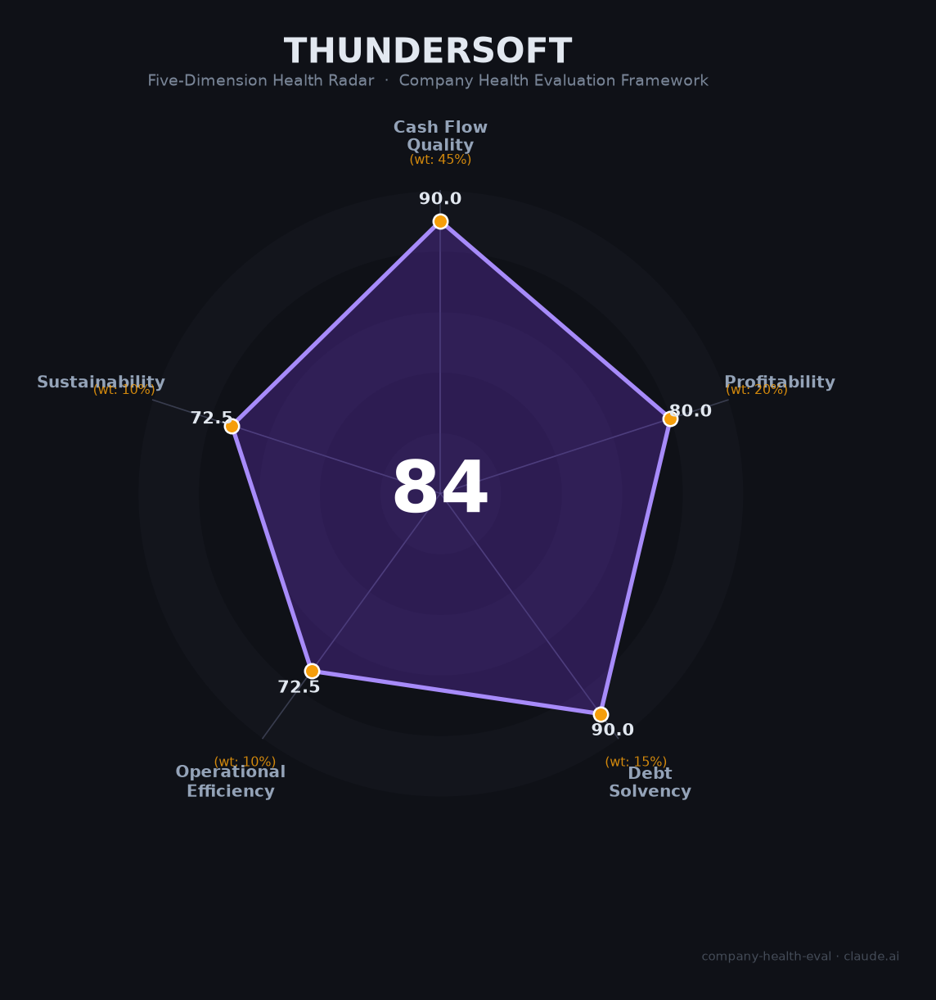

# 中科创达（300496.SZ）财务健康评估（2026-06-12）

## 一句话结论

🟡 **中等偏上（85/100）** | 座舱软件市占率28%行业第一+AIOS战略清晰+净现比>1.5，核心隐忧：毛利率四连跌+华为鸿蒙生态挤压+"增收不增利"

## 一、公司基本画像

| 维度 | 内容 |
|------|------|
| **主体** | 中科创达软件股份有限公司（A股创业板300496.SZ，2015年上市） |
| **成立** | 2008年3月，北京，创始人赵鸿飞（北理工硕士，前NEC/北大青鸟） |
| **员工** | 18,708人（研发17,240人占92%），全球15+国家研发布局 |
| **核心业务** | 智能汽车OS（34%，毛利率46%）、智能IoT（46%，毛利率19%）、智能软件（20%） |
| **2025营收** | ¥77.78亿（+44%），净利润¥4.50亿（+10%），净现比1.51，资产负债率21% |
| **AI布局** | Rubik大模型+AquaClaw车载AI Agent(高通骁龙)+AquaDrive AIOS(AWS)+滴水AIOS 2.1 |
| **市值** | ~276亿（2026.6），PE~60x |

中科创达是全球智能操作系统龙头（座舱软件市占率28%），2026年战略升级为AIOS——从传统OS向「芯片-AIOS-中间件-应用」全栈AI平台转型。IoT业务2025年爆发+133%成为第一大收入来源，但低毛利硬件占比飙升导致毛利率连续四年下滑。

## 二、五维财务健康评估

### 1. 现金流质量（90.0/100）
- OCF连续3年为正（7.55→7.53→6.80亿），净现比>1.5 → 健康
- 现金~25亿+零长期借款+资产负债率仅21% → 健康

### 2. 盈利能力（80.0/100）
- 毛利率31.7%（四连跌：37%→34.3%→31.7%，IoT硬件从29%→46%占比拖累） → 良好
- 净利率5.8%，营收3年CAGR~12.6% → 良好
- 研发费率22.7%（高投入）→ 优秀，但人均创收仅¥41.6万（软件行业中偏低） → 一般

### 3. 偿债能力（90.0/100）
- 零长期借款，资产负债率21%，现金>有息负债40倍 → 全部健康

### 4. 运营效率（72.5/100）
- 客户集中度26%（前五大，较分散）→ 但仍需关注车企订单波动 → 关注
- 员工持续扩张（13K→15K→18.7K）→ 健康
- 创始人赵鸿飞稳定，但CFO王焕欣"一肩挑三职"+年报差错被警示函 → 关注

### 5. 可持续发展（72.5/100）
- 智能汽车OS市场CAGR 5.5-15% → 关注
- AquaClaw+高通生态+座舱市占率28% → 技术壁垒强
- 三业务+全球化（海外46%） → 多元化健康
- 华为鸿蒙挤压+高盛卖出评级+"中间件被替代"系统性风险 → 关注

## 三、综合评分

| 维度 | 得分 | 权重 | 加权 |
|------|:----:|:----:|:----:|
| 现金流质量 | 90.0 | 45% | 40.5 |
| 盈利能力 | 80.0 | 20% | 16.0 |
| 偿债能力 | 90.0 | 15% | 13.5 |
| 运营效率 | 72.5 | 10% | 7.2 |
| 可持续发展 | 72.5 | 10% | 7.2 |
| **综合** | | | **84.5** 🟡 |

## 四、核心风险

1. **毛利率四连跌（高）**：IoT低毛利商品从29%→46%占比，整体毛利率从37%→32%。"增收不增利"格局短期难改。
2. **华为鸿蒙挤压（高）**：华为全栈方案搭载170万辆+25+车型，直接替代中科创达OS/中间件层。
3. **年报差错被警示函（中）**：2023年报ROE错写为0%，Q4亏损少计1700万，被记入诚信档案。

## 五、求职视角

- **优势**：AI Agent/车载OS方向技术积累深，AquaClaw+高通生态有迁移价值，全球15国布局
- **短板**：应届生口碑极差（"年年毁约"），薪资偏低（校招8-15K），加班文化+最小基数社保
- **建议**：适合车载AI Agent方向有经验者，不适合应届生首选

---

*评估日期：2026-06-12 | 数据来源：中科创达2025年年报（2026.4.22披露）*
