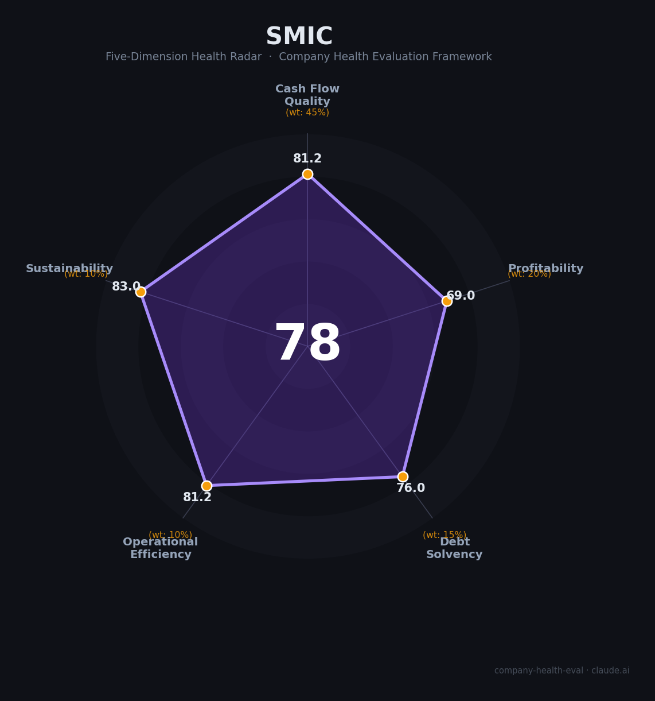

# 中芯国际（SMIC, 688981.SH / 00981.HK）财务健康评估（2026-08-11）

## 一句话结论

🟡 **中等偏上（78/100）** | 中国大陆晶圆代工「卡脖子」破局者——低负债+现金流优异+国产替代红利，但毛利率低、资本开支吞噬自由现金流是核心隐忧

---

## 一、公司基本画像

| 项目 | 内容 |
|------|------|
| 主体 | 🔒 中芯国际（SMIC），红筹架构，注册开曼群岛，总部上海浦东张江路18号；A股：688981.SH（2020科创板上市）、H股：00981.HK（2004上市） |
| 成立 | 🔒 2000年4月3日成立，2025年25周年；国内首家回归A股的境外红筹企业 |
| 股权 | 🔒 无控股股东、无实际控制人；大唐系约13.5%、大基金一二期合计约5.7% |
| 规模 | 🔒 员工19,952人（2025末），研发人员2,403人（约12%）；月产能折合8寸当量105.9万片（2025末） |
| 主营 | 全球第二大纯晶圆代工企业：逻辑代工+特色工艺，0.35μm–14nm FinFET；大陆第一家14nm量产 |
| 财务 | 🔒 2025营收$93.27亿（RMB 673.23亿，+16.2%），归母净利$6.85亿（+39.1%），资本开支$81亿 |
| 基地 | 🔒 上海（张江+中芯南方）、北京（中芯北方）、深圳、天津均为全资控股；合肥为中芯合肥联营（不控股） |
| 战略 | 🔒 2026年完成中芯北方49%股权注入（通过发行股份，交易额406亿）；2025年度不分红（大额扩产期） |

> 一句话定性：中芯国际是中国半导体制造业「国产替代与先进制程攻坚」的绝对核心平台——全球纯代工第二、大陆规模第一、无实控人治理结构稳定。作为雇主的吸引力在于「国家战略地位+扩产期招聘旺+相对稳健」，但薪资天花板受限于制造业属性（低于IC设计公司），先进制程受美国出口管制压制。

---

## 二、五维财务健康评估

### 1. 现金流质量（81/100）| 权重45%

| 指标 | 🔒 公开数据 | 评估 |
|------|-----------|------|
| 经营现金流净额 | 2023: 230.48亿 → 2024: 226.59亿 → 2025: 200.81亿（连续3年为正） | ✅ 健康：净额重大但微降 |
| 现金及等价物 | 2025末413.12亿（货币资金436.45亿），流动比率2.36 | ✅ 健康：现金充足 |
| 有息负债 | 合计约886亿（短期借款34.5亿+长短期借款约851亿） | ⚠️ 关注：绝对额较大 |
| 应收周转 | 应收账款周转约25天（2025） | ✅ 健康：回款快（代工季结） |
| 净现比 | 2025归母口径3.98（OCF/归母净利） | ✅ 健康：利润含金量极高 |

**小结**：经营现金流连续3年超200亿、净现比近4倍，表现优秀，符合代工行业「预收+垫付」模式。需注意资本开支（2025年599.5亿）远超经营现金流，自由现金流-399亿——扩产高峰期的正常表现，靠持续融资/增发支撑现金储备端未明显消耗（413亿）。现金安全垫充足。

> 🔒 数据来源：中芯国际2023-2025年报（巨潮PDF、东方财富F10、新浪财经）；2025Q4财报

### 2. 盈利能力（69/100）| 权重20%

| 指标 | 🔒 公开数据 | 评估 |
|------|-----------|------|
| 毛利率 | 21.62%（2025；2024年18.59%低点回升；行业对比台积电~58%） | ⚠️ 一般：成熟制程+仅以DUV多重曝光制程 |
| 净利率 | 10.71%（总额口径）/7.5%（归母口径） | ✅ 良好：5-15%区间 |
| 营收增速（3年CAGR） | 2022年495亿→2025年673亿，CAGR约10.8%；2025年+16.5% | ✅ 良好：10-20%区间 |
| 研发费用率 | 8.2%（费用化口径，2025）；全口径研发投入约9-10% | ✅ 良好：5-10%区间 |
| 人均产出 | 337.4万元/人（2025，较2023年224万大幅提升） | ✅ 良好：制造行业中上 |

**小结**：中芯盈利的痛点/结构性矛盾：毛利率21%远低于台积电，源于美国EUV管制下先进制程只能靠DUV多重曝光（成本高、良率低）、成熟制程依赖价格战盈利；但营收高增（2025+16.5%）、人效提升（净利率回升至10%）显示盈利质量在恢复。净利率优于华虹等同行代工厂，符合「大陆代工第一」。

### 3. 偿债能力（76/100）| 权重15%

| 指标 | 🔒 公开数据 | 评估 |
|------|-----------|------|
| 资产负债率 | 33.00%（2025末） | ✅ 健康：低于40% |
| 有息负债率 | 约24%（886亿/总资产3677亿） | ⚠️ 关注：高于20% |
| 流动比率 | 2.36（2025末，2024年1.73回升） | ✅ 健康：>2 |
| 现金比率 | 0.95 | ⚠️ 关注：接近1 |
| 股权质押 | 无实质性质押，主要股东（大基金/大唐系）均未质押 | ✅ 健康：无质押风险 |

**小结**：偿债能力强——无实控人结构下资金安全边际高；流动性比率优秀（2.36）、资产负债率仅33%的晶圆厂（同行普遍50-60%）在制造业内非常健康。但扩产期有息负债绝对额约900亿，资本结构偏依赖债务融资。

### 4. 运营效率（81/100）| 权重10%

| 指标 | 🔒 公开数据 | 评估 |
|------|-----------|------|
| 应收周转 | 约25天（2025，2024年20天） | ✅ 健康：代工行业极优 |
| 客户集中度 | 全球360+客户高度分散（消费/汽车/工控/通信等） | ✅ 健康：高度分散 |
| 员工规模趋势 | 2023: 20,223 → 2024: 19,186 → 2025: 19,952（2024小减，2025回升） | ✅ 健康：扩产期微增 |
| 高管稳定性 | 董事长刘训峰、双CEO赵海军+梁孟松长期在任 | ⚠️ 关注：2023年旧董事长周子学离职 |

**小结**：运营效率优秀——应收周转25天、客户高度分散、人效302→337万持续提升。2024年曾小幅减员（约1,000人）但2025年回补，折射行业性产能调整下基本盘稳定。

### 5. 可持续发展（83/100）| 权重10%

| 指标 | 🔒 公开数据 | 评估 |
|------|-----------|------|
| 行业赛道空间 | 中国半导体国产替代+扩产大周期，成熟制程高景气 | ✅ 健康 |
| 技术壁垒 | 大陆唯一量产14nm FinFET、先进制程N+1/N+2推进，壁垒极高 | ✅ 健康 |
| 客户/业务多元化 | 8寸/12寸+逻辑/特色工艺，360+客户多行业覆盖 | ✅ 健康 |
| 融资/资本支持 | 无实控人但获大基金持续增资、政府+发行新股支持扩产 | ✅ 健康 |
| 政策/监管风险 | 美国实体清单（2020起）+EUV/DUV限制+2023-2024制裁升级 | ⚠️ 关注：政策头部风险 |

**小结**：可持续性被「国产替代核心资产」托底（政策、资本、行业地位都利于长期），但**出口管制是悬在头上的最大变量**——先进制程被锁死，长期成长受制于美国制裁（政府补贴+国产设备替代是不可逆的主题）。

---

## 三、综合评分与健康等级

| 维度 | 得分 | 权重 | 加权得分 |
|------|:----:|:----:|:--------:|
| 现金流质量 | 81.2 | 45% | 36.5 |
| 盈利能力 | 69.0 | 20% | 13.8 |
| 偿债能力 | 76.0 | 15% | 11.4 |
| 运营效率 | 81.2 | 10% | 8.1 |
| 可持续发展 | 83.0 | 10% | 8.3 |
| **综合得分** | **78/100** | **100%** | **78.2/100** |

**健康等级：🟡 中等偏上（Moderate-High）** — 稳健型，局部有短板但整体可控。

---

## 四、同业对标

| 对比项 | 中芯国际 | 华虹半导体 | 晶合集成 | 台积电（参考） |
|--------|---------|-----------|----------|---------------|
| 2025营收 | $93.27亿（RMB 673亿） | RMB ~173亿 | RMB ~200亿级 | US$~1,230亿 |
| 毛利率 | 21.62% | 18.72% | 29.10% | ~58% |
| 净利率 | 10.71% | -4.67% | 12.10% | ~48% |
| 资产负债率 | 33% | ~40%+ | ~50% | ~40% |
| 员工规模 | 19,952 | ~6,000 | ~5,000 | ~85,000 |
| 制程 | 14nm FinFET量产+先进制程推进 | 8寸特色工艺为主 | DDIC驱动IC为主 | 3nm/5nm全球领先 |
| 核心差异 | 大陆唯一先进制程代表 | 特色工艺现金牛 | 显示驱动垄断 | 全球制程王者，无EUV限制 |

**对标结论**：中芯在「规模、制程、毛利率」全面落后台积电（先进制程受限所致），但在大陆代工中综合实力第一，盈利质量明显优于华虹（华虹2025净利率为负）。作为雇主，"制造第一梯队"地位稳固。

---

## 五、核心风险清单

1. **美国出口管制（高）**：实体清单（2020）+EUV/DUV光刻机禁运+先进制程许可+2023-2024制裁升级；先进制程仰赖DUV多重曝光，单位成本远高于台积电，先进节点毛利天花板低。若美方进一步收紧（对HMIC先进代工厂许可清零）将直接冲击华为等相关订单。
2. **自由现金流持续为负（高）**：2023-2025 FCF分别-308/-319/-399亿，靠融资维持；若利率/融资环境收紧，扩产节奏或受影响。
3. **毛利率承压（中-高）**：成熟制程价格战（华虹/晶合扩产）+折旧高峰→毛利率长期在10%-20%区间波动，远低于台积电。
4. **2025-2026不分红（中）**：投资人回报依赖价值重估而非分红；作为雇员则非直接风险。
5. **技术天花板（中）**：无EUV下5nm/3nm推进缓慢，长期「保7nm算法为上限」——影响员工技术成长预期（设备/工艺工程师升职空间受限）。

---

## 六、求职/择业视角

### 核心优势
- **平台与战略地位**：中国半导体制造「国家队」，稳的员工与价值观+国产替代背书，跳槽进入IC设计或设备/材料大厂有背书；
- **薪酬竞争力**（📊 估算）：中芯在晶圆厂（Foundry）薪酬第一梯队，高于华虹/晶合；工艺/设备工程师上海应届硕士约20-35万，研发（PE/器件）约30-50万；不过略低于IC设计（海思/展锐等35-60万+）。
- **稳定性**：现金流正、低负债、政府+大基金持续输血，未见过大规模裁员（2024年少幅减员1,000人但扩产期岗位仍在招）；倒班（12小时）普遍但有加班费和补贴。

### 现存短板
- **制造业基因**：薪资天花板低于IC设计/互联网；工作强度不小（倒班+加班费补贴但通勤长、工厂偏远）；
- **晋升路径**：foundry 传统「蓝领向工程师」升级慢，技术型岗位晋升较 IC 设计慢；
- **管制不确定性**：先进制程受限，长期岗位天花板（先进制程研发岗成长空间锁死在 14nm）。

### 分场景建议

| 个人诉求 | 推荐 | 次选 | 规避 |
|----------|------|------|------|
| 稳定+深耕 | **中芯国际**（工艺/设备稳定） | 华虹/晶合 | 资金链紧的小厂 |
| 高薪+跳板 | 海思/展锐/IC设计 | 中芯研发岗（PE/RD偏优） | Foundry工艺岗追天花板低 |
| 成长+融资红利 | 国产设备（中微/北方华创） | 中芯扩产岗 | 先进制程岗（被封死） |
| 多元+跨领域 | 中芯 + 汽车/工控代工 | IC设计大厂 | 检疫代工 |

---

## 七、总结

**中芯国际是中国晶圆代工「唯一先进制程平台」与「国产替代支柱」：**

现金流连续3年正、低负债、无质押，人效和服务 2025年毛利率回升至21.6%，归母净利+36%，在制造业地位远超同行。作为雇主，它提供「稳定+国产替代稀缺背书+可观的加班补贴」，裁员风险低（扩产期招聘）。

唯一短板是**毛利率天花板（21%）与自由现金流为负的大额投入期风险**——工资成长空间受先进制程管制与技术天花板限制，即便不创业，也难像IC设计大厂一样吃「技术溢价薪酬」。

在中美科技战持续、半导体国产替代大趋势的大环境下，属于**中等偏上**风险等级，适合追求**稳定+制造业长期深耕+愿随国产半导体一起成长**的求职者，不适合追求极致高薪、快速技术成长（先进制程受限）或期权暴富的人。

---

*评估方法：商泰汽车（iAUTO）五维企业健康度框架 · 数据截至2026年8月 · 🔒财务数据来源中芯国际2023-2025年报（巨潮PDF）· 国内外对比标为📊估算/行业公开数据*