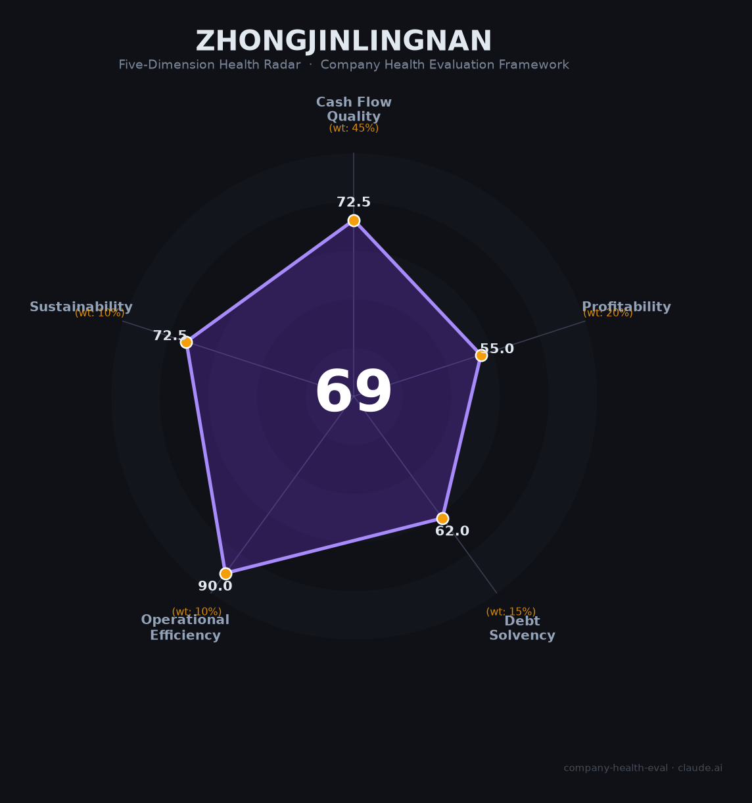

# 中金岭南（000060.SZ）财务健康评估（2026-08-13）

## 一句话结论
🟠 **中等（69/100）** | 铅锌冶炼有色龙头——营收605亿（+7.2%）+现金流稳健，但净利-25.9%+毛利6.5%薄利+负债58.6%

## 一、公司基本画像
| 主体 | 🔒 深圳市中金岭南有色金属，A股000060.SZ；铅锌冶炼有色龙头 |
| 主营 | 铅锌冶炼、有色金属 |
| 财务 | 2025营收605亿(+7.2%)；归母净利8.0亿(-25.9%)；扣非7.9亿(-23%)；经营现金流24.1亿；负债率58.6% |

## 二、五维
### 1. 现金流（73/100）健康：经营现金流24亿、回款稳
### 2. 盈利（55/100）：净利8亿但-25.9%、毛利6.5%（冶炼薄利）
### 3. 偿债（62/100）：负债58.6%、流动比率0.99略紧、短债111亿
### 4. 运营（90/100）：冶炼生产/渠道高效、经营稳健
### 5. 可持续（73/100）：铅锌周期+新能源需求中上，价格波动关注

## 三、综合
| 现金流 72.5|45%=32.6 | 盈利55|20%=11.0 | 偿债62|15%=9.3 | 运营90|10%=9.0 | 可持续72.5|10%=7.2 | **69** |
**评级：🟠 中等** — 有色龙头但薄利+周期

## 四、风险
1. 铅锌价格周期。
2. 净利-25.9%、毛利薄。
3. 负债与短债。

## 五、求职
- 优势：国企/有色龙头稳定、资源布局。
- 短板：低毛利、奖金弹性弱、矿业/冶炼传统。

**结论**：适合追求有色/资源国企稳定平台的求职者。

---
*评估方法：商泰汽车（iAUTO）五维框架 · 数据截至2026-08 · 来源中金岭南2025年报*