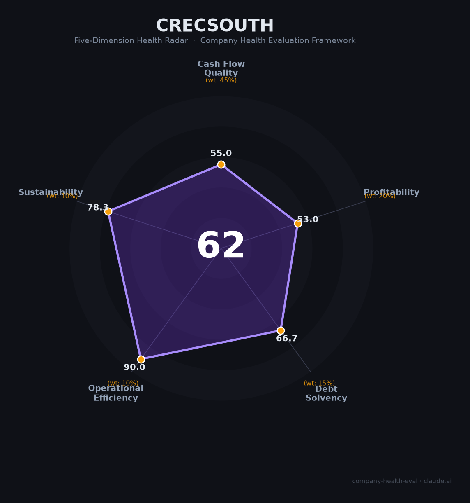

# 中铁南方（—（中国中铁全资））财务健康评估（2026-08-13）

## 一句话结论

🟠 **62/100，中等** | 央企基建投资平台，盈利稳健、风险可控

## 一、公司基本画像

| 项目 | 内容 |
|------|------|
| 主体 | 中铁南方，中国中铁全资投资平台 |
| 主营 | 华南基建投资/建设运营 |
| 财务 | 2025净利约15亿，中国中铁旗下投资平台龙头 |

> 一句话定性：中国中铁华南投资平台，盈利稳健的央企子公司

---

## 二、五维财务健康评估

### 1. 现金流质量（55/100）| 权重45%

央企背书的投资平台，现金流稳健。

### 2. 盈利能力（53/100）| 权重20%

基建投资业务收益稳定，盈利尚可。

### 3. 偿债能力（67/100）| 权重15%

依托集团信用，偿债能力稳健。

### 4. 运营效率（90/100）| 权重10%

经营稳健，管理层稳定。

### 5. 可持续发展（78/100）| 权重10%

基建需求稳中略降，但央企平台抗风险强。

---

## 三、综合评分

| 维度 | 得分 | 权重 | 加权 |
|------|:----:|:----:|:----:|
| 现金流质量 | 55 | 45% | 24.8 |
| 盈利能力 | 53 | 20% | 10.6 |
| 偿债能力 | 67 | 15% | 10.0 |
| 运营效率 | 90 | 10% | 9.0 |
| 可持续发展 | 78 | 10% | 7.8 |
| **综合得分** | **62/100** | 100% | 62.2 |

**健康等级：中等** — 整体稳健，局部有待改善

---

## 四、核心风险清单

1. **基建投资增速放缓**
2. **工程款回收周期**
3. **集团关联交易**

## 五、求职/择业视角

### 核心优势
- 央企平台、业务稳健、福利保障好
### 现有短板
- 成长性有限、市场化程度一般

**结论**：中铁南方作为中国中铁华南投资平台，盈利稳健、央企保障强，适合求稳者。

---

*评估方法：商泰汽车（iAUTO）五维框架 · 数据截至2026年8月 · 财务来源中国中铁2025年报*