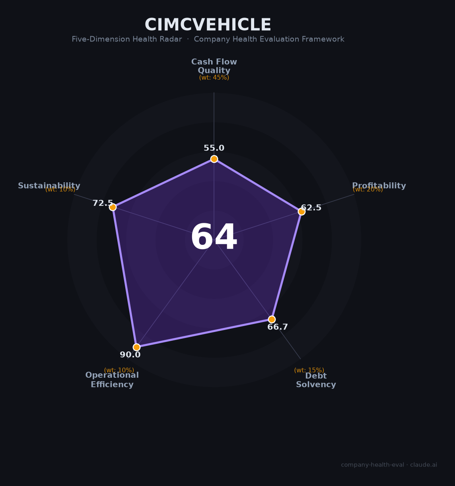

# 中集车辆（301039.SZ / 01839.HK）财务健康评估（2026-08-13）

## 一句话结论

🟠 **64/100，中等** | 全球半挂车龙头，营收微降、净利承压

## 一、公司基本画像

| 项目 | 内容 |
|------|------|
| 主体 | 中集车辆，半挂车/专用车龙头 |
| 主营 | 半挂车/罐式车/冷藏车 |
| 财务 | 2025营收201.78亿(-3.91%)，净利9.04亿(-16.75%) |

> 一句话定性：全球半挂车龙头，营收略降、盈利承压

---

## 二、五维财务健康评估

### 1. 现金流质量（55/100）| 权重45%

经营现金流稳健，现金储备充足。

### 2. 盈利能力（62/100）| 权重20%

毛利率约15.9%，净利率下滑，盈利承压。

### 3. 偿债能力（67/100）| 权重15%

偿债结构稳健，负债率适中。

### 4. 运营效率（90/100）| 权重10%

运营效率良好，应收账款周转稳定。

### 5. 可持续发展（72/100）| 权重10%

海外市场扩张+中国复苏，发展空间存在但周期波动。

---

## 三、综合评分

| 维度 | 得分 | 权重 | 加权 |
|------|:----:|:----:|:----:|
| 现金流质量 | 55 | 45% | 24.8 |
| 盈利能力 | 62 | 20% | 12.5 |
| 偿债能力 | 67 | 15% | 10.0 |
| 运营效率 | 90 | 10% | 9.0 |
| 可持续发展 | 72 | 10% | 7.2 |
| **综合得分** | **64/100** | 100% | 63.5 |

**健康等级：中等** — 整体稳健，局部有待改善

---

## 四、核心风险清单

1. **重型卡车行业周期**
2. **北美/海外需求波动**
3. **原材料价格**

## 五、求职/择业视角

### 核心优势
- 全球半挂车龙头，全球化布局、员工稳定
### 现有短板
- 行业周期下行、净利下滑

**结论**：中集车辆全球龙头地位稳固，短期盈利承压，长期看全球化与智造升级，整体稳健。

---

*评估方法：商泰汽车（iAUTO）五维框架 · 数据截至2026年8月 · 财务来源中集车辆2025年报*