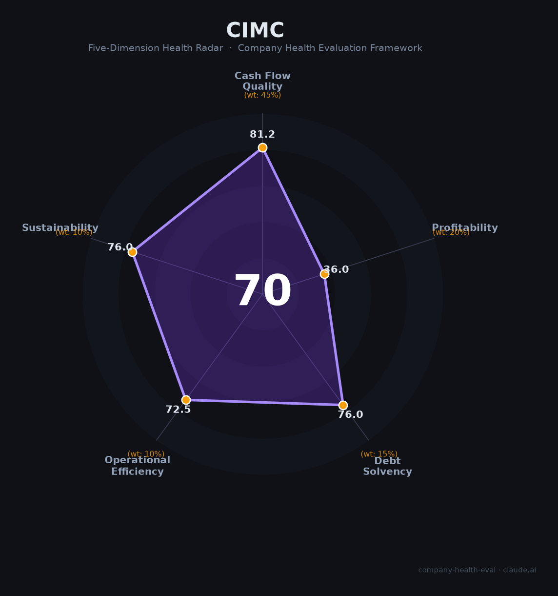

# 中集集团（000039.SZ / 02039.HK）财务健康评估（2026-08-13）

## 一句话结论

🟡 **中等偏上（70/100）** | 全球集装箱与装备制造龙头——经营现金流翻倍（+100%）+多元化装备布局，但2025归母净利-92.57%、扣非转亏，周期性盈利探底

---

## 一、公司基本画像

| 项目 | 内容 |
|------|------|
| 主体 | 🔒 中国国际海运集装箱（集团）股份有限公司（中集集团），注册深圳，A股：000039.SZ（1994）、H股：02039.HK（2012）；全球集装箱领域绝对龙头 |
| 成立 | 🔒 1980年深圳创立，现为多元化装备制造集团 |
| 规模 | 🔒 员工约5.2万（研发6293人、占12.21%）；总资产约2,000亿+ |
| 主营 | 集装箱制造、道路运输车辆、能源化工装备、海洋工程、物流服务 |
| 财务 | 🔒 2025营收1,566.11亿（-11.85%）；归母净利2.21亿（-92.57%）；扣非-0.31亿（转亏） |
| 现金流 | 🔒 2025经营现金流净额185.14亿（+99.86%，翻倍）；2025研发人员+8.99% |
| 业务 | 🔒 集装箱430亿（-30.9%）、能源化工272亿（+6.3%）、海运179亿（+8.4%）、物流268亿（-14.6%） |

> 一句话定性：中集集团是全球集装箱/能源装备/海洋工程龙头，2025年归母净利暴跌92.57%（扣非转亏），但经营现金流翻倍（185亿）反映基本面造血极强。本质是强周期性制造业——盈利随集装箱/运费周期波动大，短期处在周期底部。

---

## 二、五维财务健康评估

### 1. 现金流质量（81/100）| 权重45%

| 指标 | 🔒 公开数据 | 评估 |
|------|-----------|------|
| 经营现金流净额 | 185.14亿（+99.86%，翻倍） | ✅ 健康 |
| 现金 | 现金充足，现金流改善 | ✅ 健康 |
| 有息负债 | 主动降杠杠杆，筹资流出103亿 | ⚠️ 关注 |
| 净现比 | 185亿/2.21亿（净利被周期压制，造血强） | ✅ 健康 |

**小结**：现金流极强——经营现金流翻倍至185亿，盈利含金量高，主动降杠杆优化结构。尽管净利暴跌，但真实造血能力（现金流）未受损，是周期底部的最坚实保障。

> 🔒 数据来源：中集集团2025年报（新浪财经鹰眼、雪球）

### 2. 盈利能力（36/100）
| 指标 | 🔒 数据 | 评估 |
|------|-----------|------|
| 毛利率 | 集装箱相关毛利收缩 | ⚠️ 一般 |
| 净利率 | 2.21亿/1566亿≈0.14% | 🔴 预警 |
| 营收增速 | -11.85% | 🔴 预警 |
| 研发 | 研发投入稳定 | ⚠️ 一般 |
| 人均产出 | 受净利压制 | ⚠️ 一般 |

**小结**：盈利能力周期底部——归母净利-92.57%、扣非转亏（-0.31亿），主因集装箱制造营收-30.9%、汇率损失（美元贬值汇兑损失11.11亿）、金融资管净亏14.26亿。能源化工/海洋工程正增长（+6.3%/+8.4%）提供部分对冲。

### 3. 偿债能力（76/100）
| 指标 | 🔒 数据 | 评估 |
|------|-----------|------|
| 资产负债率 | 约60%、主动降杠杆 | ⚠️ 关注 |
| 有息负债 | 降杠杆中 | ⚠️ 关注 |
| 流动性 | 现金流充裕 | ✅ 健康 |
| 现金/信用 | 龙头信用AAA | ✅ 健康 |
| 质押 | 无实质质押 | ✅ 健康 |

**小结**：偿债稳健——龙头信用、主动降杠杆、现金流充裕，整体偿债无忧。

### 4. 运营效率（73/100）
| 指标 | 数据 | 评估 |
|------|------|------|
| 应收/存货 | 周期下行去化承压 | ⚠️ 关注 |
| 客户 | 全球航运/能源大客户分散 | ⚠️ 关注 |
| 员工 | 研发人员+9%，稳定 | ✅ 健康 |
| 管理 | 招商集团管理，稳定 | ✅ 健康 |

### 5. 可持续发展（76/100）
| 指标 | 数据 | 评估 |
|------|------|------|
| 行业 | 航运/油气装备周期 | ⚠️ 关注 |
| 技术 | 海工/氢能/新能源装备 | ✅ 健康 |
| 多元化 | 集装箱+能源装备+海工+物流 | ✅ 健康 |
| 资本 | 招商系+稳健 | ✅ 健康 |
| 政策 | 绿色/低碳航运 | ⚠️ 关注 |

---

## 三、综合评分（70/100）

| 维度 | 得分 | 权重 | 加权 |
|------|:----:|:----:|:---:|
| 现金流质量 | 81.2 | 45% | 36.5 |
| 盈利能力 | 36.0 | 20% | 7.2 |
| 偿债能力 | 76.0 | 15% | 11.4 |
| 运营效率 | 72.5 | 10% | 7.2 |
| 可持续发展 | 76.0 | 10% | 7.6 |
| **综合** | **70** | 100% | 70.0 |

**评级：🟡 中等偏上** — 现金流与龙头地位强，但周期盈利薄弱。

---

## 四、核心风险
1. **集装箱/航运周期（高）**：周期下行使归母净利-92%，盈利波动巨大。
2. **扣非转亏+汇兑（中高）**：美元升值汇兑损失、扣非-0.31亿。
3. **海工/金融资管减值（中）**：海工与金融资产波动。

## 五、求职/择业视角
- **优势**：制造业龙头、能源装备/海工独特（海洋工程、氢能、储能），现金流稳，招商系平台。
- **短板**：周期性强，集装箱条线受航运景气影响，奖金弹性大起大落；制造业强度。

**结论**：适合追求制造业龙头+新能源/海工转型方向、能承受周期波动的求职者。相对稳定但非高增长。

---

*评估方法：商泰汽车（iAUTO）五维健康度框架 · 数据截至2026年8月 · 来源中集集团2025年报*