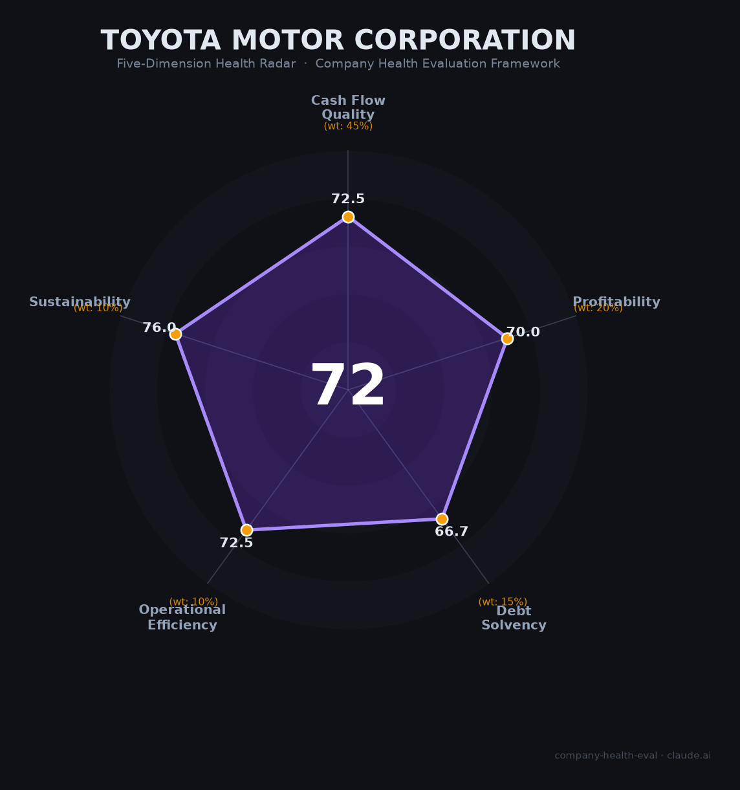

# 丰田汽车 财务健康评估（2026-06-18）

## 一句话结论

🟡 **中等偏上** | 全球最大车企，混动之王，利润两连降+美国关税+中国失速三重逆风

丰田汽车是全球销量第一的汽车制造商（2025年集团销量1,132万辆），在混合动力（HEV）领域拥有压倒性优势（全球>50%份额）。财务基本面稳健——经营现金流强劲（FY2026 ¥5.47万亿）、净利率（7.59%）远超行业均值（~4%）、全球员工39万人且70年未裁员。但面临三重逆风：美国15%汽车进口关税年侵蚀利润¥1.38万亿、中国市场日系份额从23.1%（2020）暴跌至8.7%（2026）、纯电转型严重滞后（BEV仅占自身销量~1.4%）。三年两度换帅（2026年4月近健太接任），战略从"扩张"转向"防守"。综合得分72/100，属于稳健但有明确风险点的标的。

## 一、公司基本画像

| 项目 | 内容 |
|------|------|
| **公司全称** | 丰田自动车株式会社（Toyota Motor Corporation） |
| **成立时间** | 1937年8月28日 |
| **总部** | 日本爱知县丰田市 |
| **上市交易所** | 东京证券交易所 Prime（7203.T）、纽交所（TM） |
| **当前社长（CEO）** | 近健太（Kenta Kon），2026年4月就任（三年内第二任） |
| **会长** | 丰田章男（Akio Toyoda） |
| **全球员工** | 约39.1万人（FY2026合并） |
| **市值** | ~$2,291亿（2026年6月，全球车企第二） |
| **主营品牌** | 丰田、雷克萨斯、大发、日野、世纪 |
| **FY2026营收** | ¥50.68万亿（约$3,380亿，首家突破50万亿日元的日本企业） |
| **股权特征** | 集团内交叉持股约17.5%（丰田自动织机9.15%+电装3.45%等），日本机构持股约35.6% |

丰田是全球销量最大的汽车制造商，2025年集团总销量1,132万辆（+4.6%），覆盖170+国家和地区。其核心竞争力是**丰田生产系统（TPS）**和**混合动力技术**——2025年电动化车型（HEV+PHEV+BEV+FCEV）销量首次突破500万辆，其中HEV占92%。

## 二、五维财务健康评估

### 1. 现金流质量（73/100）

| 指标 | 状态 | 数据支撑 |
|------|------|---------|
| 经营现金流净额 | 🟢 健康 | FY2024 ¥4.21T / FY2025 ¥3.70T / FY2026 ¥5.47T，连续3年强劲为正 |
| 现金及等价物 | 🟡 关注 | ¥12.66万亿现金，但相对年运营支出（~¥47T），覆盖约3.2个月。🔒 含丰田金融（TFS）资产，制造主业实际流动性充裕 |
| 有息负债 | 🟡 关注 | ¥43.21万亿（含TFS汽车贷款），D/E 1.05，在汽车行业中处于中等水平 |
| 净现比 | 🟢 健康 | OCF/NI = 1.42x（¥5.47T / ¥3.85T），利润含金量高 |

**核心判断**：丰田的现金生成能力是全球车企中最强的之一。FY2026经营现金流同比大增48%至¥5.47万亿，自由现金流在连续两年为负后转正（¥5,584亿）。有息负债看似庞大（¥43.2T），但绝大部分来自丰田金融（TFS）的汽车贷款业务（资产端有对应应收），制造主业负债水平远低于合并报表数字。

### 2. 盈利能力（70/100）

| 指标 | 状态 | 数据支撑 |
|------|------|---------|
| 毛利率 | 🟡 良好 | 14.93%（FY2026），高于大众（15.92%）但低于本田（21.50%）。3年趋势持续下滑（20.78%→19.92%→14.93%） |
| 净利率 | 🟡 良好 | 7.59%，远高于行业整车中位数（~3.99%），但同比-2.33pp |
| 营收增速 | 🟡 良好 | FY2024 +21.4% / FY2025 +6.5% / FY2026 +5.5%，3年CAGR约10.9%。但近期减速明显，含日元贬值水分 |
| 研发费用率 | 🟠 一般 | 2.8%，全球主要车企中最低（本田5.7%、大众6.0%、特斯拉6.8%、行业均值4-7%） |
| 人均产出 | 🟡 良好 | ¥1.30亿/人（~$865K），高于本田（¥1.12亿）和大众（~$336K），在传统车企中领先 |

**核心判断**：盈利能力在传统车企中属于第一梯队，但趋势令人担忧。净利润连续两年下滑（FY2026同比-19.2%），营业利润率从FY2024的11.9%腰斩至FY2026的7.4%，FY2027预计进一步降至~5.9%。研发投入强度仅为行业均值的约一半——这既是盈利能力强的原因（成本控制好），也可能是长期技术竞争力的隐患。

### 3. 偿债能力（67/100）

| 指标 | 状态 | 数据支撑 |
|------|------|---------|
| 资产负债率 | 🟡 关注 | 61.07%（总负债/总资产），处于40-70%区间中位，低于大众（68.9%）、福特（84.3%），优于行业均值 |
| 有息负债率 | 🟡 关注 | 39.9%（有息负债/总资产），含TFS汽车金融贷款。制造主业负债率远低于合并数字 |
| 股权质押 | 🟢 健康 | 日本企业，无重大股权质押。集团交叉持股结构稳定 |

**核心判断**：丰田的偿债能力在汽车行业中处于健康水平。资产负债率（61%）低于多数欧美竞争对手。核心风险在于有息负债的绝对规模（¥43.2T）持续增长（FY2024→FY2026 +18%），但这主要由TFS业务扩张驱动，有对应的贷款资产支撑。集团信用评级稳健，2026年顺利完成大规模债券发行，现金储备增至¥12.66T。

### 4. 运营效率（73/100）

| 指标 | 状态 | 数据支撑 |
|------|------|---------|
| 应收周转 | 🟡 关注 | DSO 112.4天（FY2026），高于行业均值（60-90天），含TFS汽车贷款应收。制造主业DSO更低 |
| 客户集中度 | 🟢 健康 | 全球170+国家、数百万终端客户，无单一客户依赖 |
| 员工规模趋势 | 🟢 健康 | 3年稳定增长：380,793→383,853→390,927人（+2.7%），无裁员 |
| 高管稳定性 | 🟡 关注 | 三年两度换帅（2023佐藤→2026近健太），但均为内部有序交接，丰田家族仍深度参与 |

**核心判断**：运营效率整体稳健。丰田生产系统（TPS）仍是全球制造业标杆，人均产出在传统车企中领先。近健太接任后提出"降本8%"计划（目标FY2027单车制造成本降低8%），亲自走访供应商而非压榨供应链。认证造假丑闻（大发/日野/丰田自动织机）暴露了集团管控短板，累计罚款超$16亿，但未伤及丰田本社运营。

### 5. 可持续发展能力（76/100）

| 指标 | 状态 | 数据支撑 |
|------|------|---------|
| 行业赛道空间 | 🟡 关注 | 全球汽车销量增速~2-3%/年，属低速增长行业。但HEV细分市场增速超20% |
| 技术壁垒 | 🟢 健康 | HEV专利全球第一（20年+积累），TPS无法被复制，固态电池2027-2028年量产目标 |
| 客户/业务多元化 | 🟢 健康 | 5大品牌×170+国家×HEV/PHEV/BEV/FCEV四线并行。1.5亿保有量零部件/金融/售后贡献超50%营业利润 |
| 资本支持 | 🟢 健康 | 两地上市、~$2,300亿市值、日本银行业强力背书、政府氢能战略直接扶持 |
| 政策/监管风险 | 🟡 关注 | 美国15%关税年侵蚀¥1.38万亿利润；中国稀土出口冻结导致14条产线停产；但欧盟2035燃油车禁令软化构成利好 |

**核心判断**：可持续发展能力在传统车企中是最强的。丰田的"多路径战略"（不赌单一技术路线）在政策不确定性高的当下显示出了战略智慧——欧盟2035禁令软化直接利好其混动产品线。固态电池供应链（出光兴产+住友金属矿山）垂直整合成型，若2027-2028年如期量产，将彻底改变BEV竞争格局。最大外部风险是中国稀土断供（日本重稀土100%依赖中国），预计2026年Q3-Q4储备耗尽。

## 三、综合评分与健康等级

| 维度 | 得分 | 权重 | 加权得分 |
|------|------|------|----------|
| 现金流质量 | 73 | 45% | 32.6 |
| 盈利能力 | 70 | 20% | 14.0 |
| 偿债能力 | 67 | 15% | 10.0 |
| 运营效率 | 73 | 10% | 7.2 |
| 可持续发展 | 76 | 10% | 7.6 |
| **综合得分** | **72** | **100%** | **71.5** |

**健康等级：🟡 中等偏上（Moderate-High）**

各维度得分较为均衡，可持续发展（76）和运营效率（73）相对突出，偿债能力（67）受TFS汽车金融高负债拖累偏低。整体呈"稳健偏防守"态势。

## 四、同业对标

| 对比项 | 丰田 FY2026 | 大众 FY2025 | 特斯拉 FY2025 | 本田 FY2025 | 比亚迪 FY2025 |
|--------|:----------:|:----------:|:-----------:|:----------:|:-----------:|
| 营收 | ¥50.68万亿 | €3,219亿 | $948亿 | ¥21.69万亿 | ¥8,040亿 |
| 净利润 | ¥3.85万亿 | €66.7亿 | $37.9亿 | ¥8,358亿 | ¥555亿 |
| 净利率 | 7.59% | ~2.1% | ~4.0% | 3.85% | ~6.9% |
| 毛利率 | 14.93% | 15.92% | ~18-20% | 21.50% | ~18% |
| 研发费用率 | 2.8% | 6.0% | 6.76% | 5.67% | ~6.5% |
| 全球员工 | 39.1万 | 64.0万 | 13.5万 | 19.4万 | ~87万 |
| 市值 | ~$2,291亿 | ~$545亿 | ~$15,427亿 | ~$400亿 | ~$1,249亿 |
| BEV占比 | ~1.4% | ~8% | 100% | <1% | ~55% |

**对标结论**：丰田是全球盈利能力最强的传统车企（净利率7.59%，碾压大众的2.1%），但在电动化转型速度上严重落后。其核心竞争力（HEV）在短期（3-5年）内仍是巨大优势——欧盟政策软化、美国消费者偏好混动、中国市场补贴退坡后HEV反弹——但长期（5-10年）若固态电池无法如期量产，BEV落后将成为致命伤。

## 五、核心风险清单

1. **美国关税持续侵蚀（极高）**：15%汽车进口关税年侵蚀利润¥1.38万亿，北美业务FY2026由盈转亏（2008年以来首次）。丰田仅将4-5月关税计入FY2027展望，全年影响可能远超预期。USMCA重谈是下一个政策雷区。

2. **中国稀土断供（极高）**：日本重稀土100%依赖中国，2025年12月中国全面冻结对日出口。丰田14条生产线已停产，企业储备6-8个月，预计2026年Q3-Q4耗尽。年产量可能减少约80万辆，经济损失最高¥2.5万亿。

3. **中国市场结构性失速（高）**：日系车在华市占率从2020年23.1%暴跌至2026年5月8.7%。丰田虽为日系中唯一正增长（2025年178万辆，+0.23%），但2026年5月销量同比-32%（连续4个月下滑）。智能化严重掉队（OTA年更8次 vs 比亚迪200次），决策链条（3-4年）无法匹配中国速度（12-18个月）。

4. **电动化转型缓慢（中高）**：BEV仅占自身销量~1.4%，远低于全球平均18%。固态电池虽技术领先，但福冈工厂已二次延期，量产时间可能从2027年推迟到2028年之后。若固态电池再延期，2030年BEV占比达50%的行业预期下，超300家丰田系供应商面临倒闭风险。

5. **盈利持续恶化（中）**：营业利润从FY2024峰值¥5.35T预计降至FY2027 ¥3.0T（累计-44%）。盈亏平衡点台数上升，受益结构恶化。分红仍在增长（FY2027预计¥100/股），但派息率将从~31%升至~43%。

6. **认证造假后遗症（中）**：大发/日野/TICO认证造假累计罚款超$16亿，仍在发酵。2026年2月TICO柴油发动机造假再次曝光，影响兰德酷路泽和Hilux全球约3.6万辆/月。管理层承认"未能理解现场实际情况"，集团合规文化系统性缺陷尚未根除。

## 六、求职/择业视角

### 核心优势

- **极致的就业稳定性**：自1950年以来70+年未进行大规模裁员。即使FY2026利润两连降、北美业务亏损，也选择内部消化而非裁员。对追求稳定的人而言，这几乎是全球大型企业中的顶级保障。
- **行业领先的薪酬福利（日本）**：日本本社平均年薪首破¥1,000万（约¥42.5万人民币），连续5年全额接受工会加薪要求，年度奖金7.6个月。应届生起薪¥278,000/月（本科），处于日本制造业顶端。
- **全球通用的履历价值**：丰田生产系统（TPS）是全球制造业的"通用语言"，精益管理、质量管理经验可迁移至任何行业。Glassdoor综合评分4.1/5，79%员工推荐。
- **工作生活平衡**：日本制造业中WLB最好的大企业之一。正试验四天工作制，有给消化率90-100%。

### 现存短板

- **薪酬增长缓慢（中国区）**：一汽丰田/广汽丰田应届生年薪约¥12-15万，5年经验普遍不超过¥20万。跳槽比亚迪/蔚来同等岗位薪资可翻倍（¥35-50万）。每年涨薪仅20-200元，被戏称"温水煮青蛙"。
- **电动化/智能化技能积累有限**：丰田的核心技术积累在发动机、变速箱、混动系统——这些在BEV时代价值下降。软件/智能座舱/自动驾驶领域严重落后，相关岗位的技术成长空间不及特斯拉/比亚迪/新势力。
- **职业天花板明显（中国区）**：合资企业核心决策由日方主导，中方员工晋升天花板低。年功序列虽在日本已冻结，但中国文化仍有残余影响。
- **地域限制**：日本总部在爱知县丰田市（非东京/大阪），中国工厂在天津/广州南沙（远离一线城市核心区）。

### 分场景建议

| 个人诉求 | 推荐 | 次选 | 规避 |
|----------|------|------|------|
| 稳定+深耕（10年+） | **丰田日本总部** — 终身雇佣+高福利+TPS正统 | 丰田中国（合资） | — |
| 高薪+跳板（3-5年） | 特斯拉/比亚迪 — 薪资天花板高+股权激励 | 丰田（刷履历后跳槽） | 丰田中国长期停留 |
| 成长+融资红利 | 中国新势力/自动驾驶创业公司 | 丰田新业务部门（固态电池/Woven City） | 传统制造岗 |
| WLB优先 | **丰田（日本/中国）** — 加班少+加班费+年假 | 本田 | 特斯拉/比亚迪 |
| 制造/供应链专业 | **丰田（任何地区）** — TPS是全球最硬通货 | 大众 | — |

## 七、总结

丰田汽车是**全球汽车制造**领域「稳如泰山的混动之王」的公司：经营现金流年超¥5万亿、净利率碾压所有传统竞对、70年不裁员的就业保障，唯一短板是纯电转型严重滞后叠加美国关税+中国失速+稀土断供三重外部冲击。在全球汽车产业百年变局的大环境下，属于**中等偏上**，适合追求极致稳定和制造专业深耕的求职者，不适合追求高薪快长和纯电/智能化赛道的人的选择。

---

*评估日期：2026-06-18 | 数据截至：FY2026（2026年3月期）财报 | 评分引擎：v1.0*
