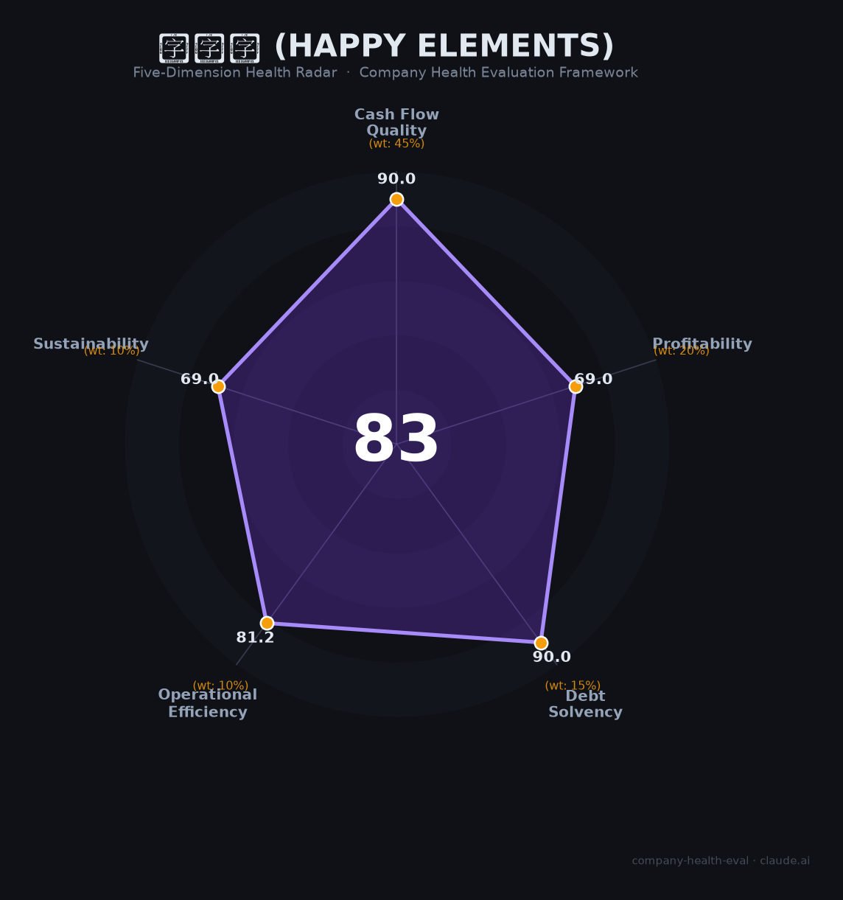

# 乐元素 财务健康评估（2026-06-19）

## 一句话结论

🟡 **中等偏上（83/100）** | 三消国民IP+零负债+游戏圈最佳WLB，单一产品依赖+9年财务黑箱是核心隐忧

## 一、公司基本画像

| 项目 | 内容 |
|------|------|
| **运营主体** | 乐元素科技（北京）股份有限公司 |
| **成立时间** | 2012年2月（品牌始于2009年） |
| **法定代表人** | 郑利琼（创始人王海宁为实际控制人） |
| **注册资本** | 38,000万元（已实缴） |
| **员工规模** | 全球约1,600人（北京参保558人+上海/深圳+日本~290人） |
| **总部** | 北京海淀（上海、深圳、京都、东京、旧金山、新加坡均有办公室） |
| **融资历史** | A轮DCM→B轮联想$3,000万→C轮2016腾讯入股→D轮新希望集团；2016年密集融资拆除红筹架构 |
| **估值参考** | 2017年IPO拟募资20亿（发行后市值约200亿）；当前无公开估值 |
| **主营产品** | 《开心消消乐》（2014，累计8亿+用户，MAU 4,299万）+《偶像梦幻祭》系列（日本累计流水>100亿）+《海滨消消乐》+《白银之城》（UE5新作） |
| **IPO状态** | 2017年申请上交所主板→2021年终止审查 |

**一句话定性**：乐元素是中国三消休闲游戏绝对龙头，以「国民级IP+不加班文化」在游戏圈独树一帜。2017年营收¥22.64亿/净利¥7.65亿/净利率33.8%的财务底子极厚，但此后9年无公开财报，开心消消乐MAU从1.21亿降至4,299万，单一产品依赖和财务黑箱构成核心风险。

## 二、五维财务健康评估

### 1. 现金流质量（90.0/100）

| 指标 | 判断 | 说明 |
|------|------|------|
| 经营现金流 | ✅ 健康 | 2017年净利润¥7.65亿，长期运营12年+无裁员潮，推测经营现金流持续为正 |
| 现金储备 | ✅ 健康 | 盈利公司+零负债+2016年密集融资积累，现金跑道充裕 |
| 有息负债 | ✅ 健康 | 纯股权融资路径（腾讯/新希望/联想），零有息负债 |

**评估**：乐元素是典型的「现金牛」公司——国民级产品持续产生现金流，无需依赖债务或外部融资维持运营。即使2017年后财务数据不透明，从持续经营12年+未裁员+仍在扩张招聘判断，现金流质量毋庸置疑。

### 2. 盈利能力（69.0/100）

| 指标 | 判断 | 说明 |
|------|------|------|
| 毛利率 | ✅ 良好 | 三消游戏行业毛利率60-80%，乐元素2017年净利率33.8%暗示毛利率应在70%+ |
| 净利率 | ✅ 良好 | 2017年净利率33.8%，🔒招股书数据。当前无数据但行业基准15-30%，推测仍处健康区间 |
| 营收增速 | 📊 一般 | 2017年后无公开数据。开心消消乐MAU从1.21亿→4,299万，HEKK 2023财年利润-29.53%，增长动能减弱 |
| 研发费用率 | ✅ 良好 | 1,600人团队中研发占主体，UE5大作+动捕中心+AI优化投入 |
| 人均产出 | ✅ 良好 | 2017年人均约¥283万（22.64亿/~800人），远超行业均值。当前估算仍>¥100万 |

**评估**：2017年财务底子极好（净利率33.8%，超King的~40%仅差6个百分点）。但9年财务黑箱意味着盈利能力无法验证。从可观测指标（MAU下降、日本利润下滑）判断，当前盈利大概率不如2017年峰值，但核心产品仍维持亿级MAU，利润底子应仍雄厚。

### 3. 偿债能力（90.0/100）

| 指标 | 判断 | 说明 |
|------|------|------|
| 资产负债率 | ✅ 健康 | 轻资产游戏公司，零有息负债 |
| 有息负债率 | ✅ 健康 | 全部股权融资，2016年拆除红筹后以人民币基金和产业资本为主 |

**评估**：零负债运营是游戏公司常态，偿债风险为零。

### 4. 运营效率（81.2/100）

| 指标 | 判断 | 说明 |
|------|------|------|
| 应收周转 | ✅ 健康 | 游戏收入主要来自苹果/谷歌等平台分成，回款周期短 |
| 客户集中度 | ✅ 健康 | 数亿用户，完全分散 |
| 高管稳定性 | ✅ 健康 | 王海宁+三位联合创始人共同控制60.1%股份，核心团队稳定10年+ |
| 员工规模趋势 | ⚠️ 关注 | 北京参保从603人（2023）降至558人（2024）；2025年11月OX项目裁员（小规模） |

**评估**：运营效率整体良好，但员工数量小幅收缩（-7.5%）和OX项目裁撤是值得关注的信号——暗示公司可能在优化成本结构，或新项目推进不及预期。

### 5. 可持续发展能力（69.0/100）

| 指标 | 判断 | 说明 |
|------|------|------|
| 行业赛道 | ⚠️ 关注 | 中国游戏市场增速5-10%，三消品类成熟，但小游戏（微信/抖音）增速>50%提供新渠道 |
| 技术壁垒 | ✅ 健康 | 开心消消乐运营12年+8亿用户+消消乐商标获法院认定具有显著性，IP护城河极深 |
| 业务多元化 | ⚠️ 关注 | 开心消消乐占收入64%+（2017），偶像梦幻祭日本利润下滑29.53%，《白银之城》仍在研 |
| 资本支持 | ⚠️ 关注 | IPO终止后无新融资记录，但公司盈利可自给；腾讯持股为潜在退出通道 |
| 政策风险 | ✅ 健康 | 版号政策向休闲游戏倾斜（2025年634款休闲益智获版号）；防沉迷对成年用户为主的消消乐影响极小 |

**评估**：可持续发展呈现「稳健基本盘+增长停滞」的格局。12年的IP和用户基础构成极深护城河，但单一产品依赖和新品乏力意味着公司更多是「守住存量」而非「开拓增量」。《白银之城》（UE5二次元ARPG）是打破困局的关键赌注，但UE5项目投入巨大且竞争激烈，成败未知。

## 三、综合评分与健康等级

| 维度 | 得分 | 权重 | 加权得分 |
|------|------|------|----------|
| 现金流质量 | 90.0 | 45% | 40.5 |
| 盈利能力 | 69.0 | 20% | 13.8 |
| 偿债能力 | 90.0 | 15% | 13.5 |
| 运营效率 | 81.2 | 10% | 8.1 |
| 可持续发展 | 69.0 | 10% | 6.9 |
| **综合得分** | | | **82.8/100** |
| **健康等级** | | | 🟡 **中等偏上** |

## 四、同业对标

| 对比项 | 乐元素 | 柠檬微趣（宾果消消消） | King（Candy Crush） | Playrix |
|--------|------|---------------------|---------------------|---------|
| 上市/融资状态 | D轮，IPO终止 | 新三板→IPO撤回 | 被微软$690亿间接收购 | 私有（爱尔兰） |
| 营收规模 | ¥22.64亿（2017）→ 📊 ~¥15-30亿（2024估） | ¥3.88亿（2017）→ 📊 ¥36亿（2024，海外爆发） | $27.85亿（2022 Bookings） | $17亿（2024 IAP估） |
| 净利率 | 33.8%（2017） | 23%（2017） | ~40%（运营利润率） | 未公开 |
| 核心产品MAU | 4,299万（2025，开心消消乐） | ~1,800万（宾果） | 1.5亿+（Candy Crush） | N/A |
| 核心差异 | 国内三消#1+日本女性向#1，WLB标杆 | 2024海外合成品类爆发 | 全球三消绝对王者 | 三消+叙事融合模式 |
| 员工规模 | ~1,600 | — | ~2,000（King部门） | ~3,000+ |

**对标结论**：乐元素是中国三消绝对龙头（MAU远超柠檬微趣），但全球维度与King/Playrix存在数量级差距。柠檬微趣2024年在海外合成赛道爆发（营收+200%），而乐元素在海外增长上落后。公司在游戏行业中属于「小而美」的现金牛，而非高增长的明星标的。

## 五、核心风险清单

1. **单一产品依赖+生命周期风险（高）**：开心消消乐占收入64%+（2017），运营已超12年。MAU从2017年1.21亿降至2025年4,299万。虽然降速温和（银发人群仍有5.6%增长），但任何重大运营事故或用户偏好转移都可能重创公司根基。

2. **9年财务黑箱（高）**：2017年招股书后无任何公开财务数据。公司未上市、无信息披露义务，投资者和求职者无法判断2017-2026年间营收和利润的真实变化。IPO终止意味着退出通道关闭，员工期权价值高度不确定。

3. **新品接续乏力（中高）**：开心消消乐之后未能推出同等量级产品。2025年OX项目裁撤+《溯回青空》2026年停运，新品成功率不高。《白银之城》（UE5 ARPG）和《V Project》（3D偶像）投入巨大，但UE5二次元赛道已有米哈游等巨头占据，突围难度大。

4. **日本市场增长放缓（中）**：HEKK 2023财年净利润49亿日元（同比-29.53%），偶像梦幻祭系列进入成熟期，日本二次元市场竞争加剧（原神、赛马娘等）。

5. **汇率风险（中低）**：日本收入以日元计价（占集团海外收入>80%），日元持续贬值压缩人民币口径利润。

## 六、求职/择业视角

### 核心优势
- **游戏圈最佳WLB**：多个独立来源反复确认「从来不加班」——早10晚7/早9晚6，双休。这在996盛行的游戏行业中是极为罕见的异类
- **15薪+福利好**：15薪制、免费早餐、零食饮料、定期体检、偶尔包场看电影
- **稳定性极高**：核心产品运营12年+，无大规模裁员（2023-2024全球游戏裁员潮中平稳度过），OX裁撤为局部项目调整
- **品牌背书**：国民级产品（8亿+用户知道开心消消乐），「消消乐」商标获法院认定具有显著性，简历上有分量
- **技术栈转型机会**：正在做UE5大作和3D偶像项目，技术栈从休闲游戏向高品质3D转型，有一定成长空间

### 现存短板
- **技术岗薪资偏低+地位低**：多位技术员工反馈「薪资在同类型公司中偏低很多，涨薪慢」「技术在乐元素是最底层的存在」
- **晋升通道窄**：项目推进慢→晋升机会少；产品线集中→横向发展空间有限
- **财务不透明**：未上市公司，9年无财报，期权价值无法评估，IPO退出遥遥无期
- **战略方向不确定性**：从休闲→UE5重度二次元的转型跨度极大，能否成功未知

### 分场景建议

| 个人诉求 | 推荐 | 次选 | 规避 |
|----------|------|------|------|
| 稳定+深耕 | **乐元素**（WLB+零裁员+现金牛） | 腾讯游戏 | 中小型游戏创业公司 |
| 高薪+跳板 | 米哈游（薪资行业顶级） | 腾讯/网易 | **乐元素**（技术薪资偏低） |
| 成长+技术提升 | 米哈游（UE5/Unity前沿） | **乐元素**（UE5新项目有空间） | 纯休闲游戏公司 |
| WLB优先 | **乐元素**（游戏圈独一档） | 任天堂 | 任何996游戏公司 |

> **最推荐**：追求工作生活平衡、希望稳定深耕的游戏从业者（策划/美术/运营）——乐元素是游戏圈的「世外桃源」。
> **不推荐**：追求高薪和高增长的技术岗（薪资偏低+晋升慢）、期待IPO期权兑现的早期员工（退出路径不明）。

## 七、总结

**乐元素是中国三消休闲游戏领域「国民级IP持有者、游戏圈WLB天花板」：**
现金流和偿债极强（零负债+年利润曾达¥7.65亿），12年IP护城河深厚（8亿用户+商标获法院保护），「不加班文化」在996泛滥的游戏行业独树一帜。
核心短板在于单一产品依赖（开心消消乐占64%+）、9年财务黑箱（IPO终止后再无公开数据）、以及新品接续乏力（《白银之城》是高风险高回报的战略赌注）。
在中国游戏行业「存量竞争+AI冲击」大环境下，属于**稳定性极高的现金牛**，适合追求WLB和稳定的从业者，不适合追求高增长和高薪酬的顶尖人才。

---

*评估日期：2026-06-19 | 数据截至：2026年6月公开信息 | 评分引擎：company-health-eval v1.0*
