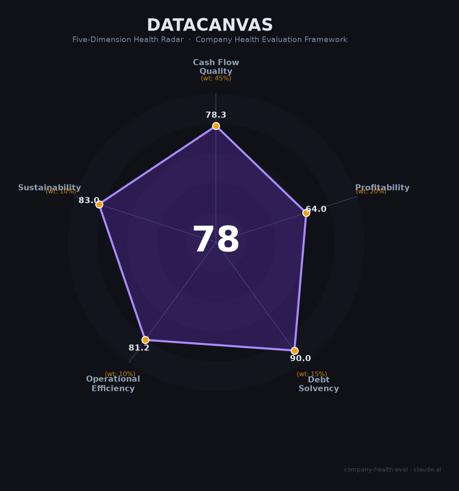

# 九章云极（DataCanvas）财务健康评估（2026-06-12）

## 一句话结论

🟡 **中等偏上（78/100）** | AI基础软件+智算云双轮驱动，2025H1已盈利，国资背书冲刺IPO，体量偏小+创始人股权稀释是核心关

---

## 一、公司基本画像

- **主体**：北京九章云极科技股份有限公司，2013年2月成立，专精特新重点"小巨人"
- **股权结构**：Advantech Capital 8.60%（第一大股东），方磊约2.55%+尚明栋约2.55%（创始团队合计仅5.1%），中关村系+中国电子等国资占比高
- **规模**：数百人（约300-500），超400项知识产权
- **主营**：AI基础软件（DataCanvas数据科学平台）+ 智算云（Alaya NeW Cloud）+ "新启业"企业级智能体引擎（Agentic RL+MCP协议）
- **定位**：中国版CoreWeave——"一度算力"（7元/度）按需零售的第三方普惠智算云
- **融资状态**：累计约8-9亿元，最新轮2026年1月（北京两大国资基金领投），入选2025-2026中国独角兽TOP50

---

## 二、五维评估

### 现金流质量（78/100）
| 指标 | 判定 | 依据 |
|------|:--:|------|
| OCF | 🟡 关注 | 2025H1刚实现盈利，OCF可能刚转正或接近转正 |
| 现金 | 🟢 健康 | 2026年1月新融资，国资背书，300-500人团队消耗可控 |
| 负债 | 🟢 健康 | VC驱动，零有息负债 |

### 盈利能力（64/100）—— 毛利率良好（AI软件+智算云），2025H1已盈利，营收增速估计20%+，研发费用率合理
### 偿债能力（90/100）—— 零负债，现金充裕
### 运营效率（81/100）—— 团队稳定10年+，客户多元，无裁员
### 可持续发展（83/100）—— 智算云市场爆发+信创+国资强力背书，GPU效率亚太首位

## 三、综合评分

| 维度 | 得分 | 权重 | 加权得分 |
|------|:----:|:----:|:--------:|
| 现金流质量 | 78 | 45% | 35.2 |
| 盈利能力 | 64 | 20% | 12.8 |
| 偿债能力 | 90 | 15% | 13.5 |
| 运营效率 | 81 | 10% | 8.1 |
| 可持续发展 | 83 | 10% | 8.3 |
| **综合得分** | | | **78/100 🟡 中等偏上** |

## 四、同业对标

| 对比项 | 九章云极 | 无问芯穹 | 第四范式 |
|--------|---------|---------|---------|
| 成立 | 2013 | 2023 | 2014 |
| 融资 | ~9亿 | ~22亿 | 上市(06682.HK) |
| ML平台份额 | 7.6%(第三) | N/A | 30.4%(第一) |
| GenAI IaaS | 10% | N/A | N/A |
| 盈利 | 2025H1已盈利 | 未披露 | 首年微盈 |
| 估值 | 独角兽(~$1B+) | 独角兽 | ~194亿港元 |

## 五、核心风险

1. **创始人股权稀释严重（中高）**：方磊+尚明栋仅5.1%，无单一股东超10%，治理结构可能导致决策僵局或控制权争夺
2. **营收体量偏小（中）**：虽已盈利，但绝对规模可能仅数亿元，与第四范式（71亿）不在同一量级
3. **大厂竞争（中）**：阿里云（60%IaaS）+华为昇腾全栈，第三方独立平台的差异化空间在收窄

## 六、总结

九章云极是AI基础软件赛道「成立最早、盈利最稳、国资背书最强」的老牌创业公司：12年深耕AI平台，IDC中国前三，2025H1率先盈利，GPU效率亚太首位，"一度算力"模式创新领先。核心关注：创始人股权稀释至5.1%的治理风险，以及上市时间表能否在2026-2027年兑现。

*评估日期：2026-06-12 | 评分引擎 v1.0 | 雷达图：DataCanvas_health_radar.png*
