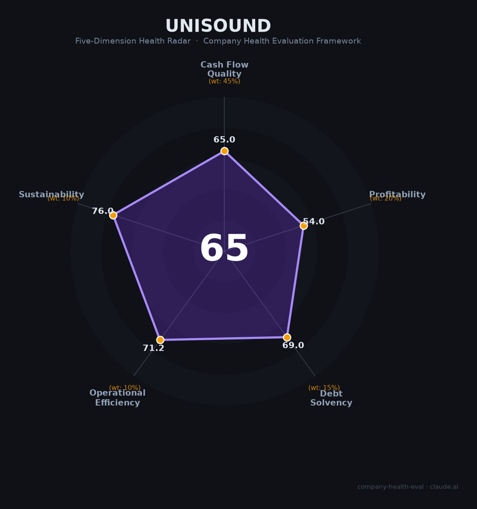

# 云知声（Unisound）财务健康评估（2026-06-12）

## 一句话结论

🟠 **中等（65/100）** | "港股AGI第一股"，山海大模型收入暴增1076%至6亿，人均产值252万亮眼，应收89%+OCF连负是核心硬伤

---

## 一、公司基本画像

- **主体**：云知声智能科技股份有限公司，2012年6月成立，2025年6月30日港交所上市（09678.HK）
- **股权**：黄伟（CEO/实控人，约27.88%），梁家恩（CTO，3.78%），康恒（COO，2.27%）三人一致行动合计33.93%；启明创投9.41%、挚信资本8.94%、中网投6.37%、京东3.27%
- **规模**：约480人（人均产值252万），北京+上海+合肥
- **主营**：山海通用大模型+医疗AI+语音AI+物联网AI芯片（累计出货1.1亿颗），大模型收入6.1亿（占50%+）
- **融资**：累计约24亿+11轮融资，IPO募资净额约2.06亿港元，2026年又两次配售合计约5亿港元

---

## 二、五维评估

| 维度 | 得分 | 要点 |
|------|:----:|------|
| 现金流质量 | 65 | OCF-2.13亿连负，IPO+配售现金补充至3.41亿+ |
| 盈利能力 | 54 | 毛利率36%偏低，净亏-27%，但大模型收入暴增1076%+人均252万亮眼 |
| 偿债能力 | 69 | D/A 55.64%，流动比率1.65，IPO化解33亿赎回负债 |
| 运营效率 | 71 | 应收10.85亿/营收89.5%（危险），40%超1年账龄；客户多元，团队稳 |
| 可持续发展 | 76 | AGI大模型+医疗AI+芯片三大赛道，但需频繁融资补充现金流 |

| 维度 | 得分 | 权重 | 加权得分 |
|------|:----:|:----:|:--------:|
| 现金流质量 | 65 | 45% | 29.2 |
| 盈利能力 | 54 | 20% | 10.8 |
| 偿债能力 | 69 | 15% | 10.3 |
| 运营效率 | 71 | 10% | 7.1 |
| 可持续发展 | 76 | 10% | 7.6 |
| **综合** | | | **65/100 🟠 中等** |

## 三、核心风险

1. **应收账款恶化（极高）**：10.85亿/占营收89.5%，周转约327天，40%超1年——几乎一年的收入都是应收账款
2. **持续亏损+频繁融资（高）**：OCF连负，上市不到1年已配售2次再募5亿港元
3. **毛利率下滑（中）**：36.1%（同比-2.7pct），大模型竞争加剧进一步压缩毛利
4. **科大讯飞碾压式竞争（中）**：讯飞营收271亿vs云知声12亿，差距23倍

## 四、总结

云知声是AI赛道「概念最全但财务最脆」的港股标的：山海大模型1076%增长、人均产值252万行业领先、医疗AI+芯片双差异化。但应收款吞噬了几乎所有营收（89.5%），OCF连续为负，上市不到1年两次配售暴露资金饥渴——"增长故事动人，现金流真相残酷"。

*评估日期：2026-06-12 | 评分引擎 v1.0 | 雷达图：Unisound_health_radar.png*
